---
markdown-it:
  html: true
---


# MIPS NOTES

## 目录

### 指令集
- [（壹）整数指令集](#壹整数指令集)
  - [一、数据传送类指令](#一数据传送类指令)
  - [二、算数运算类指令](#二算数运算类指令)
  - [三、逻辑运算类指令](#三逻辑运算类指令)
  - [四、移位指令](#四移位指令)
  - [五、逻辑设置指令](#五逻辑设置指令)
  - [六、跳转指令](#六跳转指令)
  - [七、系统调用](#七系统调用)

### 宏指令
- [（贰）宏指令（伪指令）](#贰宏指令伪指令)

### 寄存器
- [MIPS 通用寄存器表（32 个）](#mips-通用寄存器表32-个)
- [特殊寄存器（非通用寄存器）](#特殊寄存器非通用寄存器)

### 控制结构    
- [IF THEN ELSE & IF THEN](#一if-then-elseif-then的翻译)
- [WHILE](#二while的翻译)
- [FOR](#三for循环的翻译)
- [SWITCH](#四switch的翻译)

### 全局变量与汇编命令
- [全局变量与汇编命令](#全局变量的翻译和汇编命令)

### 问答
- [第一部分：概述与 MIPS 架构](#第一部分概述与-mips-架构)
- [第二部分：寻址方式与指令](#第二部分寻址方式与指令)

### [指令执行](#指令执行图)

### 练习
- [课本例题](#例题)
- [课本习题](#习题)
- [指令练习](#指令练习)
- <a href="21programs.pdf" target="_blank">📄 21个MIPS汇编程序（PDF）</a>

### [易混淆](#注意点)

### 附录
- [MARS 常用 SYSCALL 服务表](#mars-常用-syscall-服务表)
- [Tips](#小tips)
### 前情:
以下是常用字符的ASCII码对照表：
| 字符 | 名称 | ASCII (十进制) | ASCII (十六进制) |
| :---: | :--- | :---: | :---: |
| 空格 | Space | 32 | **0x20** |
| 换行 | Line Feed (LF) | 10 | **0x0A** |
| '0' | 数字 0 | 48 | **0x30** |
| '9' | 数字 9 | 57 | **0x39** |
| 'a' | 小写字母 a | 97 | **0x61** |
| 'z' | 小写字母 z | 122 | **0x7A** |
| 'A' | 大写字母 A | 65 | **0x41** |
| 'Z' | 大写字母 Z | 90 | **0x5A** |

小写与大写转换，即小写-32（-0x20）,大写+32(+0x20)

---

### 快速记忆法：

1.  **空格** = 32
2.  **换行** = 10 （在C语言中是 `\n`，MIPS中常用来检测输入结束）
3.  **数字 '0'~'9'** = 48~57 （连续递增）
4.  **大写 'A'~'Z'** = 65~90 （连续递增）
5.  **小写 'a'~'z'** = 97~122 （连续递增）

### 为什么这个表在汇编中很重要？

- **判断字符类型**：比如检查输入字符是否是字母，可以用 `blt` 和 `bgt` 比较ASCII码范围。
- **大小写转换**：
  - 大写转小写：`addi $t0, $t0, 32` （因为 `'a' - 'A' = 32`）
  - 小写转大写：`addi $t0, $t0, -32`
- **数字字符转数值**：`sub $t0, $t0, 48` （ASCII码 `'0'` = 48，减去48就得到整数0）


$注意!!!:$
**逻辑运算 0 扩展；其余 I 型指令一律符号扩展。u 不改变扩展方式，只改变运算时的溢出检测和数值解读方式(即最高位是作为符号位还是作为数值位)。**


注意：

rd:register destination(一般用于在R指令格式中作目的寄存器)

rs:register source(I、R指令格式中的第一源寄存器)

rt:register target(I指令格式中的目的寄存器、R指令格式中的第二源寄存器)

imm:16位立即数  
其实:**立即数执行算数运算指令时用该数的符号位（第15位）作为高16位补全32位，执行逻辑运算指令时用0填充高16位补全32位。**--P18


**需了解的位运算点：**


- and --乘法
  - 与自己--不变
  - **对于指定的某一位**
  - 与1--不变；与0--置0 ； 
- or  --按位或 = 取最大值$（$0|0=0, 0|1=1, 1|0=1, 1|1=1）$
  - 或自己--不变
  - **对于指定的某一位**
  - 或1--置1；或0--不变；
- xor 无进位加法
  - 异或自己--清零
  - **对于指定的某一位**
  - 异或1--(1为0，0为1--取反)；异或0(1为1，0为0--不变)；
- not 1减去该位 (只能对整体not) 
- nor 或非，先或再按位取反
  - 或非自己--取反
  - **对于指定的某一位**
  - 或非1--置0；或非0--取反；
- 非逻辑设置，置0方法：
  - `or rd,$zero,$zero`或其他位运算
  - `li $rd, 0` 
  - `add $rd, $zero, $zero`
  - 注意`li`普世方法
- 非逻辑设置，置1方法：
  - `ori rd,$zero,1`或其他位运算
  - `li rd, 1`
  - `addi rd, $zero, 1`
  - 注意`li`普世方法
- 在只有0与1是，1即为非0(不等于0)

---
故:

对于$指定的某一位$:  
- 置1：
  - x or 1 
- 置0：
  - x and 0
  - x nor 1
- 不变：
  - x and 1
  - x or 0
  - x xor 0
- 取反：
  - x xor 1
  - x nor 0

#### 按位运算总结（针对单个位）

| 运算 | 与 0 | 与 1 | 与自身 |
| :--- | :--- | :--- | :--- |
| **AND** | 0 | 不变 | 不变 |
| **OR** | 不变 | 1 | 不变 |
| **XOR** | 不变 | 取反 | 0 |
| **NOR** | 取反 | 0 | 取反 |

### 因而:

# 位运算掩码原则

## 核心三操作

对任意位 `x`：

| 目的 | 操作 | 表达式 |
|:---|:---|:---|
| **清零** | AND 0 | `x and 0` |
| **置1** | OR 1 | `x or 1` |
| **取反** | XOR 1 | `x xor 1` |

## 等价变形

| 表达式 | 效果 | 归属 |
|:---|:---|:---|
| `x nor 1` | 清零 | 等价于 `x and 0` |
| `x nor 0` | 取反 | 等价于 `x xor 1` |
| `x nor x` | 取反 | 等价于 `x xor 1` |
| `x xor x` | 清零 | 等价于 `x and 0` |

## 保持不变的位

掩码中不参与修改的位：

| 表达式 | 效果 |
|:---|:---|
| `x and 1` | 不变 |
| `x or 0` | 不变 |
| `x xor 0` | 不变 |

## 一句话

**AND 0 清零，OR 1 置 1，XOR 1 取反。其余都是等价变形。**


---

### MIPS 汇编数据定义伪指令：.byte, .word, .space

在 MIPS 汇编中，`.byte`、`.word` 和 `.space` 用于在数据段（`.data`）中分配内存。它们的主要区别在于分配单位、是否初始化以及对齐方式。

$↓↓↓↓↓↓↓↓↓↓↓↓↓↓↓↓↓↓↓↓↓↓↓↓↓↓↓↓↓↓↓↓↓↓↓↓↓↓↓↓↓↓↓↓↓↓↓↓↓↓↓↓↓↓↓↓↓↓↓↓↓↓↓↓↓↓↓↓↓↓↓↓↓↓↓↓↓↓↓↓↓↓↓↓↓↓↓↓↓↓↓↓↓↓↓↓↓↓↓↓↓↓↓↓↓↓↓↓↓↓↓↓↓$

## 一、`.byte` – 分配字节

- **分配单位**：1 字节（8 位）
- **可初始化**：可以跟一个或多个数值（0~255）或字符（单引号），用逗号分隔
- **对齐**：无对齐要求，按顺序连续存放

### 示例
```assembly
.data
c1:    .byte 'A'          ; 分配 1 字节，存放 ASCII 65
c2:    .byte 10, 20, 30   ; 分配 3 字节，连续存放 10,20,30
str:   .byte 'H','e','l','l','o',0   ; 手动构造字符串（无自动结束符）
```

### 数组使用
定义字节数组：`.byte 1,2,3,4,5`  
访问时用 `lb`（有符号）或 `lbu`（无符号）读取，`sb` 写入。
在读取字符串中的字符是要用lb不能用lw,相应的，在读数字数组是，要用偏移量(*4)，用lw而不是lb

---

## 二、`.word` – 分配字

- **分配单位**：4 字节（32 位，一个 MIPS 字）
- **可初始化**：可以跟一个或多个 32 位整数，用逗号分隔
- **对齐**：**自动按 4 字节对齐**，若前一个数据未对齐，汇编器会插入填充字节

### 示例
```assembly
.data
x:      .word 100               ; 分配 4 字节，初值 100
arr:    .word 1, 2, 3, 4, 5     ; 分配 20 字节，连续存放 5 个整数
matrix: .word 0:10              ; 分配 40 字节，10 个整数初始化为 0（MARS 支持重复语法）
```


### 数组使用
定义字数组：`.word 0:10`（10 个 0）  
访问时用 `lw` 读取，`sw` 写入，下标需转换为字节偏移（乘以 4）。

---

## 三、`.space` – 分配未初始化空间

- **分配单位**：字节，需要指定大小（字节数）
- **不初始化**：只分配空间，不设初值（内容通常为 0，但不保证）
- **对齐**：无自动对齐，从当前位置连续分配

### 示例
```assembly
.data
buffer: .space 100              ; 分配 100 字节，未初始化
arr:    .space 40               ; 分配 40 字节，可用于存放 10 个 int
```

### 数组使用
`.space 40` 可以当作 10 个 `int` 的数组，但需要自己管理索引（乘以 4）。

---

## 四、对齐的影响

由于 `.word` 要求 4 字节对齐，混合使用时可能产生“空洞”：

```assembly
.data
a:      .byte 1         ; 地址 0x10010000
b:      .word 100       ; 为了对齐，会从 0x10010004 开始（跳过 3 字节）
c:      .space 2        ; 地址 0x10010008
d:      .word 200       ; 地址 0x1001000c（自动对齐到 4 的倍数）
```

程序员通常不需要手动计算地址，汇编器自动处理。但了解对齐有助于理解内存布局。

---

## 五、数组的定义与访问

### 1. 定义数组

```assembly
.data
int_arr:   .word 10, 20, 30, 40, 50   ; 5 个整数元素
byte_arr:  .byte 'a','b','c','d','e'  ; 5 个字节
buffer:    .space 40                  ; 40 字节未初始化（可作 10 个 int）
```

### 2. 访问数组元素（以 `int_arr` 为例）

假设 `int_arr` 的地址在 `$t0` 中，要访问第 `i` 个元素（i 从 0 开始）：

```assembly
la   $t0, int_arr        ; 数组基址
li   $t1, i              ; 下标
sll  $t1, $t1, 2         ; 下标 × 4（字节偏移）
add  $t1, $t0, $t1       ; 元素地址
lw   $t2, 0($t1)         ; 读取元素到 $t2
```

刻意保持 `$t0` 不变，这样下一轮循环还可以继续拿 `$t0` 当基址用——不用每次重新 `la`。

你如果不小心改了 `$t0`，下一轮再读就会越读越偏，数组访问就全乱了。

基址留着不动，偏移用临时寄存器暂存，这是标准写法。

写回类似，用 `sw`。

---

## 六、总结对比表

| 伪指令 | 分配单位 | 是否可赋初值 | 对齐要求 | 典型用途 |
| :--- | :--- | :--- | :--- | :--- |
| `.byte` | 1 字节 | ✅ 可赋初值（数值/字符） | 无 | 字符、字节数组、字符串 |
| `.word` | 4 字节 | ✅ 可赋初值（整数） | 4 字节对齐 | 整数变量、整数数组 |
| `.space` | 1 字节（可指定数量） | ❌ 只分配，不赋初值 | 无 | 大块缓冲区、未初始化数组 |

---

## 七、使用建议

- 需要初始化的小数据用 `.byte` 或 `.word`。
- 需要大块未初始化空间用 `.space`（如模拟栈、堆）。
- 定义数组时，如果元素个数已知且需初值，用 `.word 0,0,0...` 或 `.word 0:n`（MARS 支持重复计数）。
- 访问数组时注意偏移计算：**字节偏移 = 下标 × 元素大小**。

掌握这些，你就能灵活地在 MIPS 汇编中管理数据了。


## （壹）整数指令集

### 一、数据传送类指令

#### 1. 取（加载）数据指令

- **`lb rt, offset(rs)`** `# load byte [I]`  
  `rs` 的值加上**符号扩展**的 16 位偏移量形成有效地址，从有效地址指向的内存读取 **8 位字节**，**符号扩展**后加载到 `rt`。

PS:即便偏移量为0,也应当写上，比如说 `lb $a0,0($t0)`或`lb $a0,($t0)`

**括号不能省，数字可以省（省略数字默认为 0）。**

PS:先是offset进行符号扩展,然后再跟rs加

- **`lbu rt, offset(rs)`** `# load byte unsigned [I]`  
  `rs` 的值加上**符号扩展**的 16 位偏移量形成有效地址，从有效地址指向的内存读取 **8 位字节**，**0扩展**后加载到 `rt`。

- **`lh rt, offset(rs)`** `# load halfword [I]`  
  `rs` 的值加上**符号扩展**的 16 位偏移量形成有效地址，从有效地址指向的内存读取 **16 位半字**，**符号扩展**后加载到 `rt`。  
  > 若有效地址为奇数则发生地址错误异常，地址必为 2 的倍数（0 bit 为 0）。

- **`lhu rt, offset(rs)`** `# load halfword unsigned [I]`  
  `rs` 的值加上**符号扩展**的 16 位偏移量形成有效地址，从有效地址指向的内存读取 **16 位半字**，**0扩展**后加载到 `rt`。  
  > 若有效地址为奇数则发生地址错误异常，地址必为 2 的倍数（0 bit 为 0）。

- **`lw rt, offset(rs)`** `# load word [I]`  
  `rs` 的值加上**符号扩展**的 16 位偏移量形成有效地址，从有效地址指向的内存读取 **字数据** 加载到 `rt`。  
  > 地址应为 4 的倍数（末 2 bit 为 0），否则发生地址错误异常。

- **`lui rt, imm`** `# load upper immediate [I]加载立即数到高半字（16bits）`  
  `rt = imm << 16 | 0x0000`  
  将 16 位立即数左移 16 位，低 16 位补 0，结果存入 `rt`。

#### 2. 存数据指令

$PS:地址对齐要求与load一致$

- **`sb rt, offset(rs)`** `# store byte [I]`  
  有效地址 = `rs` + 【符号扩展】的 16 位偏移量，将 `rt` 最低 8 位【值】存入有效地址指向的内存。

  PS:不是rt指向的有效地址的值

- **`sh rt, offset(rs)`** `# store halfword [I]`  
  有效地址 = `rs` + 【符号扩展】的 16 位偏移量，将 `rt` 低 16 位存入有效地址指向的内存（地址必为 2 的倍数）。

- **`sw rt, offset(rs)`** `# store word [I]`  
  有效地址 = `rs` + 【符号扩展】的 16 位偏移量，将 `rt` 全部 32 位存入有效地址指向的内存（地址必为 4 的倍数）。


load指令一定会扩展为32bits是因为要存入寄存器，而寄存器为32bits

#### 3. 专用寄存器

- **`mfhi rd`** `# move from HI register[R]`
- **`mflo rd`** `# move from LO register[R]`
- **`mthi rs`** `# move to HI register[R]`
- **`mtlo rs`** `# move to LO register[R]`

---

### 二、算数运算类指令

#### 1. 加

- **`add rd, rs, rt`** `[R]`  
  `rs + rt` → `rd`，可能检查补码溢出。

- **`addu rd, rs, rt`** `[R]`  
  不检查补码溢出（一般用于地址运算）。**不代表零扩展**

- **`addi rt, rs, imm`** `[I]`  
  `rs` + **符号扩展**至 32 位的立即数 → `rt`，会检查补码溢出。

- **`addiu rt, rs, imm`** `[I]`  
  `rs` + **符号扩展**至 32 位的立即数 → `rt`，不检查补码溢出。  
  > **注**：此处`unsigned` 仅代表不检查补码溢出，**不代表零扩展**。立即数仍进行【符号扩展】，只是将最高位视为数值位。这里的imm还是符号扩展，只不过rs+imm得到的答案按无符号数来看，所以不会检查溢出

- **检查** 这个词很微妙


#### 2. 减

- **`sub rd, rs, rt`** `[R]`  
  `rs - rt` → `rd`，会检查补码溢出。

- **`subu rd, rs, rt`** `[R]`  
  不检查补码溢出。

#### 3. 乘

- **`mult rs, rt`** `[R]`  
  `rs * rt`，64 位积：高 32 位 → `HI`，低 32 位 → `LO`。操作数视为有符号数，不产生溢出。  
  结果可用 `mfhi` / `mflo` 取出。

- **`multu rs, rt`** `[R]`  
  操作数视为无符号正数，其余同 `mult`。

#### 4. 除

- **`div rs, rt`** `[R]`  
  `rs ÷ rt`：商 → `LO`，余数 → `HI`。操作数符号相反时商为负；余数符号与被除数 `rs` 相同。不产生溢出异常。  
  > 除数为 0 时结果未定义。

>对于 div rs, rt（有符号除法）：
>- 商向 0 取整（truncate toward zero）
>- 余数 = 被除数 − 商 × 除数
>- 余数的符号 = 被除数的符号


$PS:数学上，余数应当恒为正$

- **`divu rs, rt`** `[R]`  
  操作数均视为无符号数，商和余数恒为正。其余同 `div`。

---

### 三、逻辑运算类指令

- **`and rd, rs, rt`** `[R]`  
  rs与rt按位与 → `rd`。

- **`andi rt, rs, imm`** `[I]`  
  `rs` 与 **0扩展**至 32 位的立即数按位与 → `rt`。  
  > 注：立即数高 16 位默认为 0，若需非 0 掩码，先用 `lui` + `ori` 构造。

- **`or rd, rs, rt`** `[R]`  
  按位或 → `rd`。

- **`ori rt, rs, imm`** `[I]`  
  `rs` 与 **0扩展**至 32 位的立即数按位或 → `rt`。

- **`nor rd, rs, rt`** `[R]`  
  按位或非（先或后取反） → `rd`。

- **`xor rd, rs, rt`** `[R]`  
  按位异或 → `rd`。

- **`xori rt, rs, imm`** `[I]`  
  `rs` 与 **0扩展**的立即数按位异或 → `rt`。

---

### 四、移位指令

**注意移位指令是rd,rt,而非rt,rs**

- **`sll rd, rt, sa`** `shift left logical[R]`  
  `rt` 左移 `sa` 位，空位补 【0】 → `rd`。

**$PS:sa如果超过5位会截断$**

- **`sllv rd, rt, rs`** `shift left logical variable[R]`  
  `rt` 左移 `rs` 低 5 位指定的位数，空位补 【0】 → `rd`。  
  > 最多移位 31 位（5 bit 全 1）。

- **`srl rd, rt, sa`** `shift right logical[R]`  
  `rt` 逻辑右移 `sa` 位，空位补 【0】 → `rd`。

- **`srlv rd, rt, rs`** `shift right logical variable[R]`  
  `rt` 逻辑右移 `rs` 低 5 位指定的位数，空位补 【0】 → `rd`。

- **`sra rd, rt, sa`** `shift right arithmetic[R]`  
  `rt` 算术右移 `sa` 位，空位用【符号位】填充 → `rd`。

- **`srav rd, rt, rs`** `shift right arithmetic variable[R]`  
  `rt` 算术右移 `rs` 低 5 位指定的位数，空位用【符号位】填充 → `rd`。

---

### 五、逻辑设置指令

- **`slt rd, rs, rt`** `set if less than[R]`  
  若 `rs < rt`（有符号比较），`rd` 置 1，否则置 0。

- **`sltu rd, rs, rt`** `set if less than unsigned[R]`  
  若 `rs < rt`（无符号比较），`rd` 置 1，否则置 0。

- **`slti rt, rs, imm`** `set if less than immediate[I]`  
  若 `rs < 【符号扩展】的立即数`（有符号），`rt` 置 1，否则置 0。

- **`sltiu rt, rs, imm`** `set if less than immediate unsigned[I]`  
  若 `rs < 【符号扩展】的立即数`（无符号），`rt` 置 1，否则置 0。

---

### 六、跳转指令

#### 1. 无条件转移指令

- **`j label`** `[J]`  
  PC 高 4 位拼接 26 位立即数左移 2 位 → PC。  
  > 左移两位-->指令均为32位，以字为单位，故0、1bit必为0  
  指令的增加，一般不会影响到高四位

- **`jal label`** `jump and link[J]`  
  >将`PC`当前值(说明PC已+4)保存在`$ra`中，然后将【当前PC的前四位】与【26位立即数左移两位之后】连接起来形成一个地址，加载到`PC`。

- **`jalr rd, rs`** `jump and link register[R]`  
  将返回地址（PC(已加过4)）存入 `rd`，然后跳转至 `rs` 中的地址。  
  > 使用前 `rs` 必须已加载有效地址。

- **`jr rs`** `jump register unconditionally[R]`  
  跳转至 `rs` 中的地址。常用于函数返回：`jr $ra`。

#### 2. 分支指令

- **`beq rs, rt, label`** `branch if equal[I]`  
  若 `rs == rt`，跳转至 `label`。

- **`bne rs, rt, label`** `branch if not equal[I]`  
  若 `rs != rt`，跳转至 `label`。

- **`bgez rs, label`** `branch if greater than or equal to zero[I]`  
  若 `rs >= 0`，跳转至 `label`。

- **`bgezal rs, label`** `branch if greater than or equal to zero and link[I]`  
  若 `rs >= 0`，将返回地址存入 `$ra` 后跳转。

- **`bgtz rs, label`** `branch if greater than zero[I]`  
  若 `rs > 0`，跳转。

- **`blez rs, label`** `branch if less than or equal to zero[I]`  
  若 `rs <= 0`，跳转。

- **`bltz rs, label`** `branch if less than zero[I]`  
  若 `rs < 0`，跳转。

- **`bltzal rs, label`** `branch if less than zero and link[I]`  
  若 `rs < 0`，将返回地址存入 `$ra` 后跳转。

---
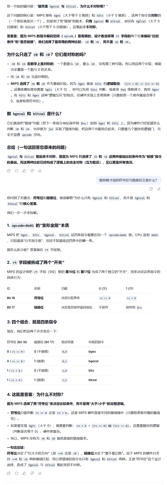


---

## 附录：机器码结构说明

- **R 格式**：`op (6) | rs (5) | rt (5) | rd (5) | sa (5) | funct (6)`  
  - `op` = 0x00  
  - `funct` 确定具体操作

- **I 格式**：`op (6) | rs (5) | rt (5) | immediate (16)`  
  - `op` 确定指令类型  
  - `immediate` 为 16 位有符号或无符号立即数

- **J 格式**：`op (6) | target (26)`  
  - `op` = 0x02（`j`）或 0x03（`jal`）  
  - `target` 为 26 位跳转地址（左移 2 位后与 PC 高 4 位拼接）

> **注**：所有示例中的十六进制为实际机器码，偏移量或立即数已按示例值给出，实际使用时需根据 label 或立即数值计算。

### 七、系统调用

- **`syscall`** `[R]`  
  触发系统调用异常。

---

## （贰）宏指令（伪指令）

<details>
<summary><b>abs rd, rs</b> —— 求绝对值```absolute value```</summary>

```asm
addu  rd, $zero, rs
bgez  rs, 1f #此处为行标号
sub   rd, $zero, rs
1:
```

先加到rd寄存器里，如果rd值大于等于0，无事，否则用0减自己

[Tips](#小tips)

</details>

<details>
<summary><b>beqz rs, label</b> —— 等于零则跳转```branch if equal to  zero```</summary>

```asm
beq   rs, $zero, label
```
</details>

<details>
<summary><b>bge rs, rt, label</b> —— 大于等于则跳转（有符号）</summary>

```asm
slt   $at, rs, rt
beq   $at, $zero, label
```

使用slt，大于等于即为不小于，即赋值0，再考虑与0的大小关系

</details>

<details>
<summary><b>bgeu rs, rt, label</b> —— 大于等于则跳转（无符号）`branch if greater or equal`</summary>

```asm
sltu  $at, rs, rt
beq   $at, $zero, label
```
</details>

<details>
<summary><b>bgt rs, rt, label</b> —— 大于则跳转（有符号）`branch if greater than`</summary>

```asm
slt   $at, rt, rs
bne   $at, $zero, label

判断rs是不是大于rt,即判断rt是不是小于rs，即判断`$at`是不是1,即判断`$at`是不是不等于0(因为只有判断是否为0的，故在判断是否为1时应当判断是否不等于0!)

```
</details>

<details>
<summary><b>bgtu rs, rt, label</b> —— 大于则跳转（无符号）</summary>

```asm
sltu  $at, rt, rs
bne   $at, $zero, label
```
</details>

<details>
<summary><b>ble rs, rt, label</b> —— 小于等于则跳转（有符号）`branch if less or equal`</summary>

```asm
slt   $at, rt, rs
beq   $at, $zero, label
```
</details>

<details>
<summary><b>bleu rs, rt, label</b> —— 小于等于则跳转（无符号）</summary>

```asm
sltu  $at, rt, rs
beq   $at, $zero, label
```

rs小于等于rt即为rt大于等于rs,即rt不小于rs,如果rt小于rs,则置0

</details>

<details>
<summary><b>blt rs, rt, label</b> —— 小于则跳转（有符号）`branch if less than`</summary>

```asm
slt   $at, rs, rt
bne   $at, $zero, label
```
</details>

<details>
<summary><b>bltu rs, rt, label</b> —— 小于则跳转（无符号）</summary>

```asm
sltu  $at, rs, rt
bne   $at, $zero, label
```
</details>

<details>
<summary><b>bnez rs, label</b> —— 不等于零则跳转`branch if not equal to zero`</summary>

```asm
bne   rs, $zero, label
```
</details>

<details>
<summary><b>b label</b> —— 无条件相对跳转</summary>

```asm
bgez  $zero, label
# 或
beq   $zero, $zero, label
```


**在此处PC=PC+imm<<4(说明PC已+4)**


</details>

<details>
<summary><b>div rd, rs, rt</b> —— 有符号除法（商）</summary>

```asm
bne   rt, $zero, ok
break $zero
ok:
div   rs, rt
mflo  rd
```
</details>

<details>
<summary><b>div rt, rs, imm(32)</b> —— 有符号除法（商）</summary>

```asm
li $at,imm  #实际上还要细分，li也有不同的展开，主要看imm的值
bne   $at, $zero, ok
break $zero
ok:
div   rs, $at
mflo  rt
```
</details>

<details>
<summary><b>divu rd, rs, rt</b> —— 无符号除法（商）</summary>

```asm
bne   rt, $zero, ok
break $zero
ok:
divu  rs, rt
mflo  rd
```
</details>

<details>
<summary><b>divu rt, rs, imm(32)</b> —— 无符号除法（商）</summary>

```asm
li $at,imm  #实际上还要细分，li也有不同的展开，主要看imm的值
bne   $at, $zero, ok
break $zero
ok:
divu   rs, $at
mflo  rt
```
</details>

<details>
<summary><b>la rd, label</b> —— 加载地址</summary>

```asm
lui   $at, %hi(label)
ori   rd, $at, %lo(label)
#符号 %hi() 和 %lo() 是 MIPS 汇编器提供的运算符，用来在汇编阶段把一个 32 位地址拆分成高 16 位和低 16 位。
```
</details>

<details>
<summary><b>li rd, value</b> （value ≥ 32768 或负数）</summary>

```asm
lui   $at, %hi(value)
ori   rd, $at, %lo(value)
```


有时候加载负数也可以使用:addiu


</details>

<details>
<summary><b>li rd, value</b> （value < 32768）</summary>

```asm
ori   rd, $zero, value
```
PS:有时-3276value
</details>

<details>
<summary><b>move rd, rs</b> —— 寄存器间数据传送</summary>

```asm
addu  rd, $zero, rs
```
</details>

<details>
<summary><b>mul rd, rs, rt</b> —— 乘法（不检查溢出）</summary>

```asm
mult  rs, rt
mflo  rd
```
</details>

<details>
<summary><b>mul rt, rs, imm(32)</b> —— 乘法（不检查溢出）</summary>

```asm
li $at,imm
mult  rs, $at
mflo  rt
```


**注意:**

没有`mulu`的用法，因为不管有无符号，其低32位数都相同:


</details>

<details>
<summary><b>mulo rd, rs, rt</b> —— 有符号乘法（检查溢出）</summary>

```asm
mult  rs, rt
mfhi  $at
mflo  rd
sra   rd, rd, 31
beq   $at, rd, ok
break $zero
ok:
mflo  rd
```


</details>

<details>
<summary><b>mulou rd, rs, rt</b> —— 无符号乘法（检查溢出）</summary>

```asm
multu rs, rt
mfhi  $at
beq   $at, $zero, ok
break $zero
ok:
mflo  rd
```


</details>

<details>
<summary><b>neg rd, rs</b> —— 求补（有符号，检查溢出）</summary>

```asm
sub   rd, $zero, rs
```
</details>

<details>
<summary><b>negu rd, rs</b> —— 求补（无符号）</summary>

```asm
subu  rd, $zero, rs
```
</details>

<details>
<summary><b>nop</b> —— 空操作</summary>

```asm
or    $zero, $zero, $zero
```
</details>

<details>
<summary><b>not rd, rs</b> —— 按位取反</summary>

```asm
nor   rd, rs, $zero
```
</details>

<details>
<summary><b>rem rd, rs, rt</b> —— 有符号除法（余数）`remain`</summary>

```asm
bne   rt, $zero, ok
break $zero
ok:
div   rs, rt
mfhi  rd
```
注意老式写法：
```asm
bne rt,$0,8  # 如果 rt != 0，跳过 8 字节即 2 条指令（即直接跳到 mfhi 行）
break $0
div rs,rt
mfhi rd
```
</details>

<details>
<summary><b>rem rt, rs, imm(32)</b> —— 无符号除法（余数）</summary>

```asm
li $at,imm
bne   $at, $zero, ok
break $zero
ok:
div  rs, $at
mfhi  rt
```
</details>

<details>
<summary><b>remu rd, rs, rt</b> —— 无符号除法（余数）</summary>

```asm
bne   rt, $zero, ok
break $zero
ok:
divu  rs, rt
mfhi  rd
```
</details>

<details>
<summary><b>remu rt, rs, imm(32)</b> —— 无符号除法（余数）</summary>

```asm
li $at,imm
bne   $at, $zero, ok
break $zero
ok:
divu  rs, $at
mfhi  rt
```
</details>

<details>
<summary><b>rol rd, rs, rt</b> —— 循环左移（变量移位）`rotate left`</summary>

```asm
subu  $at, $zero, rt # $at = -rt (补码)，其低5位等效于 32 - rt
#主要是因为我们要32-rt,但是这样的话，我们没有在rs上放立即数的方式
不然我们就要用一个寄存器存放固定值32了
srlv  $at, rs, $at
sllv  rd, rs, rt
or    rd, rd, $at
```

- **一个十进制数取负数，在二进制补码上的表现就是按位取反再+1**
- 32位-- (11111····11111)
- 在对应位，用1减去该二进制位，等效于该位取反(按位取反的数学本质)
- 所以想要得到【32减去**rt的低五位**】(32-(11111))  所代表的(十进制)值，用32减去低五位，即对低五位按位取反，即对整体按位取反，即取负数(反正会截断)
   


</details>

<details>
<summary><b>rol rd, rs, sa</b> —— 循环左移（固定移位）</summary>

```asm
srl   $at, rs, 32-sa
sll   rd, rs, sa
or    rd, rd, $at
```
</details>

<details>
<summary><b>ror rd, rs, rt</b> —— 循环右移（变量移位）`rotate right`</summary>

```asm
subu  $at, $zero, rt
sllv  $at, rs, $at
srlv  rd, rs, rt
or    rd, rd, $at
```
</details>

<details>
<summary><b>ror rd, rs, sa</b> —— 循环右移（固定移位）</summary>

```asm
sll   $at, rs, 32-sa
srl   rd, rs, sa
or    rd, rd, $at
```
</details>

<details>
<summary><b>seq rd, rs, rt</b> —— 相等则置 1`set if equal`</summary>

```asm
beq   rt, rs, yes
ori   rd, $zero, 0
beq   $zero, $zero, skip
yes:
ori   rd, $zero, 1
skip:
```
</details>

<details>
<summary><b>sge rd, rs, rt</b> —— 大于等于则置 1（有符号）`set if greater or equal`</summary>

```asm
bne   rt, rs, yes
ori   rd, $zero, 1
beq   $zero, $zero, skip
yes:
slt   rd, rt, rs
skip:
```

PS:一种优化思路:
```mips
slt  $at, rs, rt        # $at = 1 if rs < rt
xori rd, $at, 1         # 取反：1→0, 0→1
```
- 本质就是slt+取反操作


</details>

<details>
<summary><b>sgeu rd, rs, rt</b> —— 大于等于则置 1（无符号）</summary>

```asm
bne   rt, rs, yes
ori   rd, $zero, 1
beq   $zero, $zero, skip
yes:
sltu  rd, rt, rs
skip:
```
</details>

<details>
<summary><b>sgt rd, rs, rt</b> —— 大于则置 1（有符号）`set if greater than`</summary>

```asm
slt   rd, rt, rs
```
</details>

<details>
<summary><b>sgtu rd, rs, rt</b> —— 大于则置 1（无符号）</summary>

```asm
sltu  rd, rt, rs
```
</details>

<details>
<summary><b>sle rd, rs, rt</b> —— 小于等于则置 1（有符号）`set if less or equal`</summary>

```asm
bne   rt, rs, yes
ori   rd, $zero, 1
beq   $zero, $zero, skip
yes:
slt   rd, rs, rt
skip:
```
</details>

<details>
<summary><b>sleu rd, rs, rt</b> —— 小于等于则置 1（无符号）</summary>

```asm
bne   rt, rs, yes
ori   rd, $zero, 1
beq   $zero, $zero, skip
yes:
sltu  rd, rs, rt
skip:
```
</details>

<details>
<summary><b>sne rd, rs, rt</b> —— 不等则置 1`set if not equal`</summary>

```asm
beq   rt, rs, yes
ori   rd, $zero, 1 #非逻辑设置，置1方法
beq   $zero, $zero, skip
yes:
ori   rd, $zero, 0
skip:
```
</details>

## MIPS 通用寄存器表（32 个）
| 编号/十六进制 | 助记符 | 用途说明 | 英文全称 / 翻译 |
|:---:|:---|:---|:---|
| 0 | `$zero` | 恒为 0，写入无效 | **zero** constant |
| 1 | `$at` | 汇编器临时使用（展开伪指令） | **a**ssembler **t**emporary |
| 2-3 | `$v0` ~ `$v1` | 函数返回值 | **v**alue returned |
| 4-7 | `$a0` ~ `$a3` | 函数实参（前 4 个） | **a**rguments |
| 8-15 | `$t0` ~ `$t7` | 临时寄存器，调用者保存 | **t**emporary |
| 16-23 | `$s0` ~ `$s7` | 保存寄存器，被调用者保存 | **s**aved |
| 24-25 | `$t8` ~ `$t9` | 临时寄存器（同 t0~t7） | **t**emporary |
| 26-27 | `$k0` ~ `$k1` | 保留给 OS 内核，异常处理用 | **k**ernel reserved |
| 28 | `$gp` | 全局数据区指针 | **g**lobal **p**ointer |
| 29 | `$sp` | 栈顶指针 | **s**tack **p**ointer |
| 30 | `$fp` / `$s8` | 帧指针（或作为第 9 个保存寄存器） | **f**rame **p**ointer / **s**aved |
| 31 | `$ra` | 函数返回地址 | **r**eturn **a**ddress |

### **PS:将寄存器堆视作一个数组R[32]，rd,rs,rt是值为0-31之间的下标**

# MIPS 通用寄存器对照表(带十六进制表示)

| 编号 (十进制) | 寄存器名称 | 十六进制 | 用途 / 约定 |
| :---: | :---: | :---: | :--- |
| 0 | `$zero` | `0x00` | 恒为 0 |
| 1 | `$at` | `0x01` | 汇编临时寄存器 |
| 2 | `$v0` | `0x02` | 返回值 / 系统调用号 |
| 3 | `$v1` | `0x03` | 返回值 |
| 4 | `$a0` | `0x04` | 参数 1 |
| 5 | `$a1` | `0x05` | 参数 2 |
| 6 | `$a2` | `0x06` | 参数 3 |
| 7 | `$a3` | `0x07` | 参数 4 |
| 8 | `$t0` | `0x08` | 临时变量 |
| 9 | `$t1` | `0x09` | 临时变量 |
| 10 | `$t2` | `0x0A` | 临时变量 |
| 11 | `$t3` | `0x0B` | 临时变量 |
| 12 | `$t4` | `0x0C` | 临时变量 |
| 13 | `$t5` | `0x0D` | 临时变量 |
| 14 | `$t6` | `0x0E` | 临时变量 |
| 15 | `$t7` | `0x0F` | 临时变量 |
| 16 | `$s0` | `0x10` | 保存变量 |
| 17 | `$s1` | `0x11` | 保存变量 |
| 18 | `$s2` | `0x12` | 保存变量 |
| 19 | `$s3` | `0x13` | 保存变量 |
| 20 | `$s4` | `0x14` | 保存变量 |
| 21 | `$s5` | `0x15` | 保存变量 |
| 22 | `$s6` | `0x16` | 保存变量 |
| 23 | `$s7` | `0x17` | 保存变量 |
| 24 | `$t8` | `0x18` | 临时变量 |
| 25 | `$t9` | `0x19` | 临时变量 |
| 26 | `$k0` | `0x1A` | 内核临时寄存器 |
| 27 | `$k1` | `0x1B` | 内核临时寄存器 |
| 28 | `$gp` | `0x1C` | 全局指针 |
| 29 | `$sp` | `0x1D` | 栈指针 |
| 30 | `$fp` / `$s8` | `0x1E` | 帧指针 / 保存变量 |
| 31 | `$ra` | `0x1F` | 返回地址 |


## 特殊寄存器（非通用寄存器）
| 名称 | 用途说明 | 翻译 |
|:---|:---|:---|
| **PC** | 程序计数器，存放下一条指令地址 | **P**rogram **C**ounter |
| **HI** | 乘法结果高 32 位 / 除法余数 | **HI**gh word |
| **LO** | 乘法结果低 32 位 / 除法商 | **LO**w word |
| **IR** | 指令寄存器，存放当前执行的机器码 | **I**nstruction **R**egister |

**HI 与 LO 除了记录乘除法结果以及用特定指令传输到寄存器堆以外，其他指令都不能使用，因而称为专用寄存器**

*PC中存放的是将要取出执行的指令所在内存单元的地址。PC的初始值由操作系统指定，即为将要执行程序的**第一条指令**所存放的内存单元的地址。*程序计数器中的地址通过总线传送到指令缓存的地址输入端。当一条指令已从内存取出并存放到指令寄存器(IR,$Instruction\ Register$)中后，PC的增量为4，CPU便有了下一条指令所在内存位置的地址，以便CPU顺序提取下一条指令。

## 控制结构
----

## <span id="一if-then-elseif-then的翻译">一、"if then else"&"if then"的翻译</span>
### "if then else"
- 伪代码:
```
if ($t8<0) then
          {
            $s0=0-$t8;
            $t1=$t1+1;
          }
else      
          {
            $s0=$s8;
            $t2=$t2+1;
          }      
```
- 翻译:
```Py
      bgez  $t8, else          # 如果$t8>=0则分支到else 
      #其实考虑到then后面的是顺序执行
      #故在代码逻辑上应道是满足<0时顺序执行，而>0的时候就应当跳走
      sub   $s0, $zero, $t8    # s0 = 0 - t8
      addi  $t1, $t1, 1        # t1加上1 
      b next                   # 跳过else后面的代码 
else: 
      ori   $s0, $t8, 0        # s0 = t8 
      addi  $t2, $t2, 1        # t2加上1 
next:

```
>读者应当注意到判断条件($t8<0)对应MIPS汇编第一句bgez $t8，…，条件恰好相反。  
- 这是由于if的流程和分支指令的逻辑相反：if条件成立时继续运行，而分支指令继续运行（不跳转）则要求条件不成立。  
- 将if的条件反过来成为分支指令的条件，可以让汇编指令按顺序对应到伪代码的语句。另外，在代码块1（then代码块）之后要添加一条转移语句，以跳过代码块2（else 代码块）。

$这段代码实现了什么:$$负数和非负数的统计或转换$
### "if then"
- 伪代码:
```py
if（$t0>$t1）then $t1=$t0
```
- 翻译:
```py
      ble $t0, $t1, out1 	# 如果t0<=t1分支到out1 
      move $t1, $t0		    # t1=t0
      #依旧考虑到then后顺序执行
out1:
```
## <span id="二while的翻译">二、"while"的翻译</span>
- 伪代码:
```py
$v0 = 1 
While ($a1 < $a2) do  
{ 
    $t1 = mem[$a1] 
    $t2 = mem[$a2] 
    if ($t1 != $t2) {$v0 = 0;break }
    $a1 = $a1 + 1 
    $a2 = $a2 - 1
} 
```
- 翻译:
```py
        li    $v0, 1                
        # v0=1 
loop:   bgeu  $a1, $a2, done        
        # 如果a1>=a2分支到done 
        lb    $t1, 0($a1)           
        # 加载字节数据: t1 = mem[a1 + 0] 
        #比如字符啊什么的，要判断的东西大概率在内存中
        lb    $t2, 0($a2)           
        # 加载字节数据: t2 = mem[a2 + 0] 
        bne   $t1, $t2, break       
        # 如果t1!=t2分支到break 
        addi  $a1, $a1, 1           # a1 = a1 + 1 
        addi  $a2, $a2, -1          # a2 = a2 - 1 
        b     loop                  # 跳转到loop 
break: 
        li $v0, 0                   # v0=0，结束
done:
      #这里只要判断$v0是不是为1，即能知道是否回文
```
$这段代码实现了什么:$$一个标准的回文判断程序，从字符串（或数组）的两端向中间比较。$

>这个例子里的while是“当型循环”，即先判断循环条件、再执行循环体循环。
- 和if语句的翻译类似，我们用相反的条件作为分支条件，满足则跳出循环,否则继续执行循环体。
- 完成循环体后直接跳转至最初的条件分支语句。
- 对if(条件){代码；break}做特殊处理：将break之前的代码放置在循环外，以break为标号，满足条件跳转至break标号。读者可自行绘制该代码的流程图。

## <span id="三for循环的翻译">三、"for循环"的翻译</span>
- 伪代码:
```py
$a0 = 0; 
For($t0 = 10; $t0 > 0; $t0 = $t0 -1)do{$a0 = $a0+$t0} 
```
- 翻译:
```py
      li $a0, 0             #  $a0 = 0 
      li $t0, 10            # 初始化循环计数为10 
loop: 
      add $a0, $a0, $t0 
      addi $t0, $t0, -1     # 循环计数器递减 
      bgtz $t0, loop        # 如果$t0>0跳转到loop 
```
$这段代码实现了什么:$$用\$a0记录从10加到1的结果$


## <span id="四switch的翻译">四、"switch"的翻译</span>
- 伪代码:
```py
        $s0 = 32; 
top:    cout  << “Input a value from 1 to 3”  
        cin >> $v0   
        switch ($v0) {
        case(1):  {$s0 = $s0 << 1; break;}  
        case(2):  {$s0 = $s0 << 2; break;}  
        case(3):  {$s0 = $s0 << 3; break;}  
        default:    goto top; 
        }
        cout << $s0   
```
- 翻译:
```py .line-numbers
            .data 
            .align  2 
jumptable:  .word top, case1, case2, case3 
prompt :    .asciiz  “\n\n Input a value from 1 to 3: ” 
            .text 
top:   
            li    $v0, 4            # 打印字串的调用号 
            la    $a0, prompt 
            syscall 
            li    $v0, 5            # 读取整数的调用号 
            syscall 
            blez  $v0, top          
            # 小于1为default处理，跳转到top 
            li    $t3, 3 
            bgt   $v0, $t3, top     
            # 大于3为default处理，跳转到top 
            la    $a1, jumptable    
            # 加载跳转表jumptable地址 
      注意  # $a1 = jumptable 的基地址（比如 0x10010000）
            sll   $t0, $v0, 2  
      注意  # 偏移：输入 1 → 偏移 4     
            # 计算字地址偏移 
            # jumptable是按字分配的
            # 一个字四个字节,跳一个地址要输入数字乘4
            add   $t1, $a1, $t0     
            # 构成指向jumptable内数据的指针 
      注意  # $t1 = jumptable 中某个条目的地址
            #（比如 0x10010004）（存放"casex"的地址）
            lw    $t2, 0($t1)       
            # 从jumptable获得地址数据 (得到casex)
      注意  # $t2 = 该条目里存放的值
            #（比如 case1 的地址 0x00400080）
            jr    $t2               
            # 跳转到“switch”的各个分支 
      注意  # 跳转到 case1 的代码
      故 不能直接--jr $t1
case1:      sll   $s0, $s0, 1       # 逻辑左移1位 
            b     output 
case2:      sll   $s0, $s0, 2       # 逻辑左移2位
            b     output 
case3:      sll   $s0, $s0, 3       # 逻辑左移3位
output: 
            li    $v0, 1            # 打印整数的调用号
            move  $a0, $s0          # a0为需要打印的整数 
            syscall                 # 输出结果

```


>该例数据段中标号jumptable开始的内存分配了4个字，其值为top、 case1、 case2、 case3，都是文本段中的标号，也就是跳转地址。
- 因此jumptable定义了一个跳转地址列表，是跳转地址列表的首地址。
- 代码中计算了控制变量$v0在跳转地址表中对应的地址\$t1=jumptable+\$v0<<2，将jumptable的内容（对应的跳转地址）读入\$t2
- 最后用指令jr \$t2跳转至该地址，控制流程进入对应的分支。
- 除最后一个以外，每个case分支的最后一条都是b语句，跳转到整个switch结构的出口。
  
## <span id="全局变量的翻译和汇编命令">全局变量的翻译和汇编命令</span>

- 在汇编语言中，全局变量在数据段中分配，以标号表明变量的地址。
- MIPS常用的汇编命令如下:

| 伪指令 | 说明 |
| :--- | :--- |
| `.align n` | 将下一个数据与 \(2^n\) 字节边界对齐 |
| `.ascii str` | 将字符串 `str` 存储在内存中，不添加终止符 `null` |
| `.asciiz str` | 将字符串 `str` 存储在内存中，并添加终止符 `null` |
| `.byte b1, ..., bn` | 将 \(n\) 个值存储在连续的字节中 |
| `.word w1, ..., wn` | 将 \(n\) 个 32 位数存储在连续的存储器字中 |
| `.space n` | 在当前段中分配 \(n\) 个字节的空间 |

**注意:** 有"z"与无"z":字符串会一直输出直至遇到'\0'，故不加"z",则对于某个字符串在输出完自身内容后还会输出其他字符串的内容直到某个字符串有'\0'，或者在内存中遇到'\0'，出现乱码


- 例3-8：写出以下C语言全局变量定义的MIPS汇编代码。
```c
char c1,c2='A',c3='B';
char *str=”hello”;
int  n=100;
```
- 翻译:
```py
      .data 
      c1:		.byte 0				
      # C语言规定，全局变量无初值则初值为0
      c2:		.byte 65 			# ‘A’的ASCII码
      c3:		.byte 66 			# ‘B’的ASCII码
str:	 .asciiz"hello" 	# 以0为结尾
      .align 2			
      # 整型数占据一个字，其地址必须对齐为4的倍数
n:	  .word 100			
```
or
```py
	  .data
c1:	.byte 0
c2:	.byte 'A'
c3:	.byte 'B'
str1:.asciiz "hello"
str2:.byte 'h','e','l','l','o',0
n:	.word 100
```
```text
地址        变量    值
0x10010000  c1      0x00
0x10010001  c2      0x41 ('A')
0x10010002  c3      0x42 ('B')
0x10010003  str1    'h'
0x10010004          'e'
0x10010005          'l'
0x10010006          'l'
0x10010007          'o'
0x10010008          0x00 (\0)
0x10010009  str2    'h'
0x1001000A          'e'
0x1001000B          'l'
0x1001000C          'l'
0x1001000D          'o'
0x1001000E          0x00
0x1001000F          填充（未使用）
0x10010010  n       100
```

- 数组是常用的数据类型，MIPS架构从指令集的设计到汇编语言的语法都提供了有限的支持。C语言中给一维整型数组分配1024个单元的代码是：
``` c
int array[1024]; 
```
在MIPS汇编中，对应的代码是：
```py
        .data 
array:  .space  4096
```
- 注意汇编命令“.space”分配的空间是以字节为单位的。32位架构下的字有4个字节，和整型数相同。
- 因此1024个字（整型数）的数组，和4096个字节的数组分配的空间是一样的。


- 例3-9：将以下C代码翻译成MIPS汇编。
```c
int pof2[16]={1,2,4,8,16,32,64,128,256,512,1024,2048,4096,8192,16384,32768};
main(){
	int n;
	cin>>n;
	cout<<prof[n];
}
```
- 翻译:
```py
        .data 
pof2:   .word 1,2,4,8,16,32,64,128,256,512,1024,2048,4096,8192,16384,32768 
        .text
        li $v0,5
        syscall           	# 获得输入的N
        la  $s0, pof2    	# s0 = &pof2 
        sll $t0, $v0, 2  	# t0 = N*4
        add $s0, $s0, $t0 	# s0+= N*4
        lw  $a0, ($s0)  	# a0 = MEM[s0 + N*4] 
        # 没有lw $a0,$t0($s0)
        li $v0,1
        syscall           	# 输出结果

```
$该代码将一个16个单元的整型数组初始化为2的N次方（N=0-15），用户输入N，通过【查表】输出2的N次方。$
- MIPS汇编访问数组元素的方式和高级语言一样：元素0“pof2[0]”中的值为1，元素1“pof2[1]”中的值为2，依此类推。
- 如果输入2，代码执行后$a0中的值为4。
- 访问该数组元素的地址必须为4的倍数。
- 存储器中可访问的最小单位是字节，为8个二进制位。
- 一个字有4个字节，字的地址就是其第一个字节的地址。

- 在MIPS架构中，所有数据操作指令和控制指令要求其操作数在寄存器堆中。因此对伪代码中的变量，对应到寄存器更方便编程。创建一个交叉引用表来描述这种对应，在程序中以注释出现。例如：
```
# Cross References:
# v0: N,   
# t0: Sum 
```
    表示后面的程序中，寄存器v0存储变量N，t0存储变量Sum


例3-1：求1+2+…+N的和。
``` py
# 程序名称：整数求和 
# 程序员：你的名字 
# 最后更改时间：
# 功能描述： 
# 求整数1到N的和，N的值由键盘输入。
 ##################################################################   
# 算法的伪代码描述：
# main:   cout << “Please input a value for N” 
#         cin >> v0  
#         If ( v0 <= 0 ) stop 
#              t0 = 0; 
#         While (v0 > 0 ) do  
#         { 
#             t0 = t0 + v0;    
#             v0 = v0 - 1; 
#         } 
#         cout << t0; 
#         go to main

################################################################# 
# 交叉引用表：
# v0: N   
# t0: Sum 
#################################################################
          .data 
prompt:   .asciiz "\n   Please Input a value for N =  "
result:   .asciiz "   The sum of the integers from 1 to N is "
bye:      .asciiz "\n  **** Have a good day ****"
          .globl main 
          .text 
main:     li    $v0, 4            # 打印字符串的系统调用号 
          la    $a0, prompt       # 加载prompt字串地址到a0 
          syscall                 # 打印prompt字串 
          li    $v0, 5            # 读取整数的系统调用号 
          syscall                 # 读取整数N的值到v0 
          blez  $v0,  end         # 如果$v0<=0分支到end  
          li    $t0, 0            # $t0清0 
loop:     add   $t0, $t0, $v0     # 整数和记录在$t0中 
          addi  $v0, $v0, -1      # 反向求整数和 
          bnez  $v0,  loop        # 如果$v0不为0，分支到loop 
          li    $v0, 4            # 打印字符串的系统调用号
          la    $a0, result       # 加载result字串地址到a0 
          syscall                 # 打印result字串
          li    $v0, 1            # 打印整数的系统调用号
          move  $a0,  $t0         # 将需要打印的值赋给$a0  
          syscall                 # 打印整数和 
          b main                  # 跳转到main 
end:      li    $v0, 4            # 打印字符串的系统调用号
          la    $a0, bye          # 加载bye字串地址到a0 
          syscall                 # 打印bye字串
          li    $v0, 10           # 终止程序，返回系统
          syscall                 # 

``` 

$该代码可以复用，直至输入的数<=0,或者————数字太大，t0会先超过32位有符号数$

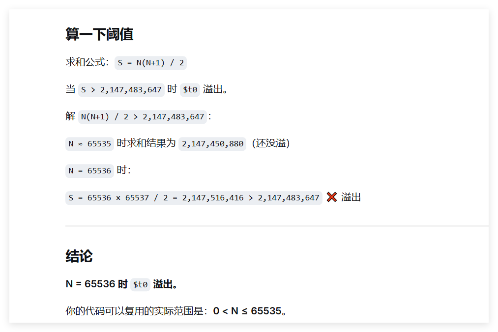

如果换成addu，虽然结果会错误，但不会报错

有意思！


必须在文本文件的末尾留一个空白行。

**【注】** 文件末尾留空行是早期汇编器和跨平台规范遗留的习惯(读取到'\n'结束)，MARS 中通常不必须，但按教材要求保留更稳妥。

# 算法开发

## 逻辑操作指令应用

### 逻辑操作指令应用真值表
|           | 0-0 | 0-1 | 1-0 | 1-1 |
|-----------|----|----|----|----|
| **x**     | 0  | 0  | 1  | 1  |
| **y**     | 0  | 1  | 0  | 1  |
| **x AND y** | 0  | 0  | 0  | 1  |
| **x OR y**  | 0  | 1  | 1  | 1  |
| **x XOR y** | 0  | 1  | 1  | 0  |
| **x NOR y** | 1  | 0  | 0  | 0  |

关于逻辑操作的阐释：

操作数存储在32位源寄存器中，32位运算结果存储在目标寄存器中。一个字中从最低位和最高位分别为为位0和位31，若逻辑操作有16位的中间操作数，则硬件自动0扩展为32位操作数。


```assembly
$t8 = 0xffffffc0 = 1111111111111111111111111111111111111111111111111111111111000000 (二进制)
$t9 = 0x0000003f = 0000000000000000000000000000000000000000000000000000000000111111 (二进制)
```
**此两者称为“模板”**

## 1. 使用 `and` (按位与) 清除低位 (Clearing Lower Bits)

**目标**：将 `$t0` 的内容复制到 `$t1`，并将低 6 位清零。

**指令：**
```assembly
and $t1, $t0, $t8      # $t1 = $t0 & $t8
```

**解析**：
- 在掩码 (`$t8`) 为 0 的位置，结果得到 0。
- 在掩码 (`$t8`) 为 1 的位置，结果得到 `$t0` 的原始值。

## 2. 使用 `or` (按位或) 设置低位 (Setting Lower Bits)

**目标**：将 `$t0` 的内容复制到 `$t1`，并将低 6 位设置为 1。

**指令：**
```assembly
or $t1, $t0, $t9       # $t1 = $t0 | $t9
```

**解析**：
- 在掩码 (`$t9`) 为 1 的位置，结果得到 1。
- 在掩码 (`$t9`) 为 0 的位置，结果得到 `$t0` 的原始值。

## 3. 使用 `xor` (按位异或) 取反特定位 (Complementing Specific Bits)

**目标**：取反寄存器 `$t0` 的低 6 位，其余位保持不变。

**指令：**
```assembly
xor $t0, $t0, $t9      # $t1 = $t0 ^ $t9
```

**解析**：
- 在掩码 (`$t9`) 为 1 的位置，得到原始值 `$t0` 的取反值。
- 在掩码 (`$t9`) 为 0 的位置，得到 `$t0` 的原始值拷贝。

---

## 4. 判断两个数是否同号 (Checking Same Sign)

**目标**：判断寄存器 `$s0` 和 `$s1` 中的数值是否具有相同的符号。

**指令序列：**
```assembly
xor $t0, $s0, $s1      # 如果 $s0 和 $s1 符号不同，$t0 的最高有效位 (MSB) 将被设为 "1"
bgez $t0, same_sign    # 如果 MSB 为 0 (即同号)，则跳转到 same_sign 标签
```

**解析**：
- 异或操作可以直观地发现两个数符号位（最高位）的区别。
- 结果 `$t0` 为负数代表符号不同；`$t0` 为非负数代表符号相同。

## 5. 不使用临时寄存器交换两个寄存器的值 (Swapping Registers)

**目标**：交换 `$s0` 和 `$s1` 的内容。

**指令序列：**
```assembly
xor $t0, $s0, $s1      # 确定哪些位是不同的
move $s0, $t1          # 将 s1 的副本移到 s0 
xor $s1, $s0, $t0      # 获取 s0 的副本，并取反那些不同的位
```

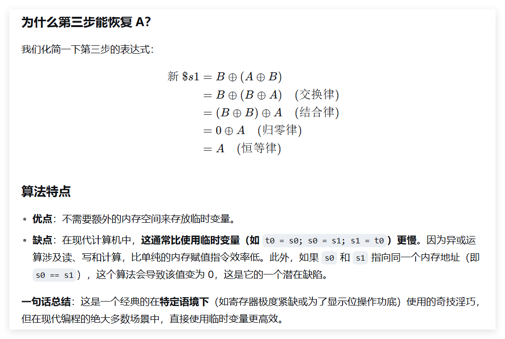

## 移位操作指令应用
有一个注意点：移位可进行乘除，-8可算术右移1位实现/2,而负奇数如-9就不行，结果没有向0截断，答案应是-4。可通过以下代码实现：
```py
sub $a0,$zero,$a0
sra $a0,$a0,1
sub $a0,$zero,$a0
```
PS:div指令会正常处理，就是移位指令需要注意

## 见P63 5.4模块化程序设计和文档

# 使用栈实现函数调用

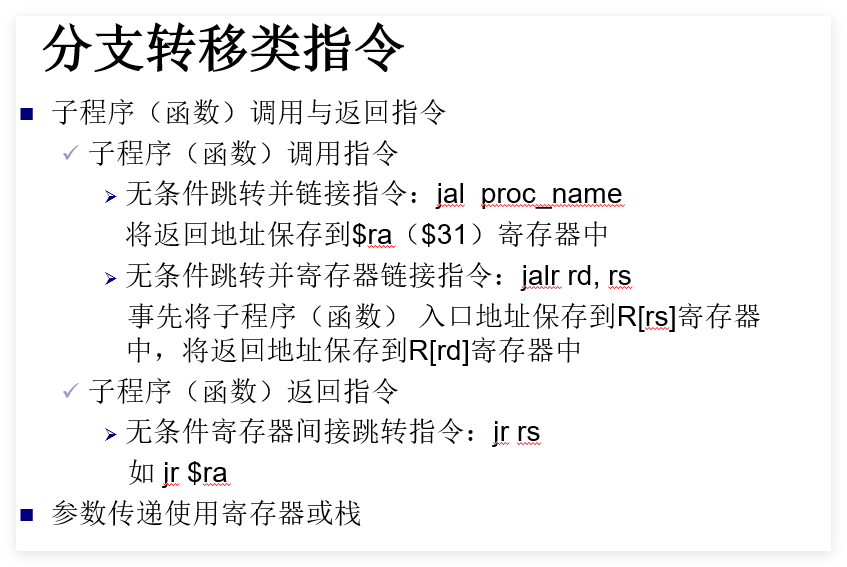

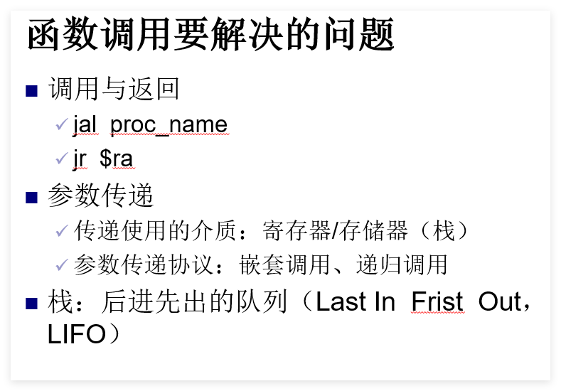

## 堆栈的基本概念和具体操作
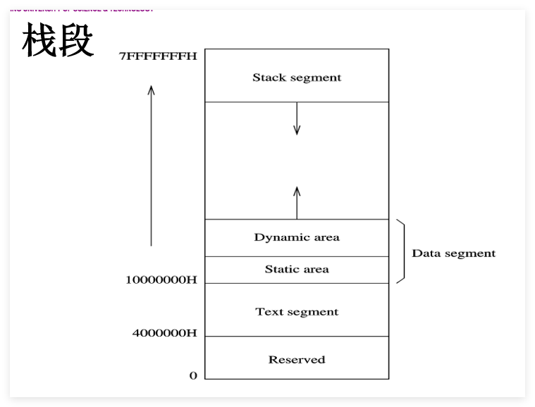

栈数据向下增长（栈底向栈顶，栈顶在下面），且地址逐渐减少。使用栈存储数据不需要具体地址，只需要有一个寄存器记录栈顶的地址。在MIPS架构中使用寄存器堆中的29号寄存器记录栈顶地址，即`$sp`$(stack\ pointer\ 栈指针)$
一个字入栈的操作分为两步：在当前sp指定的地址存储字；将sp减去4。对应的出栈操作也是两步：取出sp位置上的 字，将sp加上4。

入栈时sp减少，出栈时恢复，增加。
例如，将存储器`$t0`入栈的指令序列为：
```
addiu $sp,$sp,-4 #调整栈顶指针  必须用 addiu，因为栈操作不需要溢出检测。
# MIPS要求字访问必须4字节对齐，$sp 的修改必须是4的倍数。
sw $t0,0($sp)    #$t0入栈
```
将存储器`$t0`出栈的指令序列为：
```
lw $t0,0($sp)    #$t0出栈
addiu $sp,$sp,4  #调整栈顶指针
```

**MIPS的字(word) = 32位 = 4字节
MIPS的lw和sw指令只能访问4字节对齐的地址，即地址必须是4的倍数（地址的低2位必须为00）。**
## 参数传递协议
硅图国际公司最早提出了在MIPS架构下参数传递协议，即：

前四个传递给函数的实参(传入参数)在调用函数前要放到a0、a1、a2和a3寄存器中。

即便这些参数不存放到栈中，也需要在栈中为它们分配存储空间。其余实参都通过栈来传递。

寄存器v0和v1用于存放被调用函数的返回值。

**对于将多个数据入栈和出栈的操作，仅需要调整一次栈顶指针，以提高效率**

main在调用JACK函数时，还需要调用JILL库函数，假设JILL涉及5个参数，其中3个参数需要传递给函数(传入参数)，函数返回2个参数(传出参数)。一般来说，参数既可以传递值也可以传递地址(指针)。
函数JILL的伪代码描述为`JILL(A,B,C,D,E)`


> 这段代码展示了在调用函数 `JILL` 前后，如何在堆栈中保存和恢复数据。

## MIPS 汇编代码

```assembly
#此时处于调用JACK
addiu $sp, $sp, -24        # 在栈中分配调用函数 JILL 所需的内存空间
sw    $t1, 0($sp)           # 将第 1 个实参数 “A” 存入栈，即栈顶位置 (Mem[$sp])
sw    $t2, 4($sp)           # 将第 2 个实参数 “B” 存入栈，即栈顶+4 位置 (Mem[$sp+4])
sw    $t3, 8($sp)           # 将第 3 个实参数 “C” 存入栈，即栈顶+8 位置 (Mem[$sp+8])
sw    $ra, 20($sp)          # 栈顶+20 处用于保存返回地址，即调用 “JACK” 函数指令的下一条指令的地址
                            #因为再调用JILL，$ra会被覆盖(注意保存的时机)
jal   JILL                  # 调用函数 JILL
---
#此时JILL jr $ra又回到了JACK
lw    $ra, 20($sp)          # 取回返回到主程序 (main 函数) 的返回地址
lw    $t4, 12($sp)          # 在栈顶+12 位置 (Mem[$sp+12]) 取第 1 个返回参数 (传出参数) “D”
lw    $t5, 16($sp)          # 在栈顶+16 位置 (Mem[$sp+16]) 取第 2 个返回参数 (传出参数) “E”
addiu $sp, $sp, 24          # 释放栈空间
```

### 图 6-2 jal JILL 指令之前和之后的堆栈内容

| 偏移量 | 调用 JILL **之前** (初始状态) | 调用 JILL **之后** (函数返回后状态) |
| :---: | :---: | :---: |
| **+20** | 返回地址 | 返回地址 |
| **+16** | ? | **E** |
| **+12** | ? | **D** |
| **+8** | **C** | **C** |
| **+4** | **B** | **B** |
| **+0** | **A** | **A** |   

*(图中 `$sp` 箭头指向 +0 位置)*
有几个注意要点:sp在减完x之后，栈顶位置即为`0($sp)`,而`(x-4)($sp)`是合法的可存储新数据的最后一个位置(+x到的原位置不能放数据)
`addiu $sp,$sp,x #回到旧栈顶`则是释放栈空间
并且`$sp`是不改变的，仅使用偏移

```text
调用JILL前的栈：
高地址
+24: [旧$sp的数据] ← 不能动！
+20: [JACK的$ra]   ← 保存的返回地址
+16: [????]        ← 预留给E（初始为垃圾值）
+12: [????]        ← 预留给D（初始为垃圾值）
+8:  [  C  ]       ← 输入参数
+4:  [  B  ]       ← 输入参数
+0:  [  A  ]       ← 输入参数  ← $sp指向这里
低地址

调用JILL后：
+24: [旧$sp的数据] 
+20: [JACK的$ra]   ← 恢复后写回$ra
+16: [  E  ]       ← JILL写入的传出参数
+12: [  D  ]       ← JILL写入的传出参数
+8:  [  C  ]       
+4:  [  B  ]       
+0:  [  A  ]       
```
## 嵌套函数调用和叶子（Leaf）函数
对于稍有规模的程序，其函数调用往往是多层嵌套的，形成一个树状结构。调用树最下端的函数如同树叶，称为叶子函数。

**叶子函数是不会调用其他函数的函数**

故对于上一节JLLL，最先要做的工作是获取输入参数是 A,B和C
```
JILL:
    lw $a0,0($sp) #在栈顶位置(Mem[sp])获得第一个参数"A"
    lw $a1,4($sp) #在栈顶+4位置获得第二个参数"B"
    lw $a2,8($sp) #在栈顶+8的位置获得第三个参数"C"
    #...
#在函数JILL中的最后几条指令实现返回参数D和E：
    sw $v0,12($sp) #在栈顶+12处，存放第一个返回的参数"D"
    sw $v1,16($sp) #在栈顶+16处，存放第二个返回的参数"E"
    jr $ra         #返回JACK
```


在函数嵌套调用的情况下，有时还会有一种更复杂的情况。假设在函数“JACK”中使用寄存器t6和t7存放中间(临时)结果，而且要求这两个寄存器存放的内容在调用函数“JILL”的执行完毕后，仍保持原存放的数值不变。
确保这些寄存器中存放的原有值（函数“JACK”的中间结果）不被破坏的唯一方法是：在调用函数“JILL”之前将它们**保存在栈中**，并且在函数在“JILL”执行结束返回到函数“JACK”之后，恢复这两个寄存器原来存放的值。

为什么需要在JACK函数中有上述“保存”和“恢复”行为？因为函数“JILL”可能需要使用t6和t7寄存器来存放它产生的中间结果。

注意，使用 32 位 MIPS 架构汇编语言编程，程序员只需要保存那些“t”开头的寄存器。其原因是我们约定在一个函数内部，仅使用“t”开头的寄存器来存放中间结果，而通常不使用其它寄存器存放中间结果，“t”代表“临时（temp）”。
叶子函数没有保存“t”开头的寄存器内容的需求，因为其不再调用任何函数。下面的例子展示函数 JACK 如何保存和恢复寄存器$t6和$t7中的内容，图 6-3 显示了调用 JILL 前后的堆栈内容。


**由于存在函数嵌套调用和递归调用行为，返回地址寄存器$31或$ra必须要入栈加以保护;由于必须使用CPU内部通用寄存器存放临时（中间）结果，所以通用寄存器也需要入栈保护**

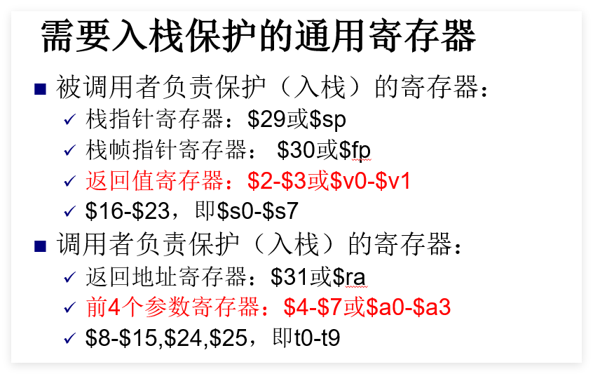

```assembly
addiu $sp, $sp, -32        # 考虑到需要保存临时寄存器，在栈中分配了多一些空间
sw    $t1, 0($sp)           # 将第 1 个实参数 “A” 存入栈，即栈顶位置 (Mem[$sp])
sw    $t2, 4($sp)           # 将第 2 个实参数 “B” 存入栈，即栈顶+4 位置 (Mem[$sp+4])
sw    $t3, 8($sp)           # 将第 3 个实参数 “C” 存入栈，即栈顶+8 位置 (Mem[$sp+8])
sw    $ra, 20($sp)          # 将返回地址保存在栈顶+20 处，即栈顶+20 位置 (Mem[$sp+20])
sw    $t6, 24($sp)          # 将寄存器 $t6 中的内容保存在栈顶+24 处，即栈顶+24 位置 (Mem[$sp+24])
sw    $t7, 28($sp)          # 将寄存器 $t7 中的内容保存在栈顶+28 处，即栈顶+28 位置 (Mem[$sp+28])

jal   JILL                  # 调用函数 JILL

lw    $t6, 24($sp)          # 恢复寄存器 $t6 原有内容
lw    $t7, 28($sp)          # 恢复寄存器 $t7 原有内容
lw    $ra, 20($sp)          # 取回返回到主程序 (main 函数) 的返回地址
lw    $t4, 12($sp)          # 在栈顶+12 位置 (Mem[$sp+12]) 取第 1 个返回参数 (“out 参数”) “D”
lw    $t5, 16($sp)          # 在栈顶+16 位置 (Mem[$sp+16]) 取第 2 个返回参数 (“out 参数”) “E”
addiu $sp, $sp, 32          # 释放栈空间
```
### 图 6-3 jal JILL 指令之前和之后的堆栈内容

| 堆栈内容 (调用前) | 偏移量 | 堆栈内容 (调用后) |
| :---: | :---: | :---: |
| $t7 | +28 | $t7 |
| $t6 | +24 | $t6 |
| 返回地址 | +20 | 返回地址 |
| ? | +16 | E |
| ? | +12 | D |
| C | +8 | C |
| B | +4 | B |
| A | +0 | A |

*(注：$sp 箭头指向栈底，即 +0 位置)*

## 在栈中为局部变量分配存储空间
当需要临时数据缓冲区时，需要为在栈中为临时数据（局部变量）分配存储空间。比如：
```
addiu $sp,$sp,-16 #在栈中为临时数组分配存储空间
move $a0,$sp      #初始化指向该数组的指针
```
在函数返回之前，该临时数组在栈中分配的存储空间必须被释放。
```
addiu $sp,$sp,16  #释放临时数组在栈中占用的存储空间
```
## 栈帧指针
根据上面的代码，可以注意到，在栈中为局部变量分配空间时，需要更改栈指针(sp)中的地址，即改变了栈顶的位置。在前面的所有示例中，我们是在基于假设栈顶位置不会改变的前提下，可以正确地获取或存储实参和返回值，因为这些参数的存放位置相对栈顶位置而言，偏移量时固定的值。

考虑一种方法，可以在每个函数中建立一个固定的参考点，以保持各个参数相对于固定参考点的偏移量，不会因分配局部变量而发生变化。

<strong>寄存器30 `$fp`</strong>称为栈帧指针寄存器，用于存放栈帧地址。栈帧也成为活动记录$(activation record)$

一个函数的栈帧，用于保存该函数的参数、临时寄存器的内容以及分配给该函数定义的局部变量所需的内存空间，还包含了栈帧之间的链接关系。
### 例 6-2：使用 MIPS 汇编语言实现下述 C 语言程序的功能

C 语言源代码

```c
main()
{
    int a;
    a = mysub(6);
    print(a);
}

int mysub( int arg )
{
    int b, c;
    b = arg*2;
    c = b + 7;
    return c;
}
```

MIPS 汇编语言代码


### 1. Main 函数部分

```py
    .text
    .globl main

# ---------- main函数开始 ----------
main:
    # 被调用函数所需步骤如下：
    # 1. 返回地址入栈
    addiu $sp, $sp, -4
    sw  $ra, ($sp)

    # 2. 调用者的栈帧指针入栈
    addiu $sp, $sp, -4
    sw  $fp, ($sp)

    # 3. 没有 s 开头的寄存器需要入栈，此步为空

    # 4. $fp = $sp - 变量需要的空间 (此处只有 int a，即 4 字节)
    addiu $fp, $sp, -4
    move $sp, $fp

    # ---------- 调用子函数 mysub ----------
    # 调用子函数的步骤如下：
    # 1. 没有 t 开头的寄存器需要入栈，此步为空
    # 2. 加载参数 $a0
    li  $a0, 6
    # 3. 跳转至被调用函数入口
    jal mysub

    # ---------- 处理调用返回的步骤 ----------
    # 1. 没有 t 开头的寄存器需要出栈，此步为空
    # 2. a = mysub(6)，函数返回值赋值给变量 a
    sw  $v0, 0($fp)

    # ---------- 打印变量 a ----------
    # 变量 a 加载到 $a0
    lw  $a0, 0($fp)
    # 打印整型数的系统调用
    li  $v0, 1
    syscall

    # ---------- 结束函数 ----------
    # 1. 无返回值，此步为空
    # 2. $sp = $fp + 变量需要的空间
    addi $sp, $fp, 4
    # 3. 没有 s 开头的寄存器需要出栈，此步为空
    # 4. $fp 出栈
    lw  $fp, ($sp)
    addiu $sp, $sp, 4
    # 5. $ra 出栈
    lw  $ra, ($sp)
    add $sp, $sp, 4
    # 返回到操作系统
    jr  $ra
```

### 2. Mysub 函数部分

```py
    .text
    .globl mysub

# ---------- mysub 函数开始 ----------
mysub:
    # 被调用函数所需步骤如下：
    # 1. 返回地址入栈
    addiu $sp, $sp, -4
    sw  $ra, ($sp)

    # 2. 调用者的栈帧指针入栈
    addiu $sp, $sp, -4
    sw  $fp, ($sp)

    # 3. $s1 入栈 (被调用者保存)
    addiu $sp, $sp, -4
    sw  $s1, ($sp)

    # 4. $fp = $sp - 变量需要的空间 (int b, c 共 8 字节) |||“方便访问变量” 正是 $fp 的核心功能之一，也是它存在的最主要目的。|||
    addiu $fp, $sp, -8
    move $sp, $fp

    # ---------- 函数体 ----------
    # b = arg * 2
    mul $s1, $a0, 2
    # 将计算结果 b 存入栈中 (偏移量 0)
    sw  $s1, 0($fp)

    # c = b + 7
    lw  $t0, 0($fp) # 获得变量 b
    addiu $t0, $t0, 7 # b + 7
    # 将计算结果 c 存入栈中 (偏移量 4)
    sw  $t0, 4($fp)

    # ---------- 结束函数 ----------
    # 1. 返回值放到 $v0 中
    lw  $v0, 4($fp)

    # 2. $sp = $fp + 变量需要的空间
    addiu $sp, $fp, 8

    # 3. $s1 出栈
    lw  $s1, ($sp)
    add $sp, $sp, 4

    # 4. $fp 出栈
    lw  $fp, ($sp)
    addiu $sp, $sp, 4

    # 5. $ra 出栈
    lw  $ra, ($sp)
    addiu $sp, $sp, 4

    # 6. 返回到调用者
    jr  $ra
```

## 可重入函数
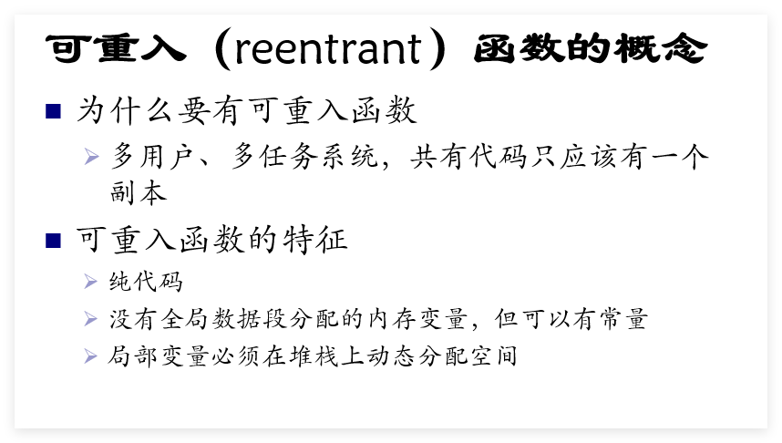

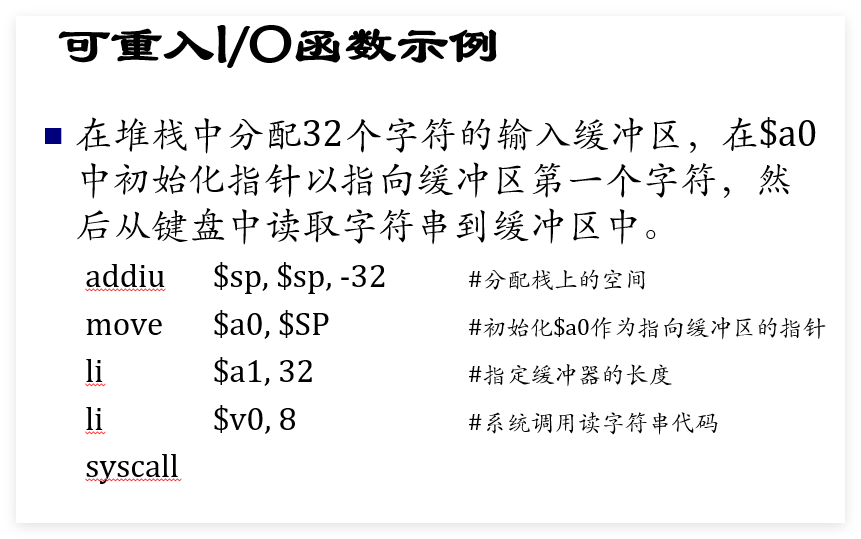

## 递归函数

编写递归函数类似于编写可重入代码，在执行递归调用之前，在堆栈上保存与当前调用函数有关的所有寄存器的内容。当从递归函数调用返回时，堆栈上保存的值必须恢复到相关寄存器。
例：计算N！
 N！= 1 * 2 * 3 * ... * N，且定义0！= 1
用递归思想定义N的阶乘：N！= N*(N-1) ！ 。


# 异常处理

## 如何使计算机提供交互响应？--中断
中断，是在硬件设计中包含当某些外部事件发生时，中断当前程序运行的**一些方法**。使CPU暂时中断正执行的程序，去处理特殊事件的操作，处理完成后能继续被中断前的操作。

发出中断请求，引起CPU中断的事件或来源成为中断源。
 
通过中断机制传输数据成为中断传送方式，是CPU与外设之间通信的一种有效方法，提高了CPU的利用率，也提高了计算机处理各种突发事件或外部事件的能力。
除了中断之外，还有很多需要打断程序正常执行的事件。MIPS体系结构将这些事件用一种专门的机制来处理，叫做异常处理。MIPS架构的实现方案是附加硬件，成为协处理器0，包含多个用于异常处理的专用寄存器以及支持内存映射。该协处理器被设计位在异常发生时，向CPU控制单元发送中断信号。

常见MIPS异常事件：
- 外部事件：包括中断和读总线出错
- 访存异常：对于给定的访存地址不存在可用的映射项，或试图写入写保护的页
- 程序或硬件检测到的错误：报错不存在的指令、用户态的非法指令、整数溢出、地址对齐错误、用户态访问非用户空间等
- 系统调用和陷阱：用专用指令产生的特殊异常，例如syscall产生的异常，用于提供系统调用
  
## 协处理器0
协处理器($Coprocessor0$,简称CP0)中，和处理异常有关的寄存器有如下4个：
- 状态寄存器($SR$):记录系统的各类状态和配置，共32位。位0（IEc，中断使能，设为0时阻止CPU响应中断，为1时允许），位1（KUc，内核模式，设为0时以用户模式运行，为1时以内核模式运行），位2（IEp，前一个IE），位3（KUp，前一个KU），位4（IEo，旧的IE），位5（KUo，旧的KU），位8~15（IM，中断掩码，决定对不同的中断源是否响应）
- 原因寄存器($Cause$):记录发生异常的原因。位2 ~ 6（ExcCode,异常码）是一个五位码，表示发生了哪一种异常。位8~15（IP，挂起的中断）表示有哪些中断还没得到处理。位31（BD,转移延迟）表示异常是否在分支指令的延迟槽中。
- 异常返回地址($EPC$):保存异常返回点的地址。一般是产生异常或者遭遇异常的指令地址，但在Cause寄存器的BD位为0时上移一条指令，即从延迟槽移动到分支指令。
- 坏虚拟地址寄存器($BadVaddr$):在发生地址访问异常时（用户程序访问了用户段以外的地址，或者地址没有对齐），保存引发异常的地址
 
MIPS设计了访问协处理器的指令，以便将协处理器中的寄存器读取到CPU中处理，以及写回到协处理器中。常用指令：
```
mfc0 rd,n #CPU 寄存器rd载入协处理器寄存器n的内容
mtc0 rs,n #将CPU寄存器rs存储到协处理器寄存器n中
```
注意第二个指令mtc0(Move to Coprocessor0,移动到CP0)可能会引起混淆，因为该指令中目的寄存器时在右边字段指定的，这与所有其他MIPS指令不同。
例如：
```
mfc0 $k0,$13  #$k0载入Cause寄存器
mtc0 $0,$12   #将0存储到Cause寄存器中
```
## 陷阱处理过程
每当出现异常时，再处理器到达下一个指令将被取出执行的状态时，CPU控制器就进入一个特殊的状态。以下是当异常返回时，MIPS架构有关硬件所做的主要工作：
- 设置EPC，使其指向返回时重新执行的指令
- 将CPU切换到权限更高的系统态，并进制响应中断。硬件将状态寄存器中的KUp和IEp保存到KUo和IEo，将KUc和IEc的值保存到KUp和IEp，并设KUc=1（内核模式），IEc=0（禁止响应中断）
- 设置Cause寄存器，使软件可以看到异常的原因。当发生地址异常时，设置BadVaddr寄存器
- CPU从异常处理入口地址取指令，开始中断响应例程

MIPS体系结构定义了17个异常：8个外部中断（6个硬件中断和2个软件中断）和9个程序异常条件，也被称为陷阱。这些异常定义在Cause寄存器ExcCode位中，部分内容如下表：
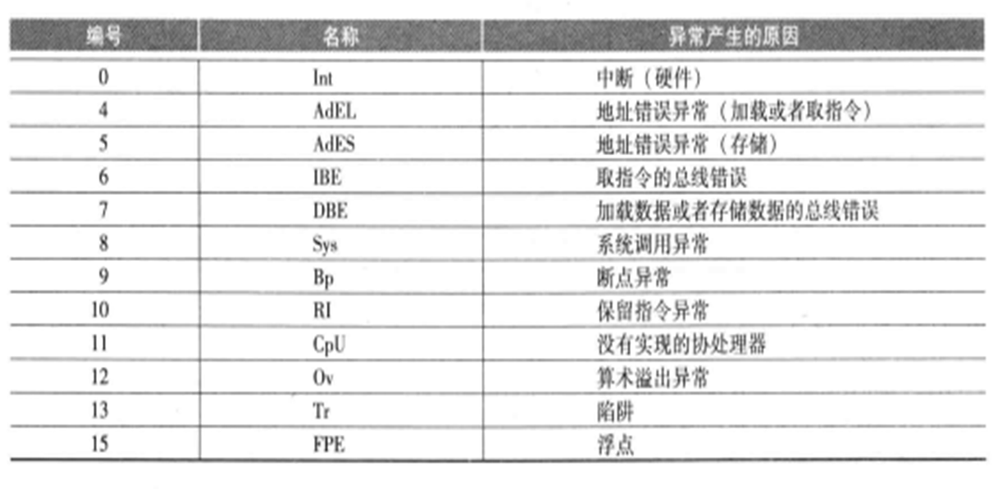
当陷阱的一个例子时算术溢出，另一个例子是地址错误异常：当发生地址错误时，坏虚拟地址（Bad Virtual Address）寄存器加载该地址。例如，试图读取或写入没有物理内存的地址，或写入被保护为只读的文本段，或者访问一个未对齐的字地址。

当中断发生时，中断响应例程的第一个任务是执行一些代码来保存机器存在的状态，保证被打断的程序的关键状态不被覆盖。在处理终中断之后，机器回到相同的状态，执行指令从“从异常恢复(rfe)“”。cfe指令回复状态寄存器SR中的当前和先前模式。最后用jr指令将EPC寄存器内容加载到程序计数器PC，跳回异常发生的指令。在MIPSIII及后续的CPU中，用一条指令eret就可以完成恢复和返回工作。

寄存器`$k0`和`$k1`是保留给操作系统使用的。中断处理程序有可能被写成只使用这些寄存器而很少使用其他寄存器。分析PCSpim的中断处理程序，你会发现它仅保存了寄存器`$v0`和`$a0`。这个中断处理程序不是可重入的，因为它将这两个寄存器保存到了特定的内存位置。如果要使代码可重入，这些寄存器必须保存在分配给操作系统的堆栈上。

实时系统和嵌入式处理器提供了更复杂的中断优先级系统，低优先级的中断处理程序能被较高优先级的中断所中断。MIPS架构提供的中断机制，以及状态寄存器中的屏蔽码位，使编写有优先级的中断处理程序成为可能。

## 陷阱处理程序示例
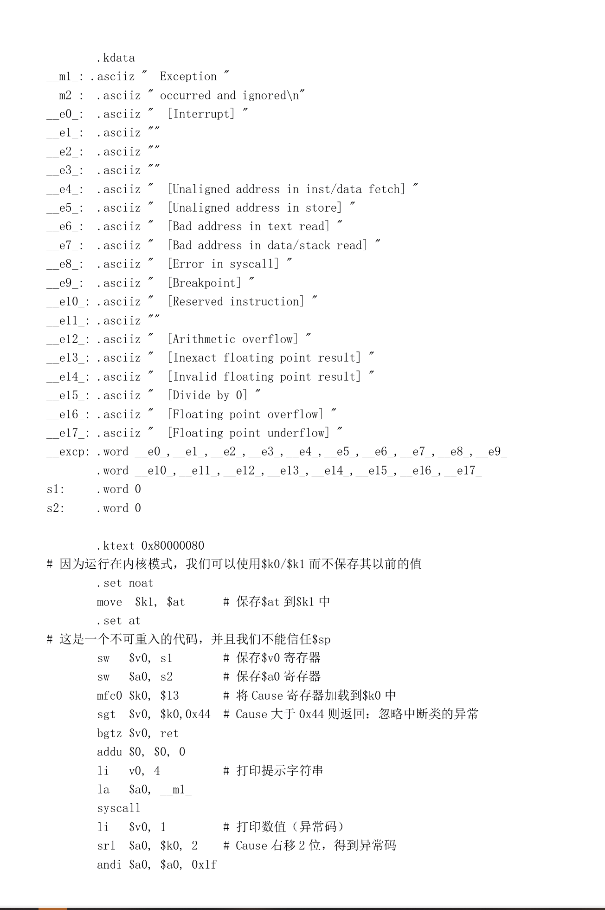
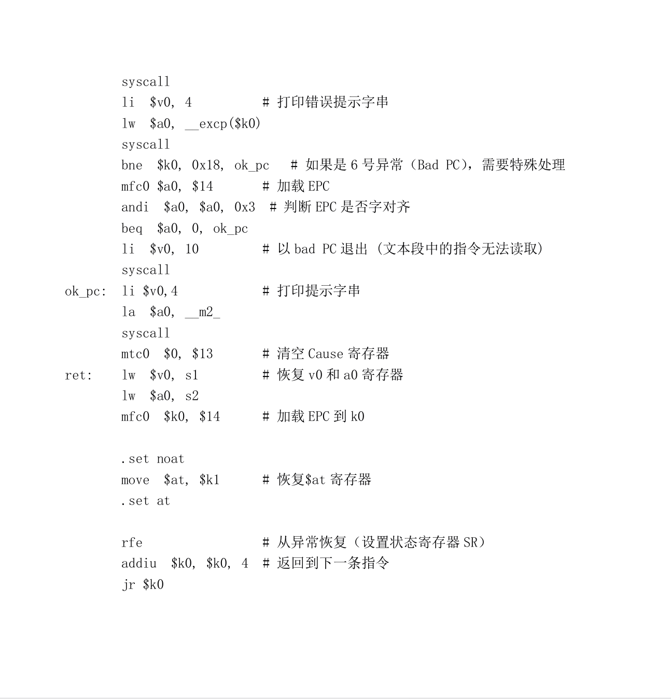

可编辑代码：
```
# MIPS 异常处理代码 (Exception Handler)

.kdata
__m1_: .asciiz " Exception "
__m2_: .asciiz " occurred and ignored\n"
__e0_: .asciiz " [Interrupt] "
__e1_: .asciiz ""
__e2_: .asciiz ""
__e3_: .asciiz ""
__e4_: .asciiz " [Unaligned address in inst/data fetch] "
__e5_: .asciiz " [Unaligned address in store] "
__e6_: .asciiz " [Bad address in text read] "
__e7_: .asciiz " [Bad address in data/stack read] "
__e8_: .asciiz " [Error in syscall] "
__e9_: .asciiz " [Breakpoint] "
__e10_: .asciiz " [Reserved instruction] "
__e11_: .asciiz ""
__e12_: .asciiz " [Arithmetic overflow] "
__e13_: .asciiz " [Inexact floating point result] "
__e14_: .asciiz " [Invalid floating point result] "
__e15_: .asciiz " [Divide by 0] "
__e16_: .asciiz " [Floating point overflow] "
__e17_: .asciiz " [Floating point underflow] "
__exc_: .word __e0_, __e1_, __e2_, __e3_, __e4_, __e5_, __e6_, __e7_, __e8_, __e9_
        .word __e10_, __e11_, __e12_, __e13_, __e14_, __e15_, __e16_, __e17_

s1:     .word 0
s2:     .word 0

.ktext 0x80000080
# 因为运行在内核模式，我们可以使用$k0/$k1而不保存其以前的值
.set noat
move $k1, $at       # 保存$at 到$k1中
.set at

# 这是一个不可重入的代码，并且我们不能信任$sp
sw $v0, s1          # 保存$v0 寄存器
sw $a0, s2          # 保存$a0 寄存器

mfc0 $k0, $13       # 将 Cause 寄存器加载到$k0中
sgt $v0, $k0, 0x44  # Cause 大于0x44 则返回; 忽略中断类的异常
bgtz $v0, ret
addu $0, $0, 0

li v0, 4            # 打印提示字符串
la $a0, __m1_
syscall

li $v0, 1           # 打印数值 (异常码)
srl $a0, $k0, 2     # Cause 右移2位, 得到异常码
andi $a0, $a0, 0x1f

syscall
li $v0, 4           # 打印错误提示字串
lw $a0, __exc_($k0)
syscall

bne $k0, 0x18, ok_pc  # 如果是 6 号异常 (Bad PC), 需要特殊处理

mfc0 $a0, $14       # 加载 EPC
andi $a0, $a0, 0x3  # 判断 EPC 是否字对齐
beq $a0, 0, ok_pc
li $v0, 10          # 以 bad PC 退出 (文本段中的指令无法读取)
syscall

ok_pc:
li $v0, 4           # 打印提示字串
la $a0, __m2_
syscall

mtc0 $0, $13        # 清空 Cause 寄存器

ret:
lw $v0, s1          # 恢复 v0 和 a0 寄存器
lw $a0, s2

mfc0 $k0, $14       # 加载 EPC 到 k0

.set noat
move $at, $k1       # 恢复 $at 寄存器
.set at

rfe                 # 从异常恢复 (设置状态寄存器 SR)
addiu $k0, $k0, 4   # 返回到下一条指令
jr $k0
```
# MIPS流水线与延迟
MIPS是无内部互锁的流水线体系结构，其指令的连续读取和执行如图2.6所示。每条指令的5个阶段（称作流水阶段）都占用固定的时间，通常是一个CPU时钟周期。RD和WB操作只占用半个时钟周期，这样整个5级流水只占用4个时钟周期。
 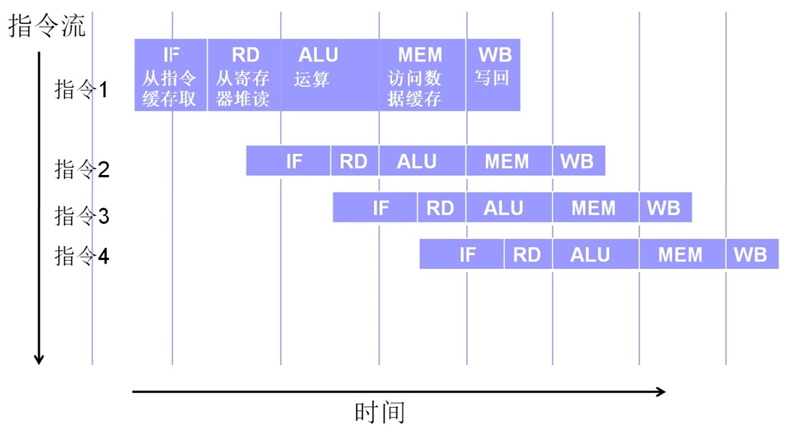
图2.6 MIPS的5级流水线

MIPS流水线会在分支指令的执行时造成一个特定的结果：当新的PC产生，跳转指令处于执行阶段时，分支指令的下一条指令已经读取并开始执行了，如图2.7所示。MIPS体系结构并没有抛弃这条指令，而是规定了分支指令之后的一条指令总是会在跳转目标指令之前正常执行。分支指令之后的指令位置有一个特定的名称，叫做分支延迟槽（branch delay slot）。
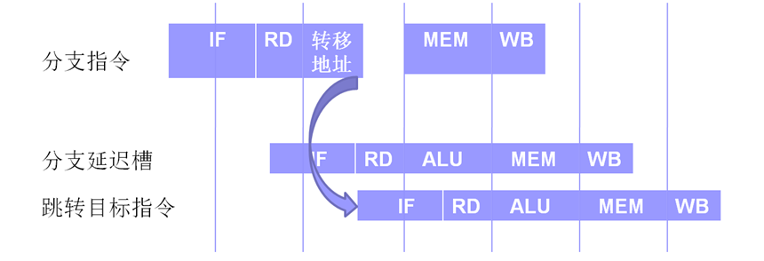
图2.7流水线和分支延迟

汇编程序员或者编译器的设计者应当充分利用分支延迟槽，填充有效指令提高程序效率。常常可以将分支指令前的指令填充到分支延迟槽中，但要小心不要干扰分支指令的判断。如果没有指令可填充，则必须填充空操作指令NOP。很多MIPS汇编器会隐藏延迟槽特性，自动调整代码，将分支前合适的一条指令移动到分支延迟槽中。

流水线造成的另一个问题是数据加载延迟，如图2.8所示。由于数据加载指令（如lw）在下一条指令的ALU阶段启动之后才能从缓存或内存中读到数据，于是下一条指令就不能使用该数据。紧跟在加载指令后的指令位置叫做加载延迟槽，程序员或汇编器也应当利用这一特性做优化工作，或者填入空操作指令nop。MIPS II之后的标准用互锁解决了这个问题：如果后续指令需要使用数据加载指令加载的数据，CPU会停下来，直到数据到达再继续执行。（其实这就不再是“无内部互锁”了）
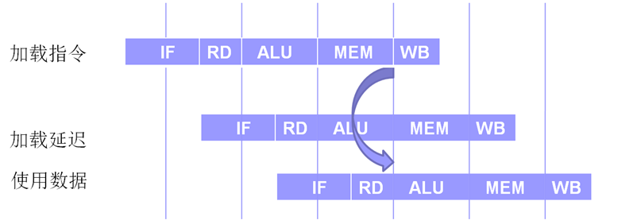
图2.8流水线和加载延迟

本书使用的MIPS模拟器SPIM或MARS的默认设置忽略延迟槽特性，即不理会分支延迟和加载延迟，按照指令的逻辑顺序模拟执行。因此默认设置下的模拟器使用者无需考虑延迟问题。这两个特性可以在设置中打开，完全模拟MIPS的分支延迟或加载延迟


# MIPS 架构与指令集问答

## 第一部分：概述与 MIPS 架构

<details>
<summary><b>Q1：和高级语言相比，低级语言有何优缺点？</b></summary>

- **优点**：
  - 执行效率高，能够直接访问系统接口。
  - 程序体积小，适合嵌入式或对资源敏感的环境。
  - 能够实现高级语言无法做到的底层操作（如上下文切换、中断处理）。
- **缺点**：
  - 可读性差，开发效率低，维护困难。
  - 与硬件平台强相关，移植性差。
  - 容易出错且调试困难。
</details>

<details>
<summary><b>Q2：为何需要学习汇编语言？</b></summary>

- 对于计算机技术的初学者，编写汇编语言程序可以深入了解计算机的程序执行过程，理解计算机底层工作原理，有助于对高级语言程序机制的理解。
- 直观感受CPU的结构和指令执行，有助于后期硬件相关课程的学习。
- 帮助调试和优化高级语言程序（如分析 C 语言反汇编）。
- 编写操作系统内核、驱动程序、嵌入式系统的必需技能。
- 应对安全领域中的逆向工程和漏洞分析需求。
</details>

<details>
<summary><b>Q3：汇编源程序和汇编程序分别是什么？</b></summary>

- **汇编源程序**：使用汇编语言编写的程序。
- **汇编程序**：将汇编源程序翻译成机器码的工具软件（如 MARS, SPIM, GNU as），也叫**汇编器/解释器**。
</details>

<details>
<summary><b>Q4：根据机器指令体系，CPU 分为哪两大类？典型代表有哪些？</b></summary>

- **CISC**（complex instruction set computer复杂指令集计算机）：指令数量多、长度可变、单条指令功能强。  
  代表：x86（Intel、AMD）。
- **RISC**（reduced instruction set computer精简指令集计算机）：指令数量少、长度固定、大部分指令单周期执行。  
  代表：MIPS、ARM、RISC-V。
</details>

<details>
<summary><b>架构 Q1：学习 MIPS 架构需要了解哪四个主要方面的内容？</b></summary>

1. **各类寄存器**：通用寄存器、专用寄存器(HI/LO)、特殊寄存器（PC/IR）。
2. **指令集与指令格式**：R/I/J 三种格式的字段划分与功能。
3. **内存寻址模式**：立即数、寄存器、基址偏移、伪直接、相对寻址。
4. **数据类型与存储格式**：字节、半字、字，以及大/小端对齐。
</details>

<details>
<summary><b>架构 Q2：数据类型和高级语言中的数据类型有何不同？</b></summary>

- 高级语言数据类型（如 `int`, `char`, `float`）带有**语义和检查**（如不能把 `float` 直接当指针用）。
- 汇编语言的数据类型只是**二进制位串的长度约定**（如 8 位、16 位、32 位），硬件不检查类型是否匹配，只按指令操作。
</details>

<details>
<summary><b>架构 Q3：MIPS 架构中通用寄存器有多少个？一个寄存器多少位？</b></summary>

- **32 个**通用寄存器（`$0` ~ `$31`）。
- 每个寄存器 **32 位**（4 字节--一个字）。
</details>

<details>
<summary><b>架构 Q4：用于传递函数输入实参的寄存器是哪些？</b></summary>

`$a0` ~ `$a3`（编号 4~7）。超过 4 个参数时，其余参数通过堆栈传递。
</details>

<details>
<summary><b>架构 Q5：用于存放函数返回值的寄存器是哪些？</b></summary>

`$v0` ~ `$v1`（编号 2~3）。通常 32 位返回值仅用 `$v0`，64 位返回值使用 `$v0` 和 `$v1` 共同存放。
</details>

<details>
<summary><b>架构 Q6：Main 调用 A，Main 中 t0 存有重要值，A 会修改 t0，如何保证 t0 不被改变？</b></summary>

`$t0` ~ `$t9` 是**临时寄存器**，按照 MIPS 调用约定，**被调用函数（A）不需要保存它们**。  
因此 **Main 必须在调用 A 之前自己把 `$t0` 保存到栈中**，A 返回后再从栈中恢复。

```asm
addiu $sp, $sp, -4
sw    $t0, 0($sp)      # 保存 t0
jal   A
lw    $t0, 0($sp)      # 恢复 t0
addiu $sp, $sp, 4
```


可以理解为函数传形参、引用等
</details>

<details>
<summary><b>架构 Q7：若 Main 使用 s0 存放重要值，该如何做？</b></summary>

`$s0` ~ `$s7` 是**保存寄存器**，调用约定规定**被调用函数（A）必须保证这些寄存器在返回时与调用前一致**。  
因此 **Main 无需额外保存**，A 若需要使用 `$s0`，会在自己的代码开头保存并在返回前恢复。


Main 侧无需任何操作，直接调用即可。
</details>

<details>
<summary><b>架构 Q8：保留给 OS 使用的寄存器是哪些？保留给汇编程序使用的寄存器是？</b></summary>

- **OS 保留**：`$k0`, `$k1`（编号 26~27），用于异常处理。
- **汇编程序保留**：`$at`（编号 1），汇编器在展开伪指令时临时使用。
- 在笔记中，宏指令展开大量使用 `$at`。
</details>

<details>
<summary><b>架构 Q9：用于存放函数返回地址的寄存器是哪个？存放栈顶地址的寄存器是哪个？</b></summary>

- 返回地址：`$ra`（编号 31）。
- 栈顶地址：`$sp`（编号 29）。
</details>

<details>
<summary><b>架构 Q10：HI 寄存器用于存放什么数据？LO 寄存器用于存放什么数据？</b></summary>

- **HI**：存放乘法结果的高 32 位，或除法的余数。
- **LO**：存放乘法结果的低 32 位，或除法的商。
</details>

<details>
<summary><b>架构 Q11：简述汇编源程序执行过程？</b></summary>

1. **编辑**：编写 `.asm` 源文件。
2. **汇编**：汇编器将助记符翻译成机器码，生成目标文件（`.o` 或 `.obj`）。
3. **链接**：链接器将多个目标文件和库合并，解析地址，生成可执行文件。
4. **加载**：操作系统将可执行文件载入内存。
5. **执行**：CPU 从 `_start` 或 `main` 入口开始逐条取指、译码、执行。

>汇编语言程序员在使用文本编辑器编写好汇编语言程序后，汇编语言程序中的助记符需要通过该一个名为汇编程序（或称汇编器）的使用程序（或称系统软件），转换为机器语言程序（或称机器语言代码）。机器语言程序以文件形式存储在计算机磁盘上。当需要执行这个程序时，另一个称为链接装载器的实用程序，负责装在和链接所有必须要使用的机器语言模块进入到内存，使得机器语言程序中的每一条指令按顺序存储在内存中。

</details>

<details>
<summary><b>架构 Q12：程序计数器寄存器 PC 存放什么值？为何一次递增 4？何时递增？</b></summary>

- **存放**：当前正在执行指令的地址（MIPS 中通常指向下一条要取的指令）。
- **递增 4**：因为 MIPS 指令固定 32 位（4 字节），地址按字节编址，所以每条指令地址间隔为 4。
- **递增时机**：在取指阶段（IF）完成后，PC 自动加 4 指向下一条顺序指令。
</details>

<details>
<summary><b>架构 Q13：画一个 64KB 的存储器。</b></summary>

- 内存储器可以看作是一个非常长的线性“数组”，这个“数组”大体上来说一部分用于存放数据，另一部分用于存放指令代码。  
- 有效的地址是指向在这个“数组”中存放的数据或指令的某个数组元素的位置，这个“数组”存放数据的部分被操作系统作为所谓的“数据段”来管理。程序计数器中(PC,或称**指令指针**)的内容实质也是指向这个“数组”元素的指针，但它指向的是这个“数组”存放指令代码的部分，这一部分被操作系统作为所谓的“文本段（$Text segment$或代码段）”来管理。  
- 实际上操作系统还在内存中分配了一个称为“栈段”的段，占用了存放数据部分存储空间的一部分。
- 32位MIPS处理器的地址总线的宽度为32位二进制位，存储器寻址空间为$2^{32}$bit，即4G个内存单元，地址范围为0\~4294967295或0x0\~0xFFFFFFFF。  
- 其地址空间的布局，即,使用划分如图所示。地址空间0x0到0x003FFFFF的部分保留给操作系统使用，0x00400000到0x0FFFFFFF为文本段，0x10000000到0x7FFFFFFF为数据段和堆栈段。数据段由代码控制，一般按地址递增连续分配，即由下向上使用；栈则向下增长，即入栈的数据越多，栈顶的地址越小。这样做的好处是可以尽可能的利用地址空间存放数据。
 
 


而对于**字节在字中的存储顺序**
>1word-4byte-32bit  
>本书使用的模拟器是建立在Intel系统上的，Intel系统属于小尾端阵营。因此本书示例在处理字数据的存储时，都使用低字节对应低地址、高字节对应高地址的方式。  
>例：将字0x12345678存储在地址0x10000000的存储器中  


64KB = 2^16 字节，地址范围从 `0x0000` 到 `0xFFFF`。  
通常分为：
- **Text 段**：存放代码（低地址端）。
- **Data 段**：存放已初始化全局变量。
- **BSS 段**：存放未初始化全局变量。
- **Heap**：动态分配区（向上增长）。
- **Stack**：栈区（向下增长，从高地址开始）。

简易图示（按字节编址）：
```
0x0000 ┌────────────┐
       │   Text     │ 代码段
0x???? ├────────────┤
       │   Data     │ 已初始化数据
0x???? ├────────────┤
       │   BSS      │ 未初始化数据
0x???? ├────────────┤
       │   Heap     │ → 向高地址增长
       │   ...      │
       │   Stack    │ ← 向低地址增长
0xFFFF └────────────┘
```
#本图一般反过来理解


</details>

<details>
<summary><b>架构 Q14：现有存储器，对齐要求下，取出地址为 0003 的一个字节、0002 的一个半字、0001 的一个字。</b></summary>

- **取字节 `0x0003`**：对齐无要求，可直接读取该地址 1 字节。
- **取半字 `0x0002`**：半字对齐要求地址为 2 的倍数，`0x0002` 符合，可读取 `0x0002` 和 `0x0003` 两个字节组成半字。
- **取字 `0x0001`**：字对齐要求地址为 4 的倍数，`0x0001` **不符合**，将引发**地址错误异常**。
</details>

<details>
<summary><b>架构 Q15：内存分为几个部分？</b></summary>

典型 MIPS 进程内存布局（从低地址到高地址）：
1. **Text**（代码段）
2. **Data**（已初始化数据段）
3. **BSS**（未初始化数据段）
4. **Heap**（堆，动态分配，向上增长）
5. **Stack**（栈，局部变量，向下增长）
6. **Kernel Space**（内核空间，用户态不可访问）
</details>


<details>
<summary><b>架构 Q16：指令寄存器 IR 存放什么？MIPS 指令有几种格式？</b></summary>

- **IR**：保存最近一条取出的指令(存放当前正在**译码和执行**的机器指令（32 位二进制码）)，在基本32位MIPS架构中，采用32位二进制位固定长度的指令格式。
- **格式种类**：**3 种** —— R 格式、I 格式、J 格式。
</details>

<details>
<summary><b>架构 Q17：R 指令有几段？举一个指令例子。</b></summary>

R 格式共 6 个字段：
| op (6) | rs (5) | rt (5) | rd (5) | sa (5) | funct (6) |
|:---|:---|:---|:---|:---|:---|
例子：`add $t0, $t1, $t2`  
op=`000000`, funct=`100000`。

操作码(opcode)字段占用6位二进制位(31~26)，且这6位全为0.最低的二进制位，即功能(function)字段，不同的编码定义**ALU要执行的具体操作(加减乘除等)**

</details>

<details>
<summary><b>架构 Q18：I 指令有几段？举一个指令例子。</b></summary>

I 格式共 4 个字段：
| op (6) | rs (5) | rt (5) | immediate (16) |
|:---|:---|:---|:---|
例子：`lw $t0, 4($sp)`  
op=`100011`, rs=`$sp`, rt=`$t0`, imm=`0004`。
</details>

<details>
<summary><b>架构 Q19：J 指令有几段？举一个指令例子。</b></summary>

J 格式共 2 个字段：
| op (6) | address (26) |
|:---|:---|
例子：`j label`  
op=`000010`, address 为目标地址的高 26 位（实际地址需左移 2 位后与 PC 高 4 位拼接）。
</details>

<details>
<summary><b>架构 Q20：结合指令动画理解三种格式指令并描述指令执行过程。</b></summary>

以 R 型 `add $t0, $t1, $t2` 为例：
1. **取指IF$(Instruction\ Fetch)$**：PC 所指指令读入 IR，PC+4 -> PC。
2. **译码RD$(Register\ Decode\ /\ Read)$**：解析IR中指令，识别为 R 型，从 `rs`、`rt` 读取 `$t1`、`$t2` 的值。
3. **执行ALU$(Arithmetic\ Logic\ Unit\ Execute)$**：ALU 将两数相加，得到结果。
4. **访存MEM$(Memory\ Access)$**：R 型无访存，结果直通下一阶段。
5. **写回WB$(Write\ Back)$**：结果写入 `rd` 指定的 `$t0`。

I 型和 J 型在地址计算和目标写入上有所区别，但基本五阶段流水线结构相同。

在简化的MIPS架构模型上执行程序，不考虑流水线，以R格式指令为例，可以描述为以下逻辑步骤：
1. 在由程序计数器指定的位置，从内存中提取指令，取出的指令放到指令寄存器中，然后程序计数器中的内容加4；
2. 指令中由两个5位编码的区域中的5位二进制编码，指定寄存器堆中的两个寄存器（即Rs和Rt），作为源操作数寄存器，进而可以获取两个32位源操作数；
3. 两个32位源操作数被分别送到ALU的两个输入端，ALU执行指令中操作码规定的运算操作；
4. 运算结果被存回寄存器堆中由指令中另一个的5位编码区域中的5位二进制编码指定的目的寄存器（即Rd）中。
转到步骤1，以同样的步骤执行下一条指令。


详细查看:[指令执行](#指令执行图)
</details>

---

## 第二部分：寻址方式与指令

<details>
<summary><b>寻址方式 Q1：操作数寻址方式有哪几种？分别是什么含义？</b></summary>

在机器指令中，由两类寻址:
- 操作数寻址(确定操作数所在的地址)
  - 寄存器寻址（在寄存器中寻找数据）、立即数寻址（在指令内部寻找数据）、存储单元寻址（在存储器中寻找数据）
- 目标地址寻址(确定跳转指令目标所在的地址)
  - 直接寻址(也称伪直接寻址)、寄存器间接寻址、相对寻址


MIPS 支持 5 种操作数寻址方式：
**针对操作数的寻址**
1. **立即数寻址$(immediate\ addressing)$**：源操作数之一为立即数，目的操作数为寄存器。(例 `addi $t1,$t2,5`)
2. **寄存器寻址$(register\ addressing)$**：操作数在寄存器中,在指令中指定寄存器名。(例`add $t0,$t1,$t3`)

在寄存器堆中，每个寄存器的编号就是其地址，在指令机器码中以5个二进制位表示


3. **存储单元寻址**(**基址寻址**)：操作数在内存中，地址 = 寄存器 + 16 位偏移量（`lw/sw`）。
>基地址(存放在某个【通用】寄存器中)+位移量(在指令中以16bits补码数存放)$(base\ addressing+displacement)$


- **注意点:**


**针对目标地址的寻址**
*分支转移：*
>实现高级语言的分支、循环以及函数调用与返回等语言成分必不可少的操作。  
实质时改变了程序顺序执行指令的行为（PC增量定值的行为），通过修改PC值实现分支转移功能。
4. **伪直接寻址$(Pseudodirect\ addressing)$**：用于 `j`（无条件转移指令）/`jal`（无条件转移指令并链接），26 位地址左移 2 位与 PC 高 4 位拼接。


**j 的跳转范围是 256 MB，高 4 位来自当前 PC，不能自由改变，所以只能在当前 PC 所在的 256 MB 区域内跳转。**


**"256MB块"**
**不是硬件专门划分的，而是 j 指令的地址计算方式天然导致了这种“块”的存在(一种描述性术语，并非硬件结构)**


- 故：在当前 PC 所在的 256 MB 块内，j 指令可以跳转到块内的任意地址。
- 但有一个前提：目标地址必须是 4 字节对齐（因为指令地址低 2 位为 0），j 指令自动保证了这一点（末尾补 00）。


1. **寄存器间接寻址**


**为什么 jr 不是直接寻址？**
- 因为：
- 直接寻址：地址写在指令里，不需要经过寄存器
- jr：地址先要加载到寄存器，再通过 jr 跳转

$也即，IR解析的时候，解析得到的并不是地址，而是寄存器编号$

$"间接"的核心含义——指令不直接给出地址，而是告诉 CPU 去哪里找地址。$

1. **(PC)相对寻址方式**：用于分支指令，目标地址 = PC + (imm << 2)。`


imm即跳过的指令条数，并且是<strong>真实指令条数</strong><details>

宏指令展开后，它占用的 **“指令条数”** 是按展开后的 **真实指令条数** 来计算的，而不是按宏定义时的一条来算。

### 详细解释

**立即数（偏移量）的含义**
MIPS 分支指令（如 `b`、`beq`、`bne`）中的 16 位立即数，其单位是 **指令条数（word 数）**，而不是字节数。
- 偏移量 = 目标指令地址 - 当前指令地址（PC） 差值，再除以 4。
- 这个偏移量决定的是 **要跳过多少条指令** 才能到达目标地址。

**宏展开的影响**
宏指令在汇编阶段被展开成多条真实指令。当汇编器计算分支偏移量时，它使用**展开后的最终代码布局**来计算。

**举例说明**
假设你的代码中有这样的宏定义：
```assembly
.macro  my_macro
    addu $t0, $t1, $t2
    subu $t0, $t0, $t3
.endm
```
这个宏展开后会变成**2条指令**。

现在考虑这段代码：
```assembly
    beq  $s0, $s1, target   # 假设这里需要跳转到 target
    my_macro                # 这里用了一个宏
    nop
target:
    ...
```

当汇编器计算 `beq` 的偏移量时，它会把 `my_macro` 展开后的 **2条指令** 计入。所以偏移量会包含这 2 条指令，而不是 1 条。

### 总结

- **宏指令展开会使代码段的总指令条数增加。**
- **分支指令的偏移量（立即数）是根据展开后的真实指令条数来计算的。**
- **所以，宏指令展开确实会影响分支跳转的偏移量计算，因为它直接影响了“目标地址与当前 PC 之间的指令条数”。**
</details>

**实际上是I指令格式，imm在静态编译时，通过公式imm=(y-x-4)>>2（右移2位是因为指令地址都是4的倍数，插值也是，地两位必然是0，不必记录，即求得:当前地址与label中间隔imm条指令）算得。然后在动态运行时在IR中填入这个imm**    
**PS：之所以要减去4，是因为跳转指令执行的第一阶段($IF$)已将PC加了4**  
**I指令各式中Imm位数有限，不记录低2位就可以多记录前面2位，可以增加相对地址表达的空间，由$2^{16}$增加到$2^{18}$,即扩大了可以相对转移到地址范围。**  
*即:不省略低 2 位：能表示 2^16 种不同的**字节偏移**；省略低 2 位：能表示 2^16 种不同的**指令条数**，对应 2^16 × 4 = 2^18 种**字节偏移***  
- `imm` 是 16 位有符号整数，范围 `-32768` ~ `+32767`
- 每条指令 4 字节，字节偏移范围：`-131072` ~ `+131068` 字节
- 换算成 KB：`-128 KB` ~ `+128 KB - 4 B`
- 无符号总跨度：`2^{18}` 字节 = `256 KB` **(分支指令的 imm 一定是有符号数，因为要支持向前跳（正偏移）和向后跳（负偏移），也就是循环和条件分支都需要往两个方向跳。)**
- PS:$2^8==2<<7==1<<8$


如果跳转范围过大，超出指令表达范围，则编译程序会给出错误，程序员需要用其他方式完成跳转

| 项目 | 值 |
| :--- | :--- |
| `imm` 位数 | 16 位有符号 |
| `imm` 最小值（二进制） | `1000 0000 0000 0000` = `-32768` |
| `imm` 最大值（二进制） | `0111 1111 1111 1111` = `+32767` |
| 字节偏移最小值 | `-32768 × 4 = -131072` 字节 |
| 字节偏移最大值 | `+32767 × 4 = +131068` 字节 |
| 换算成 KB | `-128 KB` ~ `+128 KB - 4 B` |

| 寻址方式 | 操作数位置 | 寻址过程 | 指令格式 | MIPS 典型指令 | 通俗类比 | 为何叫这个名字 |
|:---|:---|:---|:---:|:---|:---|:---|
| **立即数寻址** | 指令内部 | 直接从指令码中提取常数 | I 型 | `addi $t0, $t1, 5` | 口袋里直接摸出 5 块钱 | 数据**立即**可得，就在指令里 |
| **寄存器寻址** | 寄存器 | 直接读寄存器文件 | R 型 | `add $t0, $t1, $t2` | 从抽屉里拿东西 | 数据在**寄存器**里，选号即用 |
| **基址寻址**<br>(基址+偏移) | 内存 | 地址 = 寄存器值 + 偏移量 | I 型 | `lw $t0, 100($t1)` | 以书架第一层为基准，往右数 10 本书 | 寄存器提供**基地址**，偏移量定位具体位置 |
| **寄存器间接寻址** | 内存 | 地址 = 寄存器值 | R 型<br>(跳转类) | `jr $ra`<br>`jalr $t0` | 纸条上写着门牌号，按号去找 | 不直接给数据，给的是**存放数据的地址**（间接） |
| **伪直接寻址** | 指令附近<br>(256MB 内) | 地址 = PC[31:28] \|\| imm<<2 | J 型 | `j label`<br>`jal label` | 说“大厦 12 楼”，默认还在本栋楼 | 看起来像直接给 26 位地址，实则要靠 PC 高 4 位拼凑（**伪**） |
| **相对寻址** | 指令附近 | 地址 = PC + imm<<2 | I 型 | `beq $t0, $t1, label` | “往前走 3 步”而不是“去 403 房间” | 目标是**相对于当前 PC** 的位移量 |

PS:<details>
**标签的地址，就是它**后面紧跟的那条指令**的地址。当你写 `b label` 时，你跳转到的就是那条指令的地址。**

让我们用具体的例子来拆解。

### 1. 标签的地址是谁的？

```assembly
    .text
    .globl main
main:
    li  $v0, 10      # 假设这行指令的地址是 0x00400000
    syscall

loop_start:          # 标签，它本身不占地址
    addi $t0, $t0, 1 # 假设这行指令的地址是 0x00400010
    j    loop_start
```

- 指令 `addi $t0, $t0, 1` 的地址是 `0x00400010`。
- 标签 `loop_start` 就**代表**这个地址 `0x00400010`。它相当于给这个地址起了一个名字叫 `loop_start`。

**所以，标签的地址 = 它后面紧跟着的那条指令的地址。** 如果标签后面跟着一条指令，那标签就代表这条指令的地址。

### 2. 我写 `b label` 时，跳到哪了？

```assembly
    beq $t0, $zero, skip_loop
    li  $t1, 100
skip_loop:
    addi $t1, $t1, -1
```

- 当汇编器看到 `beq $t0, $zero, skip_loop` 时，它会找到标签 `skip_loop`。
- 标签 `skip_loop` 代表它后面那条指令 `addi $t1, $t1, -1` 的地址。
- 所以，`beq` 指令会跳转到 `addi $t1, $t1, -1` 这条指令的地址。

### 3. 为什么你会觉得“标签不占地址”，但“地址是它的”？

这就像我们给家里门牌号起名字：
- 门牌号 `101` 就是物理地址（好比指令地址）。
- 你给 `101` 起个名字叫“我家”（好比标签）。
- “我家”这个称呼本身不占物理空间，但它代表的就是 `101` 这个地址。

### 4. 拓展：汇编器怎么计算 `b label` 的偏移量？

当你写 `b label` 时，汇编器会根据标签代表的地址，计算出**从当前指令到目标指令之间要跳过多少条指令**，然后将这个“指令条数”作为立即数填充到 `b` 指令中。

**总结：**

- **标签本身不占地址。**
- **标签代表的地址，是它后面那条指令的地址。**
- **当你使用 `b label` 时，你跳转到的是标签所代表的那个地址（即它后面那条指令的地址）。**
</details>
## 寻址方式与寻址范围总结

### 一、操作数寻址（确定操作数所在的地址）

| 寻址方式 | 说明 | 最大寻址范围 |
| :--- | :--- | :--- |
| 寄存器寻址 | 操作数在寄存器中 | 单个寄存器 32 位，无范围概念 |
| 立即数寻址 | 操作数在指令内部 | 16 位立即数，范围 `-32768` ~ `+32767`（有符号）或 `0` ~ `65535`（无符号） |
| 存储单元寻址（基址寻址） | 地址 = 基址寄存器 + 符号扩展的 16 位偏移量 | 偏移量范围 `-32768` ~ `+32767` 字节，实际寻址范围取决于基址寄存器 |

---

### 二、目标地址寻址（确定跳转指令目标所在的地址）

| 寻址方式 | 说明 | 最大寻址范围 |
| :--- | :--- | :--- |
| 直接寻址（伪直接寻址） | `j` / `jal`，地址 = `{PC[31:28], target, 00}` | **256 MB**（当前 PC 所在的 256 MB 块内） |
| 寄存器间接寻址 | `jr` / `jalr`，地址 = 寄存器的值 | **4 GB**（整个 32 位地址空间） |
| 相对寻址 | `beq` / `bne` 等分支指令，地址 = `PC + (imm << 2)` | **±128 KB**（约 `-131072` ~ `+131068` 字节） |

---

### 三、补充说明

- **直接寻址（伪直接寻址）**：虽然名称中有“直接”，但实际并非完整 32 位直接地址，需与 PC 高位拼接，故范围限制在 256 MB。
- **寄存器间接寻址**：可跳转到任意 32 位地址，无范围限制。
- **相对寻址**：`imm` 为 16 位有符号数，乘以 4 后得到字节偏移范围约 ±128 KB。

## 单一寻址

| 指令类型 | 示例 | 操作数寻址 | 目标地址寻址 |
|:---|:---|:---:|:---:|
| 立即数运算 | `addi $t0, $t1, 5` | 立即数 + 寄存器 | — |
| 寄存器运算 | `add $t0, $t1, $t2` | 寄存器 | — |
| 访存 | `lw $t0, 8($s0)` | 基址 | — |
| 无条件直接跳转 | `j label` | — | 伪直接 |

## 双重寻址

| 指令类型 | 示例 | 操作数寻址 | 目标地址寻址 |
|:---|:---|:---:|:---:|
| 条件分支 | `beq $t0, $t1, label` | 寄存器 | 相对 |
| 无条件间接跳转 | `jr $ra` | 寄存器 | 寄存器间接 |

## 规律

- 需要**比较再跳** → 双重寻址（操作数 + 目标地址）
- **直接跳** → 只有目标地址寻址
- **只运算/访存** → 只有操作数寻址


# 两种寻址的本质界限

## 核心判据：寻的是什么"址"

| | 操作数寻址（数据寻址） | 目标地址寻址（指令寻址） |
|:---|:---|:---|
| **寻的"址"** | **数据地址**（某个操作数在寄存器或内存中的位置） | **指令地址**（下一条要执行的指令在内存中的位置） |
| **寻址结果** | 一个**操作数** | 一个**指令位置** |
| **地址送给谁** | **存储器**（读数据/写数据） | **程序计数器 PC**（跳转） |
| **最终影响** | **数据流**（寄存器的值、内存的值） | **控制流**（程序执行顺序） |
| **本质** | **定位数据** | **定位指令** |

---

## 一句话划清界限

> **操作数寻址寻的是"数据在哪"，地址指向内存里的一个值。**
> **目标地址寻址寻的是"指令在哪"，地址指向内存里的一条指令。**

---

## 各自解决的问题

| | 操作数寻址 | 目标地址寻址 |
|:---|:---|:---|
| **核心问题** | 操作数**从哪来** | 下一条指令**去哪** |
| **描述对象** | 数据的位置 | 地址的生成规则 |
| **寻址方式** | 立即数、寄存器、基址 | 伪直接、寄存器间接、相对 |


同时可以进行理解:两种寻址方式，好比两种应对不同情况的措施

1.当遇到寄存器，并且需要寄存器内的值时，选择寄存器寻址-- `move $t0,$t1`

2.当遇到立即数时，如果是需要立即数的值，则使用立即数寻址，如果是需要进行变形变为地址，则为相对寻址(具体看操作码)

3.对于b族，进行比较时，用寄存器寻址，跳转时，用相对寻址

4.对于J族(如jr)，先寄存器寻址，获得值，再用寄存器间接寻址

## 一、核心原则

**寻址方式由“硬件如何处理字段”决定，而硬件如何处理，由操作码决定。**

同一个寄存器编号或立即数，在不同操作码的控制下，会被解释成完全不同的东西。

---

## 二、立即数的三种命运

| 指令 | `imm` 被当作 | 硬件处理 | 产物 | 属于 |
|:---|:---|:---|:---|:---|
| `addi $t0, $t1, 5` | 常数值 5 | 符号扩展 → 32位 | 操作数 | **立即数寻址** |
| `lw $t0, 8($s0)` | 地址偏移量 8 | 符号扩展 + `$s0` 基址 | `$s0+8` 内存地址 | **基址寻址** |
| `beq $t0, $t1, loop` | 指令条数 N | 左移2位 + PC + 4 | `loop` 的地址 | **相对寻址** |

---

## 三、寄存器的两种命运

| 指令 | 寄存器值被当作 | 所属寻址 |
|:---|:---|:---|
| `add $t0, $t1, $t2` | `$t1` 和 `$t2` 的值是运算操作数 | **寄存器寻址** |
| `move $t0, $t1` | `$t1` 的值就是要复制的数据 | **寄存器寻址** |
| `jr $ra` | `$ra` 的值是跳转目标地址 | **寄存器间接寻址** |
| `jalr $t0, $a0` | `$a0` 的值是跳转目标地址 | **寄存器间接寻址** |

> `jr $ra` 同时用了两种：读 `$ra` 是**寄存器寻址**，把它的值送 PC 是**寄存器间接寻址**。

---

## 四、指令族的寻址归属

| 指令族 | 统称 | 内部细分 |
|:---|:---|:---|
| 运算类（`add`, `addi`, `lw`） | 操作数寻址 | 立即数 / 寄存器 / 基址 |
| B 族（`beq`, `bne`, `bgtz` 等） | **相对寻址** | 比较时用寄存器寻址，跳转时用相对寻址 |
| J 族（`j label`, `jal func`） | **伪直接寻址** | 只有目标地址寻址 |
| J 族（`jr $ra`, `jalr $t0`） | **寄存器间接寻址** | 先寄存器寻址取值，再寄存器间接寻址送 PC |

---

## 五、双重寻址

| 指令族 | 操作数寻址 | 目标地址寻址 |
|:---|:---:|:---:|
| B 族（`beq` 等） | 寄存器寻址 | 相对寻址 |
| `jr $ra` / `jalr $t0` | 寄存器寻址 | 寄存器间接寻址 |

---

## 六、用例子走一遍

### `beq $t0, $t1, loop`

-   `$t0` 和 `$t1` 从寄存器来 → **寄存器寻址**（操作数寻址）
-   `loop` 的地址 = PC + 4 + (imm << 2) → **相对寻址**（目标地址寻址）
-   指令整体统称：**相对寻址**

### `jr $ra`

-   `$ra` 的值从寄存器读出来 → **寄存器寻址**（操作数寻址）
-   读出的值直接送入 PC → **寄存器间接寻址**（目标地址寻址）
-   指令整体统称：**寄存器间接寻址**

### `addi $t0, $t1, 100`

-   `$t1` 从寄存器来 → **寄存器寻址**
-   `100` 直接写在指令里 → **立即数寻址**
-   两个源操作数都是**操作数寻址**，没有目标地址寻址

### `lw $t0, 4($s0)`

-   地址 = `$s0` + 4 → **基址寻址**（操作数寻址）
-   读出来的数据加载到 `$t0`
-   只有操作数寻址

---


</details>

<details>
<summary><b>寻址方式 Q2：采用立即数进行操作数寻址的指令是什么格式？采用寄存器进行操作数寻址的指令是什么格式？</b></summary>

- **立即数寻址**：I 格式（如 `addi`, `ori`, `lui`）。
- **寄存器寻址**：R 格式（如 `add`, `sub`, `and`）.

注意本题局限于$“操作数寻址”$

</details>

<details>
<summary><b>寻址方式 Q3：采用存储单元进行操作数寻址的指令是什么格式？什么写法？可以直接访问内存的指令有哪些？</b></summary>

- **格式**：I 格式。
- **写法**：`offset(rs)`，如 `lw $t0, 8($sp)`。
- **直接访存指令**：`lb`, `lbu`, `lh`, `lhu`, `lw`, `sb`, `sh`, `sw`。
</details>

<details>
<summary><b>寻址方式 Q4：为何需要目标地址寻址？</b></summary>

用于改变程序控制流（跳转和分支）。MIPS 中目标地址寻址分为：
- **伪直接寻址**（`j`, `jal`）：快速跳转到 256MB 范围内的绝对地址。
- **寄存器间接寻址**
- **相对寻址**（`beq`, `bne` 等）：相对于当前 PC 的偏移跳转，适合短距离条件分支。
</details>

<details>
<summary><b>寻址方式 Q5：寄存器间接寻址为何称为间接？采用寄存器间接寻址的指令是什么格式？</b></summary>

- **间接含义**：指令中给出的寄存器**不包含操作数本身，而包含操作数的地址**。
- **格式**：R 格式。  
  MIPS 中通过 `jr $ra` 或 `jalr $t0` 实现寄存器间接跳转，即 PC ← `rs`。
</details>

<details>
<summary><b>寻址方式 Q6：伪直接寻址为何称为伪？采用伪直接寻址的指令是什么格式？</b></summary>

- **称为“伪”**：因为指令中的 26 位立即数并非完整的目标地址，必须**与 PC 高 4 位拼接**才能得到真正的 32 位地址，并非“直接”给出全地址。
- **格式**：J 格式（`j`, `jal`）。
</details>

<details>
<summary><b>寻址方式 Q7：相对寻址为何称为相对？采用相对寻址的指令是什么格式？如何计算 Imm？</b></summary>

- **称为“相对”**：因为目标地址是**相对于当前 PC 的值**，而不是绝对地址。
- **格式**：I 格式（所有条件分支指令）。
- **Imm 计算**：  
  机器码中的 `imm` = (目标地址 - (当前 PC + 4)) >> 2。  
  汇编器会自动计算，程序员只需写 `label`。
</details>

<details>
<summary><b>数据传送类指令 Q8：从内存取数据的指令有哪些？它们是什么种类的指令？</b></summary>

- 指令：`lb`, `lbu`, `lh`, `lhu`, `lw`
- 种类：I 格式。
</details>

<details>
<summary><b>数据传送类指令 Q9：带 u 和不带 u 指令的区别是什么？为何没有 lwu？</b></summary>

- **区别**：加载的数据宽度小于 32 位时，**不带 u** 进行**符号扩展**至 32 位；**带 u** 进行**0扩展**。
- **没有 `lwu`**：因为 `lw` 本身就是加载 32 位字，**已经填满目标寄存器**，无需扩展。
</details>

<details>
<summary><b>数据传送类指令 Q10：把寄存器中数据存放到 Mem 的指令有哪些？它们是什么种类的指令？</b></summary>

- 指令：`sb`, `sh`, `sw`
- 种类：I 格式。
</details>

<details>
<summary><b>数据传送类指令 Q11：把 HI 寄存器值传送到通用寄存器的指令是什么？该指令是什么格式？把通用寄存器值传送到 LO 寄存器的指令是什么？</b></summary>

- **HI → GPR**：`mfhi rd`，R 格式。
- **GPR → LO**：`mtlo rs`，R 格式。
</details>

<details>
<summary><b>数据传送类指令 Q12：什么是宏指令？</b></summary>

宏指令（伪指令）是汇编器提供的便利助记符，**在硬件中不存在对应的机器码**。汇编时会被展开为一条或多条真实的机器指令。例如 `li $t0, 100` → `addiu $t0, $zero, 100`。
</details>

<details>
<summary><b>数据传送类指令 Q13：如何把 32 位 Imm 存放到 Mem 中？</b></summary>

```asm
lui $at, 0x1234
ori $at, $at, 0x5678   # $at = 0x12345678
sw  $at, 0($t0)        # 存入 t0 指向的内存
```

无法用单条指令直接将 32 位立即数写入内存，需要分两步：

1. 将 32 位立即数加载到寄存器（`lui` + `ori`）。
2. 用 `sw` 将寄存器值存入内存。

</details>

<details>
<summary><b>数据传送类指令 Q14：如何把 16 位立即数 Imm 存放到 Mem 中？</b></summary>

16 位立即数可用 `ori` 或 `addiu` 直接加载到寄存器，再 `sw` 存出：
```mips
ori $at, $zero, 0x1234
sw  $at, 0($t0)
```
</details>


<details>
<summary><b>数据传送类指令 Q15：写出宏指令 li $10, 0xfffffff 的实现代码。</b></summary>

`0xfffffff` 实际是 `0x0fffffff`（28 位有效），需要 `lui` + `ori`：

```asm
lui $t0, 0x0fff    # 高 16 位：0x0fff
ori $t0, $t0, 0xffff   # 低 16 位：0xffff
```
最终 `$t0` = `0x0fffffff`。


</details>

<details>
<summary><b>数据传送类指令 Q16：通用寄存器之间传送数据的宏指令是什么？其如何实现？</b></summary>

- 宏指令：`move rd, rs`
- 实现：`addu rd, $zero, rs`  
  （将 `rs` 加 0 的结果放入 `rd`）
</details>

<details>
<summary><b>算数运算类指令 Q17：加法指令包括哪些？分别是什么类型的指令？带 u 和不带 u 有何区别？</b></summary>

- **R 型**：`add`, `addu`
- **I 型**：`addi`, `addiu`
- **区别**：
  - 带 `u`：不检测补码溢出，结果直接截断 32 位。
  - 不带 `u`：可能引发溢出异常（取决于具体实现）。
</details>

<details>
<summary><b>算数运算类指令 Q18：减法指令包括哪些？分别是什么类型的指令？</b></summary>

- `sub`：R 型，检测溢出。
- `subu`：R 型，不检测溢出。
- **没有 I 型减法**。
</details>

<details>
<summary><b>算数运算类指令 Q19：减法指令为何不像加法指令那样有带 XXi 型指令？如何实现减去一个立即数？</b></summary>

- **原因**：减法可以通过**加上一个负数立即数**实现，没必要单独设计 `subi` 指令，节省了指令编码空间。
- **实现**：`addiu rt, rs, -imm`  
  因为立即数在 `addiu` 中会【符号扩展】，负数可以正确参与运算。
</details>

<details>
<summary><b>算数运算类指令 Q20：与减法指令相关的宏指令有哪些？</b></summary>

- `neg rd, rs`（求补）：展开为 `sub rd, $zero, rs`。
- `negu rd, rs`（无符号求补）：展开为 `subu rd, $zero, rs`。
</details>

<details>
<summary><b>算数运算类指令 Q21：求补宏指令能否对 -2^31 求补？</b></summary>

**不能**。  
`-2^31` 的补码是 `0x80000000`，其相反数 `2^31` 在 32 位有符号整数中**溢出**（最大正值是 `2^31-1`）。因此对 `0x80000000` 求补结果仍是自身，且带溢出检测的 `neg` 会触发异常。
</details>

<details>
<summary><b>算数运算类指令 Q22：乘/除法指令包括哪些？是什么类型的指令？</b></summary>

- 乘法：`mult` (有符号), `multu` (无符号) —— R 格式。
- 除法：`div` (有符号), `divu` (无符号) —— R 格式。
</details>

<details>
<summary><b>算数运算类指令 Q23：与乘法指令相关的宏指令有哪些？</b></summary>

- `mul rd, rs, rt`：`mult` + `mflo`。
- `mulo rd, rs, rt`：带溢出检查的乘法，若 `HI` ≠ `rd` 的【符号扩展】则溢出。
- `mulou rd, rs, rt`：无符号乘法溢出检查，若 `HI` ≠ 0 则溢出。
</details>

<details>
<summary><b>算数运算类指令 Q24：与除法指令相关的宏指令有哪些？</b></summary>

- `div rd, rs, rt`：`div rs, rt` + `mflo rd`。
- `divu rd, rs, rt`：`divu rs, rt` + `mflo rd`。
- `rem rd, rs, rt`：`div` + `mfhi`。
- `remu rd, rs, rt`：`divu` + `mfhi`。
</details>

<details>
<summary><b>逻辑运算类指令 Q25：与运算指令包括哪些？是什么类型的指令？</b></summary>

- `and`：R 型。
- `andi`：I 型（立即数 0扩展）。
</details>

<details>
<summary><b>逻辑运算类指令 Q26：或运算指令包括哪些？是什么类型的指令？</b></summary>

- `or`：R 型。
- `ori`：I 型（立即数 0扩展）。
</details>

<details>
<summary><b>逻辑运算类指令 Q27：异或运算指令包括哪些？是什么类型的指令？</b></summary>

- `xor`：R 型。
- `xori`：I 型（立即数 0扩展）。
</details>

<details>
<summary><b>逻辑运算类指令 Q28：或非指令含义是什么？非运算如何实现？</b></summary>

- **或非 `nor`**：对 `rs` 和 `rt` 按位或后取反，R 格式。
- **非运算**：MIPS 无原生 `not`，使用宏指令 `not rd, rs` 展开为 `nor rd, rs, $zero`。
</details>

<details>
<summary><b>移位指令 Q29：逻辑左移指令包括哪些？是什么类型的指令？</b></summary>

- `sll`：移位量固定（`sa` 字段），R 格式。
- `sllv`：移位量可变（取自 `rs` 低 5 位），R 格式。
</details>

<details>
<summary><b>移位指令 Q30：逻辑右移指令包括哪些？是什么类型的指令？</b></summary>

- `srl`：固定移位量，R 格式。
- `srlv`：可变移位量，R 格式。
</details>

<details>
<summary><b>移位指令 Q31：算术右移指令包括哪些？是什么类型的指令？</b></summary>

- `sra`：固定移位量，R 格式。
- `srav`：可变移位量，R 格式。
</details>

<details>
<summary><b>移位指令 Q32：为何没有算术左移指令？如何实现算术左移？</b></summary>

- **原因**：**逻辑左移和算术左移效果完全一致**（最低位补 0，符号位自然移出），因此无需单独设计。
- **实现**：直接用 `sll` 或 `sllv` 即可。
</details>

<details>
<summary><b>移位指令 Q33：循环左移宏指令如何实现？</b></summary>

`rol rd, rs, rt`（`rt` 指定移位数）：
```asm
subu $at, $zero, rt   # $at = -rt (补码)，其低5位等效于 32 - rt
srlv $at, rs, $at     # 取出将被移出的高位部分并右移对齐
sllv rd, rs, rt       # 左移剩余部分
or   rd, rd, $at      # 合并
```

>MIPS 进行可变移位（如 srlv）时，只读取 rs 寄存器的低 5 位（即 rt mod 32）。  
假设我们要计算 32 - rt:  
在 32 位补码运算中，-rt 的二进制低 5 位，恰好等于 (32 - rt) mod 32 的低 5 位。(只截取低5位，且无符号)

</details>

<details>
<summary><b>移位指令 Q34：循环右移宏指令如何实现？</b></summary>

`ror rd, rs, rt`：
```asm
subu $at, $zero, rt   # $at = 32 - rt
sllv $at, rs, $at     # 取出将被移出的低位部分并左移对齐
srlv rd, rs, rt       # 右移剩余部分
or   rd, rd, $at
```
</details>

<details>
<summary><b>条件设置指令 Q35：条件设置指令包括哪些？是什么类型的指令？</b></summary>

- **R 型**：`slt`, `sltu`
- **I 型**：`slti`, `sltiu`
</details>

<details>
<summary><b>条件设置指令 Q36：条件设置宏指令有哪些？</b></summary>

- `seq`, `sne`, `sgt`, `sgtu`, `sge`, `sgeu`, `sle`, `sleu`
- 它们都基于 `slt`/`sltu` 及分支指令组合实现。
</details>

<details>
<summary><b>跳转指令 Q37：无条件转移指令包括哪些？是什么类型的指令？</b></summary>

- `j`, `jal`：J 格式。
- `jr`, `jalr`：R 格式。
</details>

<details>
<summary><b>跳转指令 Q38：条件转移指令包括哪些？是什么类型的指令？</b></summary>

均为 I 格式：
- 与 0 比较：`bgez`, `bgezal`, `bgtz`, `blez`, `bltz`, `bltzal`
- 两寄存器比较：`beq`, `bne`

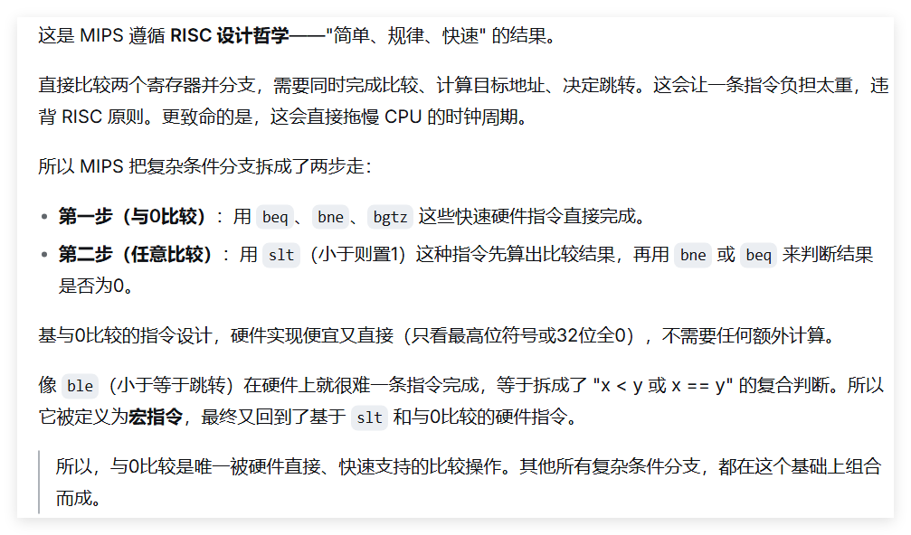

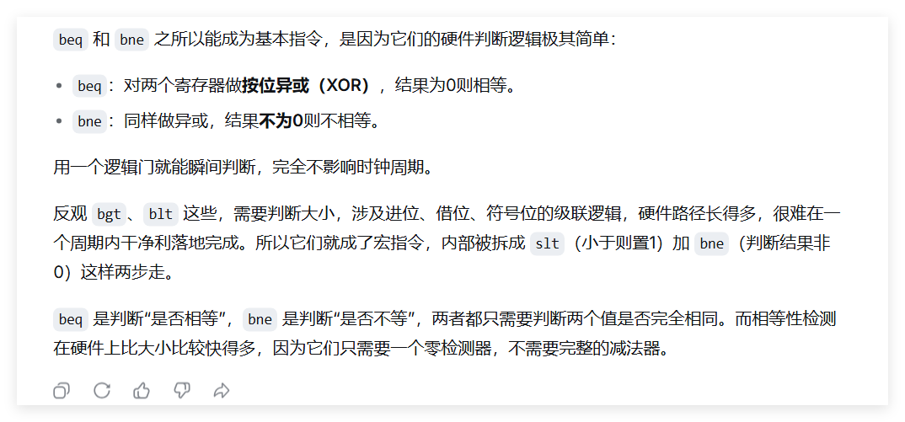

</details>

<details>
<summary><b>跳转指令 Q39：无条件转移宏指令如何实现？与 j 指令有何不同？</b></summary>

- 宏指令 `b label`：展开为 `bgez $zero, label` 或 `beq $zero, $zero, label`。
- **不同**：`b label` 是**相对寻址**，跳转范围有限（±128KB）；`j label` 是**伪直接寻址**，范围大（256MB）。两者寻址方式不同。

“无条件转移” vs “无条件转移宏指令”


</details>

<details>
<summary><b>跳转指令 Q40：条件转移宏指令包括哪些？如何实现的？</b></summary>

- 宏指令：`beqz`, `bnez`, `bge`, `bgeu`, `bgt`, `bgtu`, `ble`, `bleu`, `blt`, `bltu`
- 实现方式：结合 `slt`/`sltu` 与 `beq`/`bne`，例如 `blt rs, rt, label`：
  ```asm
  slt $at, rs, rt
  bne $at, $zero, label
  ```
</details>

<details>
<summary><b>系统调用指令 Q41：系统调用指令是哪个？如何使用该指令？</b></summary>

- 指令：`syscall`（R 格式，funct=`001100`）。
- 使用步骤：
  1. 将系统调用号存入 `$v0`。
  2. 将参数存入 `$a0` ~ `$a3`。
  3. 执行 `syscall`。
  4. 返回值通常从 `$v0` 读取。

例如打印整数：
```asm
li $v0, 1       # 调用号 1：print_int
move $a0, $t0   # 要打印的值
syscall
```
</details>


# 指令执行图


### ALU
- ALU是一个数字逻辑电路组件，用于执行二进制算术运算（如加、减、乘、除）和二进制逻辑运算（如“与（AND）”，“或（OR）”，“或非（NOR）”和“异或（XOR）”），以及移位运算。ALU具体执行哪个操作，取决于存放在指令寄存器中指令的操作代码，即由当前执行指令的操作码决定ALU执行什么样的操作。指令中的不同位域决定了操作的运算类别和操作数。
- **指令中的不同位域**指的是 MIPS 指令的机器码被划分成的几个固定长度的字段（bit fields），每个字段有专门的用途。
- MIPS系统没有在CPU内设计状态寄存器，因此一些异常的运算状态，比如加减法的进位或溢出无法记录
### 存储器
- 大多数现代处理器都实现并使用高速缓冲存储器（Cache），也称“快取”。
- 高速缓冲存储器位于CPU芯片上，提供对指令和数据的快速访问。
- 其原理是CPU将最近在主存中访问过的指令和数据存放在高速缓冲存储器中，下次再次访问这些指令或数据时，可以在高速缓冲存储器中获得，而不需要再次到主存中获取。
### 控制单元(CU,$Control Unit$)
- 要完成取出和执行指令，基于一条指令要完成任务的不同（比如加法操作或减法操作等等），必须生成相应的且有序的控制信号。
- 正如前面提到的，多路复用器必须有控制信号输入；每个寄存器也需要有一个输入控制信号，当该控制信号有效时，将新的值存放到寄存器中（以取代寄存器中原有内容）； ALU也需要控制信号来指定应执行的操作（加、减、乘、除、…）；
- 高速缓冲存储器需要控制信号指定是执行读出操作还是执行写入操作；寄存器堆同样需要一个控制信号，用来指示这是一个将一个值写入寄存器堆的操作还是读取操作等等。
- 所有上述控制信号都来自于控制单元。控制单元由硬件实现，实际上它是一个 "有限状态自动机"。
- 控制单元分析指令寄存器中的指令，基于指令指定的功能，按照指令执行时需要计算机各个硬件组件完成的动作以及这些动作的先后次序，发出控制信号。
- 对于发出信号存在先后次序这个要求，CPU通过将不同信号放在不同的时钟脉冲中发出来实现。计算机运行的速度是由时钟脉冲频率控制的。时钟脉冲发生器是一个晶体振荡器，它产生一个连续的波形
- 如图所示。时钟周期是时钟频率的倒数。所有现代计算机使用的时钟频率都在MHz以上，大部分计算机在GHz以上。（单位M代表106，单位G代表109）


[PPT动画](./指令动画.pptx)

# 例题

##### 例 2-1：写出计算表达式 ax² + bx + c 的程序代码片段。

<details>
<summary>查看答案</summary>

```asm
# 取数据到寄存器中
lw  $t0, X  # 将x的值从内存取到寄存器$t0中
lw  $t1, A  # a
lw  $t2, B  # b
lw  $t3, C  # c

# 计算表达式
mul $t4, $t0, $t0   # $t4 = x²
mul $t4, $t4, $t1   # $t4 = a·x²
mul $t5, $t2, $t0   # $t5 = b·x
add $t4, $t4, $t5   # $t4 = a·x² + b·x
add $t4, $t4, $t3   # $t4 = a·x² + b·x + c
```
</details>

---

##### 例 2-2：使用与运算指令实现下列功能  
（1）将 `$a1` 低 16 位的 bit0 和 bit15 清零，其它位不变；  
（2）将 `$a1` 最低有效字节（LSB）中的 ASCII 字符取出，放到 `$t1` 中。

<details>
<summary>查看答案</summary>

```asm
# (1) 清零 bit0 和 bit15
andi $a1, $a1, 0x7ffe   # 0x7ffe = 0111 1111 1111 1110₂

# (2) 取出最低有效字节
andi $t1, $a0, 0x007f   # 0x007f = 0000 0000 0111 1111₂
```
PS:标准ASCII共128个

</details>

---

##### 例 2-3：使用或运算指令将 `$a1` 寄存器中的 bit7 和 bit31 置 1，其它位不变。

<details>
<summary>查看答案</summary>

```asm
lui  $t1, 0x8000        # 0x8000 = 1000 0000 0000 0000₂
ori  $t1, $t1, 0x0080   # 0x0080 = 0000 0000 1000 0000₂
or   $a1, $a1, $t1
```
</details>

---

##### 例 2-4：使用异或运算指令实现下列功能  
（1）将 `$a1` 寄存器中的 bit5 取反，其它位不变；  
（2）将 `$a1` 寄存器赋初值 0。

<details>
<summary>查看答案</summary>

```asm
# (1) 取反 bit5
xori $a1, $a1, 0x0020   # 0x0020 = 0000 0000 0010 0000₂

# (2) 清零
xor  $a1, $a1, $a1
```
</details>

---

##### 例 2-2（移位版）：计算表达式 x·10 + y，用移位指令实现乘法。

<details>
<summary>查看答案</summary>

```asm
lw   $t1, x            # $t1 = x
lw   $t2, y            # $t2 = y
sll  $t1, $t1, 1       # $t1 = x·2
move $t3, $t1          # 暂存 x·2
sll  $t1, $t1, 2       # $t1 = x·8
add  $t1, $t1, $t3     # $t1 = x·10
add  $t1, $t1, $t2     # $t1 = x·10 + y
```
</details>

---

##### 例 2-3（循环）：使用 `$s6` 存放循环次数，大于 0 则减 1 并继续循环，否则退出。

<details>
<summary>查看答案</summary>

```asm
again:
    blez $s6, Quit       # 若 ≤0 则退出
    addi $s6, $s6, -1    # 减 1
    # 循环体
    b    again
Quit:
```
</details>

---

##### 例 2-4（字符串）：统计以 `\0` 结尾的字符串的字符数目。

<details>
<summary>查看答案</summary>

```asm
la    $t2, str          # $t2 指向字符串 str
xor   $t1, $t1, $t1     # $t1 清 0（计数器）

nextCh:
    lb    $t0, ($t2)     # 取一个字符
    beqz  $t0, strEnd    # 若为 '\0' 则结束
    addiu $t1, $t1, 1    # 计数器 +1
    addiu $t2, $t2, 1    # 指针后移
    j     nextCh
strEnd:
```
</details>


<details>
<summary><b>例3-1：求1+2+…+N的和。</b></summary>

**功能描述：** 求整数1到N的和，N的值由键盘输入。

**算法的伪代码描述：**
```
main:
    cout << "Please input a value for N"
    cin >> v0
    If (v0 <= 0) stop
    t0 = 0
    While (v0 > 0) do {
        t0 = t0 + v0
        v0 = v0 - 1
    }
    cout << t0
    go to main
```

**交叉引用表：**
| 寄存器 | 变量 |
|:---:|:---|
| `$v0` | N |
| `$t0` | Sum |

**MIPS代码：**
```asm
.data
prompt: .asciiz "\n   Please Input a value for N =  "
result: .asciiz "   The sum of the integers from 1 to N is "
bye:    .asciiz "\n  **** Have a good day ****"

.globl main
.text
main:
    li    $v0, 4            # 打印字符串的系统调用号
    la    $a0, prompt       # 加载prompt字串地址到a0
    syscall                 # 打印prompt字串
    li    $v0, 5            # 读取整数的系统调用号
    syscall                 # 读取整数N的值到v0
    blez  $v0, end          # 如果$v0<=0分支到end
    li    $t0, 0            # $t0清0
loop:
    add   $t0, $t0, $v0     # 整数和记录在$t0中
    addi  $v0, $v0, -1      # 反向求整数和
    bnez  $v0, loop         # 如果$v0不为0，分支到loop
    li    $v0, 4            # 打印字符串的系统调用号
    la    $a0, result       # 加载result字串地址到a0
    syscall                 # 打印result字串
    li    $v0, 1            # 打印整数的系统调用号
    move  $a0, $t0          # 将需要打印的值赋给$a0
    syscall                 # 打印整数和
    b     main              # 跳转到main
end:
    li    $v0, 4            # 打印字符串的系统调用号
    la    $a0, bye          # 加载bye字串地址到a0
    syscall                 # 打印bye字串
    li    $v0, 10           # 终止程序，返回系统
    syscall
```
</details>

<details>
<summary><b>例3-2：将算术表达式翻译为MIPS汇编代码。</b></summary>

**表达式：** `$s0 = sqrt($a0 * $a0 + $a1 * $a1)`

（它是哪个基本几何公式? —— 勾股定理，求斜边长）

**假设：** 可以调用平方根库函数，所有计算不超出32位范围。

**MIPS代码：**
```asm
mult  $a0, $a0       # 计算a0的平方
mflo  $t0            # t0为乘积的低32位
mult  $a1, $a1       # 计算a1的平方
mflo  $t1            # t1为乘积的低32位
add   $a0, $t0, $t1  # a0 = t0 + t1
jal   srt            # 调用平方根函数
move  $s0, $v0       # 平方根在v0中返回
```
</details>

<details>
<summary><b>例3-3：将算术表达式翻译为MIPS汇编代码。</b></summary>

**表达式：** `$s0 = (π * $t8 * $t8) / 2`

> 说明：公式的计算应当是浮点的，这里用定点计算替代。定点计算速度为浮点的数倍至数十倍，且精度足够。做法是将运算范围扩大到整数范围并保持适当精度，用整数指令计算，最后需要时再转浮点数。

**MIPS代码：**
```asm
li    $t0, 31415     # 将pi乘以10000，放到t0中
mult  $t8, $t8       # 求半径的平方
mflo  $t1            # t1为乘积的低32位
mult  $t1, $t0       # 乘以PI
mflo  $s0            # s0为乘积的低32位
sra   $s0, $s0, 1    # 用算数右移指令计算s0除以2
```
</details>


---

# 习题

# 习题一

<details>
<summary><b>1. 解释寄存器和ALU的区别。</b></summary>

**寄存器**是CPU内部用于**暂存数据**的高速存储单元，可以存放指令、地址或运算数据，具有记忆功能。

**ALU（算术逻辑单元）**是CPU中负责执行**算术运算**和**逻辑运算**的组合逻辑电路，不具备记忆功能，只能进行计算。

简单比喻：寄存器是**抽屉**（存放东西），ALU是**计算器**（执行运算）。
</details>

<details>
<summary><b>2. 解释汇编语言和机器语言的区别。</b></summary>

| 特性 | 机器语言 | 汇编语言 |
|:---|:---|:---|
| **形式** | 二进制代码 | 助记符 |
| **可读性** | 差（全是0和1） | 较好（如add表示加法） |
| **与硬件关系** | 直接对应 | 一一对应（一条汇编对应一条机器指令） |
| **需要翻译** | 不需要 | 需要汇编器翻译 |
| **举例** | `0000 0010 0001 0000...` | `add $t0, $t1, $t2` |
</details>

<details>
<summary><b>3. 解释高速缓冲存储器和寄存器堆之间的区别。</b></summary>

| 特性 | 高速缓冲存储器 | 寄存器堆 |
|:---|:---|:---|
| **位置** | 位于CPU和主存之间，可能在CPU芯片内 | 在CPU内部 |
| **用途** | 缓存最近使用的指令和数据 | 直接为ALU提供操作数，存放中间结果 |
| **访问方式** | 由硬件自动管理 | 由指令显式指定 |
| **速度** | 快（但比寄存器慢） | 最快 |
| **容量** | 较大（KB~MB级） | 小（MIPS为32个32位寄存器） |
| **管理** | 缓存控制器自动换入换出 | 程序员/编译器管理 |
</details>

<details>
<summary><b>4. 解释指令寄存器和程序计数器之间的区别。</b></summary>

| 特性 | 指令寄存器 | 程序计数器 |
|:---|:---|:---|
| **缩写** | IR | PC |
| **存放内容** | 当前**正在执行**的**指令** | **下一条**要执行指令的**地址** |
| **作用时机** | 译码和执行阶段 | 取指阶段 |
| **更新方式** | 每取一条新指令就更新 | 自动加4，或由跳转指令修改 |
</details>

<details>
<summary><b>5. 解释总线和控制线的区别。</b></summary>

- 数据通路的物理实现是总线（BUS），数据和控制信号在总线上流动。
- 总线是一组电子导体，通过它传送二进制值，这些二进制值可能表示数据或指令，也可能表示存储单元地址或控制信号等。
- 因此，总线分为**数据总线**、**地址总线**和**控制总线**，其中数据总线用于传输数据和指令，地址总线用于传输存储器和I/O设备的地址，而控制总线则用于传输控制信号.

**总线**是计算机中各部件之间**传输数据**的公共通道，包括：
- 数据总线：传输数据
- 地址总线：传输地址信息

**控制线**是传输**控制信号**的专用线路，用于协调各部件工作，如读/写信号、中断请求信号等。

> 总线运货，控制线指挥交通。
</details>

<details>
<summary><b>6. 如果一个主频为500 MHz的计算机取指令和执行指令各需要一个时钟周期，那么该计算机指令执行率是多少？</b></summary>

**解：**

主频 = 500 MHz，时钟周期 T = 1 / (500 × 10⁶) = 2 × 10⁻⁹ s = 2 ns

每条指令需要 2 个时钟周期（取指 + 执行）。

每秒可执行指令数 = (500 × 10⁶) / 2 = **250 MIPS**

答：指令执行率为 **250 MIPS**（每秒2.5亿条指令）。
</details>

<details>
<summary><b>7. 上述机器一分钟能执行多少条指令？</b></summary>

**解：**

250 MIPS × 60 秒 = 15,000 × 10⁶ = **150亿条**

答：一分钟能执行 **150亿条** 指令。
</details>

<details>
<summary><b>8. 假设有一个60年前的计算机，每秒执行1000条指令。在主频为500MHz的上述计算机上，执行1000条指令要花多长时间？</b></summary>

**解：**

500 MHz 计算机每秒执行 2.5 × 10⁸ 条指令。

执行 1000 条指令所需时间 = 1000 / (250 × 10⁶) = 4 × 10⁻⁶ s = **4 μs**

答：执行1000条指令只需 **4微秒**。
</details>

<details>
<summary><b>9. MIPS指令格式有哪几种，其含义是什么？</b></summary>

MIPS指令有三种格式，均为32位固定长度：

| 格式 | 字段组成 | 用途 |
|:---|:---|:---|
| **R格式** | op(6) + rs(5) + rt(5) + rd(5) + sa(5) + funct(6) | 寄存器间运算，如add, sub, and |
| **I格式** | op(6) + rs(5) + rt(5) + imm(16) | 带立即数运算、访存、分支，如addi, lw, beq |
| **J格式** | op(6) + address(26) | 无条件跳转，如j, jal |

- **op**：操作码，确定指令类型
- **rs**：第一源寄存器
- **rt**：第二源寄存器（R型）或目的寄存器（I型）
- **rd**：目的寄存器
- **sa**：移位量
- **funct**：功能码，配合op确定R型指令具体操作
- **imm**：16位立即数
- **address**：26位跳转目标地址
</details>

<details>
<summary><b>10. MIPS指令执行分为哪几个流水线阶段？</b></summary>

MIPS经典五阶段流水线：

| 阶段 | 缩写 | 主要工作 |
|:---|:---|:---|
| **取指** | IF | PC→取指令→PC+4→放入IR |
| **译码** | RD | 解析IR，读取寄存器rs、rt的值（Register Read） |
| **执行** | ALU | ALU执行运算，或计算访存地址 |
| **访存** | MEM | 访问数据存储器（lw读取，sw写入） |
| **写回** | WB | 将结果写回寄存器堆（rd或rt） |
</details>

<details>
<summary><b>11. 假设指令jr $ra的PC值为0x00400040，寄存器ra中的数值为0x00400080，请仿造例1-1写出指令执行各阶段的细节。</b></summary>

**指令**：`jr $ra`（R格式：op=000000, rs=$ra(31), rt=0, rd=0, sa=0, funct=001000）

**1. 取指（IF）**
- 取指地址 = PC = `0x00400040`
- 从内存取出32位机器指令，放入IR
- PC ← PC + 4 = `0x00400044`

**2. 译码（RD）**
- 解析IR：op=000000, funct=001000 → 识别为`jr`指令
- 读取rs(寄存器31)的值 → `$ra` = `0x00400080`

**3. 执行（ALU）**
- 计算跳转目标地址：PC ← `$ra` = `0x00400080`

**4. 访存（MEM）**
- `jr`指令不访问数据存储器，本阶段无操作

**5. 写回（WB）**
- `jr`指令不写回寄存器，本阶段无操作

**结果**：程序跳转到 `0x00400080` 继续执行。
</details>

# 习题二

<details>
<summary><b>2.1 MIPS架构中对操作数寻址有几种方式？对目标地址寻址有哪几种方式？</b></summary>

**操作数寻址（3种）：**
1. **立即数寻址**：操作数在指令中，如 `addi $t0, $t1, 5`
2. **寄存器寻址**：操作数在寄存器中，如 `add $t0, $t1, $t2`
3. **基址寻址**(**存储单元寻址**)：操作数在内存中，地址 = 寄存器 + 偏移量，如 `lw $t0, 100($t1)`

**目标地址寻址（3种）：**
1. **伪直接寻址**：用于 `j`/`jal`，26位地址与PC高4位拼接
2. **寄存器间接寻址**：用于 `jr`/`jalr`，地址在寄存器中
3. **相对寻址**：用于分支指令，地址 = PC + imm<<2
</details>

<details>
<summary><b>2.2 Load/Store架构是什么？请列举几个MIPS指令集中实现Load/Store架构的指令。</b></summary>

**Load/Store架构**：CPU的运算指令**只能对寄存器中的操作数**进行运算，不能直接对内存中的数据进行运算。必须先用 `load` 指令把数据从内存搬到寄存器，运算结束后再用 `store` 指令存回内存。

**Load指令**：`lb`, `lbu`, `lh`, `lhu`, `lw`

PS:`lui`并不是，虽然也有`load`,但它并没有访问内存

**Store指令**：`sb`, `sh`, `sw`
</details>

<details>
<summary><b>2.3 MIPS加减法指令和乘除法指令有什么区别？</b></summary>

| 特性 | 加减法指令 | 乘除法指令 |
|:---|:---|:---|
| **结果位置** | 通用寄存器（rd/rt） | 特殊寄存器HI（高32位/余数）、LO（低32位/商） |
| **需要额外指令** | 不需要 | 需要 `mfhi`/`mflo` 取出结果 |
| **溢出处理** | add/sub检测溢出，addu/subu不检测 | 不产生溢出异常 |
| **立即数支持** | 有（addi/addiu） | 无（乘法用mul宏指令可间接实现） |

> 加减法直接写回寄存器，乘除法要先放在HI/LO里再取出来。
</details>

<details>
<summary><b>2.4 MIPS逻辑操作中的not操作是如何实现的？</b></summary>

MIPS没有硬件 `not` 指令，通过**宏指令**实现：
```asm
not rd, rs
```
展开为：
```asm
nor rd, rs, $zero
```
原理：`rs NOR 0 = ~(rs | 0) = ~rs`，即按位取反。
</details>

<details>
<summary><b>2.5 MIPS条件转移设置指令和条件转移指令的组合可以实现种类繁多的条件分支。请按条件类别写出条件分支指令（包括宏指令）的完整列表。</b></summary>

**（1）与零比较（有符号）**
| 指令 | 条件 | 类型 |
|:---|:---|:---|
| `blez` | rs ≤ 0 | 硬件指令 |
| `bgtz` | rs > 0 | 硬件指令 |
| `bltz` | rs < 0 | 硬件指令 |
| `bgez` | rs ≥ 0 | 硬件指令 |
| `beqz` | rs = 0 | 宏指令 |
| `bnez` | rs ≠ 0 | 宏指令 |

**（2）两寄存器比较（有符号）**
| 指令 | 条件 | 类型 |
|:---|:---|:---|
| `beq` | rs = rt | 硬件指令 |
| `bne` | rs ≠ rt | 硬件指令 |
| `blt` | rs < rt | 宏指令 |
| `ble` | rs ≤ rt | 宏指令 |
| `bgt` | rs > rt | 宏指令 |
| `bge` | rs ≥ rt | 宏指令 |

**（3）两寄存器比较（无符号）**
| 指令 | 条件 | 类型 |
|:---|:---|:---|
| `bltu` | rs < rt | 宏指令 |
| `bleu` | rs ≤ rt | 宏观指令 |
| `bgtu` | rs > rt | 宏指令 |
| `bgeu` | rs ≥ rt | 宏指令 |
</details>

<details>
<summary><b>2.6 分支延迟槽是什么？为什么会有分支延迟问题？</b></summary>

**分支延迟槽**：在MIPS早期的流水线实现中，紧跟在**分支指令后面的一条指令**称为延迟槽指令。这条指令**无论分支是否发生都会被执行**。

**原因**：因为流水线在分支指令取指阶段（IF）的同时，已经把下一条指令取进来并开始译码了。等到分支指令真正执行完（EX阶段）、计算出新的PC时，下一条指令已经在流水线中了。

**解决方案**：
- 编译器在延迟槽中填入一条有用的指令（通常是从分支前搬移过来的）
- 如果找不到可用指令，填入 `nop`

> 现代MIPS可以设置"likely"位来取消延迟槽中指令的执行，但基础架构中延迟槽是经典特性。
</details>

<details>
<summary><b>2.7 参考附录C，将下列汇编程序段翻译成机器语言，并写出完整的翻译过程。

```asm
la   $a0, 0x10000000
lw   $t0, ($a0)
mult $t0, $t0
mflo $t1
sw   $t1, 4($a0)
```

</b></summary>


**1. `la $a0, 0x10000000`**
- `la` 是宏指令，展开为：
```asm
lui $a0, 0x1000        # 加载高16位
ori $a0, $a0, 0x0000   # 低16位为0，可省略
```
- `lui $a0, 0x1000`：
  - op=`001111`, rs=`00000`, rt=`00100`($a0), imm=`0001 0000 0000 0000`
  - 机器码：`0x3C041000`
- `ori $a0, $a0, 0x0000`（如果生成）：
  - op=`001101`, rs=`00100`, rt=`00100`, imm=`0000 0000 0000 0000`
  - 机器码：`0x34840000`

**2. `lw $t0, ($a0)`**
- 等价于 `lw $t0, 0($a0)`
- I格式：op=`100011`, rs=`00100`($a0), rt=`01000`($t0), imm=`0000 0000 0000 0000`
- 机器码：`0x8C880000`

**3. `mult $t0, $t0`**
- R格式：op=`000000`, rs=`01000`, rt=`01000`, rd=`00000`, sa=`00000`, funct=`011000`
- 机器码：`0x01080018`

**4. `mflo $t1`**
- R格式：op=`000000`, rs=`00000`, rt=`00000`, rd=`01001`, sa=`00000`, funct=`010010`
- 机器码：`0x00004812`

**5. `sw $t1, 4($a0)`**
- I格式：op=`101011`, rs=`00100`($a0), rt=`01001`($t1), imm=`0000 0000 0000 0100`
- 机器码：`0xAC890004`

```py
la   $a0, 0x10000000
#宏指令: lui $at,0x1000 rgba(0, 2, 17, 0.07) 1100 0000 0001 0001 0000 0000 0000--0x3c011000 rs被硬编码为0
#		 ori $a0,$at,0x0000 # 0011 0100 0010 0100 0000 0000 0000 0000--0x34240000
#op(lui)=001111 $at为1号寄存器 00001
#op(ori)=001101 $at为1号寄存器 00001 $a0为4号寄存器 00100

lw   $t0, ($a0)	# 1000 1100 1000 1000 0000 0000 0000 0000--0x8c880000
#op(lw)=100011, $t0是8号寄存器 01000 $a0是4号寄存器 00100 偏移 0*16

mult $t0, $t0 # 0000 0001 0000 1000 0000 0000 0001 1000--0x01080018
#op(mult)=000000 funct(lw)=011000 $t0是8号寄存器 01000 R格式有移位码(紧邻功能码)，并且这个指令还没有rd
mflo $t1 [R] #0000 0000 0000 0000 0100 1000 0001 0010--0x00004812
#op(mflo)=000000 func(mflo)=010010 $t1是rd,9号寄存器 01001
sw   $t1, 4($a0) # 1010 1100 1000 1001 0000 0000 0000 0100--0xac890004
#op(sw)=101011 $t1是9号寄存器 01001 $a0是4号寄存器 00100 偏移4--0000000000000100
```

</details>

<details>
<summary><b>2.8 按指令执行5阶段具体描述最后一条指令sw $t1, 4($a0)的执行过程。</b></summary>

**假设**：PC为0x0040000,$a0=0x10000000，$t1=10000（100×100=10000，已在mflo获得）

**1. 取指（IF）**
- PC为0x0040000,将取指令0xac890004从该地址取出并放入指令寄存器IR（`sw $t1, 4($a0)` → IR）
- PC增量为4，变为0x00400004

**2. 译码（RD）**
- 解析IR中指令0xac890004,得到寄存器$a0 内容0x10000000（基址）、$t1 内容10000（要存储的数据）以及立即数 imm=4 → 符号扩展为32位：`0x00000004`

**3. 执行（ALU）**
- ALU计算有效地址：0x10000000 + 4 = **0x10000004**

**4. 访存（MEM）**
- 将$t1的值（10000）写入内存地址 0x10000004
- Mem[0x10000004] ← 10000

**5. 写回（WB）**
- sw指令不写回寄存器，本阶段无操作
</details>

<details>
<summary><b>2.9 上述程序段的功能是什么？</b></summary>

该程序段的功能是：**对内存地址 0x10000000 中的数进行平方运算，并将结果存入下一个字地址（0x10000004）中**。

- 加载地址 0x10000000 到 $a0
- 从该地址取数（100）到 $t0
- 自乘：100 × 100
- 积（10000）存入 $t1
- 将结果 10000 存入 0x10000004

**功能：计算内存中一个整数的平方并存储。**
</details>


---

# 习题三

**3.1 参考附录B，将以下伪代码翻译为MIPS汇编语言：**

<details>
<summary><b>(a) $t3 = $t4 + $t5 - $t6;</b></summary>

```asm
add $t0,$t4,$t5 # t0=t4+t5
sub $t3,$t0,$t6	# t3=t0-t6

```
</details>

<details>
<summary><b>(b) $s3 = $t2 / ($s1 - 54321);</b></summary>

```asm
li   $t0, 54321 #错误写法:addi $t0,$s1,-54321(已超出16位)
sub  $t0, $s1, $t0
div  $s3, $t2,$t0

```
</details>

<details>
<summary><b>(c) $sp = $sp - 16;</b></summary>

```asm
addiu $sp, $sp, -16
```
</details>

<details>
<summary><b>(d) cout << $t3;</b></summary>

```asm
li $v0,1		    #v0=1
move $a0,$t3    #a0=t3
syscall

```
</details>

<details>
<summary><b>(e) cin >> $t0;</b></summary>

```asm
li   $v0, 5
syscall
move $t0, $v0
```
</details>

<details>
<summary><b>(f) $a0 = &array;</b></summary>

```asm
la   $a0, array
```
</details>

<details>
<summary><b>(g) $t8 = Mem($a0);</b></summary>

```asm
lw   $t8, 0($a0) 
```

**寄存器 32 位 + 默认数据类型是字 + 伪代码约定 → Mem(a0) = lw。**

</details>

<details>
<summary><b>(h) Mem($a0 + 16) = 32768;</b></summary>

```asm
li   $t0, 32768 #不能用addi也不能用addiu
#因为所有的立即数都是16位有符号数，而此数范围-32768~32767
sw   $t0, 16($a0)
```
一个错误写法:
```
addi $a0,$a0,16 #a0=a0+6 #$a0被改变了
li $t0,32768
sw $t0,$a0  #应为sw $t0,0($a0)
```
</details>

<details>
<summary><b>(i) cout << "Hello World";</b></summary>

```asm
      .data
msg:  .asciiz "Hello World"
      .text
      li   $v0, 4
      la   $a0, msg
      syscall
```
</details>

<details>
<summary><b>(j) If ($t0 < 0) then $t7 = 0 - $t0; else $t7 = $t0;</b></summary>

```asm
      bgez $t0, else
      sub  $t7, $zero, $t0
      b    next
else: 
      move $t7, $t0
next:
```
> 等价于 `abs $t7, $t0`
> 
</details>

<details>
<summary><b>(k) while(t0 != 0) { s1 = s1 + t0; t2 = t2 + 4; t0 = Mem(t2); }</b></summary>

```asm
loop: 
      beqz $t0, break
      add  $s1, $s1, $t0
      addi $t2, $t2, 4
      lw   $t0, 0($t2)
      b    loop
break:
```
</details>

<details>
<summary><b>(l) for ($t1 = 99; $t1 > 0; $t1 = $t1 - 1) $v0 = $v0 + $t1;</b></summary>

```
      li $t1,99
loop:                   #考虑到第一次肯定成立，于是不在一开始判断
      add $v0,$v0,$t1 
      addi $t1,$t1,-1
      bgtz $t1,loop

```
此法是考虑如果第一次肯定成立+末尾判断满足条件-->继续循环

---
```asm
      li   $t1, 99
      move $v0, $zero #视情况
loop: 
      blez $t1, done 
      add  $v0, $v0, $t1
      addi $t1, $t1, -1
      b    loop
done:
```
此法是起始判断不满足条件-->跳出循环，否则-->继续循环


**第一种更好**

</details>

<details>
<summary><b>(m) $t0 = 2147483647 - 2147483648;</b></summary>

```asm
# 常量表达式，编译时计算：2147483647 - (-2147483648) = 4294967295 = -1（32位补码）
li   $t0, -1
```
</details>

<details>
<summary><b>(n) $s0 = -1 * $s0;</b></summary>

```asm
sub  $s0, $zero, $s0
# 或 neg $s0, $s0
```
</details>

<details>
<summary><b>(o) $s1 = $s1 * $a0;</b></summary>

```asm
mult $s1, $a0
mflo $s1
#或者
mul $s1,$s1,$a0
```
两种写法的区别:第一种高位还在，第一种高位截断
</details>

<details>
<summary><b>(p) $s2 = sqrt($s0² + 56) / $a3;（暂时不用看）</b></summary>

```asm
mul  $t0, $s0, $s0
addi $t0, $t0, 56
# sqrt用浮点协处理器
mtc1 $t0, $f0
cvt.s.w $f0, $f0
sqrt.s $f0, $f0
cvt.w.s $f0, $f0
mfc1 $t0, $f0
div  $t0, $a3
mflo $s2
```
</details>

<details>
<summary><b>(q) $s3 = $s1 - $s2 / $s3;</b></summary>

```asm
div  $s2, $s3
mflo $at
sub  $s3, $s1, $at
#或者
div $t0,$s2,$s3
sub $s3,$s1,$t0

```

</details>

<details>
<summary><b>(r) $s4 = $s4 * 8;</b></summary>

```asm
sll  $s4, $s4, 3
```
</details>

<details>
<summary><b>(s) $s5 = π * $s5;（暂时不用看）</b></summary>

```asm
    .data
pi: .float 3.14159
    .text
mtc1   $s5, $f0
cvt.s.w $f0, $f0
l.s    $f1, pi
mul.s  $f0, $f0, $f1
cvt.w.s $f0, $f0
mfc1   $s5, $f0
```

</details>

---

<details>
<summary><b>3.2 分析上题伪代码表达式对应的汇编语言代码，计算读取和执行该代码所需的时钟周期数。

假设：普通指令取指+执行=2周期，乘法mult=32周期，除法div=38周期。

</b></summary>


| 小题 | 指令分解 | 周期计算 | 总周期 |
|:---|:---|:---|:---:|
| (a) | `add` + `sub` | 2 + 2 | **4** |
| (b) | `li`（2条普通） + `sub` + `div`（2操作数硬件指令） | 4 + 2 + 38 | **44** |
| (c) | `addiu` | 2 | **2** |
| (d) | `li`(1条) + `move` + `syscall`（忽略） | 2 + 2 | **4** |
| (e) | `li`(1条) + `syscall`（忽略） + `move` | 2 + 2 | **4** |
| (f) | `la`（汇编为 `lui` + `ori`） | 2 + 2 | **4** |
| (g) | `lw` | 2 | **2** |
| (h) | `li` + `sw` | 2 + 2 | **4** |
| (i) | `li` + `la`（2条） + `syscall`（忽略） | 2 + 4 | **6** |
| (j) | `bgez` + `sub` + `b` + `move` | 2 + 2 + 2 + 2 | **8** |
| (k) | 循环体(5条普通) × N | 10 × N | — |
| (l) | 第一种：`li` + 循环99次(3条普通) | 2 + 6 × 99 | **596** |
| (m) | `li` | 2 | **2** |
| (n) | `sub` | 2 | **2** |
| (o) | `mult` + `mflo` | 32 + 2 | **34** |
| (p) | `mul`(34) + `addi` + 浮点转换(4条) + `div`(38) + `mflo` | 34 + 2 + 8 + 38 + 2 | **84** |
| (q) | `div`（2操作数） + `mflo` + `sub` | 38 + 2 + 2 | **42** |
| (r) | `sll` | 2 | **2** |
| (s) | `mtc1` + `cvt.s.w` + `l.s` + `mul.s` + `cvt.w.s` + `mfc1` | 2 × 6 | **12** |

> **说明**：`syscall` 未给定时序，不计入周期。`li` 计 2 周期（视为一条普通指令）。`la` 拆为 `lui + ori`，计 4 周期。

> 乘除法是性能瓶颈。
</details>

<details>
<summary><b>3.3 用MIPS汇编语言程序求以下表达式的值，并且该程序不改变"s"寄存器的内容。

`$t0 = ($s1 - $s0 / $s2) * $s4 ;`

</b></summary>


```asm
div  $s0, $s2
mflo $at
sub  $at, $s1, $at
mult $at, $s4
mflo $t0
```
> 全程用 `$at` 存放中间结果，不修改 `$s0~$s4`。
</details>

<details>
<summary><b>3.4 用MIPS汇编语言程序高效实现以下表达式。

`$t0 = $s0 / 8 - 2 * $s1 + $s2;`

</b></summary>


```asm
sra  $t0, $s0, 3         # ÷8
sll  $at, $s1, 1         # ×2
sub  $t0, $t0, $at
add  $t0, $t0, $s2
```
> 移位代替乘除法，高效！
</details>

<details>
<summary><b>3.5 模仿下图，画出以下代码中变量的地址、空间分配、初值。

```text
地址        变量    值
0x10010000  c1      0x00
0x10010001  c2      0x41 ('A')
0x10010002  c3      0x42 ('B')
0x10010003  str1    'h'
0x10010004          'e'
0x10010005          'l'
0x10010006          'l'
0x10010007          'o'
0x10010008          0x00 (\0)
0x10010009  str2    'h'
0x1001000A          'e'
0x1001000B          'l'
0x1001000C          'l'
0x1001000D          'o'
0x1001000E          0x00
0x1001000F          填充（未使用）
0x10010010  n       100
```


```asm
        .data
string: .asciiz "ABCD"
crlfs:  .byte 13, 10, 0
array1: .space 4
        .align 2
array2: .word 100, 200, 300, 400
```
---
</b></summary>


| 地址 | 标签 | 内容 | 字节 |
|:---|:---|:---|:---:|
| 0x10010000 | string | 'A' (0x41) | 1 |
| 0x10010001 | | 'B' (0x42) | 1 |
| 0x10010002 | | 'C' (0x43) | 1 |
| 0x10010003 | | 'D' (0x44) | 1 |
| 0x10010004 | | '\0' | 1 |
| 0x10010005 | crlfs | 13 (CR) | 1 |
| 0x10010006 | | 10 (LF) | 1 |
| 0x10010007 | | 0 (NUL) | 1 |
| 0x10010008 | array1 | 未初始化(4字节) | 4 |
| 0x1001000C | array2 | 100 | 4 |
| 0x10010010 | | 200 | 4 |
| 0x10010014 | | 300 | 4 |
| 0x10010018 | | 400 | 4 |

> `.align 2` 使array2对齐到4的倍数（0x1001000C）。


</details>

↓**重要：学会如何访问数组**

<details>
<summary><b>3.6 将以下C++代码翻译成MIPS汇编代码。


```cpp
int a[8] = {10,23,33,5,20,77,13,28};
char *msg = "max=";
int n = 8, max;
void main(){
    for(int i = 0; i < n; i++)
        cout << a[i] << endl;
    max = a[0];
    for(int i = 0; i < n; i++)
        if(max < a[i]) max = a[i];
    cout << msg << max;
}
```


</b></summary>

```asm
.data
a:      .word 10, 23, 33, 5, 20, 77, 13, 28
msg:    .asciiz "max="
newline:.asciiz "\n"
n:      .word 8

.text
.globl main
main:
    # 输出数组元素
    li   $t0, 0
    lw   $t1, n
loop1:
    bge  $t0, $t1, end1
    sll  $t2, $t0, 2
    la   $t3, a
    add  $t3, $t3, $t2
    lw   $a0, 0($t3)
    li   $v0, 1
    syscall
    li   $v0, 4
    la   $a0, newline
    syscall
    addi $t0, $t0, 1
    b    loop1
end1:

    # 找最大值
    la   $t0, a
    lw   $t1, 0($t0)          # max = a[0]
    li   $t2, 1
    lw   $t3, n
loop2:
    bge  $t2, $t3, print
    sll  $t4, $t2, 2
    add  $t4, $t0, $t4
    lw   $t5, 0($t4)
    ble  $t5, $t1, skip
    move $t1, $t5
skip:
    addi $t2, $t2, 1
    b    loop2

print:
    li   $v0, 4
    la   $a0, msg
    syscall
    li   $v0, 1
    move $a0, $t1
    syscall
    li   $v0, 10
    syscall
```
</details>

# 习题四

## 一、数制与编码

<details>
<summary><b>4.1 将十进制数35和32转换成8位二进制数。</b></summary>

- **35** = 32 + 2 + 1 = $2^5 + 2^1 + 2^0$ = **00100011₂**
- **32** = $2^5$ = **00100000₂**
</details>

<details>
<summary><b>4.2 使用乘2和加方法将00010101和00011001转换成十进制数。</b></summary>

**00010101₂：**
$= 0\times2^7 + 0\times2^6 + 0\times2^5 + 1\times2^4 + 0\times2^3 + 1\times2^2 + 0\times2^1 + 1\times2^0$
$= 16 + 4 + 1 = 21$

**00011001₂：**
$= 16 + 8 + 1 = 25$
</details>

<details>
<summary><b>4.3 解释为何能够根据二进制数的低位判断数的奇偶性。</b></summary>

二进制数的最低位（LSB，bit 0）权重为 $2^0 = 1$，其余位权重均为2的倍数。

- 最低位为 **0**：该数为偶数（可被2整除）
- 最低位为 **1**：该数为奇数（被2除余1）

因此，只需检查最低位即可判断奇偶性。
</details>

<details>
<summary><b>4.4 将二进制数00010101和00011001转换成十六进制数。</b></summary>

**00010101₂：**
- 高4位 `0001` = 0x1
- 低4位 `0101` = 0x5
- 结果：**0x15**

**00011001₂：**
- 高4位 `0001` = 0x1
- 低4位 `1001` = 0x9
- 结果：**0x19**
</details>

<details>
<summary><b>4.5 将十六进制数0x15和0xA9转换成十进制数。</b></summary>

- **0x15** = $1 \times 16^1 + 5 \times 16^0 = 16 + 5 = 21$
- **0xA9** = $10 \times 16^1 + 9 \times 16^0 = 160 + 9 = 169$
</details>

<details>
<summary><b>4.6 将十进制数-35和-63转换成8位二进制补码表示。</b></summary>

**-35：**
1. 正35的二进制：00100011₂
2. 按位取反：11011100₂
3. 末位加1：**11011101₂**

**-63：**
1. 正63的二进制：00111111₂
2. 按位取反：11000000₂
3. 末位加1：**11000001₂**
</details>

<details>
<summary><b>4.7 假设使用二进制补码，找到下列数的十进制数。

(a) 10000001

(b) 11111111

(c) 01010000

(d) 11100000

(e) 10000011

</b></summary>

| 二进制 | 最高位 | 转换 | 十进制 |
|:---|:---|:---|:---:|
| (a) 1000001 | 1（负数） | 取反+1：0111111₂=63 | **-63** |
| (b) 11111111 | 1（负数） | 取反+1：00000001₂=1 | **-1** |
| (c) 01010000 | 0（正数） | 64+16=80 | **80** |
| (d) 11100000 | 1（负数） | 取反+1：00100000₂=32 | **-32** |
| (e) 10000011 | 1（负数） | 取反+1：01111101₂=125 | **-125** |
</details>

<details>
<summary><b>4.8 假设使用二进制补码，将下表进行转换。

| 16位二进制 | 十六进制 | 十进制 |
|:---|:---|:---|
| 1111111100111100 |   |   |
|   | 0xFF88 |   |
|   |   | -128  |
| 1111111111111010 |  |   |
|   | 0x0011 |   |
|   |   | -25  |
---
</b></summary>


</details>

<details>
<summary><b>4.9 给定两个数的补码表示01101110和00011010，实施二进制加法，会发生溢出吗？为什么？</b></summary>

```
  01101110  (110)
+ 00011010  ( 26)
───────────
  10001000  (136，但作为有符号数是-120)
```

- 两个正数相加，结果最高位为1（表示负数）
- **发生溢出**。因为8位有符号数范围是-128~127，110+26=136 > 127，超出范围。
</details>

<details>
<summary><b>4.10 给定两个数的补码表示11101000和00010011，实施二进制减法，会发生溢出吗？为什么？</b></summary>

减法转化为加法：11101000 - 00010011 = 11101000 + (00010011的补码)

```
  11101000  (-24)
+ 11101101  (-19，是00010011取反+1)
───────────
  11010101  (-43)
```

- -24 + (-19) = -43，结果在-128~127范围内
- **不发生溢出**。
</details>

<details>
<summary><b>4.11 加法运算中溢出和进位的区别是什么？</b></summary>

| 特性 | 进位（Carry） | 溢出（Overflow） |
|:---|:---|:---|
| **含义** | 最高位运算产生向外的进位 | 结果超出有符号数表示范围 |
| **判断** | 无符号数运算，最高位有进位 | 两正数加得负，或两负数加得正 |
| **用途** | 无符号数运算检测 | 有符号数运算检测 |

> 进位 ≠ 溢出。例如：有符号 -1 + (-1) 有进位无溢出；127 + 1 无进位有溢出。
</details>

<details>
<summary><b>4.12 将2位十六进制值0x88扩展成4位十六进制值。</b></summary>

0x88 = 10001000₂，最高位为1，符号扩展：

**4位十六进制：0xFF88**
</details>

<details>
<summary><b>4.13 分支指令执行后PC的可能值。

```asm
loop: addi $t4, $t4, -8       
      sub  $t2, $t2, $t0      
      bne  $t4, $t2, loop     
```

</b></summary>

```asm
loop: addi $t4, $t4, -8       # PC = 0x00012344
      sub  $t2, $t2, $t0      # PC = 0x00012348
      bne  $t4, $t2, loop     # PC = 0x0001234C
```

bne执行时PC已+4变为 `0x00012350`。

**PC 的更新机制：在 MIPS 中，执行 bne 指令时，PC 已经指向了下一条指令的地址（即 PC + 4）**

- **$t4 ≠ $t2**：PC = 0x00012350 + (imm << 2)，跳回 loop → PC = **0x00012344**
- **$t4 = $t2**：不跳转，PC = **0x00012350**
</details>

<details>
<summary><b>4.14 给定两个8位二进制数的补码表示X=10010100,Y=00101100。
它们对应的十进制数是多少？实施X+Y、X-Y和Y-X操作，并判断是否有溢出发生？使用十六进制表示X和Y，并进行上述操作。


</b></summary>

**X = 10010100₂，Y = 00101100₂**

十进制：
- X（负数）→ 取反+1：01101100₂ = 108 → **X = -108**
- Y（正数）→ **Y = 44**

十六进制：
- X = **0x94**，Y = **0x2C**

**X + Y：**
- (-108) + 44 = -64 → 在范围内，**无溢出**

**X - Y：**
- (-108) - 44 = -152 < -128 → **有溢出**

**Y - X：**
- 44 - (-108) = 152 > 127 → **有溢出**
</details>

<details>
<summary><b>4.15 下列代码片段的地址是0x00012344，当分支指令执行后，程序计数寄存器PC的两个可能值是多少？给每条指令增加注释。

```asm
loop: lw   $t0, 0($a0)    # 
      addi $a0, $a0, 4    # 
      andi $t1, $t0, 1    # 
      beqz $t0, loop      # 
```

</b></summary>

```asm
loop: lw   $t0, 0($a0)    # PC=0x00012344, 从$a0指向的内存加载字到$t0
      addi $a0, $a0, 4    # PC=0x00012348, 指针+4，指向下一个字
      andi $t1, $t0, 1    # PC=0x0001234C, 取$t0的最低位(奇偶性)
      beqz $t0, loop      # PC=0x00012350, $t0=0则跳回loop
```

beqz执行时PC = 0x00012350 + 4 = 0x00012354。

- **$t0 = 0**：跳回 loop → PC = **0x00012344**
- **$t0 ≠ 0**：不跳转 → PC = **0x00012354**
</details>

---


<details>
<summary><b>4.16 我们可以使用两个32位寄存器表示一个64位二进制数，写作(寄存器1，寄存器2)，其中寄存器1表示该64位数的高32位，寄存器2表示该64位数的低32位。
例如(t1,t0)表示高32位为t1中内容、低32位为t0中内容的64位数

请写一段代码，完成64位无符号数加法。设加数在(t1,t0)和(t3,t2)中，结果放到(t5,t4)中。
</b></summary>

```asm
# 加数：(t1,t0) 和 (t3,t2)，结果：(t5,t4)
addu $t4, $t0, $t2        # 低32位相加
sltu $at, $t4, $t0        # 检测低32位相加是否产生进位
addu $t5, $t1, $t3        # 高32位相加
addu $t5, $t5, $at        # 加上进位
```
> 原理：64位加法 = 低32位加法 + 高32位加法 + 进位。

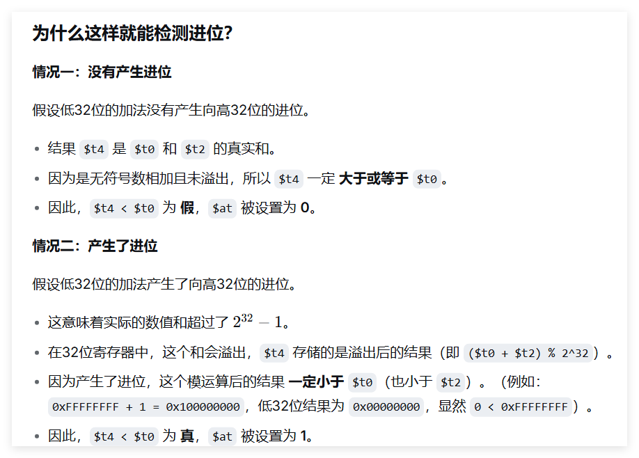  
**在无符号加法中，如果两个数相加产生了进位，那么它们的和一定小于其中一个加数。**

</details>

<details>
<summary><b>4.17 扩展例4-3，写一段代码以16进制输出上述64位数(t5,t4),合并上题在模拟器中测试
</b></summary>

```asm
# 64位数在(t5, t4)中，输出高32位和低32位的十六进制
li   $v0, 34               # print_hex
move $a0, $t5
syscall
move $a0, $t4
syscall
```

**其实应当手写一个输出十六进制数的程序**

</details>

---

# 习题五

<details>
<summary><b>5.1 编写程序，计算内存数据段中带"chico"标签的最初100个数据字的总和。</b></summary>

```asm
.data
chico: .word 100个数据...

.text
    la   $t0, chico         # 数组指针
    li   $t1, 100           # 循环次数
    li   $t2, 0             # sum = 0
loop:
    lw   $t3, 0($t0)
    add  $t2, $t2, $t3
    addi $t0, $t0, 4
    addi $t1, $t1, -1
    bnez $t1, loop
exit:
    li $v0,10
    syscall
```
</details>

<details>
<summary><b>5.2 编写程序，将以"SRC"开始的内存单元中连续100个字移动到以"DEST"开始的内存单元。</b></summary>

```asm
    la   $t0, SRC
    la   $t1, DEST
    li   $t2, 100
loop:
    lw   $t3, 0($t0)
    sw   $t3, 0($t1)
    addi $t0, $t0, 4
    addi $t1, $t1, 4
    addi $t2, $t2, -1
    bnez $t2, loop
exit:
    li $v0,10
    syscall

```
</details>

<details>
<summary><b>5.3 编写函数"ABS"，接收寄存器a0中的整数字，返回a0的绝对值。</b></summary>

```asm
ABS:
    bgez $a0, done
    sub  $a0, $zero, $a0
done:
    jr   $ra
```
</details>

<details>
<summary><b>5.4 编写函数PENO(&X,N,SP,SN),求长度为N的数组X中的正奇数之和与负偶数之和。
数组地址X通过寄存器a0传递，数组长度N通过寄存器a1传递，返回如下两个值:
(1)数组中正奇数之和通过v0返回
(2)负偶数之和通过v1返回

</b></summary>

```asm
PENO:
    li   $v0, 0             # 正奇数之和
    li   $v1, 0             # 负偶数之和
loop:
    beqz $a1, done
    lw   $t0, 0($a0)
    # 判断正奇数
    blez $t0, check_even
    andi $t1, $t0, 1
    beqz $t1, next #想要为1，如果不为1，即为0，走
    add  $v0, $v0, $t0
    b    next
check_even:
    beqz $t0, next
    andi $t1, $t0, 1
    bnez $t1, next #想要为0，如果不为0，走
    add  $v1, $v1, $t0
next:
    addi $a0, $a0, 4
    addi $a1, $a1, -1
    b    loop
done:
    jr   $ra
```
</details>

<details>
<summary><b>5.5 编写函数SUM(N)：用乘法和移位求1到N之和。
数值N通过a0传递，计算结果通过v0返回;编写主程序，要求调用SUM函数5次，每次传递不同的N，打印5次结果,N的定义如下

`N:   .word 9,10,32666,32777,654321`


</b></summary>

```asm
	.data
N:  .word 9,10,32666,32777,654321 #最后一个值会溢出
	.globl main
	.text
SUM:
    # S = N(N+1)/2
    addi $t0, $a0, 1
    mult $a0, $t0
    mflo $v0
    sra  $v0, $v0, 1       # ÷2
    jr   $ra
main:
    la $a1,N
    li $t1,5
Lp1:
    lw $a0,0($a1)
    jal SUM
    move $a0,$v0
    li $v0,1
    # move $a0,$v0 这是错的，因为上面会破坏$v0
    syscall
    li $v0,11
    li $a0,0x0a
    syscall
    addi $a1,$a1,4
    addi $t1,$t1,-1
    bnez $t1,Lp1
exit:
    li $v0,10
    syscall

```
</details>

<details>
<summary><b>5.6 函数FIB(N,&array)：存储斐波那契数列前N项。
N通过$a0传递，数组地址通过a1传递。Fibonacci序列的前几个元素是:1,1,2,3,5,8...


</b></summary>

```asm
FIB:
    li   $t0, 1
    li   $t1, 1
    li   $t2, 0             # 计数器--cnt
loop:
    beq  $t2, $a0, done    #也可以使用$a0进行倒计数
    sw   $t0, 0($a1)
    add  $t3, $t0, $t1
    move $t0, $t1
    move $t1, $t3
    addi $a1, $a1, 4
    addi $t2, $t2, 1
    b    loop
done:
    jr   $ra
```
</details>

<details>
<summary><b>5.7 编写函数，接收a0,a1,a2中的三个整数，从小到大排序。结果放到a0,a1,a2并返回

</b></summary>

```asm
sort3:
    # 比较$a0和$a1   #目的其实是要看 要不要动位置
    ble  $a0, $a1, skip1
    move $at, $a0
    move $a0, $a1
    move $a1, $at
skip1:
    # 比较$a1和$a2
    ble  $a1, $a2, skip2
    move $at, $a1
    move $a1, $a2
    move $a2, $at
    # 再比较$a0和$a1
    ble  $a0, $a1, skip2
    move $at, $a0
    move $a0, $a1
    move $a1, $at
skip2:
    jr   $ra
```
</details>

<details>
<summary><b>5.8 
根据以下C代码，编写一个程序，包括数据定义，充分使用移位实现2的倍数的乘除法

``` c
int main(){
  int K,Y;
  int Z[50];
  Y = 56;
  K = 20;
  Z[K] = Y - 16 * (K / 4 +210);
}
```


</b></summary>

```asm
	.data
Z:	.space 200
Y:	.word 56
K:	.word 20
	.globl main
	.text
main:
	la $a0,Z #数组指针 
	la $a1,Y
	lw $t1,0($a1)  #t1=Y
	la $a2,K
	lw $t2,0($a2) #t2=K
	sll $t4,$t2,2  #要*4的，不能忘记！
	add $a1,$a0,$t4 # Z[K]
	sra $t3,$t2,2
	addi $t3,$t3,210
	sll $t3,$t3,4
	sub $t3,$t1,$t3
	sw $t3,0($a1)
exit:
	li $v0,10
	syscall
	
```
</details>

<details>
<summary><b>5.9 编写函数SumMain(a0:&X,a1:N,v0:Sum),在32位字的二维数组求N×N二维数组主对角线之和。

数组地址X通过a0传递，数组长度的N通过a1传递,结果存储在v0中返回。在过程中**不能修改**寄存器a0,a1中的值。假设N=4,要求计算算法执行的时钟周期数。

</b></summary>

```asm
SumMain:
	li $v0,0 #clear
	li $t1,0 #cnt
	move $a2,$a0
	addi $t2,$a1,1 #N+1
	sll $t2,$t2,2  # N+1是个数，实际还要再乘4！！！
Lp1:
	lw $t0,($a2) #数组元素
	add $v0,$v0,$t0
	add $a2,$a2,$t2
	addi $t1,$t1,1
	bne $t1,$a1,Lp1
done:
	jr $ra
```

```
SumMain:
    li   $v0, 0        # 1次
    li   $t1, 0        # 1次
    move $a2, $a0      # 1次
    addi $t2, $a1, 1   # 1次
    sll  $t2, $t2, 2   # 1次
Lp1:
    lw   $t0, ($a2)    # 4次（循环4次）
    add  $v0, $v0, $t0 # 4次
    add  $a2, $a2, $t2 # 4次
    addi $t1, $t1, 1   # 4次
    bne  $t1, $a1, Lp1 # 4次（前3次跳转成功，最后1次失败）
done:
    jr   $ra           # 1次
```
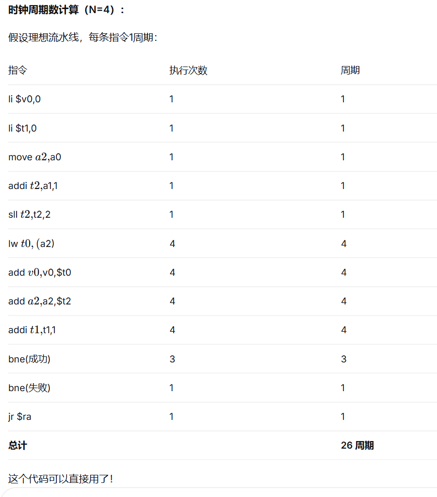


</details>

<details>
<summary><b>5.10 编写函数Det(a0:&X,v0:D),计算2×2矩阵的秩。
数组地址X通过a0传递，结果存储在v0中返回。在过程中不能修改a0中的值，计算算法执行的时钟周期数。
</b></summary>

```asm
Det:
    lw   $t0, 0($a0)        # a[0][0]
    lw   $t1, 4($a0)        # a[0][1]
    lw   $t2, 8($a0)        # a[1][0]
    lw   $t3, 12($a0)       # a[1][1]
    mult $t0, $t3
    mflo $t0
    mult $t1, $t2
    mflo $t1
    sub  $v0, $t0, $t1
    jr   $ra
```

> 2条乘法指令(各32周期) = 64周期 + 8条普通指令 = 约80周期。
</details>

<details>
<summary><b>5.11 将下列伪代码表达式转换成MIPS汇编代码，当存储字指令(sw)执行时程序判断是否有数组越界。数组"zap"中包含50个字，寄存器$a0中值的范围是0-196.程序需要判断寄存器a0中的值是一个字地址，若发生数值越界或寄存器a0中的值不是字地址，则跳转到分支"Error".

```asm
    .data
zap:.space 200
    .text

···???. .
    zap[$a0]=$s0
```
</b></summary>

```asm
.data
zap: .space 200
.text
    # 检查地址是否字对齐
    andi $at, $a0, 3         # 低2位必须为0
    bnez $at, Error
    # 检查是否越界(0 ≤ $a0 ≤ 196)
    li   $at, 196
    bgt  $a0, $at, Error
    bltz $a0, Error
    # 合法，执行存储
    la   $at, zap
    add  $at, $at, $a0
    sw   $s0, 0($at)
    b    done
Error:
    # 越界处理
done:
```
</details>

<details>
<summary><b>5.12 编写函数，在N个字的数组X中计算能被4整除的元素个数。数组地址X通过a0传递，长度N通过a1传递，结果存储在v0中返回。</b></summary>

```asm
CountDiv4:
    li   $v0, 0
loop:
    beqz $a1, done
    lw   $t0, 0($a0)
    addi $a0, $a0, 4  #是+4
    addi $a1, $a1, -1 #倒计数
    andi $at, $t0, 3  # 被4整除⇔低2位为0
    bnez $at, loop
    addi $v0, $v0, 1
    b    loop
done:
    jr   $ra
```
</details>

<details>
<summary><b>5.13 完成5-7节描述的右对齐打印十进制值函数。</b></summary>

```asm
Decout:
    move $t0, $a0            # 保存要打印的值
    la   $t1, buf
    li   $t2, 11             # 缓冲区末尾索引
    sb   $0, 12($t1)         # 字符串结束符
    # 填充空格
    li   $t8, 0x20
space:
    add  $t9, $t1, $t2
    sb   $t8, ($t9)
    addi $t2, $t2, -1
    bgez $t2, space
    # 转换为十进制
    abs  $t3, $t0
    li   $t2, 11
    li   $t9, 10
    add  $t1, $t1, $t2
loop:
    div  $t3, $t9
    mflo $t3
    mfhi $t4
    addi $t4, $t4, 0x30
    sb   $t4, ($t1)
    addi $t1, $t1, -1
    beqz $t3, sign
    b    loop
sign:
    bgez $t0, ret
    li   $t8, 0x2d           # '-'
    sb   $t8, ($t1)
ret:
    jr   $ra
```
</details>

<details>
<summary><b>5.14 将例5-3"包含查错的读取十进制值函数"改写为C/C++代码。</b></summary>

```c
int Decin(char *buffer, int length, int *status) {
    // 跳过前导空格
    while (*buffer == ' ' || *buffer == '\t') buffer++;

    int sign = 1;
    if (*buffer == '-') {
        sign = -1;
        buffer++;
    }

    int value = 0;
    int has_digit = 0;

    while (*buffer >= '0' && *buffer <= '9') {
        value = value * 10 + (*buffer - '0');
        buffer++;
        has_digit = 1;

        // 溢出检测（简化）
        if (value < 0) {
            *status = -1;    // 溢出
            return 0;
        }
    }

    if (!has_digit) {
        *status = -2;        // 无有效数字
        return 0;
    }

    *status = 0;
    return sign * value;
}
```
</details>

---

# 习题六

<details>
<summary>6.1 MinMax (&X, N, Min, Max)

**题目描述：**
写一个函数：搜索大小为“N”个字（word）的数组“X”，找出其中的最小值和最大值。
输入参数 X 和 N 以及返回的最小值和最大值都通过栈传递。（显示最小值和最大值通过调用 MinMax 函数实现）

</summary>

```py
	.data
max_msg:.asciiz"\nthe max number is : "
min_msg:.asciiz"the min number is : "
int_arr: .word 10,23,-12,83,77,-4,100
	.text
	.globl main
MinMax:
	lw $a1,12($sp)
	lw $s0,8($sp)
	addiu $sp,$sp,-12
	sw $ra,8($sp)
	sw $a1,4($sp)
	sw $s0,0($sp)
	
	lw $v0,0($a1)#v0--min
	move $v1,$v0 #v1--max
	li $t0,1  	#因为0已经用来赋值了，这里可以进行优化
Loop:	
	
	sll $t2,$t0,2
	add $t2,$a1,$t2
	lw $t1,0($t2)
	bgt $t1,$v1,UPDmax
	blt $t1,$v0,UPDmin
	b next
UPDmax:
	move $v1,$t1
	b next
UPDmin:
	move $v0,$t1
	b next
next:
	addi $t0,$t0,1
	blt $t0,$s0,Loop
done:
	lw $ra,8($sp)
	addiu $sp,$sp,12
	sw $v0,4($sp)
	sw $v1,0($sp)
	jr $ra
main:
	la $a0,int_arr
	li $s0,7
	addiu $sp,$sp,-16
	sw $a0,12($sp)
	sw $s0,8($sp)
	jal MinMax
	lw $t0,4($sp) #min
	lw $t1,0($sp) #max
	la $a0,min_msg
	li $v0,4
	syscall
	li $v0,1
	move $a0,$t0
	syscall
	la $a0,max_msg
	li $v0,4
	syscall
	li $v0,1
	move $a0,$t1
	syscall
exit:
	addiu $sp,$sp,16
	li $v0,10
	syscall
# ============================================================
# 指针遍历优化版本（作为注释保留，不修改主代码）
# ============================================================
# MinMax:
#     lw $a1,12($sp)       # 数组首地址
#     lw $s0,8($sp)        # N
#     addiu $sp,$sp,-12
#     sw $ra,8($sp)
#     
#     lw $v0,0($a1)        # min = X[0]
#     move $v1,$v0         # max = X[0]
#     
#     sll $t2,$s0,2        # t2 = N * 4
#     add $t2,$a1,$t2      # t2 = 尾地址 &X[N]
#     addiu $a1,$a1,4      # 指针指向 X[1]
# 
# Loop:	
#     beq $a1,$t2,done     # 指针到末尾？结束
#     lw $t1,0($a1)
#     
#     slt $t3,$t1,$v0
#     bnez $t3,UPDmin
#     slt $t3,$v1,$t1
#     bnez $t3,UPDmax
#     b next
# 
# UPDmin:
#     move $v0,$t1
#     b next
#     
# UPDmax:
#     move $v1,$t1
#     
# next:
#     addiu $a1,$a1,4      # 指针后移 4 字节
#     j Loop
#     
# done:
#     lw $ra,8($sp)
#     addiu $sp,$sp,12
#     sw $v0,4($sp)
#     sw $v1,0($sp)
#     jr $ra
# ============================================================
# 优点：
# 1. 无需索引变量 $t0，减少寄存器占用
# 2. 无需每次循环计算 i*4（sll）+ base+offset（add）
# 3. 每次循环只需 addiu 移动指针，比索引法少 2 条指令
# 4. 循环终止条件改为地址比较（beq），更直观
# ============================================================
```


</details>

<details>
<summary>6.2 Search (&X, N, V, L)

**题目描述：**
编写一个函数：搜索按顺序搜索大小为 N 个字节的数组 X，获得值 V 存放在数组中的相对位置 L。输入参数 &X、N 和 V 通过栈传递给函数，函数的返回值即相对位置 L（从 1 到 N 范围内的某个数字）也通过栈传递。如果未找到值 V，则返回 -1。

</summary>

```py
	.data
ask_msg:.asciiz"please input your number : "
int_arr: .word -487, 312, 845, -156, 723, -999, 654, -234, 908, -671
	.text
	.globl main
Search:
	lw $a1,12($sp)
	lw $t0,8($sp)#N
	lw $t1,4($sp)#V
	
	li $t2,0		#序号
	li $s2,-1
Loop:
	sll $t3,$t2,2
	add $t3,$a1,$t3
	lw $t4,0($t3)
	beq $t4,$t1,done
	addi $t2,$t2,1
	blt $t2,$t0,Loop #不是ble
	b over 			#注意不能接着done，否则要是没找到，还会被$t4赋值
done:
	addi $s2,$t2,1	#调整为1-based
over:
	sw $s2,0($sp)
	jr $ra
main:
	la $a0,ask_msg
	li $v0,4
	syscall
	la $a0,int_arr
	li $s0,10
	li $v0,5
	syscall
	move $s1,$v0
	addiu $sp,$sp,-16
	sw $a0,12($sp)
	sw $s0,8($sp)
	sw $s1,4($sp)
	jal Search
	lw $s2,0($sp)
	addiu $sp,$sp,16
	li $v0,1
	move $a0,$s2
	syscall
	
exit:
	li $v0,10
	syscall
	
	
```

</details>


<details>
<summary>6.3 Scan (&X, N, U, L, D)

**题目描述：**
编写一个函数：扫描大小为“N”个字节的数组“X”，统计该数组内的下述各类数据的个数：
a. 大写字母 - U
b. 小写字母 - L
c. 十进制数字 - D
所有参数都通过栈传递。并编写一个程序来测试该函数工作是否正确。

</summary>

```py
	.data
error_msg:.asciiz"the program goes wrong\n"
normal_msg:.asciiz"the program goes well\n"
arr:.byte 'a','F','9','r','4','K','t'
	.text
	.globl main
Scan:
	lw $a1,16($sp)
	lw $s4,12($sp)
	
	li $s0,0	#s0-U
	li $s1,0	#s1-L
	li $s2,0	#s2-D
	
	
	li $t4,'A'
	li $t5,'Z'
	li $t6,'a'
	li $t7,'z'
	li $t8,'0'
	li $t9,'9'
	
	move $a0,$a1
	add $a1,$a1,$s4		#此时a1成为尾地址，a0才方便与其进行比较
Loop:
	bge $a0,$a1,done
	lb $t3,0($a0)		#不能写成 lw
	bge $t3,$t6,L
	bge $t3,$t4,U
	bge $t3,$t8,D
	b next				#都不符合时跳过
L:
	ble $t3,$t7,L_add
	b next
U:
	ble $t3,$t5,U_add
	b next
D:
	ble $t3,$t9,D_add
	b next
U_add:
	addi $s0,$s0,1
	b next
L_add:
	addi $s1,$s1,1
	b next
D_add:
	addi $s2,$s2,1
next:
	addi $a0,$a0,1
	b Loop
done:
	sw $s0,8($sp)
	sw $s1,4($sp)
	sw $s2,0($sp)
	jr $ra
main:
	li $t0,2	#大写字母--2
	li $t1,3	#小写字母--3
	li $t2,2	#十进制数字--2
	la $a0,arr
	li $s4,7
	addiu $sp,$sp,-20
	sw $a0,16($sp)
	sw $s4,12($sp)
	jal Scan
	lw $s0,8($sp)
	bne $s0,$t0,error
	lw $s1,4($sp)
	bne $s1,$t1,error
	lw $v1,0($sp)
	bne $v1,$t2,error
	addiu $sp,$sp,20
	li $v0,4
	la $a0,normal_msg
	syscall
	
	li $v0,1
	move $a0,$s0
	syscall
	li $a0,'\n'
	li $v0,11
	syscall
	li $v0,1
	move $a0,$s1
	syscall
	li $a0,'\n'
	li $v0,11
	syscall
	li $v0,1
	move $a0,$v1
	syscall
	b exit
error:
	la $a0,error_msg
	li $v0,4
	syscall

exit:
	li $v0,10
	syscall
```

</details>

<details>

<summary>
6.4 Hypotenuse (A, B, H)

**题目描述：**

这是一个使用栈传递参数实现函数嵌套调用的练习。编写一个函数：计算一个直角三角形斜边的长度。两条直角边的长度分别为 A 和 B。假设可以使用数学库中的函数 "sqr (V, R)"，该函数功能是计算一个正数 V 的平方根，函数的返回值（即 V 的平方根）通过变量 R 返回。
需要写一个程序来测试这个函数。

</summary>


</details>


<details>
<summary>6.5 AVA (&X, &Y, &Z, N, status)

**题目描述：**
编写一个函数：实现绝对值向量加法。使用栈来传递参数。参数是三个字节类型的数组（向量）的起始地址：X、Y、Z 和一个整数值 N，N 用于指定数组元素的个数。如果在执行此函数时发生溢出，则返回“1”，表示发生溢出错误，并终止函数的执行；否则返回“0”。
函数将执行向量加法：
$X_i = |Y_i| + |Z_i|$ // i 的取值范围是从 0 到 N-1
需要写一个程序来测试这个函数。

</summary>


</details>


<details>
<summary>6.6 Fibonacci (N, E)

**题目描述：**
编写一个函数：返回斐波那契数列中的第 N 个元素。值 N 和返回值 E 都通过栈传递。如果 N 大于 46，则产生溢出，此时返回值为 0。还需要实现一个函数，该函数调用函数 Fibonacci，获得第 N 个元素，并将其显示出来。斐波那契数列的前几个数字是：0、1、1、2、3、5……


</summary>


</details>


<details>
<summary>6.7 BubSort (&X, N)

**题目描述：**
编写一个函数：使用冒泡排序算法，将数组元素个数为“N”的字类型数组“X”中的元素排序成升序序列。数组的地址和值 N 通过栈传递。同时需要编写一个函数，调用函数 BubSort(&X, N) 对数组 X 实现排序，并将排序后的结果显示出来。

</summary>


</details>


<details>
<summary>6.8 RipSort (&X, N)

**题目描述：**
编写一个函数：使用“波纹排序（ripple sort）”算法，将数组元素个数为“N”的字类型数组“X”中的元素排序成升序序列。数组的地址和值 N 通过栈传递。

</summary>


</details>


<details>
<summary>6.9 Roots (a, b, c, Status, R1, R2)

**题目描述：**
这是一个使用栈传递参数实现函数嵌套调用的练习。编写一个函数来计算一个一元二次方程的根。对于一元二次方程：`y = ax² + bx + c`，其中整数值 a、b 和 c 通过栈传递给函数。
返回值指示计算结果的本质，定义如下：
0: 2 个实根 R1 和 R2
1: 1 个实根 R1 = -b/2a 
2: 2 个复数根 (R1 + iR2)
3: 无根 (计算错误)
假设数学库中计算平方根的函数 "sqrt" 可以调用。


</summary>


</details>

6.10 Reverse
<details>
<summary>6.10 Reverse

**题目描述：**
写一个可重入函数读取字符串（最多 60 个字符），并反向输出字符串。例如，字符串 "July is Hot" 将被输出为 "Toh Si-LyuJ"。


</summary>


</details>


<details>
<summary>6.11 Palindrome (B)

**题目描述：**
写一个可重入函数，判断一个字符串是否是回文。这个函数应该从栈堆缓冲区中的字符串读取字符（最多 16 个）。这个程序应该调用一个 Search 函数来确定字符串中的实际字符数。将结果以布尔值 true 或 false（1 或 0）返回到栈上。表示字符串是否是回文。

</summary>


</details>


<details>
<summary>6.12 Fibonacci (N, E)


**题目描述：**
写一个递归函数返回 Fibonacci 序列中的第 N 个元素。使用堆栈向函数传递信息和从函数返回信息。如果此函数执行时发生溢出，则返回 0。序列中的前几个数字是：0, 1, 1, 2, 3, 5, 8…

</summary>


</details>


<details>
<summary>6.13 Determinant (&M, N, R)

**题目描述：**
编写递归函数求 N x N 矩阵的行列式。数组 M 的地址和大小 N 通过堆栈传递到函数，结果 R 返回到堆栈上。
</summary>


</details>


<details>
<summary>6.14 Scan (&X, Num)

**题目描述：**
编写一个高效的MIPS 汇编语言函数 Scan 扫描字符串，目的是找出所有的**小写元音**出现在字符串中的位置，以及在字符串中出现多少个小写元音。

元音是字母 a, e, i, o, u。

字符串 "X" 的地址通过堆栈传递给函数，在堆栈上返回到元音的数量 Num。以空字符作为字符串的终止符。

这个函数中必须包含代码来调用任何学生的PrintDecimal函数来打印每个元音在字符串中的位置，靠右对齐。

注意，这是嵌套函数调用，下面是一个示例字符串：

**The quick brown fox.**

你的程序应该输出：
A Vowel wa found at Relative Position: 3
A Vowel wa found at Relative Position: 6
A Vowel wa found at Relative Position: 3
A Vowel wa found at Relative Position: 13
A Vowel wa found at Relative Position: 18

分析你的Scan函数，它是可重入函数吗？并解释原因.

</summary>

</details>


---

# 指令练习

## 算术运算类指令练习

<details>
<summary><b>1. 计算表达式 10x + y</b></summary>

```asm
# 假设 x 在 $t0, y 在 $t1, 结果存入 $t2
sll  $t2, $t0, 1         # $t2 = 2x
sll  $t3, $t0, 3         # $t3 = 8x
add  $t2, $t2, $t3       # $t2 = 10x
add  $t2, $t2, $t1       # $t2 = 10x + y
```
练习版:
```
      .data
msg1: .asciiz"Please input x:\n"
msg2: .asciiz"Please input y:\n"
msg3: .asciiz"The result is:\n"
x:    .word 0 #必须赋初值
y:    .word 0 #赋初值
res:  .word 0 #赋初值
      .text
      li $v0,4
      la $a0,msg1 #prompt
      syscall
      li $v0,5 #read x
      syscall
      sw $v0,x #Mem[x]=v0 
      li $v0,4
      la $a0,msg2 #prompt
      syscall
      li $v0,5 #read y
      syscall
      sw $v0,y #Mem[y]=v0
      lw $t0,x #t0=x
      lw $t1,y #t1=y
      sll $t2,$t0,1 #t2=2x
      sll $t3,$t2,2 #$t3=8x
      add $t4,$t2,$t3 #t4=2x+8x=10x
      add $t5,$t4,$t1 #t5=10x+y
      sw $t5,res #Mem[res]=t5
      li $v0,4
      la $a0,msg3
      syscall
      li $v0,1
      move $a0,$t5
      syscall
      li $v0,10
      syscall
```

> 10x = 2x + 8x，用移位代替乘法。
</details>

<details>
<summary><b>2. 计算表达式 ax² + bx + c</b></summary>

```asm
# 假设 a在$t0, b在$t1, c在$t2, x在$t3, 结果存入$t4
mult $t3, $t3            # x² → HI:LO
mflo $t4                 # $t4 = x²
mult $t0, $t4            # a × x²
mflo $t4                 # $t4 = ax²
mult $t1, $t3            # b × x
mflo $t5                 # $t5 = bx
add  $t4, $t4, $t5       # ax² + bx
add  $t4, $t4, $t2       # ax² + bx + c
```
练习版:
```
      .data
msg1: .asciiz "Please input x:\n" 
msg2: .asciiz "Please input a:\n" 
msg3: .asciiz "Please input b:\n" 
msg4: .asciiz "Please input c:\n" 
msg5: .asciiz "The result is:\n" 
x:    .word 0
a:    .word 0
B:    .word 0 #不能用b 会跟b指令冲突
c:    .word 0
res:  .word 0
      .text
      li $v0,4 #prompt
      la $a0,msg1
      syscall
      li $v0,5 #read x
      syscall
      sw $v0,x #Mem[x]=v0
      li $v0,4 #prompt
      la $a0,msg2
      syscall
      li $v0,5 #read a
      syscall
      sw $v0,a #Mem[a]=v0
      li $v0,4 #prompt
      la $a0,msg3
      syscall
      li $v0,5 #read b
      syscall
      sw $v0,B #Mem[b]=v0
      li $v0,4 #prompt
      la $a0,msg4
      syscall
      li $v0,5 #read c
      syscall
      sw $v0,c #Mem[c]=v0
      lw $t0,x #t0=x
      lw $t1,a #t1=a
      lw $t2,B #t2=b
      lw $t3,c #t3=c
      mul $t4,$t0,$t0 #t4=x^2
      mul $t5,$t1,$t4 #t5=ax^2
      mul $t6,$t0,$t2 #t6=bx
      add $t7,$t5,$t6 #t7=ax^2+bx
      add $t8,$t7,$t3 #t8=ax^2+bx+c
      sw $t8,res
      li $v0,4 #prompt
      la $a0,msg5
      syscall
      li $v0,1
      move $a0,$t8 #a0=t8
      syscall
      li $v0,10
      syscall

```
</details>

---

## 逻辑运算类指令练习

<details>
<summary><b>1. 寄存器$a1的位0和位15不变，其他清零</b></summary>

```asm
andi $a1, $a1, 0x8001    # 1000 0000 0000 0001
```
> 与1不变，与0清零。只保留bit15和bit0。
</details>

<details>
<summary><b>2. 取出寄存器$a0的低7位</b></summary>

```asm
andi $at, $a0, 0x007f    # 0000 0000 0111 1111
```
</details>

<details>
<summary><b>3. 将$t0中的值低6位清零后移动到$t1中</b></summary>

```asm
andi $t1, $t0, 0xffc0    # 1111 1111 1100 0000
或
andi $t0,$t0,0xffc0
move $t1,$t0

```
> 高26位与1不变，低6位与0清零。
</details>

<details>
<summary><b>4. 寄存器$a1的位7和位31置1，其余不变</b></summary>

```asm
lui $t0,0x8000
or $a1,$a1,$t0
ori $a1,$a1,0x0080 #位7--右起第五位
#所以是0x0080而不是0x0040

或者
li $t0,0x80000080 #同样的注意事项
or $a1,$a1,$t0
#有时候还要注意是低/高x位，还是就针对某一位(位x)


```
</details>

<details>
<summary><b>5. 将$t0中的值低6位置1后移动到$t1中</b></summary>

```asm
ori  $t1, $t0, 0x003f    # 0000 0000 0011 1111
或者
ori $t0,$t0,0x003f
move $t1,$t0

```
> 或1置1，或0不变。
</details>

<details>
<summary><b>6. 寄存器$a1清零</b></summary>

```asm
# 方法1：异或自身（最常用）
xor  $a1, $a1, $a1

# 方法2：零加零
add  $a1, $zero, $zero

# 方法3：零或零
or   $a1, $zero, $zero

# 方法4：与零
and  $a1,$a1,$zero
```
</details>

<details>
<summary><b>7. 寄存器$a1的位5取反，其他不变</b></summary>

```asm
xori $a1, $a1, 0x0020    # 0000 0000 0010 0000
```
> 异或1取反，异或0不变。
</details>

<details>
<summary><b>8. 交换两个寄存器$s0和$s1中内容的实现指令</b></summary>

**方法1：使用临时寄存器**
```asm
move $at, $s0
move $s0, $s1
move $s1, $at
```

**方法2：三步异或（无需额外寄存器）**
```asm
xor  $s0, $s0, $s1
xor  $s1, $s0, $s1
xor  $s0, $s0, $s1
```

**三步异或原理**（A=$s0, B=$s1）：

| 步骤 | 操作 | $s0 | $s1 |
|:---:|:---|:---|:---|
| 初始 | — | A | B |
| ① | $s0 = A⊕B | A⊕B | B |
| ② | $s1 = (A⊕B)⊕B = A | A⊕B | A |
| ③ | $s0 = (A⊕B)⊕A = B | B | A |

✅ 交换完成。
(异或运算具有交换律)

</details>

---

## 更多指令相关练习

<details>
<summary><b>1. Syscall 1/4/5/8/10/11/12 常用汇编命令</b></summary>

| $v0 | 功能 | 参数 | 返回值 |
|:---:|:---|:---|:---:|
| 1 | print_int | $a0=整数 | 无 |
| 4 | print_string | $a0=字符串地址 | 无 |
| 5 | read_int | 无 | $v0=整数 |
| 8 | read_string | $a0=缓冲区, $a1=长度 | 无 |
| 10 | exit | 无 | 无 |
| 11 | print_char | $a0=ASCII码 | 无 |
| 12 | read_char | 无 | $v0=ASCII码 |

>1、5写读整数  
4、8写读字符串  
11、12写读字符  
10退出  

**使用示例：**
```asm
# 打印整数
li $v0, 1
li $a0, 100
syscall

# 读取整数
li $v0, 5
syscall
move $t0, $v0
```
</details>

<details>
<summary><b>2. 计算负数整除2，要求使用移位指令</b></summary>

```asm
sra  $t0, $t0, 1          # 算术右移1位
```
> **必须用sra（算术右移）**，不能srl（逻辑右移）。
>
> 例：-5（0xFFFFFFFB）
> - sra：得 -2 ✅ 正确
> - srl：得 2147483645 ❌ 错误
</details>

<details>
<summary><b>3. 判断$t0中值的奇偶性</b></summary>

```asm
andi $at, $t0, 1          # 取最低位
beq  $at, $zero, even     # 最低位=0 → 偶数
# 奇数
b    done
even:
# 偶数
done:
```
> bit0为0是偶数，为1是奇数。
</details>

<details>
<summary><b>4. 宏指令abs rd, rs 的实现代码</b></summary>

```asm
addu rd, $zero, rs         # rd = rs
bgez rs, 1f                # rs ≥ 0 则跳过
sub  rd, $zero, rs         # rd = 0 - rs
1:
```
</details>

<details>
<summary><b>5. 宏指令li $t0, 0xffffefff 的实现代码</b></summary>

```asm
lui $t0, 0xffff            # 高16位
ori $t0, $t0, 0xefff       # 低16位
# $t0 = 0xffffefff
```
</details>

<details>
<summary><b>6. 宏指令div/divu rd, rs, rt（取商）的实现代码</b></summary>

**div（有符号取商）：**
```asm
bne  rt, $zero, ok
break $zero                # 除零异常
ok:
div  rs, rt
mflo rd
```

**divu（无符号取商）：**
```asm
bne  rt, $zero, ok
break $zero
ok:
divu rs, rt
mflo rd
```
</details>

<details>
<summary><b>7. 宏指令rem/remu rd, rs, rt（取余数）的实现代码</b></summary>

**rem（有符号取余）：**
```asm
bne  rt, $zero, ok
break $zero
ok:
div  rs, rt
mfhi rd                    # ← 取HI而非LO
```

**remu（无符号取余）：**
```asm
bne  rt, $zero, ok
break $zero
ok:
divu rs, rt
mfhi rd
```
</details>

<details>
<summary><b>8. 循环右移宏指令ror rd, rs, rt 的实现代码</b></summary>

```asm
subu $at, $zero, rt        # $at = -rt，低5位 = 32-rt
sllv $at, rs, $at         # 左移(32-rt)位
srlv rd, rs, rt           # 右移rt位
or   rd, rd, $at          # 合并
```
</details>

<details>
<summary><b>9. 条件设置类宏指令sne rd, rs, rt 的实现代码</b></summary>

```asm
beq  rt, rs, yes
ori  rd, $zero, 1          # 不等 → rd=1
beq  $zero, $zero, skip
yes:
ori  rd, $zero, 0          # 相等 → rd=0 不能忘了这一步
skip:
```
> sne = Set if Not Equal，不等置1，相等置0。
</details>

<details>
<summary><b>10. 条件转移类宏指令ble/bleu rs, rt, Label 的实现代码</b></summary>

**ble（有符号 ≤）：**
```asm
slt  $at, rt, rs           # rt < rs ?
beq  $at, $zero, Label     # NOT(rt<rs) → rs≤rt → 跳转
```
> 逻辑：rs ≤ rt 等价于 ¬(rt < rs)

**bleu（无符号 ≤）：**
```asm
sltu $at, rt, rs
beq  $at, $zero, Label
```
</details>

<details>
<summary><b>11. 条件转移类宏指令blt/bltu rs, rt, Label 的实现代码</b></summary>

**blt（有符号 <）：**
```asm
slt  $at, rs, rt           # rs < rt ?
bne  $at, $zero, Label     # 成立则跳转
```

**bltu（无符号 <）：**
```asm
sltu $at, rs, rt
bne  $at, $zero, Label
```
</details>

<details>
<summary><b>12. 判断两个寄存器$s0和$s1中值符号是否相同的指令</b></summary>

```asm
xor  $at, $s0, $s1         # 异或
bltz $at, diff             # 最高位=1 → 符号不同
# 符号相同
b    done
diff:
# 符号不同
done:
```

**原理**：

| $s0符号 | $s1符号 | 异或最高位 | 结果 |
|:---:|:---:|:---:|:---|
| 0（正） | 0（正） | 0 | 相同 |
| 0（正） | 1（负） | 1 | 不同 |
| 1（负） | 0（正） | 1 | 不同 |
| 1（负） | 1（负） | 0 | 相同 |

> 异或结果的最高位 = 符号是否不同：0相同，1不同。


# 判断两数符号是否相同 —— 分支法汇总

## 方法一：异或法（最简洁）

```asm
xor  $at, $s0, $s1         # 符号不同→最高位=1
bltz $at, diff             # 最高位=1→不同
# 符号相同
b    done
diff:
# 符号不同
done:
```

---

## 方法二：相乘判符号

```asm
mul  $at, $s0, $s1         # 同号得正，异号得负
bltz $at, diff             # 结果为负→符号不同
# 符号相同
b    done
diff:
# 符号不同
done:
```

> ⚠️ 可能溢出，但最高位（符号位）依然正确。推荐用 `mulo` 或只用低32位。

---

## 方法三：移位看最高位

```asm
srl  $at, $s0, 31          # 取出 $s0 的符号位（0或1）
srl  $t0, $s1, 31          # 取出 $s1 的符号位
xor  $at, $at, $t0         # 相同→0，不同→1
bnez $at, diff             # 不为0→符号不同
# 符号相同
b    done
diff:
# 符号不同
done:
```

---

## 方法四：分别与0比较（纯分支）

```asm
bltz $s0, s0_neg           # $s0 < 0
# $s0 >= 0
bltz $s1, diff             # $s0>=0, $s1<0 → 不同
b    same                  # 都>=0 → 相同
s0_neg:
bltz $s1, same             # 都<0 → 相同
b    diff                  # $s0<0, $s1>=0 → 不同
same:
# 符号相同
b    done
diff:
# 符号不同
done:
```

---

## 方法五：减法判符号

```asm
sub  $at, $s0, $s1
xor  $at, $at, $s0
xor  $at, $at, $s1
bltz $at, diff
# 符号相同
b    done
diff:
# 符号不同
done:
```
---

## 总结

| 方法 | 核心思路 | 指令数 |
|:---|:---|:---:|
| 异或法 | 符号位异或→看最高位 | 2条 |
| 相乘法 | 同号得正，异号得负 | 2条 |
| 移位法 | 各自取最高位再比较 | 4条 |
| 纯分支法 | 分四种情况判断 | 4~5条 |
| 减法法 | 减法+异或排除 | 4条 |

> 💡 **最终推荐**：用 `xor + bltz`，两个指令搞定，最简洁。其他方法用于理解原理。

</details>

---

# 注意点

**MIPS指令集与易混淆点详解表**

# MIPS 指令集与易混淆点详解表

## 一、存储指令（寄存器 → 内存）

| 指令 | 格式示例 | 写入位数 | 数据来源 | 对齐要求 | 典型错误 | 应用场景 |
| :--- | :--- | :--- | :--- | :--- | :--- | :--- |
| `sb` | `sb $t0, 0($t1)` | 8 位（1 字节） | `$t0` 的低 8 位 | 无 | 误以为会符号扩展或零扩展 | 存储字符、字节数组 |
| `sh` | `sh $t0, 0($t1)` | 16 位（2 字节） | `$t0` 的低 16 位 | 地址必须是 2 的倍数 | 存入奇地址 → 地址异常 | 存储半字（如 Unicode 字符） |
| `sw` | `sw $t0, 0($t1)` | 32 位（4 字节） | `$t0` 的全部 32 位 | 地址必须是 4 的倍数 | 存入非 4 倍数地址 → 异常 | 存储字、int、指针 |

> **教学要点**：存储指令只取寄存器的低位，高位直接丢弃，**没有符号扩展或零扩展**。写入内存的宽度由指令本身决定（`sb`=1字节，`sh`=2字节，`sw`=4字节）。

---

## 二、加载指令（内存 → 寄存器）

| 指令 | 格式示例 | 读取位数 | 扩展方式 | 对齐要求 | 典型错误 | 应用场景 |
| :--- | :--- | :--- | :--- | :--- | :--- | :--- |
| `lb` | `lb $t0, 0($t1)` | 8 位 | **符号扩展**至 32 位 | 无 | 忽略符号位，把有符号数当正数 | 读取有符号字节（如 `char`） |
| `lbu` | `lbu $t0, 0($t1)` | 8 位 | **零扩展**至 32 位 | 无 | 误以为会符号扩展 | 读取无符号字节（如 `unsigned char`） |
| `lh` | `lh $t0, 0($t1)` | 16 位 | **符号扩展**至 32 位 | 2 字节对齐 | 从奇地址加载 → 异常 | 读取有符号短整数 |
| `lhu` | `lhu $t0, 0($t1)` | 16 位 | **零扩展**至 32 位 | 2 字节对齐 | 忽略对齐要求 | 读取无符号短整数 |
| `lw` | `lw $t0, 0($t1)` | 32 位 | 无需扩展 | 4 字节对齐 | 从非 4 倍数地址加载 → 异常 | 读取字、int、指针 |

> **教学要点**：加载窄数据到 32 位寄存器时，必须扩展高位。符号扩展保持有符号数的正负，零扩展用于无符号数。`lw` 已完整，不需要扩展。

---

## 三、算术运算指令

| 指令 | 格式 | 操作 | 立即数扩展 | 溢出检查 | 典型错误 | 应用场景 |
| :--- | :--- | :--- | :--- | :--- | :--- | :--- |
| `add` | `add rd, rs, rt` | `rd = rs + rt` | 无 | **检查** | 忘记考虑溢出 | 有符号整数加法 |
| `addu` | `addu rd, rs, rt` | `rd = rs + rt` | 无 | **不检查** | 用于地址运算时误用 `add` | 地址加法、无符号加法 |
| `addi` | `addi rt, rs, imm` | `rt = rs + sign_ext(imm)` | **符号扩展** | **检查** | 把立即数当零扩展 | 有符号整数加常数 |
| `addiu` | `addiu rt, rs, imm` | `rt = rs + sign_ext(imm)` | **符号扩展** | **不检查** | 误以为立即数是零扩展 | 地址加减（如 `$sp-8`） |
| `sub` | `sub rd, rs, rt` | `rd = rs - rt` | 无 | **检查** | 操作数顺序错误 | 有符号减法 |
| `subu` | `subu rd, rs, rt` | `rd = rs - rt` | 无 | **不检查** | 用于地址运算 | 无符号减法、地址差 |

> **教学要点**：`addiu` 中的 `u` 代表“不检查溢出”，**不代表零扩展**。立即数仍然是符号扩展。地址运算务必使用 `addu` / `addiu`。

---

## 四、逻辑运算指令

| 指令 | 格式 | 操作 | 立即数扩展 | 典型错误 | 应用场景 |
| :--- | :--- | :--- | :--- | :--- | :--- |
| `and` | `and rd, rs, rt` | `rd = rs & rt` | 无 | 忘记立即数版本是 `andi` | 位清零、掩码 |
| `andi` | `andi rt, rs, imm` | `rt = rs & zero_ext(imm)` | **零扩展** | 误以为立即数符号扩展 | 清零高 16 位、提取低 16 位 |
| `or` | `or rd, rs, rt` | `rd = rs \| rt` | 无 | 与 `add` 混淆 | 位设置、组合 |
| `ori` | `ori rt, rs, imm` | `rt = rs \| zero_ext(imm)` | **零扩展** | 误以为立即数符号扩展 | 设置低 16 位中某些位 |
| `xor` | `xor rd, rs, rt` | `rd = rs ^ rt` | 无 | 与 `xori` 混淆 | 位翻转、检测差异 |
| `xori` | `xori rt, rs, imm` | `rt = rs ^ zero_ext(imm)` | **零扩展** | 误以为立即数符号扩展 | 翻转低 16 位中某些位 |
| `nor` | `nor rd, rs, rt` | `rd = ~(rs \| rt)` | 无 | 忘记可以用来实现 `not` | 实现 `not`、逻辑完备门 |

> **教学要点**：逻辑运算的立即数一律**零扩展**，因为按位操作不关心正负。`nor rd, rs, $zero` 等价于 `not rd, rs`。

---

## 五、移位指令

| 指令 | 格式 | 操作 | 移位量来源 | 移位量范围 | 典型错误 | 应用场景 |
| :--- | :--- | :--- | :--- | :--- | :--- | :--- |
| `sll` | `sll rd, rt, sa` | `rd = rt << sa` | 立即数 `sa`（5 位） | 0–31 | 写错源寄存器位置（应为 `rt`） | 乘以 2 的幂、位提取 |
| `sllv` | `sllv rd, rt, rs` | `rd = rt << (rs & 0x1F)` | 寄存器 `rs` 的低 5 位 | 0–31 | 混淆 `rs` 和 `rt` 顺序 | 可变位左移 |
| `srl` | `srl rd, rt, sa` | `rd = rt >> sa`（逻辑） | 立即数 `sa` | 0–31 | 对有符号数使用逻辑右移 | 无符号数除以 2 的幂 |
| `srlv` | `srlv rd, rt, rs` | `rd = rt >> (rs & 0x1F)`（逻辑） | 寄存器 `rs` 的低 5 位 | 0–31 | 混淆 `rs` 和 `rt` | 可变位逻辑右移 |
| `sra` | `sra rd, rt, sa` | `rd = rt >> sa`（算术） | 立即数 `sa` | 0–31 | 对无符号数使用算术右移 | 有符号数除以 2 的幂 |
| `srav` | `srav rd, rt, rs` | `rd = rt >> (rs & 0x1F)`（算术） | 寄存器 `rs` 的低 5 位 | 0–31 | 混淆 `rs` 和 `rt` | 可变位算术右移 |

> **教学要点**：移位指令的源操作数放在 `rt`，目标放在 `rd`，与 `add` 等常规 R 型指令不同。移位量超过 31 时只取低 5 位（相当于 `mod 32`）。

---

## 六、分支与跳转指令

| 指令 | 格式 | 寻址方式 | 地址计算 | 范围 | 典型错误 | 应用场景 |
| :--- | :--- | :--- | :--- | :--- | :--- | :--- |
| `beq` | `beq rs, rt, label` | 相对寻址 | `PC = PC + 4 + (imm << 2)` | ±128 KB | 忘记偏移量相对于 `PC+4` | 条件分支（相等） |
| `bne` | `bne rs, rt, label` | 相对寻址 | 同上 | ±128 KB | 同上 | 条件分支（不等） |
| `j` | `j label` | 伪直接寻址 | `PC = {PC[31:28], target, 2'b00}` | 256 MB | 试图跨 256MB 边界 | 无条件跳转 |
| `jal` | `jal label` | 伪直接寻址 | 同上，且 `$ra = PC + 4` | 256 MB | 返回地址计算错误 | 函数调用 |
| `jr` | `jr rs` | 寄存器寻址 | `PC = rs` | 4 GB | 忘记 `jr $ra` 返回 | 函数返回、间接跳转 |
| `jalr` | `jalr rd, rs` | 寄存器寻址 | `PC = rs`，且 `rd = PC + 4` | 4 GB | 混淆 `rd` 和 `rs` | 间接函数调用 |

> **教学要点**：分支指令的偏移量 `imm` 在汇编时已经通过 `(label_addr - (PC+4)) >> 2` 计算好，因此执行时直接用 `PC + 4 + (imm<<2)`。`jal` 保存的返回地址是 `PC + 4`（当前指令的下一条）。

---

## 七、常用伪指令

| 伪指令 | 格式 | 展开为 | 典型错误 | 应用场景 |
| :--- | :--- | :--- | :--- | :--- |
| `li` | `li rd, imm` | 16 位内：`ori`/`addiu`；否则 `lui`+`ori` | 误以为单条硬件指令 | 加载任意 32 位立即数 |
| `la` | `la rd, label` | `lui`+`ori` | 误用为 `li` | 加载标签地址 |
| `move` | `move rd, rs` | `addu rd, rs, $zero` | 与 `li` 混淆 | 寄存器间复制 |
| `not` | `not rd, rs` | `nor rd, rs, $zero` | 误以为有 `not` 硬件指令 | 按位取反 |
| `neg` | `neg rd, rs` | `sub rd, $zero, rs` | 与 `not` 混淆 | 取相反数（补码） |
| `bgt` | `bgt rs, rt, label` | `slt $at, rt, rs` + `bne $at, $zero, label` | 混淆大小关系 | 有符号大于则跳转 |
| `ble` | `ble rs, rt, label` | `slt $at, rt, rs` + `beq $at, $zero, label` | 混淆大小关系 | 有符号小于等于则跳转 |
| `abs` | `abs rd, rs` | `addu rd, rs, $zero` + `bgez` + `sub` | 边界值 `0x80000000` 处理 | 求绝对值 |
| `mul` | `mul rd, rs, rt` | `mult rs, rt` + `mflo rd` | 忘记乘法结果在 `LO` | 乘法取低 32 位 |
| `div` | `div rd, rs, rt` | `div rs, rt` + `mflo rd` | 忘记处理除零 | 除法取商 |
| `rem` | `rem rd, rs, rt` | `div rs, rt` + `mfhi rd` | 取错 `LO` / `HI` | 除法取余数 |

> **教学要点**：伪指令是汇编器提供的语法糖，方便编程但不增加硬件。理解其展开有助于写出更高效的代码。

---

## 八、立即数扩展与截断规则

| 操作 | 规则 | 示例 | 说明 |
| :--- | :--- | :--- | :--- |
| `addi` / `addiu` | 立即数**符号扩展** | `addiu $sp, $sp, -8` | 支持负偏移 |
| `slti` / `sltiu` | 立即数**符号扩展** | `slti $t0, $t1, -1` | 比较时与有符号/无符号数 |
| `andi` / `ori` / `xori` | 立即数**零扩展** | `andi $t0, $t1, 0x00FF` | 保留低 8 位 |
| `lui` | 立即数左移 16 位，低 16 位补 0 | `lui $t0, 0x1234` | 构造高 16 位 |
| 移位量（`sllv` 等） | 只取寄存器的**低 5 位**（`mod 32`） | `sllv $t0, $t1, $t2` | 移位量超过 31 时截断 |
| 地址计算（`lw`/`sw`） | 偏移量**符号扩展**后与基址相加 | `lw $t0, -8($sp)` | 支持负偏移 |
| 加法结果（`addu`） | 结果截断到 32 位（`mod 2^32`） | `0xFFFFFFFF + 1 = 0x00000000` | 不检查溢出 |

> **教学要点**：符号扩展用于需要保留正负的场景（算术、地址偏移），零扩展用于逻辑运算。截断本质是取模 `2^n`。

---

## 九、对齐与异常

| 指令 | 对齐要求 | 未对齐后果 | 例外情况 |
| :--- | :--- | :--- | :--- |
| `lh` / `lhu` / `sh` | 地址必须是 **2 的倍数** | 地址错误异常 | 无 |
| `lw` / `sw` | 地址必须是 **4 的倍数** | 地址错误异常 | 无 |
| `lb` / `lbu` / `sb` | 无 | 正常执行 | 无 |
| 取指（`PC`） | 指令地址必须是 4 的倍数 | 跳转或分支到非对齐地址 → 异常 | 延迟槽中可能产生意外 |

> **教学要点**：汇编器自动安排 `.data` 中的对齐，程序员只需注意指针运算和堆栈地址。

---

## 十、常用系统调用（MARS）

| 服务 | `$v0` | 参数 | 返回值 | 说明 |
| :--- | :--- | :--- | :--- | :--- |
| `print_int` | 1 | `$a0 = 整数` | 无 | 打印整数 |
| `print_float` | 2 | `$f12 = 浮点数` | 无 | 打印单精度浮点数 |
| `print_double` | 3 | `$f12 = 双精度` | 无 | 打印双精度浮点数 |
| `print_string` | 4 | `$a0 = 字符串地址` | 无 | 打印以 `\0` 结尾的字符串 |
| `read_int` | 5 | 无 | `$v0 = 整数` | 读取整数 |
| `read_float` | 6 | 无 | `$f0 = 浮点数` | 读取单精度浮点数 |
| `read_double` | 7 | 无 | `$f0 = 双精度` | 读取双精度浮点数 |
| `read_string` | 8 | `$a0 = 缓冲区`, `$a1 = 长度` | 无 | 读取字符串 |
| `sbrk` | 9 | `$a0 = 字节数` | `$v0 = 地址` | 动态分配内存 |
| `exit` | 10 | 无 | 无 | 退出程序 |
| `print_char` | 11 | `$a0 = 字符（ASCII）` | 无 | 打印单个字符 |
| `read_char` | 12 | 无 | `$v0 = 字符（ASCII）` | 读取单个字符 |

> **教学要点**：使用系统调用前务必设置好 `$v0` 和对应参数。字符串必须以 `\0` 结尾（使用 `.asciiz`）。

---


### MARS 常用 SYSCALL 服务表

| 服务名称 | 服务代码 ($v0) | 需要的参数 | 返回值 | 功能说明 |
| :--- | :---: | :--- | :---: | :--- |
| **print_int** | 1 | `$a0` = 要打印的整数 | 无 | 以十进制形式打印一个整数到控制台 [citation:5] |
| **print_float** | 2 | `$f12` = 要打印的单精度浮点数 | 无 | 打印一个单精度浮点数 [citation:5] |
| **print_double** | 3 | `$f12` = 要打印的双精度浮点数 | 无 | 打印一个双精度浮点数 [citation:5] |
| **print_string** | 4 | `$a0` = 要打印的字符串地址 (以 null 结尾) | 无 | 打印一个字符串到控制台 [citation:2] |
| **read_int** | 5 | 无 | `$v0` = 读取的整数 | 从控制台读取一行输入，并将其解析为整数返回 [citation:2] |
| **read_float** | 6 | 无 | `$f0` = 读取的浮点数 | 读取一个单精度浮点数 [citation:5] |
| **read_double** | 7 | 无 | `$f0` = 读取的双精度浮点数 | 读取一个双精度浮点数 [citation:5] |
| **read_string** | 8 | `$a0` = 存储字符串的缓冲区地址<br>`$a1` = 缓冲区长度（字节数） | 无 (数据写入缓冲区) | 从控制台读取一行字符串到指定缓冲区 [citation:2] |
| **sbrk** | 9 | `$a0` = 需要分配的字节数 | `$v0` = 分配的内存块首地址 | 在堆上分配一块内存 [citation:5] |
| **exit** | 10 | 无 | 无 | 终止程序执行 [citation:2] |
| **print_char** | 11 | `$a0` = 要打印的字符 (ASCII码) | 无 | 打印一个字符到控制台 [citation:5] |
| **read_char** | 12 | 无 | `$v0` = 读取的字符 (ASCII码) | 从控制台读取一个字符 [citation:5] |
| **time** | 30 | 无 | `$a0` = 系统时间低32位<br>`$a1` = 系统时间高32位 | 获取当前系统时间（毫秒级） [citation:5] |
| **sleep** | 32 | `$a0` = 休眠的毫秒数 | 无 | 让程序暂停执行指定的毫秒数 [citation:5] |
| **print_hex** | 34 | `$a0` = 要打印的整数 | 无 | 以8位十六进制形式打印整数（左侧补零） [citation:5] |
| **print_binary** | 35 | `$a0` = 要打印的整数 | 无 | 以32位二进制形式打印整数（左侧补零） [citation:5] |
| **print_unsigned** | 36 | `$a0` = 要打印的整数 | 无 | 以无符号十进制形式打印整数 [citation:5] |
| **random_int** | 41 | `$a0` = 随机数生成器ID (通常为0) | `$a0` = 生成的伪随机整数 | 生成一个均匀分布的伪随机整数 [citation:5] |
| **random_range** | 42 | `$a0` = 随机数生成器ID (通常为0)<br>`$a1` = 上限值 | `$a0` = 生成的伪随机整数 | 生成一个在 `[0, 上限值)` 范围内的伪随机整数 [citation:5] |
| **confirm_dialog** | 50 | `$a0` = 提示消息字符串地址 | `$a0` = 用户选择 (0:Yes, 1:No, 2:Cancel) | 弹出带有 Yes/No/Cancel 的确认对话框 [citation:5] |
| **input_int_dialog** | 51 | `$a0` = 提示消息字符串地址 | `$a0` = 输入的整数<br>`$a1` = 状态码 (0:成功, -1/-2/-3:失败) | 弹出输入对话框让用户输入一个整数 [citation:5] |
| **message_dialog** | 55 | `$a0` = 消息字符串地址<br>`$a1` = 对话框类型 (0:错误, 1:信息, 2:警告, 3:问号) | 无 | 弹出一个消息提示对话框 [citation:5] |
