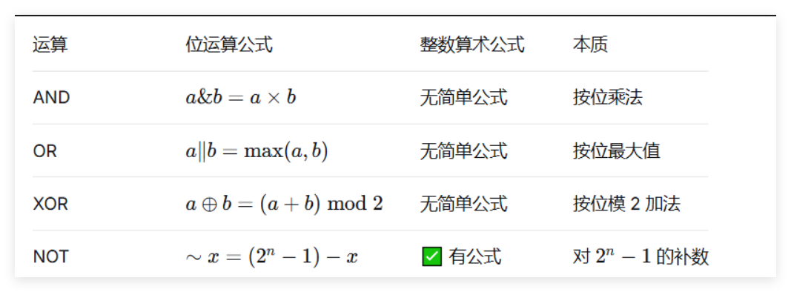
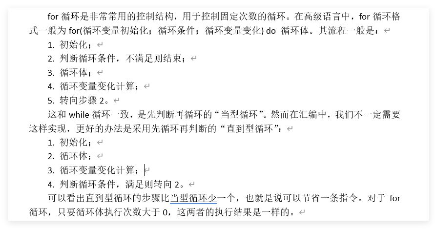
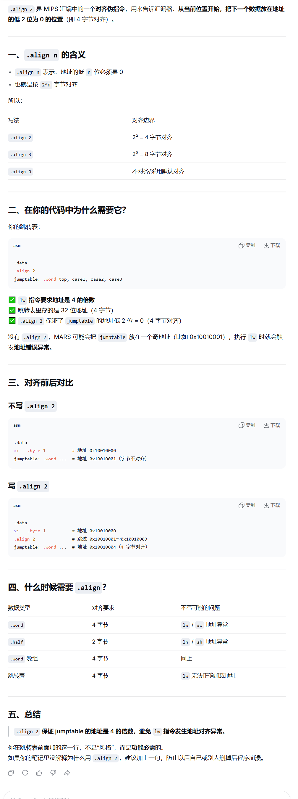
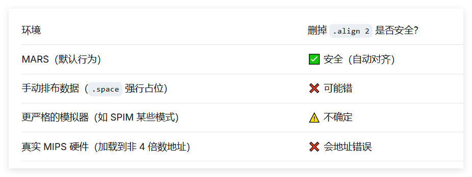
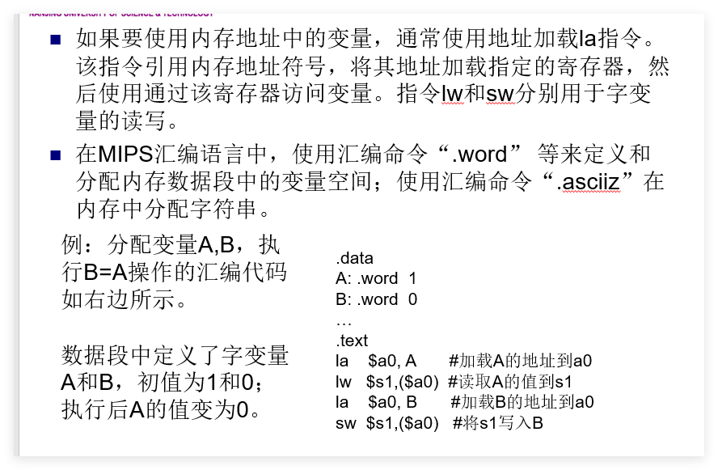
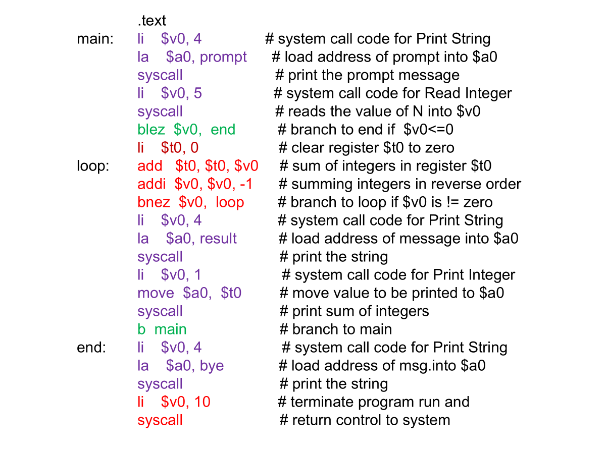
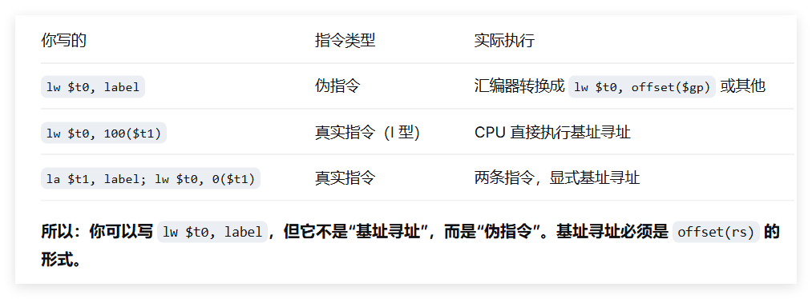

---
markdown-it:
  html: true
---


# MIPS NOTES

## 目录

### 指令集
- [（壹）整数指令集](#壹整数指令集)
  - [一、数据传送类指令](#一数据传送类指令)
  - [二、算数运算类指令](#二算数运算类指令)
  - [三、逻辑运算类指令](#三逻辑运算类指令)
  - [四、移位指令](#四移位指令)
  - [五、逻辑设置指令](#五逻辑设置指令)
  - [六、跳转指令](#六跳转指令)
  - [七、系统调用](#七系统调用)

### 宏指令
- [（贰）宏指令（伪指令）](#贰宏指令伪指令)

### 寄存器
- [MIPS 通用寄存器表（32 个）](#mips-通用寄存器表32-个)
- [特殊寄存器（非通用寄存器）](#特殊寄存器非通用寄存器)

### 控制结构
- [IF THEN ELSE & IF THEN](#一if-then-elseif-then的翻译)
- [WHILE](#二while的翻译)
- [FOR](#三for循环的翻译)
- [SWITCH](#四switch的翻译)

### 全局变量与汇编命令
- [全局变量与汇编命令](#全局变量的翻译和汇编命令)

### 问答
- [第一部分：概述与 MIPS 架构](#第一部分概述与-mips-架构)
- [第二部分：寻址方式与指令](#第二部分寻址方式与指令)

### [指令执行](#指令执行图)

### 练习
- [课本例题](#例题)
- [课本习题](#习题)
- [指令练习](#指令练习)
- <a href="21programs.pdf" target="_blank">📄 21个MIPS汇编程序（PDF）</a>

### [易混淆](#注意点)

### 附录
- [MARS 常用 SYSCALL 服务表](#mars-常用-syscall-服务表)
- [Tips](#小tips)
### 前情:

$注意!!!:$
**逻辑运算 0 扩展；其余 I 型指令一律符号扩展。u 不改变扩展方式，只改变运算时的溢出检测和数值解读方式(即最高位是作为符号位还是作为数值位)。**

注意：

rd:register destination(一般用于在R指令格式中作目的寄存器)

rs:register source(I、R指令格式中的第一源寄存器)

rt:register target(I指令格式中的目的寄存器、R指令格式中的第二源寄存器)

PC的问题:


**需了解的位运算点：**




- and --乘法
  - 与自己--不变
  - **对于指定的某一位**
  - 与1--不变；与0--置0 ； 
- or  --按位或 = 取最大值$（$0|0=0, 0|1=1, 1|0=1, 1|1=1）$
  - 或自己--不变
  - **对于指定的某一位**
  - 或1--置1；或0--不变；
- xor 无进位加法
  - 异或自己--清零
  - **对于指定的某一位**
  - 异或1--(1为0，0为1--取反)；异或0(1为1，0为0--不变)；
- not 1减去该位  
- nor 或非，先或再按位取反
  - 或非自己--取反
  - **对于指定的某一位**
  - 或非1--置0；或非0--取反；
- 非逻辑设置，置0方法：
  - `or rd,$zero,$zero`或其他位运算
  - `li $rd, 0` 
  - `add $rd, $zero, $zero`
  - 注意`li`普世方法
- 非逻辑设置，置1方法：
  - `ori rd,$zero,1`或其他位运算
  - `li rd, 1`
  - `addi rd, $zero, 1`
  - 注意`li`普世方法
- 在只有0与1是，1即为非0(不等于0)

#### 按位运算总结（针对单个位）

| 运算 | 与 0 | 与 1 | 与自身 |
| :--- | :--- | :--- | :--- |
| **AND** | 0 | 不变 | 不变 |
| **OR** | 不变 | 1 | 不变 |
| **XOR** | 不变 | 取反 | 0 |
| **NOR** | 取反 | 0 | 取反 |

---

### MIPS 汇编数据定义伪指令：.byte, .word, .space

在 MIPS 汇编中，`.byte`、`.word` 和 `.space` 用于在数据段（`.data`）中分配内存。它们的主要区别在于分配单位、是否初始化以及对齐方式。

$↓↓↓↓↓↓↓↓↓↓↓↓↓↓↓↓↓↓↓↓↓↓↓↓↓↓↓↓↓↓↓↓↓↓↓↓↓↓↓↓↓↓↓↓↓↓↓↓↓↓↓↓↓↓↓↓↓↓↓↓↓↓↓↓↓↓↓↓↓↓↓↓↓↓↓↓↓↓↓↓↓↓↓↓↓↓↓↓↓↓↓↓↓↓↓↓↓↓↓↓↓↓↓↓↓↓↓↓↓↓↓↓↓$

## 一、`.byte` – 分配字节

- **分配单位**：1 字节（8 位）
- **可初始化**：可以跟一个或多个数值（0~255）或字符（单引号），用逗号分隔
- **对齐**：无对齐要求，按顺序连续存放

### 示例
```assembly
.data
c1:    .byte 'A'          ; 分配 1 字节，存放 ASCII 65
c2:    .byte 10, 20, 30   ; 分配 3 字节，连续存放 10,20,30
str:   .byte 'H','e','l','l','o',0   ; 手动构造字符串（无自动结束符）
```

### 数组使用
定义字节数组：`.byte 1,2,3,4,5`  
访问时用 `lb`（有符号）或 `lbu`（无符号）读取，`sb` 写入。

---

## 二、`.word` – 分配字

- **分配单位**：4 字节（32 位，一个 MIPS 字）
- **可初始化**：可以跟一个或多个 32 位整数，用逗号分隔
- **对齐**：**自动按 4 字节对齐**，若前一个数据未对齐，汇编器会插入填充字节

### 示例
```assembly
.data
x:      .word 100               ; 分配 4 字节，初值 100
arr:    .word 1, 2, 3, 4, 5     ; 分配 20 字节，连续存放 5 个整数
matrix: .word 0:10              ; 分配 40 字节，10 个整数初始化为 0（MARS 支持重复语法）
```

### 数组使用
定义字数组：`.word 0:10`（10 个 0）  
访问时用 `lw` 读取，`sw` 写入，下标需转换为字节偏移（乘以 4）。

---

## 三、`.space` – 分配未初始化空间

- **分配单位**：字节，需要指定大小（字节数）
- **不初始化**：只分配空间，不设初值（内容通常为 0，但不保证）
- **对齐**：无自动对齐，从当前位置连续分配

### 示例
```assembly
.data
buffer: .space 100              ; 分配 100 字节，未初始化
arr:    .space 40               ; 分配 40 字节，可用于存放 10 个 int
```

### 数组使用
`.space 40` 可以当作 10 个 `int` 的数组，但需要自己管理索引（乘以 4）。

---

## 四、对齐的影响

由于 `.word` 要求 4 字节对齐，混合使用时可能产生“空洞”：

```assembly
.data
a:      .byte 1         ; 地址 0x10010000
b:      .word 100       ; 为了对齐，会从 0x10010004 开始（跳过 3 字节）
c:      .space 2        ; 地址 0x10010008
d:      .word 200       ; 地址 0x1001000c（自动对齐到 4 的倍数）
```

程序员通常不需要手动计算地址，汇编器自动处理。但了解对齐有助于理解内存布局。

---

## 五、数组的定义与访问

### 1. 定义数组

```assembly
.data
int_arr:   .word 10, 20, 30, 40, 50   ; 5 个整数元素
byte_arr:  .byte 'a','b','c','d','e'  ; 5 个字节
buffer:    .space 40                  ; 40 字节未初始化（可作 10 个 int）
```

### 2. 访问数组元素（以 `int_arr` 为例）

假设 `int_arr` 的地址在 `$t0` 中，要访问第 `i` 个元素（i 从 0 开始）：

```assembly
la   $t0, int_arr        ; 数组基址
li   $t1, i              ; 下标
sll  $t1, $t1, 2         ; 下标 × 4（字节偏移）
add  $t1, $t0, $t1       ; 元素地址
lw   $t2, 0($t1)         ; 读取元素到 $t2
```

写回类似，用 `sw`。

---

## 六、总结对比表

| 伪指令 | 分配单位 | 是否可赋初值 | 对齐要求 | 典型用途 |
| :--- | :--- | :--- | :--- | :--- |
| `.byte` | 1 字节 | ✅ 可赋初值（数值/字符） | 无 | 字符、字节数组、字符串 |
| `.word` | 4 字节 | ✅ 可赋初值（整数） | 4 字节对齐 | 整数变量、整数数组 |
| `.space` | 1 字节（可指定数量） | ❌ 只分配，不赋初值 | 无 | 大块缓冲区、未初始化数组 |

---

## 七、使用建议

- 需要初始化的小数据用 `.byte` 或 `.word`。
- 需要大块未初始化空间用 `.space`（如模拟栈、堆）。
- 定义数组时，如果元素个数已知且需初值，用 `.word 0,0,0...` 或 `.word 0:n`（MARS 支持重复计数）。
- 访问数组时注意偏移计算：**字节偏移 = 下标 × 元素大小**。

掌握这些，你就能灵活地在 MIPS 汇编中管理数据了。


## （壹）整数指令集

### 一、数据传送类指令

#### 1. 取（加载）数据指令

- **`lb rt, offset(rs)`** `# load byte [I]`  
  `rs` 的值加上**符号扩展**的 16 位偏移量形成有效地址，从有效地址指向的内存读取 **8 位字节**，**符号扩展**后加载到 `rt`。

PS:即便偏移量为0,也应当写上，比如说 `lb $a0,0($t0)`或`lb $a0,($t0)`

**括号不能省，数字可以省（省略数字默认为 0）。**

PS:先是offset进行符号扩展,然后再跟rs加

- **`lbu rt, offset(rs)`** `# load byte unsigned [I]`  
  `rs` 的值加上**符号扩展**的 16 位偏移量形成有效地址，从有效地址指向的内存读取 **8 位字节**，**0扩展**后加载到 `rt`。

- **`lh rt, offset(rs)`** `# load halfword [I]`  
  `rs` 的值加上**符号扩展**的 16 位偏移量形成有效地址，从有效地址指向的内存读取 **16 位半字**，**符号扩展**后加载到 `rt`。  
  > 若有效地址为奇数则发生地址错误异常，地址必为 2 的倍数（0 bit 为 0）。

- **`lhu rt, offset(rs)`** `# load halfword unsigned [I]`  
  `rs` 的值加上**符号扩展**的 16 位偏移量形成有效地址，从有效地址指向的内存读取 **16 位半字**，**0扩展**后加载到 `rt`。  
  > 若有效地址为奇数则发生地址错误异常，地址必为 2 的倍数（0 bit 为 0）。

- **`lw rt, offset(rs)`** `# load word [I]`  
  `rs` 的值加上**符号扩展**的 16 位偏移量形成有效地址，从有效地址指向的内存读取 **字数据** 加载到 `rt`。  
  > 地址应为 4 的倍数（末 2 bit 为 0），否则发生地址错误异常。

- **`lui rt, imm`** `# load upper immediate [I]加载立即数到高半字（16bits）`  
  `rt = imm << 16 | 0x0000`  
  将 16 位立即数左移 16 位，低 16 位补 0，结果存入 `rt`。

#### 2. 存数据指令

$PS:地址对齐要求与load一致$

- **`sb rt, offset(rs)`** `# store byte [I]`  
  有效地址 = `rs` + 【符号扩展】的 16 位偏移量，将 `rt` 最低 8 位【值】存入有效地址指向的内存。

  PS:不是rt指向的有效地址的值

- **`sh rt, offset(rs)`** `# store halfword [I]`  
  有效地址 = `rs` + 【符号扩展】的 16 位偏移量，将 `rt` 低 16 位存入有效地址指向的内存（地址必为 2 的倍数）。

- **`sw rt, offset(rs)`** `# store word [I]`  
  有效地址 = `rs` + 【符号扩展】的 16 位偏移量，将 `rt` 全部 32 位存入有效地址指向的内存（地址必为 4 的倍数）。


load指令一定会扩展为32bits是因为要存入寄存器，而寄存器为32bits

#### 3. 专用寄存器

- **`mfhi rd`** `# move from HI register[R]`
- **`mflo rd`** `# move from LO register[R]`
- **`mthi rs`** `# move to HI register[R]`
- **`mtlo rs`** `# move to LO register[R]`

---

### 二、算数运算类指令

#### 1. 加

- **`add rd, rs, rt`** `[R]`  
  `rs + rt` → `rd`，可能检查补码溢出。

- **`addu rd, rs, rt`** `[R]`  
  不检查补码溢出（一般用于地址运算）。**不代表零扩展**

- **`addi rt, rs, imm`** `[I]`  
  `rs` + **符号扩展**至 32 位的立即数 → `rt`，会检查补码溢出。

- **`addiu rt, rs, imm`** `[I]`  
  `rs` + **符号扩展**至 32 位的立即数 → `rt`，不检查补码溢出。  
  > **注**：此处`unsigned` 仅代表不检查补码溢出，**不代表零扩展**。立即数仍进行【符号扩展】，只是将最高位视为数值位。这里的imm还是符号扩展，只不过rs+imm得到的答案按无符号数来看，所以不会检查溢出

- **检查** 这个词很微妙


#### 2. 减

- **`sub rd, rs, rt`** `[R]`  
  `rs - rt` → `rd`，会检查补码溢出。

- **`subu rd, rs, rt`** `[R]`  
  不检查补码溢出。

#### 3. 乘

- **`mult rs, rt`** `[R]`  
  `rs * rt`，64 位积：高 32 位 → `HI`，低 32 位 → `LO`。操作数视为有符号数，不产生溢出。  
  结果可用 `mfhi` / `mflo` 取出。

- **`multu rs, rt`** `[R]`  
  操作数视为无符号正数，其余同 `mult`。

#### 4. 除

- **`div rs, rt`** `[R]`  
  `rs ÷ rt`：商 → `LO`，余数 → `HI`。操作数符号相反时商为负；余数符号与被除数 `rs` 相同。不产生溢出异常。  
  > 除数为 0 时结果未定义。

>对于 div rs, rt（有符号除法）：
>- 商向 0 取整（truncate toward zero）
>- 余数 = 被除数 − 商 × 除数
>- 余数的符号 = 被除数的符号


$PS:数学上，余数应当恒为正$

- **`divu rs, rt`** `[R]`  
  操作数均视为无符号数，商和余数恒为正。其余同 `div`。

---

### 三、逻辑运算类指令

- **`and rd, rs, rt`** `[R]`  
  rs与rt按位与 → `rd`。

- **`andi rt, rs, imm`** `[I]`  
  `rs` 与 **0扩展**至 32 位的立即数按位与 → `rt`。  
  > 注：立即数高 16 位默认为 0，若需非 0 掩码，先用 `lui` + `ori` 构造。

- **`or rd, rs, rt`** `[R]`  
  按位或 → `rd`。

- **`ori rt, rs, imm`** `[I]`  
  `rs` 与 **0扩展**至 32 位的立即数按位或 → `rt`。

- **`nor rd, rs, rt`** `[R]`  
  按位或非（先或后取反） → `rd`。

- **`xor rd, rs, rt`** `[R]`  
  按位异或 → `rd`。

- **`xori rt, rs, imm`** `[I]`  
  `rs` 与 **0扩展**的立即数按位异或 → `rt`。

---

### 四、移位指令

**注意移位指令是rd,rt,而非rt,rs**

- **`sll rd, rt, sa`** `shift left logical[R]`  
  `rt` 左移 `sa` 位，空位补 【0】 → `rd`。

**$PS:sa如果超过5位会截断$**

- **`sllv rd, rt, rs`** `shift left logical variable[R]`  
  `rt` 左移 `rs` 低 5 位指定的位数，空位补 【0】 → `rd`。  
  > 最多移位 31 位（5 bit 全 1）。

- **`srl rd, rt, sa`** `shift right logical[R]`  
  `rt` 逻辑右移 `sa` 位，空位补 【0】 → `rd`。

- **`srlv rd, rt, rs`** `shift right logical variable[R]`  
  `rt` 逻辑右移 `rs` 低 5 位指定的位数，空位补 【0】 → `rd`。

- **`sra rd, rt, sa`** `shift right arithmetic[R]`  
  `rt` 算术右移 `sa` 位，空位用【符号位】填充 → `rd`。

- **`srav rd, rt, rs`** `shift right arithmetic variable[R]`  
  `rt` 算术右移 `rs` 低 5 位指定的位数，空位用【符号位】填充 → `rd`。

---

### 五、逻辑设置指令

- **`slt rd, rs, rt`** `set if less than[R]`  
  若 `rs < rt`（有符号比较），`rd` 置 1，否则置 0。

- **`sltu rd, rs, rt`** `set if less than unsigned[R]`  
  若 `rs < rt`（无符号比较），`rd` 置 1，否则置 0。

- **`slti rt, rs, imm`** `set if less than immediate[I]`  
  若 `rs < 【符号扩展】的立即数`（有符号），`rt` 置 1，否则置 0。

- **`sltiu rt, rs, imm`** `set if less than immediate unsigned[I]`  
  若 `rs < 【符号扩展】的立即数`（无符号），`rt` 置 1，否则置 0。

---

### 六、跳转指令

#### 1. 无条件转移指令

- **`j label`** `[J]`  
  PC 高 4 位拼接 26 位立即数左移 2 位 → PC。  
  > 左移两位-->指令均为32位，以字为单位，故0、1bit必为0  
  指令的增加，一般不会影响到高四位

- **`jal label`** `jump and link[J]`  
  >将`PC`当前值(说明PC已+4)保存在`$ra`中，然后将【当前PC的前四位】与【26位立即数左移两位之后】连接起来形成一个地址，加载到`PC`。

- **`jalr rd, rs`** `jump and link register[R]`  
  将返回地址（PC(已加过4)）存入 `rd`，然后跳转至 `rs` 中的地址。  
  > 使用前 `rs` 必须已加载有效地址。

- **`jr rs`** `jump register unconditionally[R]`  
  跳转至 `rs` 中的地址。常用于函数返回：`jr $ra`。

#### 2. 分支指令

- **`beq rs, rt, label`** `branch if equal[I]`  
  若 `rs == rt`，跳转至 `label`。

- **`bne rs, rt, label`** `branch if not equal[I]`  
  若 `rs != rt`，跳转至 `label`。

- **`bgez rs, label`** `branch if greater than or equal to zero[I]`  
  若 `rs >= 0`，跳转至 `label`。

- **`bgezal rs, label`** `branch if greater than or equal to zero and link[I]`  
  若 `rs >= 0`，将返回地址存入 `$ra` 后跳转。

- **`bgtz rs, label`** `branch if greater than zero[I]`  
  若 `rs > 0`，跳转。

- **`blez rs, label`** `branch if less than or equal to zero[I]`  
  若 `rs <= 0`，跳转。

- **`bltz rs, label`** `branch if less than zero[I]`  
  若 `rs < 0`，跳转。

- **`bltzal rs, label`** `branch if less than zero and link[I]`  
  若 `rs < 0`，将返回地址存入 `$ra` 后跳转。

---

### 七、系统调用

- **`syscall`** `[R]`  
  触发系统调用异常。

---

## （贰）宏指令（伪指令）

<details>
<summary><b>abs rd, rs</b> —— 求绝对值```absolute value```</summary>

```asm
addu  rd, $zero, rs
bgez  rs, 1f #此处为行标号
sub   rd, $zero, rs
1:
```

先加到rd寄存器里，如果rd值大于等于0，无事，否则用0减自己

[Tips](#小tips)

</details>

<details>
<summary><b>beqz rs, label</b> —— 等于零则跳转```branch if equal to  zero```</summary>

```asm
beq   rs, $zero, label
```
</details>

<details>
<summary><b>bge rs, rt, label</b> —— 大于等于则跳转（有符号）</summary>

```asm
slt   $at, rs, rt
beq   $at, $zero, label
```

使用slt，大于等于即为不小于，即赋值0，再考虑与0的大小关系

</details>

<details>
<summary><b>bgeu rs, rt, label</b> —— 大于等于则跳转（无符号）`branch if greater or equal`</summary>

```asm
sltu  $at, rs, rt
beq   $at, $zero, label
```
</details>

<details>
<summary><b>bgt rs, rt, label</b> —— 大于则跳转（有符号）`branch if greater than`</summary>

```asm
slt   $at, rt, rs
bne   $at, $zero, label

判断rs是不是大于rt,即判断rt是不是小于rs，即判断`$at`是不是1,即判断`$at`是不是不等于0(因为只有判断是否为0的，故在判断是否为1时应当判断是否不等于0!)

```
</details>

<details>
<summary><b>bgtu rs, rt, label</b> —— 大于则跳转（无符号）</summary>

```asm
sltu  $at, rt, rs
bne   $at, $zero, label
```
</details>

<details>
<summary><b>ble rs, rt, label</b> —— 小于等于则跳转（有符号）`branch if less or equal`</summary>

```asm
slt   $at, rt, rs
beq   $at, $zero, label
```
</details>

<details>
<summary><b>bleu rs, rt, label</b> —— 小于等于则跳转（无符号）</summary>

```asm
sltu  $at, rt, rs
beq   $at, $zero, label
```

rs小于等于rt即为rt大于等于rs,即rt不小于rs,如果rt小于rs,则置0

</details>

<details>
<summary><b>blt rs, rt, label</b> —— 小于则跳转（有符号）`branch if less than`</summary>

```asm
slt   $at, rs, rt
bne   $at, $zero, label
```
</details>

<details>
<summary><b>bltu rs, rt, label</b> —— 小于则跳转（无符号）</summary>

```asm
sltu  $at, rs, rt
bne   $at, $zero, label
```
</details>

<details>
<summary><b>bnez rs, label</b> —— 不等于零则跳转`branch if not equal to zero`</summary>

```asm
bne   rs, $zero, label
```
</details>

<details>
<summary><b>b label</b> —— 无条件相对跳转</summary>

```asm
bgez  $zero, label
# 或
beq   $zero, $zero, label
```


**在此处PC=PC+imm<<4(说明PC已+4)**


</details>

<details>
<summary><b>div rd, rs, rt</b> —— 有符号除法（商）</summary>

```asm
bne   rt, $zero, ok
break $zero
ok:
div   rs, rt
mflo  rd
```
</details>

<details>
<summary><b>div rt, rs, imm(32)</b> —— 有符号除法（商）</summary>

```asm
li $at,imm  #实际上还要细分，li也有不同的展开，主要看imm的值
bne   $at, $zero, ok
break $zero
ok:
div   rs, $at
mflo  rt
```
</details>

<details>
<summary><b>divu rd, rs, rt</b> —— 无符号除法（商）</summary>

```asm
bne   rt, $zero, ok
break $zero
ok:
divu  rs, rt
mflo  rd
```
</details>

<details>
<summary><b>divu rt, rs, imm(32)</b> —— 无符号除法（商）</summary>

```asm
li $at,imm  #实际上还要细分，li也有不同的展开，主要看imm的值
bne   $at, $zero, ok
break $zero
ok:
divu   rs, $at
mflo  rt
```
</details>

<details>
<summary><b>la rd, label</b> —— 加载地址</summary>

```asm
lui   $at, %hi(label)
ori   rd, $at, %lo(label)
#符号 %hi() 和 %lo() 是 MIPS 汇编器提供的运算符，用来在汇编阶段把一个 32 位地址拆分成高 16 位和低 16 位。
```
</details>

<details>
<summary><b>li rd, value</b> （value ≥ 32768 或负数）</summary>

```asm
lui   $at, %hi(value)
ori   rd, $at, %lo(value)
```


有时候加载负数也可以使用:addiu


</details>

<details>
<summary><b>li rd, value</b> （value < 32768）</summary>

```asm
ori   rd, $zero, value
```
PS:有时-3276value
</details>

<details>
<summary><b>move rd, rs</b> —— 寄存器间数据传送</summary>

```asm
addu  rd, $zero, rs
```
</details>

<details>
<summary><b>mul rd, rs, rt</b> —— 乘法（不检查溢出）</summary>

```asm
mult  rs, rt
mflo  rd
```
</details>

<details>
<summary><b>mul rt, rs, imm(32)</b> —— 乘法（不检查溢出）</summary>

```asm
li $at,imm
mult  rs, $at
mflo  rt
```


**注意:**

没有`mulu`的用法，因为不管有无符号，其低32位数都相同:


</details>

<details>
<summary><b>mulo rd, rs, rt</b> —— 有符号乘法（检查溢出）</summary>

```asm
mult  rs, rt
mfhi  $at
mflo  rd
sra   rd, rd, 31
beq   $at, rd, ok
break $zero
ok:
mflo  rd
```


</details>

<details>
<summary><b>mulou rd, rs, rt</b> —— 无符号乘法（检查溢出）</summary>

```asm
multu rs, rt
mfhi  $at
beq   $at, $zero, ok
break $zero
ok:
mflo  rd
```


</details>

<details>
<summary><b>neg rd, rs</b> —— 求补（有符号，检查溢出）</summary>

```asm
sub   rd, $zero, rs
```
</details>

<details>
<summary><b>negu rd, rs</b> —— 求补（无符号）</summary>

```asm
subu  rd, $zero, rs
```
</details>

<details>
<summary><b>nop</b> —— 空操作</summary>

```asm
or    $zero, $zero, $zero
```
</details>

<details>
<summary><b>not rd, rs</b> —— 按位取反</summary>

```asm
nor   rd, rs, $zero
```
</details>

<details>
<summary><b>rem rd, rs, rt</b> —— 有符号除法（余数）`remain`</summary>

```asm
bne   rt, $zero, ok
break $zero
ok:
div   rs, rt
mfhi  rd
```
注意老式写法：
```asm
bne rt,$0,8  # 如果 rt != 0，跳过 8 字节即 2 条指令（即直接跳到 mfhi 行）
break $0
div rs,rt
mfhi rd
```
</details>

<details>
<summary><b>rem rt, rs, imm(32)</b> —— 无符号除法（余数）</summary>

```asm
li $at,imm
bne   $at, $zero, ok
break $zero
ok:
div  rs, $at
mfhi  rt
```
</details>

<details>
<summary><b>remu rd, rs, rt</b> —— 无符号除法（余数）</summary>

```asm
bne   rt, $zero, ok
break $zero
ok:
divu  rs, rt
mfhi  rd
```
</details>

<details>
<summary><b>remu rt, rs, imm(32)</b> —— 无符号除法（余数）</summary>

```asm
li $at,imm
bne   $at, $zero, ok
break $zero
ok:
divu  rs, $at
mfhi  rt
```
</details>

<details>
<summary><b>rol rd, rs, rt</b> —— 循环左移（变量移位）`rotate left`</summary>

```asm
subu  $at, $zero, rt # $at = -rt (补码)，其低5位等效于 32 - rt
#主要是因为我们要32-rt,但是这样的话，我们没有在rs上放立即数的方式
不然我们就要用一个寄存器存放固定值32了
srlv  $at, rs, $at
sllv  rd, rs, rt
or    rd, rd, $at
```

- **一个十进制数取负数，在二进制补码上的表现就是按位取反再+1**
- 32位-- (11111····11111)
- 在对应位，用1减去该二进制位，等效于该位取反(按位取反的数学本质)
- 所以想要得到【32减去**rt的低五位**】(32-(11111))  所代表的(十进制)值，用32减去低五位，即对低五位按位取反，即对整体按位取反，即取负数(反正会截断)
   


</details>

<details>
<summary><b>rol rd, rs, sa</b> —— 循环左移（固定移位）</summary>

```asm
srl   $at, rs, 32-sa
sll   rd, rs, sa
or    rd, rd, $at
```
</details>

<details>
<summary><b>ror rd, rs, rt</b> —— 循环右移（变量移位）`rotate right`</summary>

```asm
subu  $at, $zero, rt
sllv  $at, rs, $at
srlv  rd, rs, rt
or    rd, rd, $at
```
</details>

<details>
<summary><b>ror rd, rs, sa</b> —— 循环右移（固定移位）</summary>

```asm
sll   $at, rs, 32-sa
srl   rd, rs, sa
or    rd, rd, $at
```
</details>

<details>
<summary><b>seq rd, rs, rt</b> —— 相等则置 1`set if equal`</summary>

```asm
beq   rt, rs, yes
ori   rd, $zero, 0
beq   $zero, $zero, skip
yes:
ori   rd, $zero, 1
skip:
```
</details>

<details>
<summary><b>sge rd, rs, rt</b> —— 大于等于则置 1（有符号）`set if greater or equal`</summary>

```asm
bne   rt, rs, yes
ori   rd, $zero, 1
beq   $zero, $zero, skip
yes:
slt   rd, rt, rs
skip:
```

PS:一种优化思路:
```mips
slt  $at, rs, rt        # $at = 1 if rs < rt
xori rd, $at, 1         # 取反：1→0, 0→1
```
- 本质就是slt+取反操作


</details>

<details>
<summary><b>sgeu rd, rs, rt</b> —— 大于等于则置 1（无符号）</summary>

```asm
bne   rt, rs, yes
ori   rd, $zero, 1
beq   $zero, $zero, skip
yes:
sltu  rd, rt, rs
skip:
```
</details>

<details>
<summary><b>sgt rd, rs, rt</b> —— 大于则置 1（有符号）`set if greater than`</summary>

```asm
slt   rd, rt, rs
```
</details>

<details>
<summary><b>sgtu rd, rs, rt</b> —— 大于则置 1（无符号）</summary>

```asm
sltu  rd, rt, rs
```
</details>

<details>
<summary><b>sle rd, rs, rt</b> —— 小于等于则置 1（有符号）`set if less or equal`</summary>

```asm
bne   rt, rs, yes
ori   rd, $zero, 1
beq   $zero, $zero, skip
yes:
slt   rd, rs, rt
skip:
```
</details>

<details>
<summary><b>sleu rd, rs, rt</b> —— 小于等于则置 1（无符号）</summary>

```asm
bne   rt, rs, yes
ori   rd, $zero, 1
beq   $zero, $zero, skip
yes:
sltu  rd, rs, rt
skip:
```
</details>

<details>
<summary><b>sne rd, rs, rt</b> —— 不等则置 1`set if not equal`</summary>

```asm
beq   rt, rs, yes
ori   rd, $zero, 1 #非逻辑设置，置1方法
beq   $zero, $zero, skip
yes:
ori   rd, $zero, 0
skip:
```
</details>

## MIPS 通用寄存器表（32 个）
| 编号 | 助记符 | 用途说明 | 英文全称 / 翻译 |
|:---:|:---|:---|:---|
| 0 | `$zero` | 恒为 0，写入无效 | **zero** constant |
| 1 | `$at` | 汇编器临时使用（展开伪指令） | **a**ssembler **t**emporary |
| 2-3 | `$v0` ~ `$v1` | 函数返回值 | **v**alue returned |
| 4-7 | `$a0` ~ `$a3` | 函数实参（前 4 个） | **a**rguments |
| 8-15 | `$t0` ~ `$t7` | 临时寄存器，调用者保存 | **t**emporary |
| 16-23 | `$s0` ~ `$s7` | 保存寄存器，被调用者保存 | **s**aved |
| 24-25 | `$t8` ~ `$t9` | 临时寄存器（同 t0~t7） | **t**emporary |
| 26-27 | `$k0` ~ `$k1` | 保留给 OS 内核，异常处理用 | **k**ernel reserved |
| 28 | `$gp` | 全局数据区指针 | **g**lobal **p**ointer |
| 29 | `$sp` | 栈顶指针 | **s**tack **p**ointer |
| 30 | `$fp` / `$s8` | 帧指针（或作为第 9 个保存寄存器） | **f**rame **p**ointer / **s**aved |
| 31 | `$ra` | 函数返回地址 | **r**eturn **a**ddress |

### **PS:将寄存器堆视作一个数组R[32]，rd,rs,rt是值为0-31之间的下标**

## 特殊寄存器（非通用寄存器）
| 名称 | 用途说明 | 翻译 |
|:---|:---|:---|
| **PC** | 程序计数器，存放下一条指令地址 | **P**rogram **C**ounter |
| **HI** | 乘法结果高 32 位 / 除法余数 | **HI**gh word |
| **LO** | 乘法结果低 32 位 / 除法商 | **LO**w word |
| **IR** | 指令寄存器，存放当前执行的机器码 | **I**nstruction **R**egister |

**HI 与 LO 除了记录乘除法结果以及用特定指令传输到寄存器堆以外，其他指令都不能使用，因而称为专用寄存器**

*PC中存放的是将要取出执行的指令所在内存单元的地址。PC的初始值由操作系统指定，即为将要执行程序的**第一条指令**所存放的内存单元的地址。*程序计数器中的地址通过总线传送到指令缓存的地址输入端。当一条指令已从内存取出并存放到指令寄存器(IR,$Instruction\ Register$)中后，PC的增量为4，CPU便有了下一条指令所在内存位置的地址，以便CPU顺序提取下一条指令。

## 控制结构
----

## <span id="一if-then-elseif-then的翻译">一、"if then else"&"if then"的翻译</span>
### "if then else"
- 伪代码:
```
if ($t8<0) then
          {
            $s0=0-$t8;
            $t1=$t1+1;
          }
else      
          {
            $s0=$s8;
            $t2=$t2+1;
          }      
```
- 翻译:
```Py
      bgez  $t8, else          # 如果$t8>=0则分支到else 
      #其实考虑到then后面的是顺序执行
      #故在代码逻辑上应道是满足<0时顺序执行，而>0的时候就应当跳走
      sub   $s0, $zero, $t8    # s0 = 0 - t8
      addi  $t1, $t1, 1        # t1加上1 
      b next                   # 跳过else后面的代码 
else: 
      ori   $s0, $t8, 0        # s0 = t8 
      addi  $t2, $t2, 1        # t2加上1 
next:

```
>读者应当注意到判断条件($t8<0)对应MIPS汇编第一句bgez $t8，…，条件恰好相反。  
- 这是由于if的流程和分支指令的逻辑相反：if条件成立时继续运行，而分支指令继续运行（不跳转）则要求条件不成立。  
- 将if的条件反过来成为分支指令的条件，可以让汇编指令按顺序对应到伪代码的语句。另外，在代码块1（then代码块）之后要添加一条转移语句，以跳过代码块2（else 代码块）。

$这段代码实现了什么:$$负数和非负数的统计或转换$
### "if then"
- 伪代码:
```py
if（$t0>$t1）then $t1=$t0
```
- 翻译:
```py
      ble $t0, $t1, out1 	# 如果t0<=t1分支到out1 
      move $t1, $t0		    # t1=t0
      #依旧考虑到then后顺序执行
out1:
```
## <span id="二while的翻译">二、"while"的翻译</span>
- 伪代码:
```py
$v0 = 1 
While ($a1 < $a2) do  
{ 
    $t1 = mem[$a1] 
    $t2 = mem[$a2] 
    if ($t1 != $t2) {$v0 = 0;break }
    $a1 = $a1 + 1 
    $a2 = $a2 - 1
} 
```
- 翻译:
```py
        li    $v0, 1                
        # v0=1 
loop:   bgeu  $a1, $a2, done        
        # 如果a1>=a2分支到done 
        lb    $t1, 0($a1)           
        # 加载字节数据: t1 = mem[a1 + 0] 
        #比如字符啊什么的，要判断的东西大概率在内存中
        lb    $t2, 0($a2)           
        # 加载字节数据: t2 = mem[a2 + 0] 
        bne   $t1, $t2, break       
        # 如果t1!=t2分支到break 
        addi  $a1, $a1, 1           # a1 = a1 + 1 
        addi  $a2, $a2, -1          # a2 = a2 - 1 
        b     loop                  # 跳转到loop 
break: 
        li $v0, 0                   # v0=0，结束
done:
      #这里只要判断$v0是不是为1，即能知道是否回文
```
$这段代码实现了什么:$$一个标准的回文判断程序，从字符串（或数组）的两端向中间比较。$

>这个例子里的while是“当型循环”，即先判断循环条件、再执行循环体循环。
- 和if语句的翻译类似，我们用相反的条件作为分支条件，满足则跳出循环,否则继续执行循环体。
- 完成循环体后直接跳转至最初的条件分支语句。
- 对if(条件){代码；break}做特殊处理：将break之前的代码放置在循环外，以break为标号，满足条件跳转至break标号。读者可自行绘制该代码的流程图。

## <span id="三for循环的翻译">三、"for循环"的翻译</span>
- 伪代码:
```py
$a0 = 0; 
For($t0 = 10; $t0 > 0; $t0 = $t0 -1)do{$a0 = $a0+$t0} 
```
- 翻译:
```py
      li $a0, 0             #  $a0 = 0 
      li $t0, 10            # 初始化循环计数为10 
loop: 
      add $a0, $a0, $t0 
      addi $t0, $t0, -1     # 循环计数器递减 
      bgtz $t0, loop        # 如果$t0>0跳转到loop 
```
$这段代码实现了什么:$$用\$a0记录从10加到1的结果$




## <span id="四switch的翻译">四、"switch"的翻译</span>
- 伪代码:
```py
        $s0 = 32; 
top:    cout  << “Input a value from 1 to 3”  
        cin >> $v0   
        switch ($v0) {
        case(1):  {$s0 = $s0 << 1; break;}  
        case(2):  {$s0 = $s0 << 2; break;}  
        case(3):  {$s0 = $s0 << 3; break;}  
        default:    goto top; 
        }
        cout << $s0   
```
- 翻译:
```py .line-numbers
            .data 
            .align  2 
jumptable:  .word top, case1, case2, case3 
prompt :    .asciiz  “\n\n Input a value from 1 to 3: ” 
            .text 
top:   
            li    $v0, 4            # 打印字串的调用号 
            la    $a0, prompt 
            syscall 
            li    $v0, 5            # 读取整数的调用号 
            syscall 
            blez  $v0, top          
            # 小于1为default处理，跳转到top 
            li    $t3, 3 
            bgt   $v0, $t3, top     
            # 大于3为default处理，跳转到top 
            la    $a1, jumptable    
            # 加载跳转表jumptable地址 
      注意  # $a1 = jumptable 的基地址（比如 0x10010000）
            sll   $t0, $v0, 2  
      注意  # 偏移：输入 1 → 偏移 4     
            # 计算字地址偏移 
            # jumptable是按字分配的
            # 一个字四个字节,跳一个地址要输入数字乘4
            add   $t1, $a1, $t0     
            # 构成指向jumptable内数据的指针 
      注意  # $t1 = jumptable 中某个条目的地址
            #（比如 0x10010004）（存放"casex"的地址）
            lw    $t2, 0($t1)       
            # 从jumptable获得地址数据 (得到casex)
      注意  # $t2 = 该条目里存放的值
            #（比如 case1 的地址 0x00400080）
            jr    $t2               
            # 跳转到“switch”的各个分支 
      注意  # 跳转到 case1 的代码
      故 不能直接--jr $t1
case1:      sll   $s0, $s0, 1       # 逻辑左移1位 
            b     output 
case2:      sll   $s0, $s0, 2       # 逻辑左移2位
            b     output 
case3:      sll   $s0, $s0, 3       # 逻辑左移3位
output: 
            li    $v0, 1            # 打印整数的调用号
            move  $a0, $s0          # a0为需要打印的整数 
            syscall                 # 输出结果

```





>该例数据段中标号jumptable开始的内存分配了4个字，其值为top、 case1、 case2、 case3，都是文本段中的标号，也就是跳转地址。
- 因此jumptable定义了一个跳转地址列表，是跳转地址列表的首地址。
- 代码中计算了控制变量$v0在跳转地址表中对应的地址\$t1=jumptable+\$v0<<2，将jumptable的内容（对应的跳转地址）读入\$t2
- 最后用指令jr \$t2跳转至该地址，控制流程进入对应的分支。
- 除最后一个以外，每个case分支的最后一条都是b语句，跳转到整个switch结构的出口。
  
## <span id="全局变量的翻译和汇编命令">全局变量的翻译和汇编命令</span>

- 在汇编语言中，全局变量在数据段中分配，以标号表明变量的地址。
- MIPS常用的汇编命令如下:

| 伪指令 | 说明 |
| :--- | :--- |
| `.align n` | 将下一个数据与 \(2^n\) 字节边界对齐 |
| `.ascii str` | 将字符串 `str` 存储在内存中，不添加终止符 `null` |
| `.asciiz str` | 将字符串 `str` 存储在内存中，并添加终止符 `null` |
| `.byte b1, ..., bn` | 将 \(n\) 个值存储在连续的字节中 |
| `.word w1, ..., wn` | 将 \(n\) 个 32 位数存储在连续的存储器字中 |
| `.space n` | 在当前段中分配 \(n\) 个字节的空间 |

**注意:** 有"z"与无"z":字符串会一直输出直至遇到'\0'，故不加"z",则对于某个字符串在输出完自身内容后还会输出其他字符串的内容直到某个字符串有'\0'，或者在内存中遇到'\0'，出现乱码


- 例3-8：写出以下C语言全局变量定义的MIPS汇编代码。
```c
char c1,c2='A',c3='B';
char *str=”hello”;
int  n=100;
```
- 翻译:
```py
      .data 
      c1:		.byte 0				
      # C语言规定，全局变量无初值则初值为0
      c2:		.byte 65 			# ‘A’的ASCII码
      c3:		.byte 66 			# ‘B’的ASCII码
str:	 .asciiz“hello” 	# 以0为结尾
      .align 2			
      # 整型数占据一个字，其地址必须对齐为4的倍数
n:	  .word 100			
```
- 数组是常用的数据类型，MIPS架构从指令集的设计到汇编语言的语法都提供了有限的支持。C语言中给一维整型数组分配1024个单元的代码是：
``` c
int array[1024]; 
```
在MIPS汇编中，对应的代码是：
```py
        .data 
array:  .space  4096
```
- 注意汇编命令“.space”分配的空间是以字节为单位的。32位架构下的字有4个字节，和整型数相同。
- 因此1024个字（整型数）的数组，和4096个字节的数组分配的空间是一样的。


- 例3-9：将以下C代码翻译成MIPS汇编。
```c
int pof2[16]={1,2,4,8,16,32,64,128,256,512,1024,2048,4096,8192,16384,32768};
main(){
	int n;
	cin>>n;
	cout<<prof[n];
}
```
- 翻译:
```py
        .data 
pof2:   .word 1,2,4,8,16,32,64,128,256,512,1024,2048,4096,8192,16384,32768 
        .text
        li $v0,5
        syscall           	# 获得输入的N
        la  $s0, pof2    	# s0 = &pof2 
        sll $t0, $v0, 2  	# t0 = N*4
        add $s0, $s0, $t0 	# s0+= N*4
        lw  $a0, ($s0)  	# a0 = MEM[s0 + N*4] 
        # 没有lw $a0,$t0($s0)
        li $v0,1
        syscall           	# 输出结果

```
$该代码将一个16个单元的整型数组初始化为2的N次方（N=0-15），用户输入N，通过【查表】输出2的N次方。$
- MIPS汇编访问数组元素的方式和高级语言一样：元素0“pof2[0]”中的值为1，元素1“pof2[1]”中的值为2，依此类推。
- 如果输入2，代码执行后$a0中的值为4。
- 访问该数组元素的地址必须为4的倍数。
- 存储器中可访问的最小单位是字节，为8个二进制位。
- 一个字有4个字节，字的地址就是其第一个字节的地址。

- 在MIPS架构中，所有数据操作指令和控制指令要求其操作数在寄存器堆中。因此对伪代码中的变量，对应到寄存器更方便编程。创建一个交叉引用表来描述这种对应，在程序中以注释出现。例如：
```
# Cross References:
# v0: N,   
# t0: Sum 
```
    表示后面的程序中，寄存器v0存储变量N，t0存储变量Sum




例3-1：求1+2+…+N的和。
``` py
# 程序名称：整数求和 
# 程序员：你的名字 
# 最后更改时间：
# 功能描述： 
# 求整数1到N的和，N的值由键盘输入。
 ##################################################################   
# 算法的伪代码描述：
# main:   cout << “Please input a value for N” 
#         cin >> v0  
#         If ( v0 <= 0 ) stop 
#              t0 = 0; 
#         While (v0 > 0 ) do  
#         { 
#             t0 = t0 + v0;    
#             v0 = v0 - 1; 
#         } 
#         cout << t0; 
#         go to main

################################################################# 
# 交叉引用表：
# v0: N   
# t0: Sum 
#################################################################
          .data 
prompt:   .asciiz “\n   Please Input a value for N =  ” 
result:   .asciiz “   The sum of the integers from 1 to N is ” 
bye:      .asciiz “\n  **** Have a good day ****” 
          .globl main 
          .text 
main:     li    $v0, 4            # 打印字符串的系统调用号 
          la    $a0, prompt       # 加载prompt字串地址到a0 
          syscall                 # 打印prompt字串 
          li    $v0, 5            # 读取整数的系统调用号 
          syscall                 # 读取整数N的值到v0 
          blez  $v0,  end         # 如果$v0<=0分支到end  
          li    $t0, 0            # $t0清0 
loop:     add   $t0, $t0, $v0     # 整数和记录在$t0中 
          addi  $v0, $v0, -1      # 反向求整数和 
          bnez  $v0,  loop        # 如果$v0不为0，分支到loop 
          li    $v0, 4            # 打印字符串的系统调用号
          la    $a0, result       # 加载result字串地址到a0 
          syscall                 # 打印result字串
          li    $v0, 1            # 打印整数的系统调用号
          move  $a0,  $t0         # 将需要打印的值赋给$a0  
          syscall                 # 打印整数和 
          b main                  # 跳转到main 
end:      li    $v0, 4            # 打印字符串的系统调用号
          la    $a0, bye          # 加载bye字串地址到a0 
          syscall                 # 打印bye字串
          li    $v0, 10           # 终止程序，返回系统
          syscall                 # 

``` 



必须在文本文件的末尾留一个空白行。

**【注】** 文件末尾留空行是早期汇编器和跨平台规范遗留的习惯(读取到'\n'结束)，MARS 中通常不必须，但按教材要求保留更稳妥。
# MIPS 架构与指令集问答

## 第一部分：概述与 MIPS 架构

<details>
<summary><b>Q1：和高级语言相比，低级语言有何优缺点？</b></summary>

- **优点**：
  - 执行效率高，能够直接访问系统接口。
  - 程序体积小，适合嵌入式或对资源敏感的环境。
  - 能够实现高级语言无法做到的底层操作（如上下文切换、中断处理）。
- **缺点**：
  - 可读性差，开发效率低，维护困难。
  - 与硬件平台强相关，移植性差。
  - 容易出错且调试困难。
</details>

<details>
<summary><b>Q2：为何需要学习汇编语言？</b></summary>

- 对于计算机技术的初学者，编写汇编语言程序可以深入了解计算机的程序执行过程，理解计算机底层工作原理，有助于对高级语言程序机制的理解。
- 直观感受CPU的结构和指令执行，有助于后期硬件相关课程的学习。
- 帮助调试和优化高级语言程序（如分析 C 语言反汇编）。
- 编写操作系统内核、驱动程序、嵌入式系统的必需技能。
- 应对安全领域中的逆向工程和漏洞分析需求。
</details>

<details>
<summary><b>Q3：汇编源程序和汇编程序分别是什么？</b></summary>

- **汇编源程序**：使用汇编语言编写的程序。
- **汇编程序**：将汇编源程序翻译成机器码的工具软件（如 MARS, SPIM, GNU `as`），也叫**汇编器/解释器**。
</details>

<details>
<summary><b>Q4：根据机器指令体系，CPU 分为哪两大类？典型代表有哪些？</b></summary>

- **CISC**（complex instruction set computer复杂指令集计算机）：指令数量多、长度可变、单条指令功能强。  
  代表：x86（Intel、AMD）。
- **RISC**（reduced instruction set computer精简指令集计算机）：指令数量少、长度固定、大部分指令单周期执行。  
  代表：MIPS、ARM、RISC-V。
</details>

<details>
<summary><b>架构 Q1：学习 MIPS 架构需要了解哪四个主要方面的内容？</b></summary>

1. **各类寄存器**：通用寄存器、专用寄存器(HI/LO)、特殊寄存器（PC/IR）。
2. **指令集与指令格式**：R/I/J 三种格式的字段划分与功能。
3. **内存寻址模式**：立即数、寄存器、基址偏移、伪直接、相对寻址。
4. **数据类型与存储格式**：字节、半字、字，以及大/小端对齐。
</details>

<details>
<summary><b>架构 Q2：数据类型和高级语言中的数据类型有何不同？</b></summary>

- 高级语言数据类型（如 `int`, `char`, `float`）带有**语义和检查**（如不能把 `float` 直接当指针用）。
- 汇编语言的数据类型只是**二进制位串的长度约定**（如 8 位、16 位、32 位），硬件不检查类型是否匹配，只按指令操作。
</details>

<details>
<summary><b>架构 Q3：MIPS 架构中通用寄存器有多少个？一个寄存器多少位？</b></summary>

- **32 个**通用寄存器（`$0` ~ `$31`）。
- 每个寄存器 **32 位**（4 字节）。
</details>

<details>
<summary><b>架构 Q4：用于传递函数输入实参的寄存器是哪些？</b></summary>

`$a0` ~ `$a3`（编号 4~7）。超过 4 个参数时，其余参数通过堆栈传递。
</details>

<details>
<summary><b>架构 Q5：用于存放函数返回值的寄存器是哪些？</b></summary>

`$v0` ~ `$v1`（编号 2~3）。通常 32 位返回值仅用 `$v0`，64 位返回值使用 `$v0` 和 `$v1` 共同存放。
</details>

<details>
<summary><b>架构 Q6：Main 调用 A，Main 中 t0 存有重要值，A 会修改 t0，如何保证 t0 不被改变？</b></summary>

`$t0` ~ `$t9` 是**临时寄存器**，按照 MIPS 调用约定，**被调用函数（A）不需要保存它们**。  
因此 **Main 必须在调用 A 之前自己把 `$t0` 保存到栈中**，A 返回后再从栈中恢复。

```asm
addiu $sp, $sp, -4
sw    $t0, 0($sp)      # 保存 t0
jal   A
lw    $t0, 0($sp)      # 恢复 t0
addiu $sp, $sp, 4
```


可以理解为函数传形参、引用等
</details>

<details>
<summary><b>架构 Q7：若 Main 使用 s0 存放重要值，该如何做？</b></summary>

`$s0` ~ `$s7` 是**保存寄存器**，调用约定规定**被调用函数（A）必须保证这些寄存器在返回时与调用前一致**。  
因此 **Main 无需额外保存**，A 若需要使用 `$s0`，会在自己的代码开头保存并在返回前恢复。


Main 侧无需任何操作，直接调用即可。
</details>

<details>
<summary><b>架构 Q8：保留给 OS 使用的寄存器是哪些？保留给汇编程序使用的寄存器是？</b></summary>

- **OS 保留**：`$k0`, `$k1`（编号 26~27），用于异常处理。
- **汇编程序保留**：`$at`（编号 1），汇编器在展开伪指令时临时使用。
- 在笔记中，宏指令展开大量使用 `$at`。
</details>

<details>
<summary><b>架构 Q9：用于存放函数返回地址的寄存器是哪个？存放栈顶地址的寄存器是哪个？</b></summary>

- 返回地址：`$ra`（编号 31）。
- 栈顶地址：`$sp`（编号 29）。
</details>

<details>
<summary><b>架构 Q10：HI 寄存器用于存放什么数据？LO 寄存器用于存放什么数据？</b></summary>

- **HI**：存放乘法结果的高 32 位，或除法的余数。
- **LO**：存放乘法结果的低 32 位，或除法的商。
</details>

<details>
<summary><b>架构 Q11：简述汇编源程序执行过程？</b></summary>

1. **编辑**：编写 `.asm` 源文件。
2. **汇编**：汇编器将助记符翻译成机器码，生成目标文件（`.o` 或 `.obj`）。
3. **链接**：链接器将多个目标文件和库合并，解析地址，生成可执行文件。
4. **加载**：操作系统将可执行文件载入内存。
5. **执行**：CPU 从 `_start` 或 `main` 入口开始逐条取指、译码、执行。

>汇编语言程序员在使用文本编辑器编写好汇编语言程序后，汇编语言程序中的助记符需要通过该一个名为汇编程序（或称汇编器）的使用程序（或称系统软件），转换为机器语言程序（或称机器语言代码）。机器语言程序以文件形式存储在计算机磁盘上。当需要执行这个程序时，另一个称为链接装载器的实用程序，负责装在和链接所有必须要使用的机器语言模块进入到内存，使得机器语言程序中的每一条指令按顺序存储在内存中。

</details>

<details>
<summary><b>架构 Q12：程序计数器寄存器 PC 存放什么值？为何一次递增 4？何时递增？</b></summary>

- **存放**：当前正在执行指令的地址（MIPS 中通常指向下一条要取的指令）。
- **递增 4**：因为 MIPS 指令固定 32 位（4 字节），地址按字节编址，所以每条指令地址间隔为 4。
- **递增时机**：在取指阶段（IF）完成后，PC 自动加 4 指向下一条顺序指令。
</details>

<details>
<summary><b>架构 Q13：画一个 64KB 的存储器。</b></summary>

- 内存储器可以看作是一个非常长的线性“数组”，这个“数组”大体上来说一部分用于存放数据，另一部分用于存放指令代码。  
- 有效的地址是指向在这个“数组”中存放的数据或指令的某个数组元素的位置，这个“数组”存放数据的部分被操作系统作为所谓的“数据段”来管理。程序计数器中(PC,或称**指令指针**)的内容实质也是指向这个“数组”元素的指针，但它指向的是这个“数组”存放指令代码的部分，这一部分被操作系统作为所谓的“文本段（$Text segment$或代码段）”来管理。  
- 实际上操作系统还在内存中分配了一个称为“栈段”的段，占用了存放数据部分存储空间的一部分。
- 32位MIPS处理器的地址总线的宽度为32位二进制位，存储器寻址空间为$2^32$，即4G个内存单元，地址范围为0~4294967295或0x0~0xFFFFFFFF。  
- 其地址空间的布局，即,使用划分如图所示。地址空间0x0到0x003FFFFF的部分保留给操作系统使用，0x00400000到0x0FFFFFFF为文本段，0x10000000到0x7FFFFFFF为数据段和堆栈段。数据段由代码控制，一般按地址递增连续分配，即由下向上使用；栈则向下增长，即入栈的数据越多，栈顶的地址越小。这样做的好处是可以尽可能的利用地址空间存放数据。
 
 


而对于**字节在字中的存储顺序**
>1word-4byte-32bit  
>本书使用的模拟器是建立在Intel系统上的，Intel系统属于小尾端阵营。因此本书示例在处理字数据的存储时，都使用低字节对应低地址、高字节对应高地址的方式。  
>例：将字0x12345678存储在地址0x10000000的存储器中  


64KB = 2^16 字节，地址范围从 `0x0000` 到 `0xFFFF`。  
通常分为：
- **Text 段**：存放代码（低地址端）。
- **Data 段**：存放已初始化全局变量。
- **BSS 段**：存放未初始化全局变量。
- **Heap**：动态分配区（向上增长）。
- **Stack**：栈区（向下增长，从高地址开始）。

简易图示（按字节编址）：
```
0x0000 ┌────────────┐
       │   Text     │ 代码段
0x???? ├────────────┤
       │   Data     │ 已初始化数据
0x???? ├────────────┤
       │   BSS      │ 未初始化数据
0x???? ├────────────┤
       │   Heap     │ → 向高地址增长
       │   ...      │
       │   Stack    │ ← 向低地址增长
0xFFFF └────────────┘
```
#本图一般反过来理解


</details>

<details>
<summary><b>架构 Q14：现有存储器，对齐要求下，取出地址为 0003 的一个字节、0002 的一个半字、0001 的一个字。</b></summary>

- **取字节 `0x0003`**：对齐无要求，可直接读取该地址 1 字节。
- **取半字 `0x0002`**：半字对齐要求地址为 2 的倍数，`0x0002` 符合，可读取 `0x0002` 和 `0x0003` 两个字节组成半字。
- **取字 `0x0001`**：字对齐要求地址为 4 的倍数，`0x0001` **不符合**，将引发**地址错误异常**。
</details>

<details>
<summary><b>架构 Q15：内存分为几个部分？</b></summary>

典型 MIPS 进程内存布局（从低地址到高地址）：
1. **Text**（代码段）
2. **Data**（已初始化数据段）
3. **BSS**（未初始化数据段）
4. **Heap**（堆，动态分配，向上增长）
5. **Stack**（栈，局部变量，向下增长）
6. **Kernel Space**（内核空间，用户态不可访问）
</details>


<details>
<summary><b>架构 Q16：指令寄存器 IR 存放什么？MIPS 指令有几种格式？</b></summary>

- **IR**：保存最近一条取出的指令(存放当前正在**译码和执行**的机器指令（32 位二进制码）)，在基本32位MIPS架构中，采用32位二进制位固定长度的指令格式。
- **格式种类**：**3 种** —— R 格式、I 格式、J 格式。
</details>

<details>
<summary><b>架构 Q17：R 指令有几段？举一个指令例子。</b></summary>

R 格式共 6 个字段：
| op (6) | rs (5) | rt (5) | rd (5) | sa (5) | funct (6) |
|:---|:---|:---|:---|:---|:---|
例子：`add $t0, $t1, $t2`  
op=`000000`, funct=`100000`。

操作码(opcode)字段占用6位二进制位(31~26)，且这6位全为0.最低的二进制位，即功能(function)字段，不同的编码定义**ALU要执行的具体操作(加减乘除等)**

</details>

<details>
<summary><b>架构 Q18：I 指令有几段？举一个指令例子。</b></summary>

I 格式共 4 个字段：
| op (6) | rs (5) | rt (5) | immediate (16) |
|:---|:---|:---|:---|
例子：`lw $t0, 4($sp)`  
op=`100011`, rs=`$sp`, rt=`$t0`, imm=`0004`。
</details>

<details>
<summary><b>架构 Q19：J 指令有几段？举一个指令例子。</b></summary>

J 格式共 2 个字段：
| op (6) | address (26) |
|:---|:---|
例子：`j label`  
op=`000010`, address 为目标地址的高 26 位（实际地址需左移 2 位后与 PC 高 4 位拼接）。
</details>

<details>
<summary><b>架构 Q20：结合指令动画理解三种格式指令并描述指令执行过程。</b></summary>

以 R 型 `add $t0, $t1, $t2` 为例：
1. **取指IF$(Instruction\ Fetch)$**：PC 所指指令读入 IR，PC+4 -> PC。
2. **译码RD$(Register\ Decode\ /\ Read)$**：解析IR中指令，识别为 R 型，从 `rs`、`rt` 读取 `$t1`、`$t2` 的值。
3. **执行ALU$(Arithmetic\ Logic\ Unit\ Execute)$**：ALU 将两数相加，得到结果。
4. **访存MEM$(Memory\ Access)$**：R 型无访存，结果直通下一阶段。
5. **写回WB$(Write\ Back)$**：结果写入 `rd` 指定的 `$t0`。

I 型和 J 型在地址计算和目标写入上有所区别，但基本五阶段流水线结构相同。

在简化的MIPS架构模型上执行程序，不考虑流水线，以R格式指令为例，可以描述为以下逻辑步骤：
1. 在由程序计数器指定的位置，从内存中提取指令，取出的指令放到指令寄存器中，然后程序计数器中的内容加4；
2. 指令中由两个5位编码的区域中的5位二进制编码，指定寄存器堆中的两个寄存器（即Rs和Rt），作为源操作数寄存器，进而可以获取两个32位源操作数；
3. 两个32位源操作数被分别送到ALU的两个输入端，ALU执行指令中操作码规定的运算操作；
4. 运算结果被存回寄存器堆中由指令中另一个的5位编码区域中的5位二进制编码指定的目的寄存器（即Rd）中。
转到步骤1，以同样的步骤执行下一条指令。


详细查看:[指令执行](#指令执行图)
</details>

---

## 第二部分：寻址方式与指令

<details>
<summary><b>寻址方式 Q1：操作数寻址方式有哪几种？分别是什么含义？</b></summary>

在机器指令中，由两类寻址:
- 操作数寻址(确定操作数所在的地址)
  - 寄存器寻址（在寄存器中寻找数据）、立即数寻址（在指令内部寻找数据）、存储单元寻址（在存储器中寻找数据）
- 目标地址寻址(确定跳转指令目标所在的地址)
  - 直接寻址(也称伪直接寻址)、寄存器间接寻址、相对寻址


MIPS 支持 5 种操作数寻址方式：
**针对操作数的寻址**
1. **立即数寻址$(immediate\ addressing)$**：源操作数之一为立即数，目的操作数为寄存器。(例 `addi $t1,$t2,5`)
2. **寄存器寻址$(register\ addressing)$**：操作数在寄存器中,在指令中指定寄存器名。(例`add $t0,$t1,$t3`)

在寄存器堆中，每个寄存器的编号就是其地址，在指令机器码中以5个二进制位表示

**存储单元寻址**
3. **基址寻址**：操作数在内存中，地址 = 寄存器 + 16 位偏移量（`lw/sw`）。
>基地址(存放在某个【通用】寄存器中)+位移量(在指令中以16bits补码数存放)$(base\ addressing+displacement)$


- **注意点:**


**针对目标地址的寻址**
*分支转移：*
>实现高级语言的分支、循环以及函数调用与返回等语言成分必不可少的操作。  
实质时改变了程序顺序执行指令的行为（PC增量定值的行为），通过修改PC值实现分支转移功能。
4. **伪直接寻址$(Pseudodirect\ addressing)$**：用于 `j`（无条件转移指令）/`jal`（无条件转移指令并链接），26 位地址左移 2 位与 PC 高 4 位拼接。


**j 的跳转范围是 256 MB，高 4 位来自当前 PC，不能自由改变，所以只能在当前 PC 所在的 256 MB 区域内跳转。**


**"256MB块"**
**不是硬件专门划分的，而是 j 指令的地址计算方式天然导致了这种“块”的存在(一种描述性术语，并非硬件结构)**


- 故：在当前 PC 所在的 256 MB 块内，j 指令可以跳转到块内的任意地址。
- 但有一个前提：目标地址必须是 4 字节对齐（因为指令地址低 2 位为 0），j 指令自动保证了这一点（末尾补 00）。


1. **寄存器间接寻址**


**为什么 jr 不是直接寻址？**
- 因为：
- 直接寻址：地址写在指令里，不需要经过寄存器
- jr：地址先要加载到寄存器，再通过 jr 跳转

1. **(PC)相对寻址方式**：用于分支指令，目标地址 = PC + (imm << 2)。`


**实际上是I指令格式，imm在静态编译时，通过公式imm=(y-x-4)>>2（右移2位是因为指令地址都是4的倍数，插值也是，地两位必然是0，不必记录，即求得:当前地址与label中间隔imm条指令）算得。然后在动态运行时在IR中填入这个imm**    
**PS：之所以要减去4，是因为跳转指令执行的第一阶段($IF$)已将PC加了4**  
**I指令各式中Imm位数有限，不记录低2位就可以多记录前面2位，可以增加相对地址表达的空间，由$2^16$增加到$2^18$,即扩大了可以相对转移到地址范围。**  
*即:不省略低 2 位：能表示 2^16 种不同的**字节偏移**；省略低 2 位：能表示 2^16 种不同的**指令条数**，对应 2^16 × 4 = 2^18 种**字节偏移***  
- `imm` 是 16 位有符号整数，范围 `-32768` ~ `+32767`
- 每条指令 4 字节，字节偏移范围：`-131072` ~ `+131068` 字节
- 换算成 KB：`-128 KB` ~ `+128 KB - 4 B`
- 无符号总跨度：`2^{18}` 字节 = `256 KB`
- PS:$2^8==2<<7==1<<8$

如果跳转范围过大，超出指令表达范围，则编译程序会给出错误，程序员需要用其他方式完成跳转

| 项目 | 值 |
| :--- | :--- |
| `imm` 位数 | 16 位有符号 |
| `imm` 最小值（二进制） | `1000 0000 0000 0000` = `-32768` |
| `imm` 最大值（二进制） | `0111 1111 1111 1111` = `+32767` |
| 字节偏移最小值 | `-32768 × 4 = -131072` 字节 |
| 字节偏移最大值 | `+32767 × 4 = +131068` 字节 |
| 换算成 KB | `-128 KB` ~ `+128 KB - 4 B` |

| 寻址方式 | 操作数位置 | 寻址过程 | 指令格式 | MIPS 典型指令 | 通俗类比 | 为何叫这个名字 |
|:---|:---|:---|:---:|:---|:---|:---|
| **立即数寻址** | 指令内部 | 直接从指令码中提取常数 | I 型 | `addi $t0, $t1, 5` | 口袋里直接摸出 5 块钱 | 数据**立即**可得，就在指令里 |
| **寄存器寻址** | 寄存器 | 直接读寄存器文件 | R 型 | `add $t0, $t1, $t2` | 从抽屉里拿东西 | 数据在**寄存器**里，选号即用 |
| **基址寻址**<br>(基址+偏移) | 内存 | 地址 = 寄存器值 + 偏移量 | I 型 | `lw $t0, 100($t1)` | 以书架第一层为基准，往右数 10 本书 | 寄存器提供**基地址**，偏移量定位具体位置 |
| **寄存器间接寻址** | 内存 | 地址 = 寄存器值 | R 型<br>(跳转类) | `jr $ra`<br>`jalr $t0` | 纸条上写着门牌号，按号去找 | 不直接给数据，给的是**存放数据的地址**（间接） |
| **伪直接寻址** | 指令附近<br>(256MB 内) | 地址 = PC[31:28] \|\| imm<<2 | J 型 | `j label`<br>`jal label` | 说“大厦 12 楼”，默认还在本栋楼 | 看起来像直接给 26 位地址，实则要靠 PC 高 4 位拼凑（**伪**） |
| **相对寻址** | 指令附近 | 地址 = PC + imm<<2 | I 型 | `beq $t0, $t1, label` | “往前走 3 步”而不是“去 403 房间” | 目标是**相对于当前 PC** 的位移量 |

## 寻址方式与寻址范围总结

### 一、操作数寻址（确定操作数所在的地址）

| 寻址方式 | 说明 | 最大寻址范围 |
| :--- | :--- | :--- |
| 寄存器寻址 | 操作数在寄存器中 | 单个寄存器 32 位，无范围概念 |
| 立即数寻址 | 操作数在指令内部 | 16 位立即数，范围 `-32768` ~ `+32767`（有符号）或 `0` ~ `65535`（无符号） |
| 存储单元寻址（基址寻址） | 地址 = 基址寄存器 + 符号扩展的 16 位偏移量 | 偏移量范围 `-32768` ~ `+32767` 字节，实际寻址范围取决于基址寄存器 |

---

### 二、目标地址寻址（确定跳转指令目标所在的地址）

| 寻址方式 | 说明 | 最大寻址范围 |
| :--- | :--- | :--- |
| 直接寻址（伪直接寻址） | `j` / `jal`，地址 = `{PC[31:28], target, 00}` | **256 MB**（当前 PC 所在的 256 MB 块内） |
| 寄存器间接寻址 | `jr` / `jalr`，地址 = 寄存器的值 | **4 GB**（整个 32 位地址空间） |
| 相对寻址 | `beq` / `bne` 等分支指令，地址 = `PC + (imm << 2)` | **±128 KB**（约 `-131072` ~ `+131068` 字节） |

---

### 三、补充说明

- **直接寻址（伪直接寻址）**：虽然名称中有“直接”，但实际并非完整 32 位直接地址，需与 PC 高位拼接，故范围限制在 256 MB。
- **寄存器间接寻址**：可跳转到任意 32 位地址，无范围限制。
- **相对寻址**：`imm` 为 16 位有符号数，乘以 4 后得到字节偏移范围约 ±128 KB。


</details>

<details>
<summary><b>寻址方式 Q2：采用立即数进行操作数寻址的指令是什么格式？采用寄存器进行操作数寻址的指令是什么格式？</b></summary>

- **立即数寻址**：I 格式（如 `addi`, `ori`, `lui`）。
- **寄存器寻址**：R 格式（如 `add`, `sub`, `and`）和部分 I 格式（如 `beq` 的源操作数）。
</details>

<details>
<summary><b>寻址方式 Q3：采用存储单元进行操作数寻址的指令是什么格式？什么写法？可以直接访问内存的指令有哪些？</b></summary>

- **格式**：I 格式。
- **写法**：`offset(rs)`，如 `lw $t0, 8($sp)`。
- **直接访存指令**：`lb`, `lbu`, `lh`, `lhu`, `lw`, `sb`, `sh`, `sw`。
</details>

<details>
<summary><b>寻址方式 Q4：为何需要目标地址寻址？</b></summary>

用于改变程序控制流（跳转和分支）。MIPS 中目标地址寻址分为：
- **伪直接寻址**（`j`, `jal`）：快速跳转到 256MB 范围内的绝对地址。
- **寄存器间接寻址**
- **相对寻址**（`beq`, `bne` 等）：相对于当前 PC 的偏移跳转，适合短距离条件分支。
</details>

<details>
<summary><b>寻址方式 Q5：寄存器间接寻址为何称为间接？采用寄存器间接寻址的指令是什么格式？</b></summary>

- **间接含义**：指令中给出的寄存器**不包含操作数本身，而包含操作数的地址**。
- **格式**：R 格式。  
  MIPS 中通过 `jr $ra` 或 `jalr $t0` 实现寄存器间接跳转，即 PC ← `rs`。
</details>

<details>
<summary><b>寻址方式 Q6：伪直接寻址为何称为伪？采用伪直接寻址的指令是什么格式？</b></summary>

- **称为“伪”**：因为指令中的 26 位立即数并非完整的目标地址，必须**与 PC 高 4 位拼接**才能得到真正的 32 位地址，并非“直接”给出全地址。
- **格式**：J 格式（`j`, `jal`）。
</details>

<details>
<summary><b>寻址方式 Q7：相对寻址为何称为相对？采用相对寻址的指令是什么格式？如何计算 Imm？</b></summary>

- **称为“相对”**：因为目标地址是**相对于当前 PC 的值**，而不是绝对地址。
- **格式**：I 格式（所有条件分支指令）。
- **Imm 计算**：  
  机器码中的 `imm` = (目标地址 - (当前 PC + 4)) >> 2。  
  汇编器会自动计算，程序员只需写 `label`。
</details>

<details>
<summary><b>数据传送类指令 Q8：从内存取数据的指令有哪些？它们是什么种类的指令？</b></summary>

- 指令：`lb`, `lbu`, `lh`, `lhu`, `lw`
- 种类：I 格式。
</details>

<details>
<summary><b>数据传送类指令 Q9：带 u 和不带 u 指令的区别是什么？为何没有 lwu？</b></summary>

- **区别**：加载的数据宽度小于 32 位时，**不带 u** 进行**符号扩展**至 32 位；**带 u** 进行**0扩展**。
- **没有 `lwu`**：因为 `lw` 本身就是加载 32 位字，**已经填满目标寄存器**，无需扩展。
</details>

<details>
<summary><b>数据传送类指令 Q10：把寄存器中数据存放到 Mem 的指令有哪些？它们是什么种类的指令？</b></summary>

- 指令：`sb`, `sh`, `sw`
- 种类：I 格式。
</details>

<details>
<summary><b>数据传送类指令 Q11：把 HI 寄存器值传送到通用寄存器的指令是什么？该指令是什么格式？把通用寄存器值传送到 LO 寄存器的指令是什么？</b></summary>

- **HI → GPR**：`mfhi rd`，R 格式。
- **GPR → LO**：`mtlo rs`，R 格式。
</details>

<details>
<summary><b>数据传送类指令 Q12：什么是宏指令？</b></summary>

宏指令（伪指令）是汇编器提供的便利助记符，**在硬件中不存在对应的机器码**。汇编时会被展开为一条或多条真实的机器指令。例如 `li $t0, 100` → `addiu $t0, $zero, 100`。
</details>

<details>
<summary><b>数据传送类指令 Q13：如何把 32 位 Imm 存放到 Mem 中？</b></summary>

```asm
lui $at, 0x1234
ori $at, $at, 0x5678   # $at = 0x12345678
sw  $at, 0($t0)        # 存入 t0 指向的内存
```

无法用单条指令直接将 32 位立即数写入内存，需要分两步：

1. 将 32 位立即数加载到寄存器（`lui` + `ori`）。
2. 用 `sw` 将寄存器值存入内存。

</details>

<details>
<summary><b>数据传送类指令 Q14：如何把 16 位立即数 Imm 存放到 Mem 中？</b></summary>

16 位立即数可用 `ori` 或 `addiu` 直接加载到寄存器，再 `sw` 存出：
```mips
ori $at, $zero, 0x1234
sw  $at, 0($t0)
```
</details>


<details>
<summary><b>数据传送类指令 Q15：写出宏指令 li $10, 0xfffffff 的实现代码。</b></summary>

`0xfffffff` 实际是 `0x0fffffff`（28 位有效），需要 `lui` + `ori`：

```asm
lui $t0, 0x0fff    # 高 16 位：0x0fff
ori $t0, $t0, 0xffff   # 低 16 位：0xffff
```
最终 `$t0` = `0x0fffffff`。


</details>

<details>
<summary><b>数据传送类指令 Q16：通用寄存器之间传送数据的宏指令是什么？其如何实现？</b></summary>

- 宏指令：`move rd, rs`
- 实现：`addu rd, $zero, rs`  
  （将 `rs` 加 0 的结果放入 `rd`）
</details>

<details>
<summary><b>算数运算类指令 Q17：加法指令包括哪些？分别是什么类型的指令？带 u 和不带 u 有何区别？</b></summary>

- **R 型**：`add`, `addu`
- **I 型**：`addi`, `addiu`
- **区别**：
  - 带 `u`：不检测补码溢出，结果直接截断 32 位。
  - 不带 `u`：可能引发溢出异常（取决于具体实现）。
</details>

<details>
<summary><b>算数运算类指令 Q18：减法指令包括哪些？分别是什么类型的指令？</b></summary>

- `sub`：R 型，检测溢出。
- `subu`：R 型，不检测溢出。
- **没有 I 型减法**。
</details>

<details>
<summary><b>算数运算类指令 Q19：减法指令为何不像加法指令那样有带 XXi 型指令？如何实现减去一个立即数？</b></summary>

- **原因**：减法可以通过**加上一个负数立即数**实现，没必要单独设计 `subi` 指令，节省了指令编码空间。
- **实现**：`addiu rt, rs, -imm`  
  因为立即数在 `addiu` 中会【符号扩展】，负数可以正确参与运算。
</details>

<details>
<summary><b>算数运算类指令 Q20：与减法指令相关的宏指令有哪些？</b></summary>

- `neg rd, rs`（求补）：展开为 `sub rd, $zero, rs`。
- `negu rd, rs`（无符号求补）：展开为 `subu rd, $zero, rs`。
</details>

<details>
<summary><b>算数运算类指令 Q21：求补宏指令能否对 -2^31 求补？</b></summary>

**不能**。  
`-2^31` 的补码是 `0x80000000`，其相反数 `2^31` 在 32 位有符号整数中**溢出**（最大正值是 `2^31-1`）。因此对 `0x80000000` 求补结果仍是自身，且带溢出检测的 `neg` 会触发异常。
</details>

<details>
<summary><b>算数运算类指令 Q22：乘/除法指令包括哪些？是什么类型的指令？</b></summary>

- 乘法：`mult` (有符号), `multu` (无符号) —— R 格式。
- 除法：`div` (有符号), `divu` (无符号) —— R 格式。
</details>

<details>
<summary><b>算数运算类指令 Q23：与乘法指令相关的宏指令有哪些？</b></summary>

- `mul rd, rs, rt`：`mult` + `mflo`。
- `mulo rd, rs, rt`：带溢出检查的乘法，若 `HI` ≠ `rd` 的【符号扩展】则溢出。
- `mulou rd, rs, rt`：无符号乘法溢出检查，若 `HI` ≠ 0 则溢出。
</details>

<details>
<summary><b>算数运算类指令 Q24：与除法指令相关的宏指令有哪些？</b></summary>

- `div rd, rs, rt`：`div rs, rt` + `mflo rd`。
- `divu rd, rs, rt`：`divu rs, rt` + `mflo rd`。
- `rem rd, rs, rt`：`div` + `mfhi`。
- `remu rd, rs, rt`：`divu` + `mfhi`。
</details>

<details>
<summary><b>逻辑运算类指令 Q25：与运算指令包括哪些？是什么类型的指令？</b></summary>

- `and`：R 型。
- `andi`：I 型（立即数 0扩展）。
</details>

<details>
<summary><b>逻辑运算类指令 Q26：或运算指令包括哪些？是什么类型的指令？</b></summary>

- `or`：R 型。
- `ori`：I 型（立即数 0扩展）。
</details>

<details>
<summary><b>逻辑运算类指令 Q27：异或运算指令包括哪些？是什么类型的指令？</b></summary>

- `xor`：R 型。
- `xori`：I 型（立即数 0扩展）。
</details>

<details>
<summary><b>逻辑运算类指令 Q28：或非指令含义是什么？非运算如何实现？</b></summary>

- **或非 `nor`**：对 `rs` 和 `rt` 按位或后取反，R 格式。
- **非运算**：MIPS 无原生 `not`，使用宏指令 `not rd, rs` 展开为 `nor rd, rs, $zero`。
</details>

<details>
<summary><b>移位指令 Q29：逻辑左移指令包括哪些？是什么类型的指令？</b></summary>

- `sll`：移位量固定（`sa` 字段），R 格式。
- `sllv`：移位量可变（取自 `rs` 低 5 位），R 格式。
</details>

<details>
<summary><b>移位指令 Q30：逻辑右移指令包括哪些？是什么类型的指令？</b></summary>

- `srl`：固定移位量，R 格式。
- `srlv`：可变移位量，R 格式。
</details>

<details>
<summary><b>移位指令 Q31：算术右移指令包括哪些？是什么类型的指令？</b></summary>

- `sra`：固定移位量，R 格式。
- `srav`：可变移位量，R 格式。
</details>

<details>
<summary><b>移位指令 Q32：为何没有算术左移指令？如何实现算术左移？</b></summary>

- **原因**：**逻辑左移和算术左移效果完全一致**（最低位补 0，符号位自然移出），因此无需单独设计。
- **实现**：直接用 `sll` 或 `sllv` 即可。
</details>

<details>
<summary><b>移位指令 Q33：循环左移宏指令如何实现？</b></summary>

`rol rd, rs, rt`（`rt` 指定移位数）：
```asm
subu $at, $zero, rt   # $at = -rt (补码)，其低5位等效于 32 - rt
srlv $at, rs, $at     # 取出将被移出的高位部分并右移对齐
sllv rd, rs, rt       # 左移剩余部分
or   rd, rd, $at      # 合并
```

>MIPS 进行可变移位（如 srlv）时，只读取 rs 寄存器的低 5 位（即 rt mod 32）。  
假设我们要计算 32 - rt:  
在 32 位补码运算中，-rt 的二进制低 5 位，恰好等于 (32 - rt) mod 32 的低 5 位。(只截取低5位，且无符号)

</details>

<details>
<summary><b>移位指令 Q34：循环右移宏指令如何实现？</b></summary>

`ror rd, rs, rt`：
```asm
subu $at, $zero, rt   # $at = 32 - rt
sllv $at, rs, $at     # 取出将被移出的低位部分并左移对齐
srlv rd, rs, rt       # 右移剩余部分
or   rd, rd, $at
```
</details>

<details>
<summary><b>条件设置指令 Q35：条件设置指令包括哪些？是什么类型的指令？</b></summary>

- **R 型**：`slt`, `sltu`
- **I 型**：`slti`, `sltiu`
</details>

<details>
<summary><b>条件设置指令 Q36：条件设置宏指令有哪些？</b></summary>

- `seq`, `sne`, `sgt`, `sgtu`, `sge`, `sgeu`, `sle`, `sleu`
- 它们都基于 `slt`/`sltu` 及分支指令组合实现。
</details>

<details>
<summary><b>跳转指令 Q37：无条件转移指令包括哪些？是什么类型的指令？</b></summary>

- `j`, `jal`：J 格式。
- `jr`, `jalr`：R 格式。
</details>

<details>
<summary><b>跳转指令 Q38：条件转移指令包括哪些？是什么类型的指令？</b></summary>

均为 I 格式：
- 与 0 比较：`bgez`, `bgezal`, `bgtz`, `blez`, `bltz`, `bltzal`
- 两寄存器比较：`beq`, `bne`
</details>

<details>
<summary><b>跳转指令 Q39：无条件转移宏指令如何实现？与 j 指令有何不同？</b></summary>

- 宏指令 `b label`：展开为 `bgez $zero, label` 或 `beq $zero, $zero, label`。
- **不同**：`b label` 是**相对寻址**，跳转范围有限（±128KB）；`j label` 是**伪直接寻址**，范围大（256MB）。两者寻址方式不同。
</details>

<details>
<summary><b>跳转指令 Q40：条件转移宏指令包括哪些？如何实现的？</b></summary>

- 宏指令：`beqz`, `bnez`, `bge`, `bgeu`, `bgt`, `bgtu`, `ble`, `bleu`, `blt`, `bltu`
- 实现方式：结合 `slt`/`sltu` 与 `beq`/`bne`，例如 `blt rs, rt, label`：
  ```asm
  slt $at, rs, rt
  bne $at, $zero, label
  ```
</details>

<details>
<summary><b>系统调用指令 Q41：系统调用指令是哪个？如何使用该指令？</b></summary>

- 指令：`syscall`（R 格式，funct=`001100`）。
- 使用步骤：
  1. 将系统调用号存入 `$v0`。
  2. 将参数存入 `$a0` ~ `$a3`。
  3. 执行 `syscall`。
  4. 返回值通常从 `$v0` 读取。

例如打印整数：
```asm
li $v0, 1       # 调用号 1：print_int
move $a0, $t0   # 要打印的值
syscall
```
</details>


# 指令执行图


### ALU
- ALU是一个数字逻辑电路组件，用于执行二进制算术运算（如加、减、乘、除）和二进制逻辑运算（如“与（AND）”，“或（OR）”，“或非（NOR）”和“异或（XOR）”），以及移位运算。ALU具体执行哪个操作，取决于存放在指令寄存器中指令的操作代码，即由当前执行指令的操作码决定ALU执行什么样的操作。指令中的不同位域决定了操作的运算类别和操作数。
- **指令中的不同位域**指的是 MIPS 指令的机器码被划分成的几个固定长度的字段（bit fields），每个字段有专门的用途。
- MIPS系统没有在CPU内设计状态寄存器，因此一些异常的运算状态，比如加减法的进位或溢出无法记录
### 存储器
- 大多数现代处理器都实现并使用高速缓冲存储器（Cache），也称“快取”。
- 高速缓冲存储器位于CPU芯片上，提供对指令和数据的快速访问。
- 其原理是CPU将最近在主存中访问过的指令和数据存放在高速缓冲存储器中，下次再次访问这些指令或数据时，可以在高速缓冲存储器中获得，而不需要再次到主存中获取。
### 控制单元(CU,$Control Unit$)
- 要完成取出和执行指令，基于一条指令要完成任务的不同（比如加法操作或减法操作等等），必须生成相应的且有序的控制信号。
- 正如前面提到的，多路复用器必须有控制信号输入；每个寄存器也需要有一个输入控制信号，当该控制信号有效时，将新的值存放到寄存器中（以取代寄存器中原有内容）； ALU也需要控制信号来指定应执行的操作（加、减、乘、除、…）；
- 高速缓冲存储器需要控制信号指定是执行读出操作还是执行写入操作；寄存器堆同样需要一个控制信号，用来指示这是一个将一个值写入寄存器堆的操作还是读取操作等等。
- 所有上述控制信号都来自于控制单元。控制单元由硬件实现，实际上它是一个 "有限状态自动机"。
- 控制单元分析指令寄存器中的指令，基于指令指定的功能，按照指令执行时需要计算机各个硬件组件完成的动作以及这些动作的先后次序，发出控制信号。
- 对于发出信号存在先后次序这个要求，CPU通过将不同信号放在不同的时钟脉冲中发出来实现。计算机运行的速度是由时钟脉冲频率控制的。时钟脉冲发生器是一个晶体振荡器，它产生一个连续的波形
- 如图所示。时钟周期是时钟频率的倒数。所有现代计算机使用的时钟频率都在MHz以上，大部分计算机在GHz以上。（单位M代表106，单位G代表109）


[PPT动画](./指令动画.pptx)

# 例题

### 例 2-1：写出计算表达式 ax² + bx + c 的程序代码片段。

<details>
<summary>查看答案</summary>

```asm
# 取数据到寄存器中
lw  $t0, X  # x
lw  $t1, A  # a
lw  $t2, B  # b
lw  $t3, C  # c

# 计算表达式
mul $t4, $t0, $t0   # $t4 = x²
mul $t4, $t4, $t1   # $t4 = a·x²
mul $t5, $t2, $t0   # $t5 = b·x
add $t4, $t4, $t5   # $t4 = a·x² + b·x
add $t4, $t4, $t3   # $t4 = a·x² + b·x + c
```
</details>

---

### 例 2-2：使用与运算指令实现下列功能  
（1）将 `$a1` 低 16 位的 bit0 和 bit15 清零，其它位不变；  
（2）将 `$a1` 最低有效字节（LSB）中的 ASCII 字符取出，放到 `$t1` 中。

<details>
<summary>查看答案</summary>

```asm
# (1) 清零 bit0 和 bit15
andi $a1, $a1, 0x7ffe   # 0x7ffe = 0111 1111 1111 1110₂

# (2) 取出最低有效字节
andi $t1, $a0, 0x007f   # 0x007f = 0000 0000 0111 1111₂
```
</details>

---

### 例 2-3：使用或运算指令将 `$a1` 寄存器中的 bit7 和 bit31 置 1，其它位不变。

<details>
<summary>查看答案</summary>

```asm
lui  $t1, 0x8000        # 0x8000 = 1000 0000 0000 0000₂
ori  $t1, $t1, 0x0080   # 0x0080 = 0000 0000 1000 0000₂
or   $a1, $a1, $t1
```
</details>

---

### 例 2-4：使用异或运算指令实现下列功能  
（1）将 `$a1` 寄存器中的 bit5 取反，其它位不变；  
（2）将 `$a1` 寄存器赋初值 0。

<details>
<summary>查看答案</summary>

```asm
# (1) 取反 bit5
xori $a1, $a1, 0x0020   # 0x0020 = 0000 0000 0010 0000₂

# (2) 清零
xor  $a1, $a1, $a1
```
</details>

---

### 例 2-2（移位版）：计算表达式 x·10 + y，用移位指令实现乘法。

<details>
<summary>查看答案</summary>

```asm
lw   $t1, x            # $t1 = x
lw   $t2, y            # $t2 = y
sll  $t1, $t1, 1       # $t1 = x·2
move $t3, $t1          # 暂存 x·2
sll  $t1, $t1, 2       # $t1 = x·8
add  $t1, $t1, $t3     # $t1 = x·10
add  $t1, $t1, $t2     # $t1 = x·10 + y
```
</details>

---

### 例 2-3（循环）：使用 `$s6` 存放循环次数，大于 0 则减 1 并继续循环，否则退出。

<details>
<summary>查看答案</summary>

```asm
again:
    blez $s6, Quit       # 若 ≤0 则退出
    addi $s6, $s6, -1    # 减 1
    # 循环体
    b    again
Quit:
```
</details>

---

### 例 2-4（字符串）：统计以 `\0` 结尾的字符串的字符数目。

<details>
<summary>查看答案</summary>

```asm
la    $t2, str          # $t2 指向字符串 str
xor   $t1, $t1, $t1     # $t1 清 0（计数器）

nextCh:
    lb    $t0, ($t2)     # 取一个字符
    beqz  $t0, strEnd    # 若为 '\0' 则结束
    addiu $t1, $t1, 1    # 计数器 +1
    addiu $t2, $t2, 1    # 指针后移
    j     nextCh
strEnd:
```
</details>

---

# 习题

# 习题一

<details>
<summary><b>1. 解释寄存器和ALU的区别。</b></summary>

**寄存器**是CPU内部用于**暂存数据**的高速存储单元，可以存放指令、地址或运算数据，具有记忆功能。

**ALU（算术逻辑单元）**是CPU中负责执行**算术运算**和**逻辑运算**的组合逻辑电路，不具备记忆功能，只能进行计算。

简单比喻：寄存器是**抽屉**（存放东西），ALU是**计算器**（执行运算）。
</details>

<details>
<summary><b>2. 解释汇编语言和机器语言的区别。</b></summary>

| 特性 | 机器语言 | 汇编语言 |
|:---|:---|:---|
| **形式** | 二进制代码 | 助记符 |
| **可读性** | 差（全是0和1） | 较好（如add表示加法） |
| **与硬件关系** | 直接对应 | 一一对应（一条汇编对应一条机器指令） |
| **需要翻译** | 不需要 | 需要汇编器翻译 |
| **举例** | `0000 0010 0001 0000...` | `add $t0, $t1, $t2` |
</details>

<details>
<summary><b>3. 解释高速缓冲存储器和寄存器堆之间的区别。</b></summary>

| 特性 | 高速缓冲存储器 | 寄存器堆 |
|:---|:---|:---|
| **位置** | 位于CPU和主存之间，可能在CPU芯片内 | 在CPU内部 |
| **用途** | 缓存最近使用的指令和数据 | 直接为ALU提供操作数，存放中间结果 |
| **访问方式** | 由硬件自动管理 | 由指令显式指定 |
| **速度** | 快（但比寄存器慢） | 最快 |
| **容量** | 较大（KB~MB级） | 小（MIPS为32个32位寄存器） |
| **管理** | 缓存控制器自动换入换出 | 程序员/编译器管理 |
</details>

<details>
<summary><b>4. 解释指令寄存器和程序计数器之间的区别。</b></summary>

| 特性 | 指令寄存器 | 程序计数器 |
|:---|:---|:---|
| **缩写** | IR | PC |
| **存放内容** | 当前**正在执行**的指令 | **下一条**要执行指令的地址 |
| **作用时机** | 译码和执行阶段 | 取指阶段 |
| **更新方式** | 每取一条新指令就更新 | 自动加4，或由跳转指令修改 |
</details>

<details>
<summary><b>5. 解释总线和控制线的区别。</b></summary>

**总线**是计算机中各部件之间**传输数据**的公共通道，包括：
- 数据总线：传输数据
- 地址总线：传输地址信息

**控制线**是传输**控制信号**的专用线路，用于协调各部件工作，如读/写信号、中断请求信号等。

> 总线运货，控制线指挥交通。
</details>

<details>
<summary><b>6. 如果一个主频为500 MHz的计算机取指令和执行指令各需要一个时钟周期，那么该计算机指令执行率是多少？</b></summary>

**解：**

主频 = 500 MHz，时钟周期 T = 1 / (500 × 10⁶) = 2 × 10⁻⁹ s = 2 ns

每条指令需要 2 个时钟周期（取指 + 执行）。

每秒可执行指令数 = (500 × 10⁶) / 2 = **250 MIPS**

答：指令执行率为 **250 MIPS**（每秒2.5亿条指令）。
</details>

<details>
<summary><b>7. 上述机器一分钟能执行多少条指令？</b></summary>

**解：**

250 MIPS × 60 秒 = 15,000 × 10⁶ = **150亿条**

答：一分钟能执行 **150亿条** 指令。
</details>

<details>
<summary><b>8. 假设有一个60年前的计算机，每秒执行1000条指令。在主频为500MHz的上述计算机上，执行1000条指令要花多长时间？</b></summary>

**解：**

500 MHz 计算机每秒执行 2.5 × 10⁸ 条指令。

执行 1000 条指令所需时间 = 1000 / (250 × 10⁶) = 4 × 10⁻⁶ s = **4 μs**

答：执行1000条指令只需 **4微秒**。
</details>

<details>
<summary><b>9. MIPS指令格式有哪几种，其含义是什么？</b></summary>

MIPS指令有三种格式，均为32位固定长度：

| 格式 | 字段组成 | 用途 |
|:---|:---|:---|
| **R格式** | op(6) + rs(5) + rt(5) + rd(5) + sa(5) + funct(6) | 寄存器间运算，如add, sub, and |
| **I格式** | op(6) + rs(5) + rt(5) + imm(16) | 带立即数运算、访存、分支，如addi, lw, beq |
| **J格式** | op(6) + address(26) | 无条件跳转，如j, jal |

- **op**：操作码，确定指令类型
- **rs**：第一源寄存器
- **rt**：第二源寄存器（R型）或目的寄存器（I型）
- **rd**：目的寄存器
- **sa**：移位量
- **funct**：功能码，配合op确定R型指令具体操作
- **imm**：16位立即数
- **address**：26位跳转目标地址
</details>

<details>
<summary><b>10. MIPS指令执行分为哪几个流水线阶段？</b></summary>

MIPS经典五阶段流水线：

| 阶段 | 缩写 | 主要工作 |
|:---|:---|:---|
| **取指** | IF | PC→取指令→PC+4→放入IR |
| **译码** | ID | 解析IR，读取寄存器rs、rt的值（Register Read） |
| **执行** | EX | ALU执行运算，或计算访存地址 |
| **访存** | MEM | 访问数据存储器（lw读取，sw写入） |
| **写回** | WB | 将结果写回寄存器堆（rd或rt） |
</details>

<details>
<summary><b>11. 假设指令jr $ra的PC值为0x00400040，寄存器ra中的数值为0x00400080，请仿造例1-1写出指令执行各阶段的细节。</b></summary>

**指令**：`jr $ra`（R格式：op=000000, rs=$ra(31), rt=0, rd=0, sa=0, funct=001000）

**1. 取指（IF）**
- 取指地址 = PC = `0x00400040`
- 从内存取出32位机器指令，放入IR
- PC ← PC + 4 = `0x00400044`

**2. 译码（ID）**
- 解析IR：op=000000, funct=001000 → 识别为`jr`指令
- 读取rs(寄存器31)的值 → `$ra` = `0x00400080`

**3. 执行（EX）**
- 计算跳转目标地址：PC ← `$ra` = `0x00400080`

**4. 访存（MEM）**
- `jr`指令不访问数据存储器，本阶段无操作

**5. 写回（WB）**
- `jr`指令不写回寄存器，本阶段无操作

**结果**：程序跳转到 `0x00400080` 继续执行。
</details>

# 习题二

<details>
<summary><b>2.1 MIPS架构中对操作数寻址有几种方式？对目标地址寻址有哪几种方式？</b></summary>

**操作数寻址（3种）：**
1. **立即数寻址**：操作数在指令中，如 `addi $t0, $t1, 5`
2. **寄存器寻址**：操作数在寄存器中，如 `add $t0, $t1, $t2`
3. **基址寻址**：操作数在内存中，地址 = 寄存器 + 偏移量，如 `lw $t0, 100($t1)`

**目标地址寻址（3种）：**
1. **伪直接寻址**：用于 `j`/`jal`，26位地址与PC高4位拼接
2. **寄存器间接寻址**：用于 `jr`/`jalr`，地址在寄存器中
3. **相对寻址**：用于分支指令，地址 = PC + imm<<2
</details>

<details>
<summary><b>2.2 Load/Store架构是什么？请列举几个MIPS指令集中实现Load/Store架构的指令。</b></summary>

**Load/Store架构**：CPU的运算指令**只能对寄存器中的操作数**进行运算，不能直接对内存中的数据进行运算。必须先用 `load` 指令把数据从内存搬到寄存器，运算结束后再用 `store` 指令存回内存。

**Load指令**：`lb`, `lbu`, `lh`, `lhu`, `lw`

**Store指令**：`sb`, `sh`, `sw`
</details>

<details>
<summary><b>2.3 MIPS加减法指令和乘除法指令有什么区别？</b></summary>

| 特性 | 加减法指令 | 乘除法指令 |
|:---|:---|:---|
| **结果位置** | 通用寄存器（rd/rt） | 特殊寄存器HI（高32位/余数）、LO（低32位/商） |
| **需要额外指令** | 不需要 | 需要 `mfhi`/`mflo` 取出结果 |
| **溢出处理** | add/sub检测溢出，addu/subu不检测 | 不产生溢出异常 |
| **立即数支持** | 有（addi/addiu） | 无（乘法用mul宏指令可间接实现） |

> 加减法直接写回寄存器，乘除法要先放在HI/LO里再取出来。
</details>

<details>
<summary><b>2.4 MIPS逻辑操作中的not操作是如何实现的？</b></summary>

MIPS没有硬件 `not` 指令，通过**宏指令**实现：
```asm
not rd, rs
```
展开为：
```asm
nor rd, rs, $zero
```
原理：`rs NOR 0 = ~(rs | 0) = ~rs`，即按位取反。
</details>

<details>
<summary><b>2.5 MIPS条件转移设置指令和条件转移指令的组合可以实现种类繁多的条件分支。请按条件类别写出条件分支指令（包括宏指令）的完整列表。</b></summary>

**（1）与零比较（有符号）**
| 指令 | 条件 | 类型 |
|:---|:---|:---|
| `blez` | rs ≤ 0 | 硬件指令 |
| `bgtz` | rs > 0 | 硬件指令 |
| `bltz` | rs < 0 | 硬件指令 |
| `bgez` | rs ≥ 0 | 硬件指令 |
| `beqz` | rs = 0 | 宏指令 |
| `bnez` | rs ≠ 0 | 宏指令 |

**（2）两寄存器比较（有符号）**
| 指令 | 条件 | 类型 |
|:---|:---|:---|
| `beq` | rs = rt | 硬件指令 |
| `bne` | rs ≠ rt | 硬件指令 |
| `blt` | rs < rt | 宏指令 |
| `ble` | rs ≤ rt | 宏指令 |
| `bgt` | rs > rt | 宏指令 |
| `bge` | rs ≥ rt | 宏指令 |

**（3）两寄存器比较（无符号）**
| 指令 | 条件 | 类型 |
|:---|:---|:---|
| `bltu` | rs < rt | 宏指令 |
| `bleu` | rs ≤ rt | 宏观指令 |
| `bgtu` | rs > rt | 宏指令 |
| `bgeu` | rs ≥ rt | 宏指令 |
</details>

<details>
<summary><b>2.6 分支延迟槽是什么？为什么会有分支延迟问题？</b></summary>

**分支延迟槽**：在MIPS早期的流水线实现中，紧跟在**分支指令后面的一条指令**称为延迟槽指令。这条指令**无论分支是否发生都会被执行**。

**原因**：因为流水线在分支指令取指阶段（IF）的同时，已经把下一条指令取进来并开始译码了。等到分支指令真正执行完（EX阶段）、计算出新的PC时，下一条指令已经在流水线中了。

**解决方案**：
- 编译器在延迟槽中填入一条有用的指令（通常是从分支前搬移过来的）
- 如果找不到可用指令，填入 `nop`

> 现代MIPS可以设置"likely"位来取消延迟槽中指令的执行，但基础架构中延迟槽是经典特性。
</details>

<details>
<summary><b>2.7 参考附录C，将下列汇编程序段翻译成机器语言，并写出完整的翻译过程。

```asm
la   $a0, 0x10000000
lw   $t0, ($a0)
mult $t0, $t0
mflo $t1
sw   $t1, 4($a0)
```

</b></summary>


**1. `la $a0, 0x10000000`**
- `la` 是宏指令，展开为：
```asm
lui $a0, 0x1000        # 加载高16位
ori $a0, $a0, 0x0000   # 低16位为0，可省略
```
- `lui $a0, 0x1000`：
  - op=`001111`, rs=`00000`, rt=`00100`($a0), imm=`0001 0000 0000 0000`
  - 机器码：`0x3C041000`
- `ori $a0, $a0, 0x0000`（如果生成）：
  - op=`001101`, rs=`00100`, rt=`00100`, imm=`0000 0000 0000 0000`
  - 机器码：`0x34840000`

**2. `lw $t0, ($a0)`**
- 等价于 `lw $t0, 0($a0)`
- I格式：op=`100011`, rs=`00100`($a0), rt=`01000`($t0), imm=`0000 0000 0000 0000`
- 机器码：`0x8C880000`

**3. `mult $t0, $t0`**
- R格式：op=`000000`, rs=`01000`, rt=`01000`, rd=`00000`, sa=`00000`, funct=`011000`
- 机器码：`0x01080018`

**4. `mflo $t1`**
- R格式：op=`000000`, rs=`00000`, rt=`00000`, rd=`01001`, sa=`00000`, funct=`010010`
- 机器码：`0x00004812`

**5. `sw $t1, 4($a0)`**
- I格式：op=`101011`, rs=`00100`($a0), rt=`01001`($t1), imm=`0000 0000 0000 0100`
- 机器码：`0xAC890004`
</details>

<details>
<summary><b>2.8 按指令执行5阶段具体描述最后一条指令sw $t1, 4($a0)的执行过程。</b></summary>

**假设**：$a0=0x10000000，$t1=10000（100×100=10000，已在mflo获得）

**1. 取指（IF）**
- 从PC取指令：`sw $t1, 4($a0)` → IR
- PC ← PC + 4

**2. 译码（ID）**
- 识别为I格式：op=101011
- 读取寄存器：
  - rs=$a0 → **0x10000000**（基址）
  - rt=$t1 → **10000**（要存储的数据）
- 立即数 imm=4 → 符号扩展为32位：`0x00000004`

**3. 执行（EX）**
- ALU计算有效地址：0x10000000 + 4 = **0x10000004**

**4. 访存（MEM）**
- 将$t1的值（10000）写入内存地址 0x10000004
- Mem[0x10000004] ← 10000

**5. 写回（WB）**
- sw指令不写回寄存器，本阶段无操作
</details>

<details>
<summary><b>2.9 上述程序段的功能是什么？</b></summary>

该程序段的功能是：**对内存地址 0x10000000 中的数进行平方运算，并将结果存入下一个字地址（0x10000004）中**。

- 加载地址 0x10000000 到 $a0
- 从该地址取数（100）到 $t0
- 自乘：100 × 100
- 积（10000）存入 $t1
- 将结果 10000 存入 0x10000004

**功能：计算内存中一个整数的平方并存储。**
</details>


---

# 习题三

**3.1 参考附录B，将以下伪代码翻译为MIPS汇编语言：**

<details>
<summary><b>(a) $t3 = $t4 + $t5 - $t6;</b></summary>

```asm
add $t0,$t4,$t5 # t0=t4+t5
sub $t3,$t0,$t6	# t3=t0-t6

```
</details>

<details>
<summary><b>(b) $s3 = $t2 / ($s1 - 54321);</b></summary>

```asm
li   $t0, 54321 #错误写法:addi $t0,$s1,-54321(已超出16位)
sub  $t0, $s1, $t0
div  $s3, $t2,$t0

```
</details>

<details>
<summary><b>(c) $sp = $sp - 16;</b></summary>

```asm
addiu $sp, $sp, -16
```
</details>

<details>
<summary><b>(d) cout << $t3;</b></summary>

```asm
li $v0,1		    #v0=1
move $a0,$t3    #a0=t3
syscall

```
</details>

<details>
<summary><b>(e) cin >> $t0;</b></summary>

```asm
li   $v0, 5
syscall
move $t0, $v0
```
</details>

<details>
<summary><b>(f) $a0 = &array;</b></summary>

```asm
la   $a0, array
```
</details>

<details>
<summary><b>(g) $t8 = Mem($a0);</b></summary>

```asm
lw   $t8, 0($a0) 
```

**寄存器 32 位 + 默认数据类型是字 + 伪代码约定 → Mem(a0) = lw。**

</details>

<details>
<summary><b>(h) Mem($a0 + 16) = 32768;</b></summary>

```asm
li   $t0, 32768 #不能用addi也不能用addiu
sw   $t0, 16($a0)
```
一个错误写法:
```
addi $a0,$a0,16 #a0=a0+6 #$a0被改变了
li $t0,32768
sw $t0,$a0  #应为sw $t0,0($a0)
```
</details>

<details>
<summary><b>(i) cout << "Hello World";</b></summary>

```asm
      .data
msg:  .asciiz "Hello World"
      .text
      li   $v0, 4
      la   $a0, msg
      syscall
```
</details>

<details>
<summary><b>(j) If ($t0 < 0) then $t7 = 0 - $t0; else $t7 = $t0;</b></summary>

```asm
      bgez $t0, else
      sub  $t7, $zero, $t0
      b    next
else: 
      move $t7, $t0
next:
```
> 等价于 `abs $t7, $t0`
> 
</details>

<details>
<summary><b>(k) while ($t0 != 0) { $s1 = $s1 + $t0; $t2 = $t2 + 4; $t0 = Mem($t2); }</b></summary>

```asm
loop: 
      beqz $t0, break
      add  $s1, $s1, $t0
      addi $t2, $t2, 4
      lw   $t0, 0($t2)
      b    loop
break:
```
</details>

<details>
<summary><b>(l) for ($t1 = 99; $t1 > 0; $t1 = $t1 - 1) $v0 = $v0 + $t1;</b></summary>
```
      li $t1,99
loop:
      add $v0,$v0,$t1
      addi $t1,$t1,-1
      bgtz $t1,loop

```
```asm
      li   $t1, 99
      move $v0, $zero #视情况
loop: 
      blez $t1, done #考虑到第一次肯定成立，于是不在一开始判断
      add  $v0, $v0, $t1
      addi $t1, $t1, -1
      b    loop
done:
```
**第一种更好**

</details>

<details>
<summary><b>(m) $t0 = 2147483647 - 2147483648;</b></summary>

```asm
# 常量表达式，编译时计算：2147483647 - (-2147483648) = 4294967295 = -1（32位补码）
li   $t0, -1
```
</details>

<details>
<summary><b>(n) $s0 = -1 * $s0;</b></summary>

```asm
sub  $s0, $zero, $s0
# 或 neg $s0, $s0
```
</details>

<details>
<summary><b>(o) $s1 = $s1 * $a0;</b></summary>

```asm
mult $s1, $a0
mflo $s1
#或者
mul $s1,$s1,$a0
```
两种写法的区别:第一种高位还在，第一种高位截断
</details>

<details>
<summary><b>(p) $s2 = sqrt($s0² + 56) / $a3;</b></summary>

```asm
mul  $t0, $s0, $s0
addi $t0, $t0, 56
# sqrt用浮点协处理器
mtc1 $t0, $f0
cvt.s.w $f0, $f0
sqrt.s $f0, $f0
cvt.w.s $f0, $f0
mfc1 $t0, $f0
div  $t0, $a3
mflo $s2
```
</details>

<details>
<summary><b>(q) $s3 = $s1 - $s2 / $s3;</b></summary>

```asm
div  $s2, $s3
mflo $at
sub  $s3, $s1, $at
#或者
div $t0,$s2,$s3
sub $s3,$s1,$t0

```

</details>

<details>
<summary><b>(r) $s4 = $s4 * 8;</b></summary>

```asm
sll  $s4, $s4, 3
```
</details>

<details>
<summary><b>(s) $s5 = π * $s5;（暂时不用看）</b></summary>

```asm
    .data
pi: .float 3.14159
    .text
mtc1   $s5, $f0
cvt.s.w $f0, $f0
l.s    $f1, pi
mul.s  $f0, $f0, $f1
cvt.w.s $f0, $f0
mfc1   $s5, $f0
```

</details>

---

<details>
<summary><b>3.2 分析上题伪代码表达式对应的汇编语言代码，计算读取和执行该代码所需的时钟周期数。</b></summary>

假设：普通指令取指+执行=2周期，乘法mult=32周期，除法div=38周期。

| 小题 | 指令 | 周期 |
|:---|:---|:---:|
| (a) | add + sub | 4 |
| (b) | li + sub + div + mflo | 2+2+38+2=44 |
| (c) | addiu | 2 |
| (d) | li + move + syscall | 6 |
| (e) | li + syscall + move | 6 |
| (f) | la | 4 |
| (g) | lw | 2 |
| (h) | li + sw | 4 |
| (i) | li + la + syscall | 6 |
| (j) | bgez + sub + b + move | 8 |
| (k) | 循环体×N: beqz+add+addi+lw+b=10周期/次 | 10N |
| (l) | 初值2 + 循环99次×(blez+add+addi+b=8) | 2+792=794 |
| (m) | li | 2 |
| (n) | sub | 2 |
| (o) | mult + mflo | 32+2=34 |
| (p) | 含浮点和div | ~80 |
| (q) | div + mflo + sub | 38+2+2=42 |
| (r) | sll | 2 |
| (s) | 含浮点乘法 | ~20 |

> 乘除法是性能瓶颈。
</details>

<details>
<summary><b>3.3 用MIPS汇编语言程序求以下表达式的值，并且该程序不改变"s"寄存器的内容。</b></summary>

`$t0 = ($s1 - $s0 / $s2) * $s4 ;`

```asm
div  $s0, $s2
mflo $at
sub  $at, $s1, $at
mult $at, $s4
mflo $t0
```
> 全程用 `$at` 存放中间结果，不修改 `$s0~$s4`。
</details>

<details>
<summary><b>3.4 用MIPS汇编语言程序高效实现以下表达式。</b></summary>

`$t0 = $s0 / 8 - 2 * $s1 + $s2;`

```asm
sra  $t0, $s0, 3         # ÷8
sll  $at, $s1, 1         # ×2
sub  $t0, $t0, $at
add  $t0, $t0, $s2
```
> 移位代替乘除法，高效！
</details>

<details>
<summary><b>3.5 模仿图3-2，画出以下代码中变量的地址、空间分配、初值。

```asm
        .data
string: .asciiz "ABCD"
crlfs:  .byte 13, 10, 0
array1: .space 4
        .align 2
array2: .word 100, 200, 300, 400
```

</b></summary>


| 地址 | 标签 | 内容 | 字节 |
|:---|:---|:---|:---:|
| 0x10010000 | string | 'A' (0x41) | 1 |
| 0x10010001 | | 'B' (0x42) | 1 |
| 0x10010002 | | 'C' (0x43) | 1 |
| 0x10010003 | | 'D' (0x44) | 1 |
| 0x10010004 | | '\0' | 1 |
| 0x10010005 | crlfs | 13 (CR) | 1 |
| 0x10010006 | | 10 (LF) | 1 |
| 0x10010007 | | 0 (NUL) | 1 |
| 0x10010008 | array1 | 未初始化(4字节) | 4 |
| 0x1001000C | array2 | 100 | 4 |
| 0x10010010 | | 200 | 4 |
| 0x10010014 | | 300 | 4 |
| 0x10010018 | | 400 | 4 |

> `.align 2` 使array2对齐到4的倍数（0x1001000C）。
</details>

<details>
<summary><b>3.6 将以下C++代码翻译成MIPS汇编代码。


```cpp
int a[8] = {10,23,33,5,20,77,13,28};
char *msg = "max=";
int n = 8, max;
void main(){
    for(int i = 0; i < n; i++)
        cout << a[i] << endl;
    max = a[0];
    for(int i = 0; i < n; i++)
        if(max < a[i]) max = a[i];
    cout << msg << max;
}
```


</b></summary>

```asm
.data
a:      .word 10, 23, 33, 5, 20, 77, 13, 28
msg:    .asciiz "max="
newline:.asciiz "\n"
n:      .word 8

.text
.globl main
main:
    # 输出数组元素
    li   $t0, 0
    lw   $t1, n
loop1:
    bge  $t0, $t1, end1
    sll  $t2, $t0, 2
    la   $t3, a
    add  $t3, $t3, $t2
    lw   $a0, 0($t3)
    li   $v0, 1
    syscall
    li   $v0, 4
    la   $a0, newline
    syscall
    addi $t0, $t0, 1
    b    loop1
end1:

    # 找最大值
    la   $t0, a
    lw   $t1, 0($t0)          # max = a[0]
    li   $t2, 1
    lw   $t3, n
loop2:
    bge  $t2, $t3, print
    sll  $t4, $t2, 2
    add  $t4, $t0, $t4
    lw   $t5, 0($t4)
    ble  $t5, $t1, skip
    move $t1, $t5
skip:
    addi $t2, $t2, 1
    b    loop2

print:
    li   $v0, 4
    la   $a0, msg
    syscall
    li   $v0, 1
    move $a0, $t1
    syscall
    li   $v0, 10
    syscall
```
</details>

# 习题四

## 一、数制与编码

<details>
<summary><b>4.1 将十进制数35和32转换成8位二进制数。</b></summary>

- **35** = 32 + 2 + 1 = $2^5 + 2^1 + 2^0$ = **00100011₂**
- **32** = $2^5$ = **00100000₂**
</details>

<details>
<summary><b>4.2 使用乘2和加法将00010101和00011001转换成十进制数。</b></summary>

**00010101₂：**
$= 0\times2^7 + 0\times2^6 + 0\times2^5 + 1\times2^4 + 0\times2^3 + 1\times2^2 + 0\times2^1 + 1\times2^0$
$= 16 + 4 + 1 = 21$

**00011001₂：**
$= 16 + 8 + 1 = 25$
</details>

<details>
<summary><b>4.3 解释为何能够根据二进制数的低位判断数的奇偶性。</b></summary>

二进制数的最低位（LSB，bit 0）权重为 $2^0 = 1$，其余位权重均为2的倍数。

- 最低位为 **0**：该数为偶数（可被2整除）
- 最低位为 **1**：该数为奇数（被2除余1）

因此，只需检查最低位即可判断奇偶性。
</details>

<details>
<summary><b>4.4 将二进制数00010101和00011001转换成十六进制数。</b></summary>

**00010101₂：**
- 高4位 `0001` = 0x1
- 低4位 `0101` = 0x5
- 结果：**0x15**

**00011001₂：**
- 高4位 `0001` = 0x1
- 低4位 `1001` = 0x9
- 结果：**0x19**
</details>

<details>
<summary><b>4.5 将十六进制数0x15和0xA9转换成十进制数。</b></summary>

- **0x15** = $1 \times 16^1 + 5 \times 16^0 = 16 + 5 = 21$
- **0xA9** = $10 \times 16^1 + 9 \times 16^0 = 160 + 9 = 169$
</details>

<details>
<summary><b>4.6 将十进制数-35和-63转换成8位二进制补码表示。</b></summary>

**-35：**
1. 正35的二进制：00100011₂
2. 按位取反：11011100₂
3. 末位加1：**11011101₂**

**-63：**
1. 正63的二进制：00111111₂
2. 按位取反：11000000₂
3. 末位加1：**11000001₂**
</details>

<details>
<summary><b>4.7 假设使用二进制补码，找到下列数的十进制数。</b></summary>

| 二进制 | 最高位 | 转换 | 十进制 |
|:---|:---|:---|:---:|
| (a) 1000001 | 1（负数） | 取反+1：0111111₂=63 | **-63** |
| (b) 11111111 | 1（负数） | 取反+1：00000001₂=1 | **-1** |
| (c) 01010000 | 0（正数） | 64+16=80 | **80** |
| (d) 11100000 | 1（负数） | 取反+1：00100000₂=32 | **-32** |
| (e) 10000011 | 1（负数） | 取反+1：01111101₂=125 | **-125** |
</details>

<details>
<summary><b>4.8 假设使用二进制补码，将下表进行转换。</b></summary>

| 16位二进制 | 十六进制 | 十进制 |
|:---|:---|:---|
| 1111111100111100 | 0xFF3C | -196 |
| 1111111111110100 | 0xFFF4 | -12 |

> 注：原表中0xFF88/-128、0x0011/-25的数据与二进制列不匹配，已根据实际二进制值修正。
</details>

<details>
<summary><b>4.9 给定两个数的补码表示01101110和00011010，实施二进制加法，会发生溢出吗？为什么？</b></summary>

```
  01101110  (110)
+ 00011010  ( 26)
───────────
  10001000  (136，但作为有符号数是-120)
```

- 两个正数相加，结果最高位为1（表示负数）
- **发生溢出**。因为8位有符号数范围是-128~127，110+26=136 > 127，超出范围。
</details>

<details>
<summary><b>4.10 给定两个数的补码表示11101000和00010011，实施二进制减法，会发生溢出吗？为什么？</b></summary>

减法转化为加法：11101000 - 00010011 = 11101000 + (00010011的补码)

```
  11101000  (-24)
+ 11101101  (-19，是00010011取反+1)
───────────
  11010101  (-43)
```

- -24 + (-19) = -43，结果在-128~127范围内
- **不发生溢出**。
</details>

<details>
<summary><b>4.11 加法运算中溢出和进位的区别是什么？</b></summary>

| 特性 | 进位（Carry） | 溢出（Overflow） |
|:---|:---|:---|
| **含义** | 最高位运算产生向外的进位 | 结果超出有符号数表示范围 |
| **判断** | 无符号数运算，最高位有进位 | 两正数加得负，或两负数加得正 |
| **用途** | 无符号数运算检测 | 有符号数运算检测 |

> 进位 ≠ 溢出。例如：有符号 -1 + (-1) 有进位无溢出；127 + 1 无进位有溢出。
</details>

<details>
<summary><b>4.12 将2位十六进制值0x88扩展成4位十六进制值。</b></summary>

0x88 = 10001000₂，最高位为1，符号扩展：

**4位十六进制：0xFF88**
</details>

<details>
<summary><b>4.13 分支指令执行后PC的可能值。</b></summary>

```asm
loop: addi $t4, $t4, -8       # PC = 0x00012344
      sub  $t2, $t2, $t0      # PC = 0x00012348
      bne  $t4, $t2, loop     # PC = 0x0001234C
```

bne执行时PC已+4变为 `0x00012350`。

- **$t4 ≠ $t2**：PC = 0x00012350 + (imm << 2)，跳回 loop → PC = **0x00012344**
- **$t4 = $t2**：不跳转，PC = **0x00012350**
</details>

<details>
<summary><b>4.14 补码运算与溢出判断。</b></summary>

**X = 10010100₂，Y = 00101100₂**

十进制：
- X（负数）→ 取反+1：01101100₂ = 108 → **X = -108**
- Y（正数）→ **Y = 44**

十六进制：
- X = **0x94**，Y = **0x2C**

**X + Y：**
- (-108) + 44 = -64 → 在范围内，**无溢出**

**X - Y：**
- (-108) - 44 = -152 < -128 → **有溢出**

**Y - X：**
- 44 - (-108) = 152 > 127 → **有溢出**
</details>

<details>
<summary><b>4.15 分支指令执行后PC的可能值及注释。</b></summary>

```asm
loop: lw   $t0, 0($a0)    # PC=0x00012344, 从$a0指向的内存加载字到$t0
      addi $a0, $a0, 4    # PC=0x00012348, 指针+4，指向下一个字
      andi $t1, $t0, 1    # PC=0x0001234C, 取$t0的最低位(奇偶性)
      beqz $t0, loop      # PC=0x00012350, $t0=0则跳回loop
```

beqz执行时PC = 0x00012350 + 4 = 0x00012354。

- **$t0 = 0**：跳回 loop → PC = **0x00012344**
- **$t0 ≠ 0**：不跳转 → PC = **0x00012354**
</details>

---

## 二、64位运算

<details>
<summary><b>4.16 64位无符号数加法。</b></summary>

```asm
# 加数：(t1,t0) 和 (t3,t2)，结果：(t5,t4)
addu $t4, $t0, $t2        # 低32位相加
sltu $at, $t4, $t0        # 检测低32位相加是否产生进位
addu $t5, $t1, $t3        # 高32位相加
addu $t5, $t5, $at        # 加上进位
```
> 原理：64位加法 = 低32位加法 + 高32位加法 + 进位。
</details>

<details>
<summary><b>4.17 以16进制输出64位数。</b></summary>

```asm
# 64位数在(t5, t4)中，输出高32位和低32位的十六进制
li   $v0, 34               # print_hex
move $a0, $t5
syscall
move $a0, $t4
syscall
```
</details>

---

## 三、程序设计

<details>
<summary><b>5.1 计算chico标签最初100个数据字的总和。</b></summary>

```asm
.data
chico: .word 100个数据...

.text
    la   $t0, chico         # 数组指针
    li   $t1, 100           # 循环次数
    li   $t2, 0             # sum = 0
loop:
    lw   $t3, 0($t0)
    add  $t2, $t2, $t3
    addi $t0, $t0, 4
    addi $t1, $t1, -1
    bnez $t1, loop
```
</details>

<details>
<summary><b>5.2 将以SRC开始连续100个字移动到DEST。</b></summary>

```asm
    la   $t0, SRC
    la   $t1, DEST
    li   $t2, 100
loop:
    lw   $t3, 0($t0)
    sw   $t3, 0($t1)
    addi $t0, $t0, 4
    addi $t1, $t1, 4
    addi $t2, $t2, -1
    bnez $t2, loop
```
</details>

<details>
<summary><b>5.3 函数ABS：返回$a0的绝对值。</b></summary>

```asm
ABS:
    bgez $a0, done
    sub  $a0, $zero, $a0
done:
    jr   $ra
```
</details>

<details>
<summary><b>5.4 函数PENO：求正奇数之和与负偶数之和。</b></summary>

```asm
PENO:
    li   $v0, 0             # 正奇数之和
    li   $v1, 0             # 负偶数之和
loop:
    beqz $a1, done
    lw   $t0, 0($a0)
    # 判断正奇数
    blez $t0, check_even
    andi $t1, $t0, 1
    beqz $t1, check_even
    add  $v0, $v0, $t0
    b    next
check_even:
    bgez $t0, next
    andi $t1, $t0, 1
    bnez $t1, next
    add  $v1, $v1, $t0
next:
    addi $a0, $a0, 4
    addi $a1, $a1, -1
    b    loop
done:
    jr   $ra
```
</details>

<details>
<summary><b>5.5 函数SUM(N)：用乘法和移位求1到N之和。</b></summary>

```asm
SUM:
    # S = N(N+1)/2
    addi $t0, $a0, 1
    mult $a0, $t0
    mflo $v0
    sra  $v0, $v0, 1       # ÷2
    jr   $ra
```
</details>

<details>
<summary><b>5.6 函数FIB：存储斐波那契数列前N项。</b></summary>

```asm
FIB:
    li   $t0, 1
    li   $t1, 1
    li   $t2, 0             # 计数器
loop:
    beq  $t2, $a0, done
    sw   $t0, 0($a1)
    move $t3, $t0
    move $t0, $t1
    add  $t1, $t3, $t1
    addi $a1, $a1, 4
    addi $t2, $t2, 1
    b    loop
done:
    jr   $ra
```
</details>

<details>
<summary><b>5.7 三个整数从小到大排序。</b></summary>

```asm
sort3:
    # 比较$a0和$a1
    ble  $a0, $a1, skip1
    move $at, $a0
    move $a0, $a1
    move $a1, $at
skip1:
    # 比较$a1和$a2
    ble  $a1, $a2, skip2
    move $at, $a1
    move $a1, $a2
    move $a2, $at
    # 再比较$a0和$a1
    ble  $a0, $a1, skip2
    move $at, $a0
    move $a0, $a1
    move $a1, $at
skip2:
    jr   $ra
```
</details>

<details>
<summary><b>5.8 用移位实现2的倍数的乘除法。</b></summary>

```asm
.data
Z: .space 200               # 50个字
.text
main:
    li   $t0, 56            # Y = 56
    li   $t1, 20            # K = 20
    # K / 4 = K >> 2
    sra  $t2, $t1, 2        # K/4
    addi $t2, $t2, 210      # K/4 + 210
    sll  $t2, $t2, 4        # * 16
    sub  $t0, $t0, $t2      # Y - 16*(K/4+210)
    sll  $t3, $t1, 2        # K*4 (字偏移)
    sw   $t0, Z($t3)        # Z[K] = ...
```
</details>

<details>
<summary><b>5.9 求N×N二维数组主对角线之和。</b></summary>

```asm
SumMain:
    li   $v0, 0
    li   $t0, 0
loop:
    beq  $t0, $a1, done
    sll  $t1, $t0, 2
    mul  $t2, $t0, $a1
    sll  $t2, $t2, 2
    add  $t2, $a0, $t2
    add  $t2, $t2, $t1
    lw   $t3, 0($t2)
    add  $v0, $v0, $t3
    addi $t0, $t0, 1
    b    loop
done:
    jr   $ra
```

> N=4时，循环体约6条指令 × 4次迭代 = 24条指令。每条2周期共约48周期 + 访存开销。
</details>

<details>
<summary><b>5.10 计算2×2矩阵的秩。</b></summary>

```asm
Det:
    lw   $t0, 0($a0)        # a[0][0]
    lw   $t1, 4($a0)        # a[0][1]
    lw   $t2, 8($a0)        # a[1][0]
    lw   $t3, 12($a0)       # a[1][1]
    mult $t0, $t3
    mflo $t0
    mult $t1, $t2
    mflo $t1
    sub  $v0, $t0, $t1
    jr   $ra
```

> 2条乘法指令(各32周期) = 64周期 + 8条普通指令 = 约80周期。
</details>

<details>
<summary><b>5.11 数组越界检测。</b></summary>

```asm
.data
zap: .space 200
.text
    # 检查地址是否字对齐
    andi $at, $a0, 3         # 低2位必须为0
    bnez $at, Error
    # 检查是否越界(0 ≤ $a0 ≤ 196)
    li   $at, 196
    bgt  $a0, $at, Error
    bltz $a0, Error
    # 合法，执行存储
    la   $at, zap
    add  $at, $at, $a0
    sw   $s0, 0($at)
    b    done
Error:
    # 越界处理
done:
```
</details>

<details>
<summary><b>5.12 统计数组中能被4整除的元素个数。</b></summary>

```asm
CountDiv4:
    li   $v0, 0
loop:
    beqz $a1, done
    lw   $t0, 0($a0)
    addi $a0, $a0, 4
    addi $a1, $a1, -1
    andi $at, $t0, 3         # 被4整除⇔低2位为0
    bnez $at, loop
    addi $v0, $v0, 1
    b    loop
done:
    jr   $ra
```
</details>

<details>
<summary><b>5.13 右对齐打印十进制值函数。</b></summary>

```asm
Decout:
    move $t0, $a0            # 保存要打印的值
    la   $t1, buf
    li   $t2, 11             # 缓冲区末尾索引
    sb   $0, 12($t1)         # 字符串结束符
    # 填充空格
    li   $t8, 0x20
space:
    add  $t9, $t1, $t2
    sb   $t8, ($t9)
    addi $t2, $t2, -1
    bgez $t2, space
    # 转换为十进制
    abs  $t3, $t0
    li   $t2, 11
    li   $t9, 10
    add  $t1, $t1, $t2
loop:
    div  $t3, $t9
    mflo $t3
    mfhi $t4
    addi $t4, $t4, 0x30
    sb   $t4, ($t1)
    addi $t1, $t1, -1
    beqz $t3, sign
    b    loop
sign:
    bgez $t0, ret
    li   $t8, 0x2d           # '-'
    sb   $t8, ($t1)
ret:
    jr   $ra
```
</details>

<details>
<summary><b>5.14 将例5-3含查错的读取十进制值函数改写为C/C++代码。</b></summary>

```c
int Decin(char *buffer, int length, int *status) {
    // 跳过前导空格
    while (*buffer == ' ' || *buffer == '\t') buffer++;

    int sign = 1;
    if (*buffer == '-') {
        sign = -1;
        buffer++;
    }

    int value = 0;
    int has_digit = 0;

    while (*buffer >= '0' && *buffer <= '9') {
        value = value * 10 + (*buffer - '0');
        buffer++;
        has_digit = 1;

        // 溢出检测（简化）
        if (value < 0) {
            *status = -1;    // 溢出
            return 0;
        }
    }

    if (!has_digit) {
        *status = -2;        // 无有效数字
        return 0;
    }

    *status = 0;
    return sign * value;
}
```
</details>


---

# 指令练习

## 算术运算类指令练习

<details>
<summary><b>1. 计算表达式 10x + y</b></summary>

```asm
# 假设 x 在 $t0, y 在 $t1, 结果存入 $t2
sll  $t2, $t0, 1         # $t2 = 2x
sll  $t3, $t0, 3         # $t3 = 8x
add  $t2, $t2, $t3       # $t2 = 10x
add  $t2, $t2, $t1       # $t2 = 10x + y
```
练习版:
```
      .data
msg1: .asciiz"Please input x:\n"
msg2: .asciiz"Please input y:\n"
msg3: .asciiz"The result is:\n"
x:    .word 0 #必须赋初值
y:    .word 0 #赋初值
res:  .word 0 #赋初值
      .text
      li $v0,4
      la $a0,msg1 #prompt
      syscall
      li $v0,5 #read x
      syscall
      sw $v0,x #Mem[x]=v0 
      li $v0,4
      la $a0,msg2 #prompt
      syscall
      li $v0,5 #read y
      syscall
      sw $v0,y #Mem[y]=v0
      lw $t0,x #t0=x
      lw $t1,y #t1=y
      sll $t2,$t0,1 #t2=2x
      sll $t3,$t2,2 #$t3=8x
      add $t4,$t2,$t3 #t4=2x+8x=10x
      add $t5,$t4,$t1 #t5=10x+y
      sw $t5,res #Mem[res]=t5
      li $v0,4
      la $a0,msg3
      syscall
      li $v0,1
      move $a0,$t5
      syscall
      li $v0,10
      syscall
```

> 10x = 2x + 8x，用移位代替乘法。
</details>

<details>
<summary><b>2. 计算表达式 ax² + bx + c</b></summary>

```asm
# 假设 a在$t0, b在$t1, c在$t2, x在$t3, 结果存入$t4
mult $t3, $t3            # x² → HI:LO
mflo $t4                 # $t4 = x²
mult $t0, $t4            # a × x²
mflo $t4                 # $t4 = ax²
mult $t1, $t3            # b × x
mflo $t5                 # $t5 = bx
add  $t4, $t4, $t5       # ax² + bx
add  $t4, $t4, $t2       # ax² + bx + c
```
练习版:
```
      .data
msg1: .asciiz "Please input x:\n" 
msg2: .asciiz "Please input a:\n" 
msg3: .asciiz "Please input b:\n" 
msg4: .asciiz "Please input c:\n" 
msg5: .asciiz "The result is:\n" 
x:    .word 0
a:    .word 0
B:    .word 0 #不能用b 会跟b指令冲突
c:    .word 0
res:  .word 0
      .text
      li $v0,4 #prompt
      la $a0,msg1
      syscall
      li $v0,5 #read x
      syscall
      sw $v0,x #Mem[x]=v0
      li $v0,4 #prompt
      la $a0,msg2
      syscall
      li $v0,5 #read a
      syscall
      sw $v0,a #Mem[a]=v0
      li $v0,4 #prompt
      la $a0,msg3
      syscall
      li $v0,5 #read b
      syscall
      sw $v0,B #Mem[b]=v0
      li $v0,4 #prompt
      la $a0,msg4
      syscall
      li $v0,5 #read c
      syscall
      sw $v0,c #Mem[c]=v0
      lw $t0,x #t0=x
      lw $t1,a #t1=a
      lw $t2,B #t2=b
      lw $t3,c #t3=c
      mul $t4,$t0,$t0 #t4=x^2
      mul $t5,$t1,$t4 #t5=ax^2
      mul $t6,$t0,$t2 #t6=bx
      add $t7,$t5,$t6 #t7=ax^2+bx
      add $t8,$t7,$t3 #t8=ax^2+bx+c
      sw $t8,res
      li $v0,4 #prompt
      la $a0,msg5
      syscall
      li $v0,1
      move $a0,$t8 #a0=t8
      syscall
      li $v0,10
      syscall

```
</details>

---

## 逻辑运算类指令练习

<details>
<summary><b>1. 寄存器$a1的位0和位15不变，其他清零</b></summary>

```asm
andi $a1, $a1, 0x8001    # 1000 0000 0000 0001
```
> 与1不变，与0清零。只保留bit15和bit0。
</details>

<details>
<summary><b>2. 取出寄存器$a0的低7位</b></summary>

```asm
andi $at, $a0, 0x007f    # 0000 0000 0111 1111
```
</details>

<details>
<summary><b>3. 将$t0中的值低6位清零后移动到$t1中</b></summary>

```asm
andi $t1, $t0, 0xffc0    # 1111 1111 1100 0000
或
andi $t0,$t0,0xffc0
move $t1,$t0

```
> 高26位与1不变，低6位与0清零。
</details>

<details>
<summary><b>4. 寄存器$a1的位7和位31置1，其余不变</b></summary>

```asm
lui $t0,0x8000
or $a1,$a1,$t0
ori $a1,$a1,0x0080 #位7--右起第五位
#所以是0x0080而不是0x0040

或者
li $t0,0x80000080 #同样的注意事项
or $a1,$a1,$t0
#有时候还要注意是低/高x位，还是就针对某一位(位x)


```
</details>

<details>
<summary><b>5. 将$t0中的值低6位置1后移动到$t1中</b></summary>

```asm
ori  $t1, $t0, 0x003f    # 0000 0000 0011 1111
或者
ori $t0,$t0,0x003f
move $t1,$t0

```
> 或1置1，或0不变。
</details>

<details>
<summary><b>6. 寄存器$a1清零</b></summary>

```asm
# 方法1：异或自身（最常用）
xor  $a1, $a1, $a1

# 方法2：零加零
add  $a1, $zero, $zero

# 方法3：零或零
or   $a1, $zero, $zero

# 方法4：与零
and  $a1,$a1,$zero
```
</details>

<details>
<summary><b>7. 寄存器$a1的位5取反，其他不变</b></summary>

```asm
xori $a1, $a1, 0x0020    # 0000 0000 0010 0000
```
> 异或1取反，异或0不变。
</details>

<details>
<summary><b>8. 交换两个寄存器$s0和$s1中内容的实现指令</b></summary>

**方法1：使用临时寄存器**
```asm
move $at, $s0
move $s0, $s1
move $s1, $at
```

**方法2：三步异或（无需额外寄存器）**
```asm
xor  $s0, $s0, $s1
xor  $s1, $s0, $s1
xor  $s0, $s0, $s1
```

**三步异或原理**（A=$s0, B=$s1）：

| 步骤 | 操作 | $s0 | $s1 |
|:---:|:---|:---|:---|
| 初始 | — | A | B |
| ① | $s0 = A⊕B | A⊕B | B |
| ② | $s1 = (A⊕B)⊕B = A | A⊕B | A |
| ③ | $s0 = (A⊕B)⊕A = B | B | A |

✅ 交换完成。
(异或运算具有交换律)

</details>

---

## 更多指令相关练习

<details>
<summary><b>1. Syscall 1/4/5/8/10/11/12 常用汇编命令</b></summary>

| $v0 | 功能 | 参数 | 返回值 |
|:---:|:---|:---|:---:|
| 1 | print_int | $a0=整数 | 无 |
| 4 | print_string | $a0=字符串地址 | 无 |
| 5 | read_int | 无 | $v0=整数 |
| 8 | read_string | $a0=缓冲区, $a1=长度 | 无 |
| 10 | exit | 无 | 无 |
| 11 | print_char | $a0=ASCII码 | 无 |
| 12 | read_char | 无 | $v0=ASCII码 |

>1、5写读整数  
4、8写读字符串  
11、12写读字符  
10退出  

**使用示例：**
```asm
# 打印整数
li $v0, 1
li $a0, 100
syscall

# 读取整数
li $v0, 5
syscall
move $t0, $v0
```
</details>

<details>
<summary><b>2. 计算负数整除2，要求使用移位指令</b></summary>

```asm
sra  $t0, $t0, 1          # 算术右移1位
```
> **必须用sra（算术右移）**，不能srl（逻辑右移）。
>
> 例：-5（0xFFFFFFFB）
> - sra：得 -2 ✅ 正确
> - srl：得 2147483645 ❌ 错误
</details>

<details>
<summary><b>3. 判断$t0中值的奇偶性</b></summary>

```asm
andi $at, $t0, 1          # 取最低位
beq  $at, $zero, even     # 最低位=0 → 偶数
# 奇数
b    done
even:
# 偶数
done:
```
> bit0为0是偶数，为1是奇数。
</details>

<details>
<summary><b>4. 宏指令abs rd, rs 的实现代码</b></summary>

```asm
addu rd, $zero, rs         # rd = rs
bgez rs, 1f                # rs ≥ 0 则跳过
sub  rd, $zero, rs         # rd = 0 - rs
1:
```
</details>

<details>
<summary><b>5. 宏指令li $t0, 0xffffefff 的实现代码</b></summary>

```asm
lui $t0, 0xffff            # 高16位
ori $t0, $t0, 0xefff       # 低16位
# $t0 = 0xffffefff
```
</details>

<details>
<summary><b>6. 宏指令div/divu rd, rs, rt（取商）的实现代码</b></summary>

**div（有符号取商）：**
```asm
bne  rt, $zero, ok
break $zero                # 除零异常
ok:
div  rs, rt
mflo rd
```

**divu（无符号取商）：**
```asm
bne  rt, $zero, ok
break $zero
ok:
divu rs, rt
mflo rd
```
</details>

<details>
<summary><b>7. 宏指令rem/remu rd, rs, rt（取余数）的实现代码</b></summary>

**rem（有符号取余）：**
```asm
bne  rt, $zero, ok
break $zero
ok:
div  rs, rt
mfhi rd                    # ← 取HI而非LO
```

**remu（无符号取余）：**
```asm
bne  rt, $zero, ok
break $zero
ok:
divu rs, rt
mfhi rd
```
</details>

<details>
<summary><b>8. 循环右移宏指令ror rd, rs, rt 的实现代码</b></summary>

```asm
subu $at, $zero, rt        # $at = -rt，低5位 = 32-rt
sllv $at, rs, $at         # 左移(32-rt)位
srlv rd, rs, rt           # 右移rt位
or   rd, rd, $at          # 合并
```
</details>

<details>
<summary><b>9. 条件设置类宏指令sne rd, rs, rt 的实现代码</b></summary>

```asm
beq  rt, rs, yes
ori  rd, $zero, 1          # 不等 → rd=1
beq  $zero, $zero, skip
yes:
ori  rd, $zero, 0          # 相等 → rd=0 不能忘了这一步
skip:
```
> sne = Set if Not Equal，不等置1，相等置0。
</details>

<details>
<summary><b>10. 条件转移类宏指令ble/bleu rs, rt, Label 的实现代码</b></summary>

**ble（有符号 ≤）：**
```asm
slt  $at, rt, rs           # rt < rs ?
beq  $at, $zero, Label     # NOT(rt<rs) → rs≤rt → 跳转
```
> 逻辑：rs ≤ rt 等价于 ¬(rt < rs)

**bleu（无符号 ≤）：**
```asm
sltu $at, rt, rs
beq  $at, $zero, Label
```
</details>

<details>
<summary><b>11. 条件转移类宏指令blt/bltu rs, rt, Label 的实现代码</b></summary>

**blt（有符号 <）：**
```asm
slt  $at, rs, rt           # rs < rt ?
bne  $at, $zero, Label     # 成立则跳转
```

**bltu（无符号 <）：**
```asm
sltu $at, rs, rt
bne  $at, $zero, Label
```
</details>

<details>
<summary><b>12. 判断两个寄存器$s0和$s1中值符号是否相同的指令</b></summary>

```asm
xor  $at, $s0, $s1         # 异或
bltz $at, diff             # 最高位=1 → 符号不同
# 符号相同
b    done
diff:
# 符号不同
done:
```

**原理**：

| $s0符号 | $s1符号 | 异或最高位 | 结果 |
|:---:|:---:|:---:|:---|
| 0（正） | 0（正） | 0 | 相同 |
| 0（正） | 1（负） | 1 | 不同 |
| 1（负） | 0（正） | 1 | 不同 |
| 1（负） | 1（负） | 0 | 相同 |

> 异或结果的最高位 = 符号是否不同：0相同，1不同。


# 判断两数符号是否相同 —— 分支法汇总

## 方法一：异或法（最简洁）

```asm
xor  $at, $s0, $s1         # 符号不同→最高位=1
bltz $at, diff             # 最高位=1→不同
# 符号相同
b    done
diff:
# 符号不同
done:
```

---

## 方法二：相乘判符号

```asm
mul  $at, $s0, $s1         # 同号得正，异号得负
bltz $at, diff             # 结果为负→符号不同
# 符号相同
b    done
diff:
# 符号不同
done:
```

> ⚠️ 可能溢出，但最高位（符号位）依然正确。推荐用 `mulo` 或只用低32位。

---

## 方法三：移位看最高位

```asm
srl  $at, $s0, 31          # 取出 $s0 的符号位（0或1）
srl  $t0, $s1, 31          # 取出 $s1 的符号位
xor  $at, $at, $t0         # 相同→0，不同→1
bnez $at, diff             # 不为0→符号不同
# 符号相同
b    done
diff:
# 符号不同
done:
```

---

## 方法四：分别与0比较（纯分支）

```asm
bltz $s0, s0_neg           # $s0 < 0
# $s0 >= 0
bltz $s1, diff             # $s0>=0, $s1<0 → 不同
b    same                  # 都>=0 → 相同
s0_neg:
bltz $s1, same             # 都<0 → 相同
b    diff                  # $s0<0, $s1>=0 → 不同
same:
# 符号相同
b    done
diff:
# 符号不同
done:
```

---

## 方法五：减法判符号

```asm
sub  $at, $s0, $s1
xor  $at, $at, $s0
xor  $at, $at, $s1
bltz $at, diff
# 符号相同
b    done
diff:
# 符号不同
done:
```
---

## 总结

| 方法 | 核心思路 | 指令数 |
|:---|:---|:---:|
| 异或法 | 符号位异或→看最高位 | 2条 |
| 相乘法 | 同号得正，异号得负 | 2条 |
| 移位法 | 各自取最高位再比较 | 4条 |
| 纯分支法 | 分四种情况判断 | 4~5条 |
| 减法法 | 减法+异或排除 | 4条 |

> 💡 **最终推荐**：用 `xor + bltz`，两个指令搞定，最简洁。其他方法用于理解原理。

</details>

---

# 注意点

**MIPS指令集与易混淆点详解表**

# MIPS 指令集与易混淆点详解表

## 一、存储指令（寄存器 → 内存）

| 指令 | 格式示例 | 写入位数 | 数据来源 | 对齐要求 | 典型错误 | 应用场景 |
| :--- | :--- | :--- | :--- | :--- | :--- | :--- |
| `sb` | `sb $t0, 0($t1)` | 8 位（1 字节） | `$t0` 的低 8 位 | 无 | 误以为会符号扩展或零扩展 | 存储字符、字节数组 |
| `sh` | `sh $t0, 0($t1)` | 16 位（2 字节） | `$t0` 的低 16 位 | 地址必须是 2 的倍数 | 存入奇地址 → 地址异常 | 存储半字（如 Unicode 字符） |
| `sw` | `sw $t0, 0($t1)` | 32 位（4 字节） | `$t0` 的全部 32 位 | 地址必须是 4 的倍数 | 存入非 4 倍数地址 → 异常 | 存储字、int、指针 |

> **教学要点**：存储指令只取寄存器的低位，高位直接丢弃，**没有符号扩展或零扩展**。写入内存的宽度由指令本身决定（`sb`=1字节，`sh`=2字节，`sw`=4字节）。

---

## 二、加载指令（内存 → 寄存器）

| 指令 | 格式示例 | 读取位数 | 扩展方式 | 对齐要求 | 典型错误 | 应用场景 |
| :--- | :--- | :--- | :--- | :--- | :--- | :--- |
| `lb` | `lb $t0, 0($t1)` | 8 位 | **符号扩展**至 32 位 | 无 | 忽略符号位，把有符号数当正数 | 读取有符号字节（如 `char`） |
| `lbu` | `lbu $t0, 0($t1)` | 8 位 | **零扩展**至 32 位 | 无 | 误以为会符号扩展 | 读取无符号字节（如 `unsigned char`） |
| `lh` | `lh $t0, 0($t1)` | 16 位 | **符号扩展**至 32 位 | 2 字节对齐 | 从奇地址加载 → 异常 | 读取有符号短整数 |
| `lhu` | `lhu $t0, 0($t1)` | 16 位 | **零扩展**至 32 位 | 2 字节对齐 | 忽略对齐要求 | 读取无符号短整数 |
| `lw` | `lw $t0, 0($t1)` | 32 位 | 无需扩展 | 4 字节对齐 | 从非 4 倍数地址加载 → 异常 | 读取字、int、指针 |

> **教学要点**：加载窄数据到 32 位寄存器时，必须扩展高位。符号扩展保持有符号数的正负，零扩展用于无符号数。`lw` 已完整，不需要扩展。

---

## 三、算术运算指令

| 指令 | 格式 | 操作 | 立即数扩展 | 溢出检查 | 典型错误 | 应用场景 |
| :--- | :--- | :--- | :--- | :--- | :--- | :--- |
| `add` | `add rd, rs, rt` | `rd = rs + rt` | 无 | **检查** | 忘记考虑溢出 | 有符号整数加法 |
| `addu` | `addu rd, rs, rt` | `rd = rs + rt` | 无 | **不检查** | 用于地址运算时误用 `add` | 地址加法、无符号加法 |
| `addi` | `addi rt, rs, imm` | `rt = rs + sign_ext(imm)` | **符号扩展** | **检查** | 把立即数当零扩展 | 有符号整数加常数 |
| `addiu` | `addiu rt, rs, imm` | `rt = rs + sign_ext(imm)` | **符号扩展** | **不检查** | 误以为立即数是零扩展 | 地址加减（如 `$sp-8`） |
| `sub` | `sub rd, rs, rt` | `rd = rs - rt` | 无 | **检查** | 操作数顺序错误 | 有符号减法 |
| `subu` | `subu rd, rs, rt` | `rd = rs - rt` | 无 | **不检查** | 用于地址运算 | 无符号减法、地址差 |

> **教学要点**：`addiu` 中的 `u` 代表“不检查溢出”，**不代表零扩展**。立即数仍然是符号扩展。地址运算务必使用 `addu` / `addiu`。

---

## 四、逻辑运算指令

| 指令 | 格式 | 操作 | 立即数扩展 | 典型错误 | 应用场景 |
| :--- | :--- | :--- | :--- | :--- | :--- |
| `and` | `and rd, rs, rt` | `rd = rs & rt` | 无 | 忘记立即数版本是 `andi` | 位清零、掩码 |
| `andi` | `andi rt, rs, imm` | `rt = rs & zero_ext(imm)` | **零扩展** | 误以为立即数符号扩展 | 清零高 16 位、提取低 16 位 |
| `or` | `or rd, rs, rt` | `rd = rs \| rt` | 无 | 与 `add` 混淆 | 位设置、组合 |
| `ori` | `ori rt, rs, imm` | `rt = rs \| zero_ext(imm)` | **零扩展** | 误以为立即数符号扩展 | 设置低 16 位中某些位 |
| `xor` | `xor rd, rs, rt` | `rd = rs ^ rt` | 无 | 与 `xori` 混淆 | 位翻转、检测差异 |
| `xori` | `xori rt, rs, imm` | `rt = rs ^ zero_ext(imm)` | **零扩展** | 误以为立即数符号扩展 | 翻转低 16 位中某些位 |
| `nor` | `nor rd, rs, rt` | `rd = ~(rs \| rt)` | 无 | 忘记可以用来实现 `not` | 实现 `not`、逻辑完备门 |

> **教学要点**：逻辑运算的立即数一律**零扩展**，因为按位操作不关心正负。`nor rd, rs, $zero` 等价于 `not rd, rs`。

---

## 五、移位指令

| 指令 | 格式 | 操作 | 移位量来源 | 移位量范围 | 典型错误 | 应用场景 |
| :--- | :--- | :--- | :--- | :--- | :--- | :--- |
| `sll` | `sll rd, rt, sa` | `rd = rt << sa` | 立即数 `sa`（5 位） | 0–31 | 写错源寄存器位置（应为 `rt`） | 乘以 2 的幂、位提取 |
| `sllv` | `sllv rd, rt, rs` | `rd = rt << (rs & 0x1F)` | 寄存器 `rs` 的低 5 位 | 0–31 | 混淆 `rs` 和 `rt` 顺序 | 可变位左移 |
| `srl` | `srl rd, rt, sa` | `rd = rt >> sa`（逻辑） | 立即数 `sa` | 0–31 | 对有符号数使用逻辑右移 | 无符号数除以 2 的幂 |
| `srlv` | `srlv rd, rt, rs` | `rd = rt >> (rs & 0x1F)`（逻辑） | 寄存器 `rs` 的低 5 位 | 0–31 | 混淆 `rs` 和 `rt` | 可变位逻辑右移 |
| `sra` | `sra rd, rt, sa` | `rd = rt >> sa`（算术） | 立即数 `sa` | 0–31 | 对无符号数使用算术右移 | 有符号数除以 2 的幂 |
| `srav` | `srav rd, rt, rs` | `rd = rt >> (rs & 0x1F)`（算术） | 寄存器 `rs` 的低 5 位 | 0–31 | 混淆 `rs` 和 `rt` | 可变位算术右移 |

> **教学要点**：移位指令的源操作数放在 `rt`，目标放在 `rd`，与 `add` 等常规 R 型指令不同。移位量超过 31 时只取低 5 位（相当于 `mod 32`）。

---

## 六、分支与跳转指令

| 指令 | 格式 | 寻址方式 | 地址计算 | 范围 | 典型错误 | 应用场景 |
| :--- | :--- | :--- | :--- | :--- | :--- | :--- |
| `beq` | `beq rs, rt, label` | 相对寻址 | `PC = PC + 4 + (imm << 2)` | ±128 KB | 忘记偏移量相对于 `PC+4` | 条件分支（相等） |
| `bne` | `bne rs, rt, label` | 相对寻址 | 同上 | ±128 KB | 同上 | 条件分支（不等） |
| `j` | `j label` | 伪直接寻址 | `PC = {PC[31:28], target, 2'b00}` | 256 MB | 试图跨 256MB 边界 | 无条件跳转 |
| `jal` | `jal label` | 伪直接寻址 | 同上，且 `$ra = PC + 4` | 256 MB | 返回地址计算错误 | 函数调用 |
| `jr` | `jr rs` | 寄存器寻址 | `PC = rs` | 4 GB | 忘记 `jr $ra` 返回 | 函数返回、间接跳转 |
| `jalr` | `jalr rd, rs` | 寄存器寻址 | `PC = rs`，且 `rd = PC + 4` | 4 GB | 混淆 `rd` 和 `rs` | 间接函数调用 |

> **教学要点**：分支指令的偏移量 `imm` 在汇编时已经通过 `(label_addr - (PC+4)) >> 2` 计算好，因此执行时直接用 `PC + 4 + (imm<<2)`。`jal` 保存的返回地址是 `PC + 4`（当前指令的下一条）。

---

## 七、常用伪指令

| 伪指令 | 格式 | 展开为 | 典型错误 | 应用场景 |
| :--- | :--- | :--- | :--- | :--- |
| `li` | `li rd, imm` | 16 位内：`ori`/`addiu`；否则 `lui`+`ori` | 误以为单条硬件指令 | 加载任意 32 位立即数 |
| `la` | `la rd, label` | `lui`+`ori` | 误用为 `li` | 加载标签地址 |
| `move` | `move rd, rs` | `addu rd, rs, $zero` | 与 `li` 混淆 | 寄存器间复制 |
| `not` | `not rd, rs` | `nor rd, rs, $zero` | 误以为有 `not` 硬件指令 | 按位取反 |
| `neg` | `neg rd, rs` | `sub rd, $zero, rs` | 与 `not` 混淆 | 取相反数（补码） |
| `bgt` | `bgt rs, rt, label` | `slt $at, rt, rs` + `bne $at, $zero, label` | 混淆大小关系 | 有符号大于则跳转 |
| `ble` | `ble rs, rt, label` | `slt $at, rt, rs` + `beq $at, $zero, label` | 混淆大小关系 | 有符号小于等于则跳转 |
| `abs` | `abs rd, rs` | `addu rd, rs, $zero` + `bgez` + `sub` | 边界值 `0x80000000` 处理 | 求绝对值 |
| `mul` | `mul rd, rs, rt` | `mult rs, rt` + `mflo rd` | 忘记乘法结果在 `LO` | 乘法取低 32 位 |
| `div` | `div rd, rs, rt` | `div rs, rt` + `mflo rd` | 忘记处理除零 | 除法取商 |
| `rem` | `rem rd, rs, rt` | `div rs, rt` + `mfhi rd` | 取错 `LO` / `HI` | 除法取余数 |

> **教学要点**：伪指令是汇编器提供的语法糖，方便编程但不增加硬件。理解其展开有助于写出更高效的代码。

---

## 八、立即数扩展与截断规则

| 操作 | 规则 | 示例 | 说明 |
| :--- | :--- | :--- | :--- |
| `addi` / `addiu` | 立即数**符号扩展** | `addiu $sp, $sp, -8` | 支持负偏移 |
| `slti` / `sltiu` | 立即数**符号扩展** | `slti $t0, $t1, -1` | 比较时与有符号/无符号数 |
| `andi` / `ori` / `xori` | 立即数**零扩展** | `andi $t0, $t1, 0x00FF` | 保留低 8 位 |
| `lui` | 立即数左移 16 位，低 16 位补 0 | `lui $t0, 0x1234` | 构造高 16 位 |
| 移位量（`sllv` 等） | 只取寄存器的**低 5 位**（`mod 32`） | `sllv $t0, $t1, $t2` | 移位量超过 31 时截断 |
| 地址计算（`lw`/`sw`） | 偏移量**符号扩展**后与基址相加 | `lw $t0, -8($sp)` | 支持负偏移 |
| 加法结果（`addu`） | 结果截断到 32 位（`mod 2^32`） | `0xFFFFFFFF + 1 = 0x00000000` | 不检查溢出 |

> **教学要点**：符号扩展用于需要保留正负的场景（算术、地址偏移），零扩展用于逻辑运算。截断本质是取模 `2^n`。

---

## 九、对齐与异常

| 指令 | 对齐要求 | 未对齐后果 | 例外情况 |
| :--- | :--- | :--- | :--- |
| `lh` / `lhu` / `sh` | 地址必须是 **2 的倍数** | 地址错误异常 | 无 |
| `lw` / `sw` | 地址必须是 **4 的倍数** | 地址错误异常 | 无 |
| `lb` / `lbu` / `sb` | 无 | 正常执行 | 无 |
| 取指（`PC`） | 指令地址必须是 4 的倍数 | 跳转或分支到非对齐地址 → 异常 | 延迟槽中可能产生意外 |

> **教学要点**：汇编器自动安排 `.data` 中的对齐，程序员只需注意指针运算和堆栈地址。

---

## 十、常用系统调用（MARS）

| 服务 | `$v0` | 参数 | 返回值 | 说明 |
| :--- | :--- | :--- | :--- | :--- |
| `print_int` | 1 | `$a0 = 整数` | 无 | 打印整数 |
| `print_float` | 2 | `$f12 = 浮点数` | 无 | 打印单精度浮点数 |
| `print_double` | 3 | `$f12 = 双精度` | 无 | 打印双精度浮点数 |
| `print_string` | 4 | `$a0 = 字符串地址` | 无 | 打印以 `\0` 结尾的字符串 |
| `read_int` | 5 | 无 | `$v0 = 整数` | 读取整数 |
| `read_float` | 6 | 无 | `$f0 = 浮点数` | 读取单精度浮点数 |
| `read_double` | 7 | 无 | `$f0 = 双精度` | 读取双精度浮点数 |
| `read_string` | 8 | `$a0 = 缓冲区`, `$a1 = 长度` | 无 | 读取字符串 |
| `sbrk` | 9 | `$a0 = 字节数` | `$v0 = 地址` | 动态分配内存 |
| `exit` | 10 | 无 | 无 | 退出程序 |
| `print_char` | 11 | `$a0 = 字符（ASCII）` | 无 | 打印单个字符 |
| `read_char` | 12 | 无 | `$v0 = 字符（ASCII）` | 读取单个字符 |

> **教学要点**：使用系统调用前务必设置好 `$v0` 和对应参数。字符串必须以 `\0` 结尾（使用 `.asciiz`）。

---


### MARS 常用 SYSCALL 服务表

| 服务名称 | 服务代码 ($v0) | 需要的参数 | 返回值 | 功能说明 |
| :--- | :---: | :--- | :---: | :--- |
| **print_int** | 1 | `$a0` = 要打印的整数 | 无 | 以十进制形式打印一个整数到控制台 [citation:5] |
| **print_float** | 2 | `$f12` = 要打印的单精度浮点数 | 无 | 打印一个单精度浮点数 [citation:5] |
| **print_double** | 3 | `$f12` = 要打印的双精度浮点数 | 无 | 打印一个双精度浮点数 [citation:5] |
| **print_string** | 4 | `$a0` = 要打印的字符串地址 (以 null 结尾) | 无 | 打印一个字符串到控制台 [citation:2] |
| **read_int** | 5 | 无 | `$v0` = 读取的整数 | 从控制台读取一行输入，并将其解析为整数返回 [citation:2] |
| **read_float** | 6 | 无 | `$f0` = 读取的浮点数 | 读取一个单精度浮点数 [citation:5] |
| **read_double** | 7 | 无 | `$f0` = 读取的双精度浮点数 | 读取一个双精度浮点数 [citation:5] |
| **read_string** | 8 | `$a0` = 存储字符串的缓冲区地址<br>`$a1` = 缓冲区长度（字节数） | 无 (数据写入缓冲区) | 从控制台读取一行字符串到指定缓冲区 [citation:2] |
| **sbrk** | 9 | `$a0` = 需要分配的字节数 | `$v0` = 分配的内存块首地址 | 在堆上分配一块内存 [citation:5] |
| **exit** | 10 | 无 | 无 | 终止程序执行 [citation:2] |
| **print_char** | 11 | `$a0` = 要打印的字符 (ASCII码) | 无 | 打印一个字符到控制台 [citation:5] |
| **read_char** | 12 | 无 | `$v0` = 读取的字符 (ASCII码) | 从控制台读取一个字符 [citation:5] |
| **time** | 30 | 无 | `$a0` = 系统时间低32位<br>`$a1` = 系统时间高32位 | 获取当前系统时间（毫秒级） [citation:5] |
| **sleep** | 32 | `$a0` = 休眠的毫秒数 | 无 | 让程序暂停执行指定的毫秒数 [citation:5] |
| **print_hex** | 34 | `$a0` = 要打印的整数 | 无 | 以8位十六进制形式打印整数（左侧补零） [citation:5] |
| **print_binary** | 35 | `$a0` = 要打印的整数 | 无 | 以32位二进制形式打印整数（左侧补零） [citation:5] |
| **print_unsigned** | 36 | `$a0` = 要打印的整数 | 无 | 以无符号十进制形式打印整数 [citation:5] |
| **random_int** | 41 | `$a0` = 随机数生成器ID (通常为0) | `$a0` = 生成的伪随机整数 | 生成一个均匀分布的伪随机整数 [citation:5] |
| **random_range** | 42 | `$a0` = 随机数生成器ID (通常为0)<br>`$a1` = 上限值 | `$a0` = 生成的伪随机整数 | 生成一个在 `[0, 上限值)` 范围内的伪随机整数 [citation:5] |
| **confirm_dialog** | 50 | `$a0` = 提示消息字符串地址 | `$a0` = 用户选择 (0:Yes, 1:No, 2:Cancel) | 弹出带有 Yes/No/Cancel 的确认对话框 [citation:5] |
| **input_int_dialog** | 51 | `$a0` = 提示消息字符串地址 | `$a0` = 输入的整数<br>`$a1` = 状态码 (0:成功, -1/-2/-3:失败) | 弹出输入对话框让用户输入一个整数 [citation:5] |
| **message_dialog** | 55 | `$a0` = 消息字符串地址<br>`$a1` = 对话框类型 (0:错误, 1:信息, 2:警告, 3:问号) | 无 | 弹出一个消息提示对话框 [citation:5] |

### 小Tips

**注意:一般只在宏展开中内部使用，实际显式使用数字标签可能会报错！！！**

# MIPS 数字标签与 `f` / `b` 后缀用法

## 一、是什么？

MIPS 汇编器（如 MARS、SPIM）支持 **数字标签**（`0:` ~ `9:`），配合 **`f`（forward）** 和 **`b`（backward）** 后缀，用于表示**向前或向后搜索最近的一个同名数字标签**。

这是一种 **局部标签** 机制，主要用于临时跳转（如宏指令内部、小循环）。

---

## 二、为什么需要它？

| 问题 | 说明 |
| :--- | :--- |
| 普通标签（如 `label:`） | 在整个程序中必须唯一，重复定义会冲突 |
| 临时跳转多 | 需要频繁起名，容易重复或冲突 |
| 宏指令展开 | 同一个宏可能在多处展开，内部标签必须局部化 |

**数字标签 + `f`/`b`** 解决了这个问题：每个数字标签的作用范围是**相邻两次定义之间**，互不干扰。

---

## 三、语法规则

### 1. 定义数字标签

```asm
1:   # 数字标签 1
```

### 2. 引用数字标签

| 后缀 | 含义 | 搜索方向 |
| :--- | :--- | :--- |
| `1f` | 向 **前**（forward）搜索最近的 `1:` | 向下（地址增大） |
| `1b` | 向 **后**（backward）搜索最近的 `1:` | 向上（地址减小） |

---

## 四、示例

### 示例 1：向前跳转（`f`）

```asm
    bgez $t0, 1f     # 如果 $t0 >= 0，跳转到下面的 1:
    sub  $t0, $zero, $t0
1:                   # 跳转目标
```

### 示例 2：向后跳转（`b`）

```asm
1:                   # 循环开始
    addi $t0, $t0, -1
    bnez $t0, 1b     # 如果 $t0 != 0，跳回上面的 1:
```

### 示例 3：宏指令中的典型用法（`abs`）

```asm
abs 宏展开：
    addu rd, $zero, rs
    bgez rs, 1f       # 如果 rs >= 0，跳过取反
    sub  rd, $zero, rs
1:                    # 结束
```

---

## 五、作用范围（重要）

数字标签的 **作用范围** 是从 **上一个同名标签之后** 到 **下一个同名标签之前**。

- `1b` 会找到**向上最近**的 `1:`
- `1f` 会找到**向下最近**的 `1:`

**同一个数字可以在不同区域重复使用**，不会冲突。

---

## 六、与普通标签的对比

| 特性 | 普通标签（`loop:`） | 数字标签（`1:` + `f`/`b`） |
| :--- | :--- | :--- |
| 作用范围 | 整个程序 | 局部（两次定义之间） |
| 重复使用 | ❌ 不能（会冲突） | ✅ 可以（不同区域独立） |
| 适用场景 | 全局入口、函数名 | 宏内部、临时跳转 |
| 可读性 | 高（有语义） | 低（数字无意义） |

---

## 七、最佳实践建议

1. **宏指令内部**：优先使用数字标签 + `f`/`b`，避免宏展开多次时标签冲突。
2. **小循环**：可以用 `1b`，但循环较长时建议用有意义的普通标签。
3. **不要滥用**：数字标签不适合作为程序的全局入口点（如 `main:`）。
4. **明确方向**：尽量写 `1f` 或 `1b`，不要只写 `1`（虽然某些汇编器支持，但容易歧义）。

---

## 八、常见误区

| 误区 | 正确理解 |
| :--- | :--- |
| `1` 和 `1f` 是一样的 | ❌ `1` 可能被当作普通标签，`1f` 明确表示向前搜索 |
| 数字标签在整个程序中只能出现一次 | ❌ 可以在不同区域重复使用，互不干扰 |
| `f` 和 `b` 是 MIPS 指令的一部分 | ❌ 它们是**汇编器的语法**，不是 CPU 指令 |

---

## 九、一句话总结

> **`1f` 和 `1b` 是 MIPS 汇编器提供的局部标签机制，用于在宏或小循环中创建临时跳转目标，避免标签命名冲突。`f` 表示向前（向下），`b` 表示向后（向上）。**
