---
html:
  embed_local_images: true
---

# MIPS 指令集归纳整理

## 目录

### 指令集
- [（壹）整数指令集](#壹整数指令集)
  - [一、数据传送类指令](#一数据传送类指令)
  - [二、算数运算类指令](#二算数运算类指令)
  - [三、逻辑运算类指令](#三逻辑运算类指令)
  - [四、移位指令](#四移位指令)
  - [五、逻辑设置指令](#五逻辑设置指令)
  - [六、跳转指令](#六跳转指令)
  - [七、系统调用](#七系统调用)

### 宏指令
- [（贰）宏指令（伪指令）](#贰宏指令伪指令)

### 寄存器
- [MIPS 通用寄存器表（32 个）](#mips-通用寄存器表32-个)
- [特殊寄存器（非通用寄存器）](#特殊寄存器非通用寄存器)

### 问答
- [第一部分：概述与 MIPS 架构](#第一部分概述与-mips-架构)
- [第二部分：寻址方式与指令](#第二部分寻址方式与指令)

### [指令执行](#指令执行图)

### 练习
- [课本例题](#例题)
- [课本习题](#习题)
- [指令练习](#指令练习)

### [易混淆](#注意点)

### 附录
- [MARS 常用 SYSCALL 服务表](#mars-常用-syscall-服务表)
- [Tips](#小tips)
### 前情:

$!!!:$
**逻辑运算 0 扩展；其余 I 型指令一律符号扩展。u 不改变扩展方式，只改变运算时的溢出检测和数值解读方式(即最高位是作为符号位还是作为数值位)。**

注意：

rd:register destination(一般用于在R指令格式中作目的寄存器)

rs:register source(I、R指令格式中的第一源寄存器)

rt:register target(I指令格式中的目的寄存器、R指令格式中的第二源寄存器)

PC的问题:


## （壹）整数指令集

### 一、数据传送类指令

#### 1. 取（加载）数据指令

- **`lb rt, offset(rs)`** `# load byte [I]`  
  `rs` 的值加上**符号扩展**的 16 位偏移量形成有效地址，从有效地址指向的内存读取 **8 位字节**，**符号扩展**后加载到 `rt`。

PS:即便偏移量为0,也应当写上，比如说 `lb $a0,0($t0)`

PS:先是offset进行符号扩展,然后再跟rs加

- **`lbu rt, offset(rs)`** `# load byte unsigned [I]`  
  `rs` 的值加上**符号扩展**的 16 位偏移量形成有效地址，从有效地址指向的内存读取 **8 位字节**，**0扩展**后加载到 `rt`。

- **`lh rt, offset(rs)`** `# load halfword [I]`  
  `rs` 的值加上**符号扩展**的 16 位偏移量形成有效地址，从有效地址指向的内存读取 **16 位半字**，**符号扩展**后加载到 `rt`。  
  > 若有效地址为奇数则发生地址错误异常，地址必为 2 的倍数（0 bit 为 0）。

- **`lhu rt, offset(rs)`** `# load halfword unsigned [I]`  
  `rs` 的值加上**符号扩展**的 16 位偏移量形成有效地址，从有效地址指向的内存读取 **16 位半字**，**0扩展**后加载到 `rt`。  
  > 若有效地址为奇数则发生地址错误异常，地址必为 2 的倍数（0 bit 为 0）。

- **`lw rt, offset(rs)`** `# load word [I]`  
  `rs` 的值加上**符号扩展**的 16 位偏移量形成有效地址，从有效地址指向的内存读取 **字数据** 加载到 `rt`。  
  > 地址应为 4 的倍数（末 2 bit 为 0），否则发生地址错误异常。

- **`lui rt, imm`** `# load upper immediate [I]加载立即数到高半字（16bits）`  
  `rt = imm << 16 | 0x0000`  
  将 16 位立即数左移 16 位，低 16 位补 0，结果存入 `rt`。

#### 2. 存数据指令

$PS:地址对齐要求与load一致$

- **`sb rt, offset(rs)`** `# store byte [I]`  
  有效地址 = `rs` + 【符号扩展】的 16 位偏移量，将 `rt` 最低 8 位【值】存入有效地址指向的内存。

  PS:不是rt指向的有效地址的值

- **`sh rt, offset(rs)`** `# store halfword [I]`  
  有效地址 = `rs` + 【符号扩展】的 16 位偏移量，将 `rt` 低 16 位存入有效地址指向的内存（地址必为 2 的倍数）。

- **`sw rt, offset(rs)`** `# store word [I]`  
  有效地址 = `rs` + 【符号扩展】的 16 位偏移量，将 `rt` 全部 32 位存入有效地址指向的内存（地址必为 4 的倍数）。


load指令一定会扩展为32bits是因为要存入寄存器，而寄存器为32bits

#### 3. 专用寄存器

- **`mfhi rd`** `# move from HI register[R]`
- **`mflo rd`** `# move from LO register[R]`
- **`mthi rs`** `# move to HI register[R]`
- **`mtlo rs`** `# move to LO register[R]`

---

### 二、算数运算类指令

#### 1. 加

- **`add rd, rs, rt`** `[R]`  
  `rs + rt` → `rd`，可能检查补码溢出。

- **`addu rd, rs, rt`** `[R]`  
  不检查补码溢出（一般用于地址运算）。**不代表零扩展**

- **`addi rt, rs, imm`** `[I]`  
  `rs` + **符号扩展**至 32 位的立即数 → `rt`，会检查补码溢出。

- **`addiu rt, rs, imm`** `[I]`  
  `rs` + **符号扩展**至 32 位的立即数 → `rt`，不检查补码溢出。  
  > **注**：此处`unsigned` 仅代表不检查补码溢出，**不代表零扩展**。立即数仍进行【符号扩展】，只是将最高位视为数值位。这里的imm还是符号扩展，只不过rs+imm得到的答案按无符号数来看，所以不会检查溢出

- **检查** 这个词很微妙


#### 2. 减

- **`sub rd, rs, rt`** `[R]`  
  `rs - rt` → `rd`，会检查补码溢出。

- **`subu rd, rs, rt`** `[R]`  
  不检查补码溢出。

#### 3. 乘

- **`mult rs, rt`** `[R]`  
  `rs * rt`，64 位积：高 32 位 → `HI`，低 32 位 → `LO`。操作数视为有符号数，不产生溢出。  
  结果可用 `mfhi` / `mflo` 取出。

- **`multu rs, rt`** `[R]`  
  操作数视为无符号正数，其余同 `mult`。

#### 4. 除

- **`div rs, rt`** `[R]`  
  `rs ÷ rt`：商 → `LO`，余数 → `HI`。操作数符号相反时商为负；余数符号与被除数 `rs` 相同。不产生溢出异常。  
  > 除数为 0 时结果未定义。

>对于 div rs, rt（有符号除法）：
>- 商向 0 取整（truncate toward zero）
>- 余数 = 被除数 − 商 × 除数
>- 余数的符号 = 被除数的符号


$PS:数学上，余数应当恒为正$

- **`divu rs, rt`** `[R]`  
  操作数均视为无符号数，商和余数恒为正。其余同 `div`。

---

### 三、逻辑运算类指令

- **`and rd, rs, rt`** `[R]`  
  rs与rt按位与 → `rd`。

- **`andi rt, rs, imm`** `[I]`  
  `rs` 与 **0扩展**至 32 位的立即数按位与 → `rt`。  
  > 注：立即数高 16 位默认为 0，若需非 0 掩码，先用 `lui` + `ori` 构造。

- **`or rd, rs, rt`** `[R]`  
  按位或 → `rd`。

- **`ori rt, rs, imm`** `[I]`  
  `rs` 与 **0扩展**至 32 位的立即数按位或 → `rt`。

- **`nor rd, rs, rt`** `[R]`  
  按位或非（先或后取反） → `rd`。

- **`xor rd, rs, rt`** `[R]`  
  按位异或 → `rd`。

- **`xori rt, rs, imm`** `[I]`  
  `rs` 与 **0扩展**的立即数按位异或 → `rt`。

---

### 四、移位指令

**注意移位指令是rd,rt,而非rt,rs**

- **`sll rd, rt, sa`** `shift left logical[R]`  
  `rt` 左移 `sa` 位，空位补 【0】 → `rd`。

**$PS:sa如果超过5位会截断$**

- **`sllv rd, rt, rs`** `shift left logical variable[R]`  
  `rt` 左移 `rs` 低 5 位指定的位数，空位补 【0】 → `rd`。  
  > 最多移位 31 位（5 bit 全 1）。

- **`srl rd, rt, sa`** `shift right logical[R]`  
  `rt` 逻辑右移 `sa` 位，空位补 【0】 → `rd`。

- **`srlv rd, rt, rs`** `shift right logical variable[R]`  
  `rt` 逻辑右移 `rs` 低 5 位指定的位数，空位补 【0】 → `rd`。

- **`sra rd, rt, sa`** `shift right arithmetic[R]`  
  `rt` 算术右移 `sa` 位，空位用【符号位】填充 → `rd`。

- **`srav rd, rt, rs`** `shift right arithmetic variable[R]`  
  `rt` 算术右移 `rs` 低 5 位指定的位数，空位用【符号位】填充 → `rd`。

---

### 五、逻辑设置指令

- **`slt rd, rs, rt`** `set if less than[R]`  
  若 `rs < rt`（有符号比较），`rd` 置 1，否则置 0。

- **`sltu rd, rs, rt`** `set if less than unsigned[R]`  
  若 `rs < rt`（无符号比较），`rd` 置 1，否则置 0。

- **`slti rt, rs, imm`** `set if less than immediate[I]`  
  若 `rs < 【符号扩展】的立即数`（有符号），`rt` 置 1，否则置 0。

- **`sltiu rt, rs, imm`** `set if less than immediate unsigned[I]`  
  若 `rs < 【符号扩展】的立即数`（无符号），`rt` 置 1，否则置 0。

---

### 六、跳转指令

#### 1. 无条件转移指令

- **`j label`** `[J]`  
  PC 高 4 位拼接 26 位立即数左移 2 位 → PC。  
  > 左移两位-->指令均为32位，以字为单位，故0、1bit必为0  
  指令的增加，一般不会影响到高四位

- **`jal label`** `jump and link[J]`  
  >将`PC`当前值(说明PC已+4)保存在`$ra`中，然后将【当前PC的前四位】与【26位立即数左移两位之后】连接起来形成一个地址，加载到`PC`。

- **`jalr rd, rs`** `jump and link register[R]`  
  将返回地址（PC(已加过4)）存入 `rd`，然后跳转至 `rs` 中的地址。  
  > 使用前 `rs` 必须已加载有效地址。

- **`jr rs`** `jump register unconditionally[R]`  
  跳转至 `rs` 中的地址。常用于函数返回：`jr $ra`。

#### 2. 分支指令

- **`beq rs, rt, label`** `branch if equal[I]`  
  若 `rs == rt`，跳转至 `label`。

- **`bne rs, rt, label`** `branch if not equal[I]`  
  若 `rs != rt`，跳转至 `label`。

- **`bgez rs, label`** `branch if greater than or equal to zero[I]`  
  若 `rs >= 0`，跳转至 `label`。

- **`bgezal rs, label`** `branch if greater than or equal to zero and link[I]`  
  若 `rs >= 0`，将返回地址存入 `$ra` 后跳转。

- **`bgtz rs, label`** `branch if greater than zero[I]`  
  若 `rs > 0`，跳转。

- **`blez rs, label`** `branch if less than or equal to zero[I]`  
  若 `rs <= 0`，跳转。

- **`bltz rs, label`** `branch if less than zero[I]`  
  若 `rs < 0`，跳转。

- **`bltzal rs, label`** `branch if less than zero and link[I]`  
  若 `rs < 0`，将返回地址存入 `$ra` 后跳转。

---

### 七、系统调用

- **`syscall`** `[R]`  
  触发系统调用异常。

---

## （贰）宏指令（伪指令）

<details>
<summary><b>abs rd, rs</b> —— 求绝对值```absolute value```</summary>

```asm
addu  rd, $zero, rs
bgez  rs, 1f #此处为行标号
sub   rd, $zero, rs
1:
```

先加到rd寄存器里，如果rd值大于等于0，无事，否则用0减自己

[Tips](#小tips)

</details>

<details>
<summary><b>beqz rs, label</b> —— 等于零则跳转```branch if equal to  zero```</summary>

```asm
beq   rs, $zero, label
```
</details>

<details>
<summary><b>bge rs, rt, label</b> —— 大于等于则跳转（有符号）</summary>

```asm
slt   $at, rs, rt
beq   $at, $zero, label
```

使用slt，大于等于即为不小于，即赋值0，再考虑与0的大小关系

</details>

<details>
<summary><b>bgeu rs, rt, label</b> —— 大于等于则跳转（无符号）`branch if greater or equal`</summary>

```asm
sltu  $at, rs, rt
beq   $at, $zero, label
```
</details>

<details>
<summary><b>bgt rs, rt, label</b> —— 大于则跳转（有符号）`branch if greater than`</summary>

```asm
slt   $at, rt, rs
bne   $at, $zero, label

判断rs是不是大于rt,即判断rt是不是小于rs，即判断`$at`是不是1,即判断`$at`是不是不等于0(因为只有判断是否为0的，故在判断是否为1时应当判断是否不等于0!)

```
</details>

<details>
<summary><b>bgtu rs, rt, label</b> —— 大于则跳转（无符号）</summary>

```asm
sltu  $at, rt, rs
bne   $at, $zero, label
```
</details>

<details>
<summary><b>ble rs, rt, label</b> —— 小于等于则跳转（有符号）`branch if less or equal`</summary>

```asm
slt   $at, rt, rs
beq   $at, $zero, label
```
</details>

<details>
<summary><b>bleu rs, rt, label</b> —— 小于等于则跳转（无符号）</summary>

```asm
sltu  $at, rt, rs
beq   $at, $zero, label
```

rs小于等于rt即为rt大于等于rs,即rt不小于rs,如果rt小于rs,则置0

</details>

<details>
<summary><b>blt rs, rt, label</b> —— 小于则跳转（有符号）`branch if less than`</summary>

```asm
slt   $at, rs, rt
bne   $at, $zero, label
```
</details>

<details>
<summary><b>bltu rs, rt, label</b> —— 小于则跳转（无符号）</summary>

```asm
sltu  $at, rs, rt
bne   $at, $zero, label
```
</details>

<details>
<summary><b>bnez rs, label</b> —— 不等于零则跳转`branch if not equal to zero`</summary>

```asm
bne   rs, $zero, label
```
</details>

<details>
<summary><b>b label</b> —— 无条件相对跳转</summary>

```asm
bgez  $zero, label
# 或
beq   $zero, $zero, label
```


**在此处PC=PC+imm<<4(说明PC已+4)**


</details>

<details>
<summary><b>div rd, rs, rt</b> —— 有符号除法（商）</summary>

```asm
bne   rt, $zero, ok
break $zero
ok:
div   rs, rt
mflo  rd
```
</details>

<details>
<summary><b>div rt, rs, imm(32)</b> —— 有符号除法（商）</summary>

```asm
li $at,imm  #实际上还要细分，li也有不同的展开，主要看imm的值
bne   $at, $zero, ok
break $zero
ok:
div   rs, $at
mflo  rt
```
</details>

<details>
<summary><b>divu rd, rs, rt</b> —— 无符号除法（商）</summary>

```asm
bne   rt, $zero, ok
break $zero
ok:
divu  rs, rt
mflo  rd
```
</details>

<details>
<summary><b>divu rt, rs, imm(32)</b> —— 无符号除法（商）</summary>

```asm
li $at,imm  #实际上还要细分，li也有不同的展开，主要看imm的值
bne   $at, $zero, ok
break $zero
ok:
divu   rs, $at
mflo  rt
```
</details>

<details>
<summary><b>la rd, label</b> —— 加载地址</summary>

```asm
lui   $at, %hi(label)
ori   rd, $at, %lo(label)
#符号 %hi() 和 %lo() 是 MIPS 汇编器提供的运算符，用来在汇编阶段把一个 32 位地址拆分成高 16 位和低 16 位。
```
</details>

<details>
<summary><b>li rd, value</b> （value ≥ 32768 或负数）</summary>

```asm
lui   $at, %hi(value)
ori   rd, $at, %lo(value)
```


有时候加载负数也可以使用:addiu


</details>

<details>
<summary><b>li rd, value</b> （value < 32768）</summary>

```asm
ori   rd, $zero, value
```
PS:有时-3276value
</details>

<details>
<summary><b>move rd, rs</b> —— 寄存器间数据传送</summary>

```asm
addu  rd, $zero, rs
```
</details>

<details>
<summary><b>mul rd, rs, rt</b> —— 乘法（不检查溢出）</summary>

```asm
mult  rs, rt
mflo  rd
```
</details>

<details>
<summary><b>mul rt, rs, imm(32)</b> —— 乘法（不检查溢出）</summary>

```asm
li $at,imm
mult  rs, $at
mflo  rt
```


**注意:**

没有`mulu`的用法，因为不管有无符号，其低32位数都相同:


</details>

<details>
<summary><b>mulo rd, rs, rt</b> —— 有符号乘法（检查溢出）</summary>

```asm
mult  rs, rt
mfhi  $at
mflo  rd
sra   rd, rd, 31
beq   $at, rd, ok
break $zero
ok:
mflo  rd
```

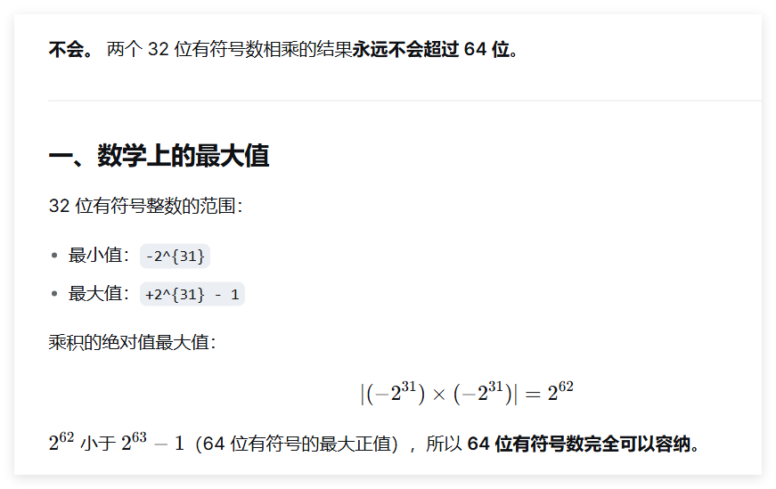

</details>

<details>
<summary><b>mulou rd, rs, rt</b> —— 无符号乘法（检查溢出）</summary>

```asm
multu rs, rt
mfhi  $at
beq   $at, $zero, ok
break $zero
ok:
mflo  rd
```

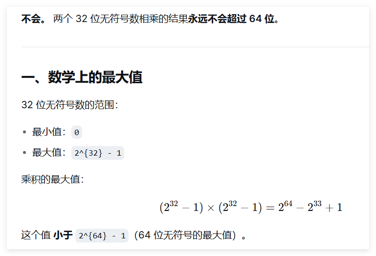

</details>

<details>
<summary><b>neg rd, rs</b> —— 求补（有符号，检查溢出）</summary>

```asm
sub   rd, $zero, rs
```
</details>

<details>
<summary><b>negu rd, rs</b> —— 求补（无符号）</summary>

```asm
subu  rd, $zero, rs
```
</details>

<details>
<summary><b>nop</b> —— 空操作</summary>

```asm
or    $zero, $zero, $zero
```
</details>

<details>
<summary><b>not rd, rs</b> —— 按位取反</summary>

```asm
nor   rd, rs, $zero
```
</details>

<details>
<summary><b>rem rd, rs, rt</b> —— 有符号除法（余数）`remain`</summary>

```asm
bne   rt, $zero, ok
break $zero
ok:
div   rs, rt
mfhi  rd
```
注意老式写法：
```asm
bne rt,$0,8  # 如果 rt != 0，跳过 8 字节即 2 条指令（即直接跳到 mfhi 行）
break $0
div rs,rt
mfhi rd
```
</details>

<details>
<summary><b>rem rt, rs, imm(32)</b> —— 无符号除法（余数）</summary>

```asm
li $at,imm
bne   $at, $zero, ok
break $zero
ok:
div  rs, $at
mfhi  rt
```
</details>

<details>
<summary><b>remu rd, rs, rt</b> —— 无符号除法（余数）</summary>

```asm
bne   rt, $zero, ok
break $zero
ok:
divu  rs, rt
mfhi  rd
```
</details>

<details>
<summary><b>remu rt, rs, imm(32)</b> —— 无符号除法（余数）</summary>

```asm
li $at,imm
bne   $at, $zero, ok
break $zero
ok:
divu  rs, $at
mfhi  rt
```
</details>

<details>
<summary><b>rol rd, rs, rt</b> —— 循环左移（变量移位）`rotate left`</summary>

```asm
subu  $at, $zero, rt # $at = -rt (补码)，其低5位等效于 32 - rt
#主要是因为我们要32-rt,但是这样的话，我们没有在rs上放立即数的方式
不然我们就要用一个寄存器存放固定值32了
srlv  $at, rs, $at
sllv  rd, rs, rt
or    rd, rd, $at
```

- **一个十进制数取负数，在二进制补码上的表现就是按位取反再+1**
- 32位-- (11111····11111)
- 在对应位，用1减去该二进制位，等效于该位取反(按位取反的数学本质)
- 所以想要得到【32减去**rt的低五位**】(32-(11111))  所代表的(十进制)值，用32减去低五位，即对低五位按位取反，即对整体按位取反，即取负数(反正会截断)
   


</details>

<details>
<summary><b>rol rd, rs, sa</b> —— 循环左移（固定移位）</summary>

```asm
srl   $at, rs, 32-sa
sll   rd, rs, sa
or    rd, rd, $at
```
</details>

<details>
<summary><b>ror rd, rs, rt</b> —— 循环右移（变量移位）`rotate right`</summary>

```asm
subu  $at, $zero, rt
sllv  $at, rs, $at
srlv  rd, rs, rt
or    rd, rd, $at
```
</details>

<details>
<summary><b>ror rd, rs, sa</b> —— 循环右移（固定移位）</summary>

```asm
sll   $at, rs, 32-sa
srl   rd, rs, sa
or    rd, rd, $at
```
</details>

<details>
<summary><b>seq rd, rs, rt</b> —— 相等则置 1`set if equal`</summary>

```asm
beq   rt, rs, yes
ori   rd, $zero, 0
beq   $zero, $zero, skip
yes:
ori   rd, $zero, 1
skip:
```
</details>

<details>
<summary><b>sge rd, rs, rt</b> —— 大于等于则置 1（有符号）`set if greater or equal`</summary>

```asm
bne   rt, rs, yes
ori   rd, $zero, 1
beq   $zero, $zero, skip
yes:
slt   rd, rt, rs
skip:
```

PS:一种优化思路:
```mips
slt  $at, rs, rt        # $at = 1 if rs < rt
xori rd, $at, 1         # 取反：1→0, 0→1
```
- 本质就是slt+取反操作


</details>

<details>
<summary><b>sgeu rd, rs, rt</b> —— 大于等于则置 1（无符号）</summary>

```asm
bne   rt, rs, yes
ori   rd, $zero, 1
beq   $zero, $zero, skip
yes:
sltu  rd, rt, rs
skip:
```
</details>

<details>
<summary><b>sgt rd, rs, rt</b> —— 大于则置 1（有符号）`set if greater than`</summary>

```asm
slt   rd, rt, rs
```
</details>

<details>
<summary><b>sgtu rd, rs, rt</b> —— 大于则置 1（无符号）</summary>

```asm
sltu  rd, rt, rs
```
</details>

<details>
<summary><b>sle rd, rs, rt</b> —— 小于等于则置 1（有符号）`set if less or equal`</summary>

```asm
bne   rt, rs, yes
ori   rd, $zero, 1
beq   $zero, $zero, skip
yes:
slt   rd, rs, rt
skip:
```
</details>

<details>
<summary><b>sleu rd, rs, rt</b> —— 小于等于则置 1（无符号）</summary>

```asm
bne   rt, rs, yes
ori   rd, $zero, 1
beq   $zero, $zero, skip
yes:
sltu  rd, rs, rt
skip:
```
</details>

<details>
<summary><b>sne rd, rs, rt</b> —— 不等则置 1`set if not equal`</summary>

```asm
beq   rt, rs, yes
ori   rd, $zero, 1
beq   $zero, $zero, skip
yes:
ori   rd, $zero, 0
skip:
```
</details>

# MIPS 通用寄存器表（32 个）
| 编号 | 助记符 | 用途说明 | 英文全称 / 翻译 |
|:---:|:---|:---|:---|
| 0 | `$zero` | 恒为 0，写入无效 | **zero** constant |
| 1 | `$at` | 汇编器临时使用（展开伪指令） | **a**ssembler **t**emporary |
| 2-3 | `$v0` ~ `$v1` | 函数返回值 | **v**alue returned |
| 4-7 | `$a0` ~ `$a3` | 函数实参（前 4 个） | **a**rguments |
| 8-15 | `$t0` ~ `$t7` | 临时寄存器，调用者保存 | **t**emporary |
| 16-23 | `$s0` ~ `$s7` | 保存寄存器，被调用者保存 | **s**aved |
| 24-25 | `$t8` ~ `$t9` | 临时寄存器（同 t0~t7） | **t**emporary |
| 26-27 | `$k0` ~ `$k1` | 保留给 OS 内核，异常处理用 | **k**ernel reserved |
| 28 | `$gp` | 全局数据区指针 | **g**lobal **p**ointer |
| 29 | `$sp` | 栈顶指针 | **s**tack **p**ointer |
| 30 | `$fp` / `$s8` | 帧指针（或作为第 9 个保存寄存器） | **f**rame **p**ointer / **s**aved |
| 31 | `$ra` | 函数返回地址 | **r**eturn **a**ddress |

### **PS:将寄存器堆视作一个数组R[32]，rd,rs,rt是值为0-31之间的下标**

# 特殊寄存器（非通用寄存器）
| 名称 | 用途说明 | 翻译 |
|:---|:---|:---|
| **PC** | 程序计数器，存放下一条指令地址 | **P**rogram **C**ounter |
| **HI** | 乘法结果高 32 位 / 除法余数 | **HI**gh word |
| **LO** | 乘法结果低 32 位 / 除法商 | **LO**w word |
| **IR** | 指令寄存器，存放当前执行的机器码 | **I**nstruction **R**egister |

**HI 与 LO 除了记录乘除法结果以及用特定指令传输到寄存器堆以外，其他指令都不能使用，因而称为专用寄存器**

*PC中存放的是将要取出执行的指令所在内存单元的地址。PC的初始值由操作系统指定，即为将要执行程序的**第一条指令**所存放的内存单元的地址。*程序计数器中的地址通过总线传送到指令缓存的地址输入端。当一条指令已从内存取出并存放到指令寄存器(IR,$Instruction\ Register$)中后，PC的增量为4，CPU便有了下一条指令所在内存位置的地址，以便CPU顺序提取下一条指令。


# MIPS 架构与指令集问答

## 第一部分：概述与 MIPS 架构

<details>
<summary><b>Q1：和高级语言相比，低级语言有何优缺点？</b></summary>

- **优点**：
  - 执行效率高，能够直接访问系统接口。
  - 程序体积小，适合嵌入式或对资源敏感的环境。
  - 能够实现高级语言无法做到的底层操作（如上下文切换、中断处理）。
- **缺点**：
  - 可读性差，开发效率低，维护困难。
  - 与硬件平台强相关，移植性差。
  - 容易出错且调试困难。
</details>

<details>
<summary><b>Q2：为何需要学习汇编语言？</b></summary>

- 对于计算机技术的初学者，编写汇编语言程序可以深入了解计算机的程序执行过程，理解计算机底层工作原理，有助于对高级语言程序机制的理解。
- 直观感受CPU的结构和指令执行，有助于后期硬件相关课程的学习。
- 帮助调试和优化高级语言程序（如分析 C 语言反汇编）。
- 编写操作系统内核、驱动程序、嵌入式系统的必需技能。
- 应对安全领域中的逆向工程和漏洞分析需求。
</details>

<details>
<summary><b>Q3：汇编源程序和汇编程序分别是什么？</b></summary>

- **汇编源程序**：使用汇编语言编写的程序。
- **汇编程序**：将汇编源程序翻译成机器码的工具软件（如 MARS, SPIM, GNU `as`），也叫**汇编器/解释器**。
</details>

<details>
<summary><b>Q4：根据机器指令体系，CPU 分为哪两大类？典型代表有哪些？</b></summary>

- **CISC**（complex instruction set computer复杂指令集计算机）：指令数量多、长度可变、单条指令功能强。  
  代表：x86（Intel、AMD）。
- **RISC**（reduced instruction set computer精简指令集计算机）：指令数量少、长度固定、大部分指令单周期执行。  
  代表：MIPS、ARM、RISC-V。
</details>

<details>
<summary><b>架构 Q1：学习 MIPS 架构需要了解哪四个主要方面的内容？</b></summary>

1. **各类寄存器**：通用寄存器、专用寄存器(HI/LO)、特殊寄存器（PC/IR）。
2. **指令集与指令格式**：R/I/J 三种格式的字段划分与功能。
3. **内存寻址模式**：立即数、寄存器、基址偏移、伪直接、相对寻址。
4. **数据类型与存储格式**：字节、半字、字，以及大/小端对齐。
</details>

<details>
<summary><b>架构 Q2：数据类型和高级语言中的数据类型有何不同？</b></summary>

- 高级语言数据类型（如 `int`, `char`, `float`）带有**语义和检查**（如不能把 `float` 直接当指针用）。
- 汇编语言的数据类型只是**二进制位串的长度约定**（如 8 位、16 位、32 位），硬件不检查类型是否匹配，只按指令操作。
</details>

<details>
<summary><b>架构 Q3：MIPS 架构中通用寄存器有多少个？一个寄存器多少位？</b></summary>

- **32 个**通用寄存器（`$0` ~ `$31`）。
- 每个寄存器 **32 位**（4 字节）。
</details>

<details>
<summary><b>架构 Q4：用于传递函数输入实参的寄存器是哪些？</b></summary>

`$a0` ~ `$a3`（编号 4~7）。超过 4 个参数时，其余参数通过堆栈传递。
</details>

<details>
<summary><b>架构 Q5：用于存放函数返回值的寄存器是哪些？</b></summary>

`$v0` ~ `$v1`（编号 2~3）。通常 32 位返回值仅用 `$v0`，64 位返回值使用 `$v0` 和 `$v1` 共同存放。
</details>

<details>
<summary><b>架构 Q6：Main 调用 A，Main 中 t0 存有重要值，A 会修改 t0，如何保证 t0 不被改变？</b></summary>

`$t0` ~ `$t9` 是**临时寄存器**，按照 MIPS 调用约定，**被调用函数（A）不需要保存它们**。  
因此 **Main 必须在调用 A 之前自己把 `$t0` 保存到栈中**，A 返回后再从栈中恢复。

```asm
addiu $sp, $sp, -4
sw    $t0, 0($sp)      # 保存 t0
jal   A
lw    $t0, 0($sp)      # 恢复 t0
addiu $sp, $sp, 4
```


可以理解为函数传形参、引用等
</details>

<details>
<summary><b>架构 Q7：若 Main 使用 s0 存放重要值，该如何做？</b></summary>

`$s0` ~ `$s7` 是**保存寄存器**，调用约定规定**被调用函数（A）必须保证这些寄存器在返回时与调用前一致**。  
因此 **Main 无需额外保存**，A 若需要使用 `$s0`，会在自己的代码开头保存并在返回前恢复。


Main 侧无需任何操作，直接调用即可。
</details>

<details>
<summary><b>架构 Q8：保留给 OS 使用的寄存器是哪些？保留给汇编程序使用的寄存器是？</b></summary>

- **OS 保留**：`$k0`, `$k1`（编号 26~27），用于异常处理。
- **汇编程序保留**：`$at`（编号 1），汇编器在展开伪指令时临时使用。
- 在笔记中，宏指令展开大量使用 `$at`。
</details>

<details>
<summary><b>架构 Q9：用于存放函数返回地址的寄存器是哪个？存放栈顶地址的寄存器是哪个？</b></summary>

- 返回地址：`$ra`（编号 31）。
- 栈顶地址：`$sp`（编号 29）。
</details>

<details>
<summary><b>架构 Q10：HI 寄存器用于存放什么数据？LO 寄存器用于存放什么数据？</b></summary>

- **HI**：存放乘法结果的高 32 位，或除法的余数。
- **LO**：存放乘法结果的低 32 位，或除法的商。
</details>

<details>
<summary><b>架构 Q11：简述汇编源程序执行过程？</b></summary>

1. **编辑**：编写 `.asm` 源文件。
2. **汇编**：汇编器将助记符翻译成机器码，生成目标文件（`.o` 或 `.obj`）。
3. **链接**：链接器将多个目标文件和库合并，解析地址，生成可执行文件。
4. **加载**：操作系统将可执行文件载入内存。
5. **执行**：CPU 从 `_start` 或 `main` 入口开始逐条取指、译码、执行。

>汇编语言程序员在使用文本编辑器编写好汇编语言程序后，汇编语言程序中的助记符需要通过该一个名为汇编程序（或称汇编器）的使用程序（或称系统软件），转换为机器语言程序（或称机器语言代码）。机器语言程序以文件形式存储在计算机磁盘上。当需要执行这个程序时，另一个称为链接装载器的实用程序，负责装在和链接所有必须要使用的机器语言模块进入到内存，使得机器语言程序中的每一条指令按顺序存储在内存中。

</details>

<details>
<summary><b>架构 Q12：程序计数器寄存器 PC 存放什么值？为何一次递增 4？何时递增？</b></summary>

- **存放**：当前正在执行指令的地址（MIPS 中通常指向下一条要取的指令）。
- **递增 4**：因为 MIPS 指令固定 32 位（4 字节），地址按字节编址，所以每条指令地址间隔为 4。
- **递增时机**：在取指阶段（IF）完成后，PC 自动加 4 指向下一条顺序指令。
</details>

<details>
<summary><b>架构 Q13：画一个 64KB 的存储器。</b></summary>

- 内存储器可以看作是一个非常长的线性“数组”，这个“数组”大体上来说一部分用于存放数据，另一部分用于存放指令代码。  
- 有效的地址是指向在这个“数组”中存放的数据或指令的某个数组元素的位置，这个“数组”存放数据的部分被操作系统作为所谓的“数据段”来管理。程序计数器中(PC,或称**指令指针**)的内容实质也是指向这个“数组”元素的指针，但它指向的是这个“数组”存放指令代码的部分，这一部分被操作系统作为所谓的“文本段（$Text segment$或代码段）”来管理。  
- 实际上操作系统还在内存中分配了一个称为“栈段”的段，占用了存放数据部分存储空间的一部分。
- 32位MIPS处理器的地址总线的宽度为32位二进制位，存储器寻址空间为$2^32$，即4G个内存单元，地址范围为0~4294967295或0x0~0xFFFFFFFF。  
- 其地址空间的布局，即,使用划分如图所示。地址空间0x0到0x003FFFFF的部分保留给操作系统使用，0x00400000到0x0FFFFFFF为文本段，0x10000000到0x7FFFFFFF为数据段和堆栈段。数据段由代码控制，一般按地址递增连续分配，即由下向上使用；栈则向下增长，即入栈的数据越多，栈顶的地址越小。这样做的好处是可以尽可能的利用地址空间存放数据。
 
 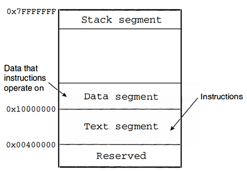


而对于**字节在字中的存储顺序**
>1word-4byte-32bit  
>本书使用的模拟器是建立在Intel系统上的，Intel系统属于小尾端阵营。因此本书示例在处理字数据的存储时，都使用低字节对应低地址、高字节对应高地址的方式。  
>例：将字0x12345678存储在地址0x10000000的存储器中  

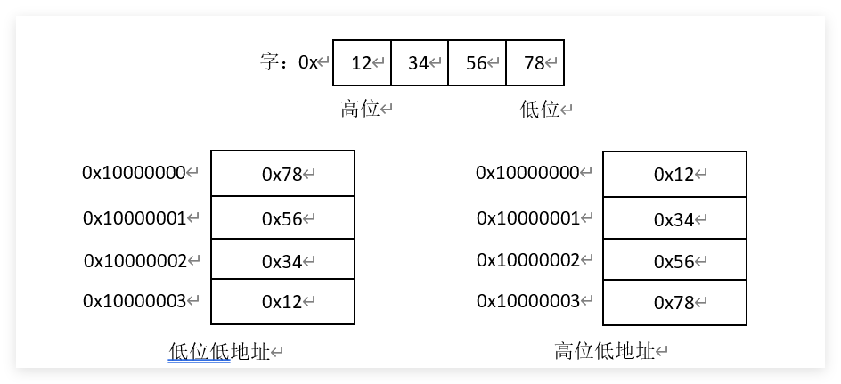


64KB = 2^16 字节，地址范围从 `0x0000` 到 `0xFFFF`。  
通常分为：
- **Text 段**：存放代码（低地址端）。
- **Data 段**：存放已初始化全局变量。
- **BSS 段**：存放未初始化全局变量。
- **Heap**：动态分配区（向上增长）。
- **Stack**：栈区（向下增长，从高地址开始）。

简易图示（按字节编址）：
```
0x0000 ┌────────────┐
       │   Text     │ 代码段
0x???? ├────────────┤
       │   Data     │ 已初始化数据
0x???? ├────────────┤
       │   BSS      │ 未初始化数据
0x???? ├────────────┤
       │   Heap     │ → 向高地址增长
       │   ...      │
       │   Stack    │ ← 向低地址增长
0xFFFF └────────────┘

#本图一般反过来理解
```
</details>

<details>
<summary><b>架构 Q14：现有存储器，对齐要求下，取出地址为 0003 的一个字节、0002 的一个半字、0001 的一个字。</b></summary>

- **取字节 `0x0003`**：对齐无要求，可直接读取该地址 1 字节。
- **取半字 `0x0002`**：半字对齐要求地址为 2 的倍数，`0x0002` 符合，可读取 `0x0002` 和 `0x0003` 两个字节组成半字。
- **取字 `0x0001`**：字对齐要求地址为 4 的倍数，`0x0001` **不符合**，将引发**地址错误异常**。
</details>

<details>
<summary><b>架构 Q15：内存分为几个部分？</b></summary>

典型 MIPS 进程内存布局（从低地址到高地址）：
1. **Text**（代码段）
2. **Data**（已初始化数据段）
3. **BSS**（未初始化数据段）
4. **Heap**（堆，动态分配，向上增长）
5. **Stack**（栈，局部变量，向下增长）
6. **Kernel Space**（内核空间，用户态不可访问）
</details>

<details>
<summary><b>架构 Q16：指令寄存器 IR 存放什么？MIPS 指令有几种格式？</b></summary>

- **IR**：保存最近一条取出的指令(存放当前正在**译码和执行**的机器指令（32 位二进制码）)，在基本32位MIPS架构中，采用32位二进制位固定长度的指令格式。
- **格式种类**：**3 种** —— R 格式、I 格式、J 格式。
</details>

<details>
<summary><b>架构 Q17：R 指令有几段？举一个指令例子。</b></summary>

R 格式共 6 个字段：
| op (6) | rs (5) | rt (5) | rd (5) | sa (5) | funct (6) |
|:---|:---|:---|:---|:---|:---|
例子：`add $t0, $t1, $t2`  
op=`000000`, funct=`100000`。

操作码(opcode)字段占用6位二进制位(31~26)，且这6位全为0.最低的二进制位，即功能(function)字段，不同的编码定义**ALU要执行的具体操作(加减乘除等)**

</details>

<details>
<summary><b>架构 Q18：I 指令有几段？举一个指令例子。</b></summary>

I 格式共 4 个字段：
| op (6) | rs (5) | rt (5) | immediate (16) |
|:---|:---|:---|:---|
例子：`lw $t0, 4($sp)`  
op=`100011`, rs=`$sp`, rt=`$t0`, imm=`0004`。
</details>

<details>
<summary><b>架构 Q19：J 指令有几段？举一个指令例子。</b></summary>

J 格式共 2 个字段：
| op (6) | address (26) |
|:---|:---|
例子：`j label`  
op=`000010`, address 为目标地址的高 26 位（实际地址需左移 2 位后与 PC 高 4 位拼接）。
</details>

<details>
<summary><b>架构 Q20：结合指令动画理解三种格式指令并描述指令执行过程。</b></summary>

以 R 型 `add $t0, $t1, $t2` 为例：
1. **取指IF$(Instruction\ Fetch)$**：PC 所指指令读入 IR，PC+4 -> PC。
2. **译码RD$(Register\ Decode\ /\ Read)$**：解析IR中指令，识别为 R 型，从 `rs`、`rt` 读取 `$t1`、`$t2` 的值。
3. **执行ALU$(Arithmetic\ Logic\ Unit\ Execute)$**：ALU 将两数相加，得到结果。
4. **访存MEM$(Memory\ Access)$**：R 型无访存，结果直通下一阶段。
5. **写回WB$(Write\ Back)$**：结果写入 `rd` 指定的 `$t0`。

I 型和 J 型在地址计算和目标写入上有所区别，但基本五阶段流水线结构相同。

在简化的MIPS架构模型上执行程序，不考虑流水线，以R格式指令为例，可以描述为以下逻辑步骤：
1. 在由程序计数器指定的位置，从内存中提取指令，取出的指令放到指令寄存器中，然后程序计数器中的内容加4；
2. 指令中由两个5位编码的区域中的5位二进制编码，指定寄存器堆中的两个寄存器（即Rs和Rt），作为源操作数寄存器，进而可以获取两个32位源操作数；
3. 两个32位源操作数被分别送到ALU的两个输入端，ALU执行指令中操作码规定的运算操作；
4. 运算结果被存回寄存器堆中由指令中另一个的5位编码区域中的5位二进制编码指定的目的寄存器（即Rd）中。
转到步骤1，以同样的步骤执行下一条指令。


详细查看:[指令执行](#指令执行图)
</details>

---

## 第二部分：寻址方式与指令

<details>
<summary><b>寻址方式 Q1：操作数寻址方式有哪几种？分别是什么含义？</b></summary>

在机器指令中，由两类寻址:
- 操作数寻址(确定操作数所在的地址)
  - 寄存器寻址（在寄存器中寻找数据）、立即数寻址（在指令内部寻找数据）、存储单元寻址（在存储器中寻找数据）
- 目标地址寻址(确定跳转指令目标所在的地址)
  - 直接寻址(也称伪直接寻址)、寄存器间接寻址、相对寻址


MIPS 支持 5 种操作数寻址方式：
**针对操作数的寻址**
1. **立即数寻址$(immediate\ addressing)$**：源操作数之一为立即数，目的操作数为寄存器。(例 `addi $t1,$t2,5`)
2. **寄存器寻址$(register\ addressing)$**：操作数在寄存器中,在指令中指定寄存器名。(例`add $t0,$t1,$t3`)

在寄存器堆中，每个寄存器的编号就是其地址，在指令机器码中以5个二进制位表示

**存储单元寻址**
3. **基址寻址**：操作数在内存中，地址 = 寄存器 + 16 位偏移量（`lw/sw`）。
>基地址(存放在某个【通用】寄存器中)+位移量(在指令中以16bits补码数存放)$(base\ addressing+displacement)$


**针对目标地址的寻址**
*分支转移：*
>实现高级语言的分支、循环以及函数调用与返回等语言成分必不可少的操作。  
实质时改变了程序顺序执行指令的行为（PC增量定值的行为），通过修改PC值实现分支转移功能。
4. **伪直接寻址$(Pseudodirect\ addressing)$**：用于 `j`（无条件转移指令）/`jal`（无条件转移指令并链接），26 位地址左移 2 位与 PC 高 4 位拼接。


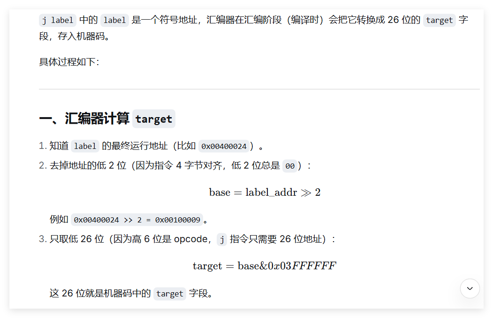

**j 的跳转范围是 256 MB，高 4 位来自当前 PC，不能自由改变，所以只能在当前 PC 所在的 256 MB 区域内跳转。**

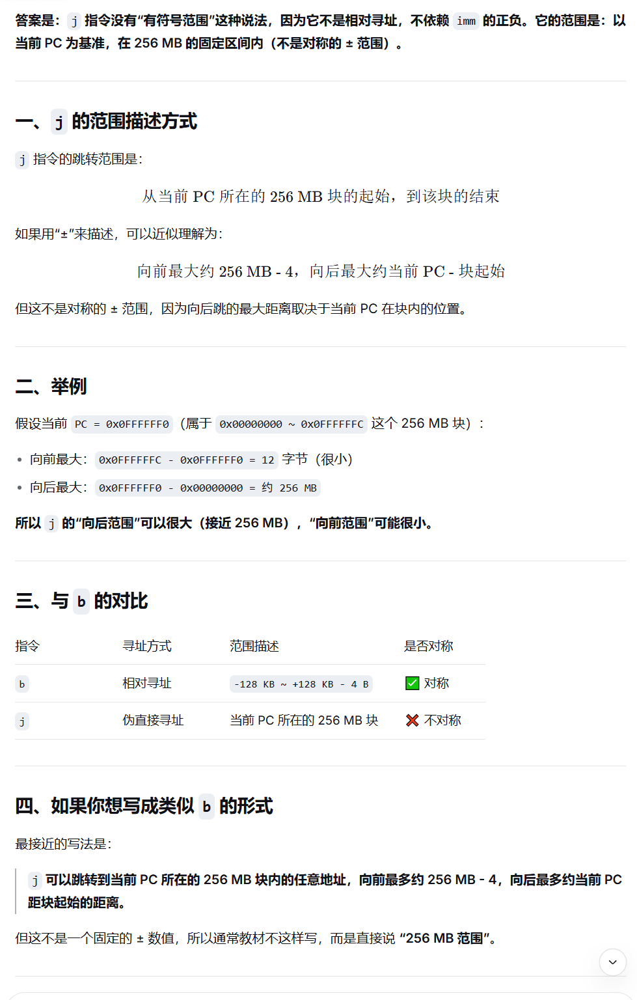

### "256MB块"
**不是硬件专门划分的，而是 j 指令的地址计算方式天然导致了这种“块”的存在(一种描述性术语，并非硬件结构)**
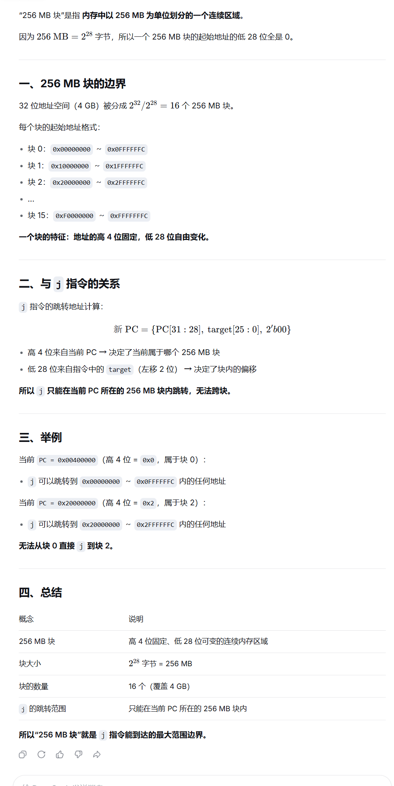

- 故：在当前 PC 所在的 256 MB 块内，j 指令可以跳转到块内的任意地址。
- 但有一个前提：目标地址必须是 4 字节对齐（因为指令地址低 2 位为 0），j 指令自动保证了这一点（末尾补 00）。


5. **寄存器间接寻址**


**为什么 jr 不是直接寻址？**
- 因为：
- 直接寻址：地址写在指令里，不需要经过寄存器
- jr：地址先要加载到寄存器，再通过 jr 跳转

1. **(PC)相对寻址方式**：用于分支指令，目标地址 = PC + (imm << 2)。`


**实际上是I指令格式，imm在静态编译时，通过公式imm=(y-x-4)>>2（右移2位是因为指令地址都是4的倍数，插值也是，地两位必然是0，不必记录，即求得:当前地址与label中间隔imm条指令）算得。然后在动态运行时在IR中填入这个imm**    
**PS：之所以要减去4，是因为跳转指令执行的第一阶段($IF$)已将PC加了4**  
**I指令各式中Imm位数有限，不记录低2位就可以多记录前面2位，可以增加相对地址表达的空间，由$2^16$增加到$2^18$,即扩大了可以相对转移到地址范围。**  
*即:不省略低 2 位：能表示 2^16 种不同的**字节偏移**；省略低 2 位：能表示 2^16 种不同的**指令条数**，对应 2^16 × 4 = 2^18 种**字节偏移***  
- `imm` 是 16 位有符号整数，范围 `-32768` ~ `+32767`
- 每条指令 4 字节，字节偏移范围：`-131072` ~ `+131068` 字节
- 换算成 KB：`-128 KB` ~ `+128 KB - 4 B`
- 无符号总跨度：`2^{18}` 字节 = `256 KB`
- PS:$2^8==2<<7==1<<8$

如果跳转范围过大，超出指令表达范围，则编译程序会给出错误，程序员需要用其他方式完成跳转

| 项目 | 值 |
| :--- | :--- |
| `imm` 位数 | 16 位有符号 |
| `imm` 最小值（二进制） | `1000 0000 0000 0000` = `-32768` |
| `imm` 最大值（二进制） | `0111 1111 1111 1111` = `+32767` |
| 字节偏移最小值 | `-32768 × 4 = -131072` 字节 |
| 字节偏移最大值 | `+32767 × 4 = +131068` 字节 |
| 换算成 KB | `-128 KB` ~ `+128 KB - 4 B` |

| 寻址方式 | 操作数位置 | 寻址过程 | 指令格式 | MIPS 典型指令 | 通俗类比 | 为何叫这个名字 |
|:---|:---|:---|:---:|:---|:---|:---|
| **立即数寻址** | 指令内部 | 直接从指令码中提取常数 | I 型 | `addi $t0, $t1, 5` | 口袋里直接摸出 5 块钱 | 数据**立即**可得，就在指令里 |
| **寄存器寻址** | 寄存器 | 直接读寄存器文件 | R 型 | `add $t0, $t1, $t2` | 从抽屉里拿东西 | 数据在**寄存器**里，选号即用 |
| **基址寻址**<br>(基址+偏移) | 内存 | 地址 = 寄存器值 + 偏移量 | I 型 | `lw $t0, 100($t1)` | 以书架第一层为基准，往右数 10 本书 | 寄存器提供**基地址**，偏移量定位具体位置 |
| **寄存器间接寻址** | 内存 | 地址 = 寄存器值 | R 型<br>(跳转类) | `jr $ra`<br>`jalr $t0` | 纸条上写着门牌号，按号去找 | 不直接给数据，给的是**存放数据的地址**（间接） |
| **伪直接寻址** | 指令附近<br>(256MB 内) | 地址 = PC[31:28] \|\| imm<<2 | J 型 | `j label`<br>`jal label` | 说“大厦 12 楼”，默认还在本栋楼 | 看起来像直接给 26 位地址，实则要靠 PC 高 4 位拼凑（**伪**） |
| **相对寻址** | 指令附近 | 地址 = PC + imm<<2 | I 型 | `beq $t0, $t1, label` | “往前走 3 步”而不是“去 403 房间” | 目标是**相对于当前 PC** 的位移量 |

## 寻址方式与寻址范围总结

### 一、操作数寻址（确定操作数所在的地址）

| 寻址方式 | 说明 | 最大寻址范围 |
| :--- | :--- | :--- |
| 寄存器寻址 | 操作数在寄存器中 | 单个寄存器 32 位，无范围概念 |
| 立即数寻址 | 操作数在指令内部 | 16 位立即数，范围 `-32768` ~ `+32767`（有符号）或 `0` ~ `65535`（无符号） |
| 存储单元寻址（基址寻址） | 地址 = 基址寄存器 + 符号扩展的 16 位偏移量 | 偏移量范围 `-32768` ~ `+32767` 字节，实际寻址范围取决于基址寄存器 |

---

### 二、目标地址寻址（确定跳转指令目标所在的地址）

| 寻址方式 | 说明 | 最大寻址范围 |
| :--- | :--- | :--- |
| 直接寻址（伪直接寻址） | `j` / `jal`，地址 = `{PC[31:28], target, 00}` | **256 MB**（当前 PC 所在的 256 MB 块内） |
| 寄存器间接寻址 | `jr` / `jalr`，地址 = 寄存器的值 | **4 GB**（整个 32 位地址空间） |
| 相对寻址 | `beq` / `bne` 等分支指令，地址 = `PC + (imm << 2)` | **±128 KB**（约 `-131072` ~ `+131068` 字节） |

---

### 三、补充说明

- **直接寻址（伪直接寻址）**：虽然名称中有“直接”，但实际并非完整 32 位直接地址，需与 PC 高位拼接，故范围限制在 256 MB。
- **寄存器间接寻址**：可跳转到任意 32 位地址，无范围限制。
- **相对寻址**：`imm` 为 16 位有符号数，乘以 4 后得到字节偏移范围约 ±128 KB。


</details>

<details>
<summary><b>寻址方式 Q2：采用立即数进行操作数寻址的指令是什么格式？采用寄存器进行操作数寻址的指令是什么格式？</b></summary>

- **立即数寻址**：I 格式（如 `addi`, `ori`, `lui`）。
- **寄存器寻址**：R 格式（如 `add`, `sub`, `and`）和部分 I 格式（如 `beq` 的源操作数）。
</details>

<details>
<summary><b>寻址方式 Q3：采用存储单元进行操作数寻址的指令是什么格式？什么写法？可以直接访问内存的指令有哪些？</b></summary>

- **格式**：I 格式。
- **写法**：`offset(rs)`，如 `lw $t0, 8($sp)`。
- **直接访存指令**：`lb`, `lbu`, `lh`, `lhu`, `lw`, `sb`, `sh`, `sw`。
</details>

<details>
<summary><b>寻址方式 Q4：为何需要目标地址寻址？</b></summary>

用于改变程序控制流（跳转和分支）。MIPS 中目标地址寻址分为：
- **伪直接寻址**（`j`, `jal`）：快速跳转到 256MB 范围内的绝对地址。
- **寄存器间接寻址**
- **相对寻址**（`beq`, `bne` 等）：相对于当前 PC 的偏移跳转，适合短距离条件分支。
</details>

<details>
<summary><b>寻址方式 Q5：寄存器间接寻址为何称为间接？采用寄存器间接寻址的指令是什么格式？</b></summary>

- **间接含义**：指令中给出的寄存器**不包含操作数本身，而包含操作数的地址**。
- **格式**：R 格式。  
  MIPS 中通过 `jr $ra` 或 `jalr $t0` 实现寄存器间接跳转，即 PC ← `rs`。
</details>

<details>
<summary><b>寻址方式 Q6：伪直接寻址为何称为伪？采用伪直接寻址的指令是什么格式？</b></summary>

- **称为“伪”**：因为指令中的 26 位立即数并非完整的目标地址，必须**与 PC 高 4 位拼接**才能得到真正的 32 位地址，并非“直接”给出全地址。
- **格式**：J 格式（`j`, `jal`）。
</details>

<details>
<summary><b>寻址方式 Q7：相对寻址为何称为相对？采用相对寻址的指令是什么格式？如何计算 Imm？</b></summary>

- **称为“相对”**：因为目标地址是**相对于当前 PC 的值**，而不是绝对地址。
- **格式**：I 格式（所有条件分支指令）。
- **Imm 计算**：  
  机器码中的 `imm` = (目标地址 - (当前 PC + 4)) >> 2。  
  汇编器会自动计算，程序员只需写 `label`。
</details>

<details>
<summary><b>数据传送类指令 Q8：从内存取数据的指令有哪些？它们是什么种类的指令？</b></summary>

- 指令：`lb`, `lbu`, `lh`, `lhu`, `lw`
- 种类：I 格式。
</details>

<details>
<summary><b>数据传送类指令 Q9：带 u 和不带 u 指令的区别是什么？为何没有 lwu？</b></summary>

- **区别**：加载的数据宽度小于 32 位时，**不带 u** 进行**符号扩展**至 32 位；**带 u** 进行**0扩展**。
- **没有 `lwu`**：因为 `lw` 本身就是加载 32 位字，**已经填满目标寄存器**，无需扩展。
</details>

<details>
<summary><b>数据传送类指令 Q10：把寄存器中数据存放到 Mem 的指令有哪些？它们是什么种类的指令？</b></summary>

- 指令：`sb`, `sh`, `sw`
- 种类：I 格式。
</details>

<details>
<summary><b>数据传送类指令 Q11：把 HI 寄存器值传送到通用寄存器的指令是什么？该指令是什么格式？把通用寄存器值传送到 LO 寄存器的指令是什么？</b></summary>

- **HI → GPR**：`mfhi rd`，R 格式。
- **GPR → LO**：`mtlo rs`，R 格式。
</details>

<details>
<summary><b>数据传送类指令 Q12：什么是宏指令？</b></summary>

宏指令（伪指令）是汇编器提供的便利助记符，**在硬件中不存在对应的机器码**。汇编时会被展开为一条或多条真实的机器指令。例如 `li $t0, 100` → `addiu $t0, $zero, 100`。
</details>

<details>
<summary><b>数据传送类指令 Q13：如何把 32 位 Imm 存放到 Mem 中？</b></summary>

无法用单条指令直接将 32 位立即数写入内存，需要分两步：
1. 将 32 位立即数加载到寄存器（`lui` + `ori`）。
2. 用 `sw` 将寄存器值存入内存。

```asm
lui $at, 0x1234
ori $at, $at, 0x5678   # $at = 0x12345678
sw  $at, 0($t0)        # 存入 t0 指向的内存
```
</details>

<details>
<summary><b>数据传送类指令 Q14：如何把 16 位立即数 Imm 存放到 Mem 中？</b></summary>

16 位立即数可用 `ori` 或 `addiu` 直接加载到寄存器，再 `sw` 存出：

```asm
ori $at, $zero, 0x1234
sw  $at, 0($t0)
```
</details>

<details>
<summary><b>数据传送类指令 Q15：写出宏指令 li $10, 0xfffffff 的实现代码。</b></summary>

`0xfffffff` 实际是 `0x0fffffff`（28 位有效），需要 `lui` + `ori`：

```asm
lui $t0, 0x0fff    # 高 16 位：0x0fff
ori $t0, $t0, 0xffff   # 低 16 位：0xffff
```
最终 `$t0` = `0x0fffffff`。
</details>

<details>
<summary><b>数据传送类指令 Q16：通用寄存器之间传送数据的宏指令是什么？其如何实现？</b></summary>

- 宏指令：`move rd, rs`
- 实现：`addu rd, $zero, rs`  
  （将 `rs` 加 0 的结果放入 `rd`）
</details>

<details>
<summary><b>算数运算类指令 Q17：加法指令包括哪些？分别是什么类型的指令？带 u 和不带 u 有何区别？</b></summary>

- **R 型**：`add`, `addu`
- **I 型**：`addi`, `addiu`
- **区别**：
  - 带 `u`：不检测补码溢出，结果直接截断 32 位。
  - 不带 `u`：可能引发溢出异常（取决于具体实现）。
</details>

<details>
<summary><b>算数运算类指令 Q18：减法指令包括哪些？分别是什么类型的指令？</b></summary>

- `sub`：R 型，检测溢出。
- `subu`：R 型，不检测溢出。
- **没有 I 型减法**。
</details>

<details>
<summary><b>算数运算类指令 Q19：减法指令为何不像加法指令那样有带 XXi 型指令？如何实现减去一个立即数？</b></summary>

- **原因**：减法可以通过**加上一个负数立即数**实现，没必要单独设计 `subi` 指令，节省了指令编码空间。
- **实现**：`addiu rt, rs, -imm`  
  因为立即数在 `addiu` 中会【符号扩展】，负数可以正确参与运算。
</details>

<details>
<summary><b>算数运算类指令 Q20：与减法指令相关的宏指令有哪些？</b></summary>

- `neg rd, rs`（求补）：展开为 `sub rd, $zero, rs`。
- `negu rd, rs`（无符号求补）：展开为 `subu rd, $zero, rs`。
</details>

<details>
<summary><b>算数运算类指令 Q21：求补宏指令能否对 -2^31 求补？</b></summary>

**不能**。  
`-2^31` 的补码是 `0x80000000`，其相反数 `2^31` 在 32 位有符号整数中**溢出**（最大正值是 `2^31-1`）。因此对 `0x80000000` 求补结果仍是自身，且带溢出检测的 `neg` 会触发异常。
</details>

<details>
<summary><b>算数运算类指令 Q22：乘/除法指令包括哪些？是什么类型的指令？</b></summary>

- 乘法：`mult` (有符号), `multu` (无符号) —— R 格式。
- 除法：`div` (有符号), `divu` (无符号) —— R 格式。
</details>

<details>
<summary><b>算数运算类指令 Q23：与乘法指令相关的宏指令有哪些？</b></summary>

- `mul rd, rs, rt`：`mult` + `mflo`。
- `mulo rd, rs, rt`：带溢出检查的乘法，若 `HI` ≠ `rd` 的【符号扩展】则溢出。
- `mulou rd, rs, rt`：无符号乘法溢出检查，若 `HI` ≠ 0 则溢出。
</details>

<details>
<summary><b>算数运算类指令 Q24：与除法指令相关的宏指令有哪些？</b></summary>

- `div rd, rs, rt`：`div rs, rt` + `mflo rd`。
- `divu rd, rs, rt`：`divu rs, rt` + `mflo rd`。
- `rem rd, rs, rt`：`div` + `mfhi`。
- `remu rd, rs, rt`：`divu` + `mfhi`。
</details>

<details>
<summary><b>逻辑运算类指令 Q25：与运算指令包括哪些？是什么类型的指令？</b></summary>

- `and`：R 型。
- `andi`：I 型（立即数 0扩展）。
</details>

<details>
<summary><b>逻辑运算类指令 Q26：或运算指令包括哪些？是什么类型的指令？</b></summary>

- `or`：R 型。
- `ori`：I 型（立即数 0扩展）。
</details>

<details>
<summary><b>逻辑运算类指令 Q27：异或运算指令包括哪些？是什么类型的指令？</b></summary>

- `xor`：R 型。
- `xori`：I 型（立即数 0扩展）。
</details>

<details>
<summary><b>逻辑运算类指令 Q28：或非指令含义是什么？非运算如何实现？</b></summary>

- **或非 `nor`**：对 `rs` 和 `rt` 按位或后取反，R 格式。
- **非运算**：MIPS 无原生 `not`，使用宏指令 `not rd, rs` 展开为 `nor rd, rs, $zero`。
</details>

<details>
<summary><b>移位指令 Q29：逻辑左移指令包括哪些？是什么类型的指令？</b></summary>

- `sll`：移位量固定（`sa` 字段），R 格式。
- `sllv`：移位量可变（取自 `rs` 低 5 位），R 格式。
</details>

<details>
<summary><b>移位指令 Q30：逻辑右移指令包括哪些？是什么类型的指令？</b></summary>

- `srl`：固定移位量，R 格式。
- `srlv`：可变移位量，R 格式。
</details>

<details>
<summary><b>移位指令 Q31：算术右移指令包括哪些？是什么类型的指令？</b></summary>

- `sra`：固定移位量，R 格式。
- `srav`：可变移位量，R 格式。
</details>

<details>
<summary><b>移位指令 Q32：为何没有算术左移指令？如何实现算术左移？</b></summary>

- **原因**：**逻辑左移和算术左移效果完全一致**（最低位补 0，符号位自然移出），因此无需单独设计。
- **实现**：直接用 `sll` 或 `sllv` 即可。
</details>

<details>
<summary><b>移位指令 Q33：循环左移宏指令如何实现？</b></summary>

`rol rd, rs, rt`（`rt` 指定移位数）：
```asm
subu $at, $zero, rt   # $at = -rt (补码)，其低5位等效于 32 - rt
srlv $at, rs, $at     # 取出将被移出的高位部分并右移对齐
sllv rd, rs, rt       # 左移剩余部分
or   rd, rd, $at      # 合并
```

>MIPS 进行可变移位（如 srlv）时，只读取 rs 寄存器的低 5 位（即 rt mod 32）。  
假设我们要计算 32 - rt:  
在 32 位补码运算中，-rt 的二进制低 5 位，恰好等于 (32 - rt) mod 32 的低 5 位。(只截取低5位，且无符号)

</details>

<details>
<summary><b>移位指令 Q34：循环右移宏指令如何实现？</b></summary>

`ror rd, rs, rt`：
```asm
subu $at, $zero, rt   # $at = 32 - rt
sllv $at, rs, $at     # 取出将被移出的低位部分并左移对齐
srlv rd, rs, rt       # 右移剩余部分
or   rd, rd, $at
```
</details>

<details>
<summary><b>条件设置指令 Q35：条件设置指令包括哪些？是什么类型的指令？</b></summary>

- **R 型**：`slt`, `sltu`
- **I 型**：`slti`, `sltiu`
</details>

<details>
<summary><b>条件设置指令 Q36：条件设置宏指令有哪些？</b></summary>

- `seq`, `sne`, `sgt`, `sgtu`, `sge`, `sgeu`, `sle`, `sleu`
- 它们都基于 `slt`/`sltu` 及分支指令组合实现。
</details>

<details>
<summary><b>跳转指令 Q37：无条件转移指令包括哪些？是什么类型的指令？</b></summary>

- `j`, `jal`：J 格式。
- `jr`, `jalr`：R 格式。
</details>

<details>
<summary><b>跳转指令 Q38：条件转移指令包括哪些？是什么类型的指令？</b></summary>

均为 I 格式：
- 与 0 比较：`bgez`, `bgezal`, `bgtz`, `blez`, `bltz`, `bltzal`
- 两寄存器比较：`beq`, `bne`
</details>

<details>
<summary><b>跳转指令 Q39：无条件转移宏指令如何实现？与 j 指令有何不同？</b></summary>

- 宏指令 `b label`：展开为 `bgez $zero, label` 或 `beq $zero, $zero, label`。
- **不同**：`b label` 是**相对寻址**，跳转范围有限（±128KB）；`j label` 是**伪直接寻址**，范围大（256MB）。两者寻址方式不同。
</details>

<details>
<summary><b>跳转指令 Q40：条件转移宏指令包括哪些？如何实现的？</b></summary>

- 宏指令：`beqz`, `bnez`, `bge`, `bgeu`, `bgt`, `bgtu`, `ble`, `bleu`, `blt`, `bltu`
- 实现方式：结合 `slt`/`sltu` 与 `beq`/`bne`，例如 `blt rs, rt, label`：
  ```asm
  slt $at, rs, rt
  bne $at, $zero, label
  ```
</details>

<details>
<summary><b>系统调用指令 Q41：系统调用指令是哪个？如何使用该指令？</b></summary>

- 指令：`syscall`（R 格式，funct=`001100`）。
- 使用步骤：
  1. 将系统调用号存入 `$v0`。
  2. 将参数存入 `$a0` ~ `$a3`。
  3. 执行 `syscall`。
  4. 返回值通常从 `$v0` 读取。

例如打印整数：
```asm
li $v0, 1       # 调用号 1：print_int
move $a0, $t0   # 要打印的值
syscall
```
</details>

# 指令执行图
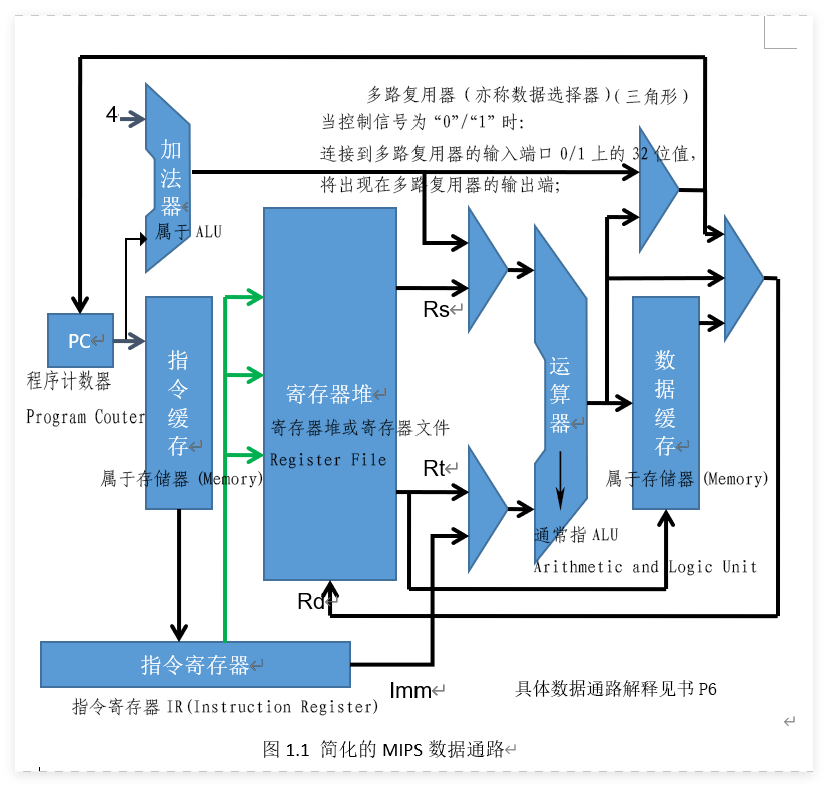

### ALU
- ALU是一个数字逻辑电路组件，用于执行二进制算术运算（如加、减、乘、除）和二进制逻辑运算（如“与（AND）”，“或（OR）”，“或非（NOR）”和“异或（XOR）”），以及移位运算。ALU具体执行哪个操作，取决于存放在指令寄存器中指令的操作代码，即由当前执行指令的操作码决定ALU执行什么样的操作。指令中的不同位域决定了操作的运算类别和操作数。
- **指令中的不同位域**指的是 MIPS 指令的机器码被划分成的几个固定长度的字段（bit fields），每个字段有专门的用途。
- MIPS系统没有在CPU内设计状态寄存器，因此一些异常的运算状态，比如加减法的进位或溢出无法记录
### 存储器
- 大多数现代处理器都实现并使用高速缓冲存储器（Cache），也称“快取”。
- 高速缓冲存储器位于CPU芯片上，提供对指令和数据的快速访问。
- 其原理是CPU将最近在主存中访问过的指令和数据存放在高速缓冲存储器中，下次再次访问这些指令或数据时，可以在高速缓冲存储器中获得，而不需要再次到主存中获取。
### 控制单元(CU,$Control Unit$)
- 要完成取出和执行指令，基于一条指令要完成任务的不同（比如加法操作或减法操作等等），必须生成相应的且有序的控制信号。
- 正如前面提到的，多路复用器必须有控制信号输入；每个寄存器也需要有一个输入控制信号，当该控制信号有效时，将新的值存放到寄存器中（以取代寄存器中原有内容）； ALU也需要控制信号来指定应执行的操作（加、减、乘、除、…）；
- 高速缓冲存储器需要控制信号指定是执行读出操作还是执行写入操作；寄存器堆同样需要一个控制信号，用来指示这是一个将一个值写入寄存器堆的操作还是读取操作等等。
- 所有上述控制信号都来自于控制单元。控制单元由硬件实现，实际上它是一个 "有限状态自动机"。
- 控制单元分析指令寄存器中的指令，基于指令指定的功能，按照指令执行时需要计算机各个硬件组件完成的动作以及这些动作的先后次序，发出控制信号。
- 对于发出信号存在先后次序这个要求，CPU通过将不同信号放在不同的时钟脉冲中发出来实现。计算机运行的速度是由时钟脉冲频率控制的。时钟脉冲发生器是一个晶体振荡器，它产生一个连续的波形
- 如图所示。时钟周期是时钟频率的倒数。所有现代计算机使用的时钟频率都在MHz以上，大部分计算机在GHz以上。（单位M代表106，单位G代表109）

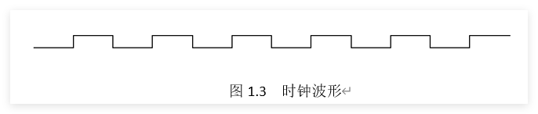

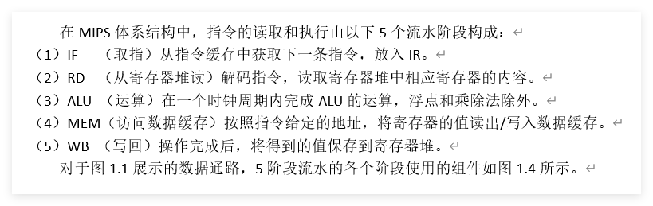

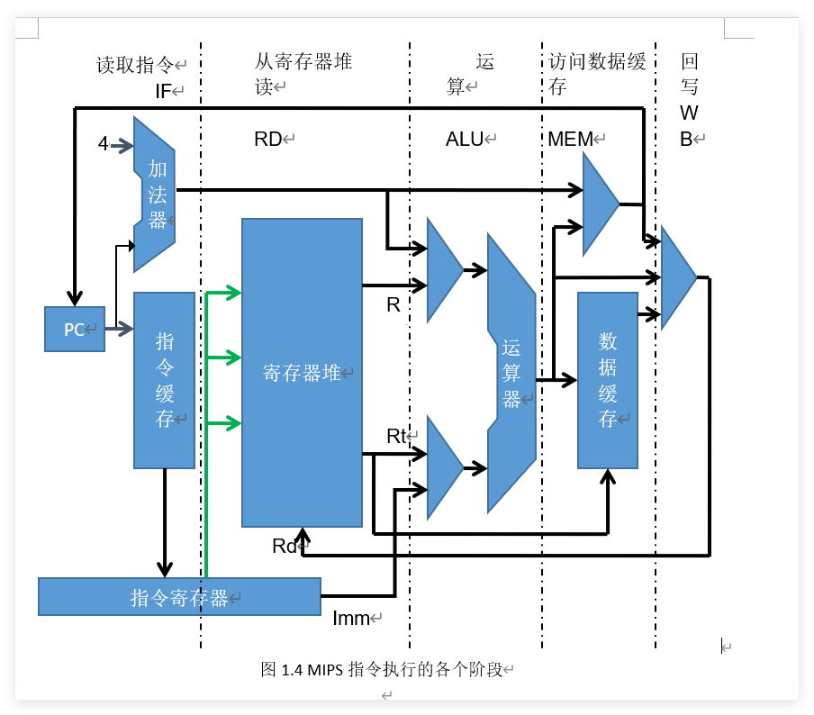

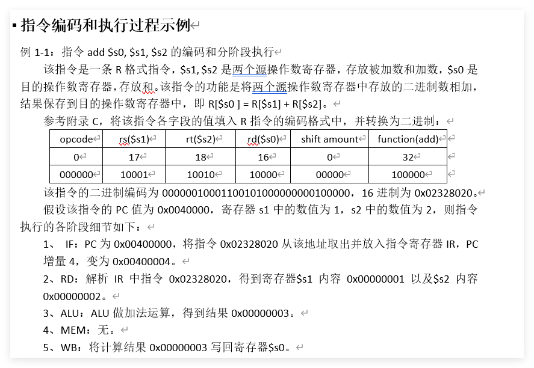

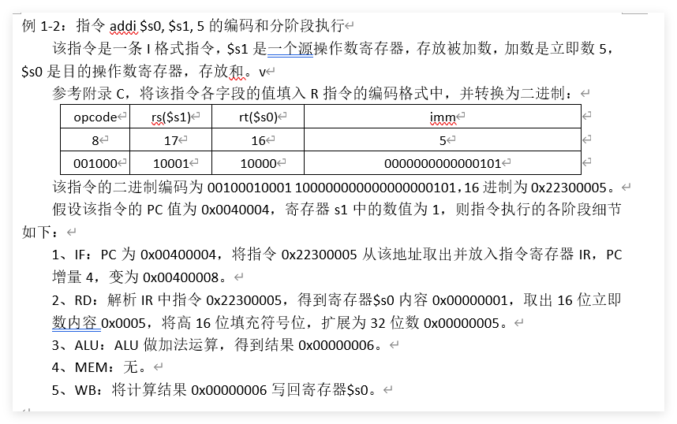

[PPT动画](./指令动画.pptx)

# 例题

### 例 2-1：写出计算表达式 ax² + bx + c 的程序代码片段。

<details>
<summary>查看答案</summary>

```asm
# 取数据到寄存器中
lw  $t0, X  # x
lw  $t1, A  # a
lw  $t2, B  # b
lw  $t3, C  # c

# 计算表达式
mul $t4, $t0, $t0   # $t4 = x²
mul $t4, $t4, $t1   # $t4 = a·x²
mul $t5, $t2, $t0   # $t5 = b·x
add $t4, $t4, $t5   # $t4 = a·x² + b·x
add $t4, $t4, $t3   # $t4 = a·x² + b·x + c
```
</details>

---

### 例 2-2：使用与运算指令实现下列功能  
（1）将 `$a1` 低 16 位的 bit0 和 bit15 清零，其它位不变；  
（2）将 `$a1` 最低有效字节（LSB）中的 ASCII 字符取出，放到 `$t1` 中。

<details>
<summary>查看答案</summary>

```asm
# (1) 清零 bit0 和 bit15
andi $a1, $a1, 0x7ffe   # 0x7ffe = 0111 1111 1111 1110₂

# (2) 取出最低有效字节
andi $t1, $a0, 0x007f   # 0x007f = 0000 0000 0111 1111₂
```
</details>

---

### 例 2-3：使用或运算指令将 `$a1` 寄存器中的 bit7 和 bit31 置 1，其它位不变。

<details>
<summary>查看答案</summary>

```asm
lui  $t1, 0x8000        # 0x8000 = 1000 0000 0000 0000₂
ori  $t1, $t1, 0x0080   # 0x0080 = 0000 0000 1000 0000₂
or   $a1, $a1, $t1
```
</details>

---

### 例 2-4：使用异或运算指令实现下列功能  
（1）将 `$a1` 寄存器中的 bit5 取反，其它位不变；  
（2）将 `$a1` 寄存器赋初值 0。

<details>
<summary>查看答案</summary>

```asm
# (1) 取反 bit5
xori $a1, $a1, 0x0020   # 0x0020 = 0000 0000 0010 0000₂

# (2) 清零
xor  $a1, $a1, $a1
```
</details>

---

### 例 2-2（移位版）：计算表达式 x·10 + y，用移位指令实现乘法。

<details>
<summary>查看答案</summary>

```asm
lw   $t1, x            # $t1 = x
lw   $t2, y            # $t2 = y
sll  $t1, $t1, 1       # $t1 = x·2
move $t3, $t1          # 暂存 x·2
sll  $t1, $t1, 2       # $t1 = x·8
add  $t1, $t1, $t3     # $t1 = x·10
add  $t1, $t1, $t2     # $t1 = x·10 + y
```
</details>

---

### 例 2-3（循环）：使用 `$s6` 存放循环次数，大于 0 则减 1 并继续循环，否则退出。

<details>
<summary>查看答案</summary>

```asm
again:
    blez $s6, Quit       # 若 ≤0 则退出
    addi $s6, $s6, -1    # 减 1
    # 循环体
    b    again
Quit:
```
</details>

---

### 例 2-4（字符串）：统计以 `\0` 结尾的字符串的字符数目。

<details>
<summary>查看答案</summary>

```asm
la    $t2, str          # $t2 指向字符串 str
xor   $t1, $t1, $t1     # $t1 清 0（计数器）

nextCh:
    lb    $t0, ($t2)     # 取一个字符
    beqz  $t0, strEnd    # 若为 '\0' 则结束
    addiu $t1, $t1, 1    # 计数器 +1
    addiu $t2, $t2, 1    # 指针后移
    j     nextCh
strEnd:
```
</details>

---

# 习题
一、
1. 解释寄存器和ALU的区别。
2. 解释汇编语言和机器语言的区别。
3. 解释高速缓冲存储器和寄存器堆之间的区别。
4. 解释指令寄存器和程序计数器之间的区别。
5. 解释总线和控制线的区别。
6. 如果一个主频为500 MHz的计算机取指令和执行指令各需要一个时钟周期，那么该计算机指令执行率是多少？
7. 上述机器一分钟能执行多少条指令？
8. 假设有一个60年前的计算机，每秒执行1000条指令。在主频为500MHz的上述计算机上，执行1000条指令要花多长时间？
9.  MIPS指令格式有哪几种，其含义是什么？
10. MIPS指令执行分为哪几个流水线阶段？
11. 假设指令jr $ra的PC值为0x0040040，寄存器ra中的数值为0x0040080，请仿造例1-1写出指令执行各阶段的细节。

二、

- 2.1 MIPS架构中对操作数寻址有几种方式？对目标地址寻址有哪几种方式？
- 2.2 Load/Store架构是什么？请列举几个MIPS指令集中实现Load/Store架构的指令。
- 2.3 MIPS加减法指令和乘除法指令有什么区别？
- 2.4 MIPS逻辑操作中的not操作是如何实现的？
- 2.5 MIPS条件转移设置指令和条件转移指令的组合可以实现种类繁多的条件分支。请按条件类别写出条件分支指令（包括宏指令）的完整列表。
- 2.6 分支延迟槽是什么？为什么会有分支延迟问题？
- 2.7 参考附录C,将下列汇编程序段翻译成机器语言，并写出完整的翻译过程。
```mips
la	 $a0, 0x10000000
lw 	 $t0,($a0)
mult $t0,$t0
mflo $t1
sw 	 $t1,4($a0)
```
2.8 按指令执行5阶段具体描述最后一条指令sw $t1, 4($a0)的执行过程。假设程序第一条指令地址为0x00400000，地址0x10000000中的内容为十进制的100。
2.9 上述程序段的功能是什么？ 

三、
- 3.1 参考附录B，将以下伪代码翻译为MIPS汇编语言：
  
- (a) $t3 = t4 + t5 – t6;$   
(b) $s3 = t2 / (s1 – 54321);$   
(c)  $sp = sp –16;$   
(d) $cout << t3;$   
(e) $cin  >> t0;$   
(f) $a0 = \&array;$   
(g) $t8 = Mem(a0);$   
(h) $Mem(a0+ 16) = 32768;$   
(i) $cout  << “Hello\ World”;$   
(j) $If (t0 < 0)\ then\ t7 = 0 – t0\ \  else\ t7 = t0;$   
(k) $while\ (\ t0 != 0)\ \{ s1 = s1 + t0;\ t2 = t2 + 4;\ t0 = Mem(t2) \};$   
(l) $for\ ( t1 = 99;\ t1 > 0;\ t1=t1 -1)  v0 = v0 + t1;$   
(m) $t0 = 2147483647 - 2147483648;$   
(n) $s0 = -1 * s0;$   
(o) $s1 = s1 * a0;$   
(p) $s2 = sqrt(s0^2 + 56) / a3;$   
(q) $s3 = s1 - s2 / s3;$   
(r) $s4 = s4 * 8;$  
(s) $s5 = \pi * s5;$

- 3.2 分析上题伪代码表达式对应的汇编语言代码，计算读取和执行该代码所需的时钟周期数。假设读取和执行一条普通指令都需要一个时钟周期；乘法指令需要32个时钟周期，除法指令需要38个时钟周期。
- 3.3 用MIPS汇编语言程序求以下表达式的值，并且该程序不改变“s”寄存器的内容。
`$t0 = ($s1 - $s0 / $s2) * $s4 ; `
- 3.4 用MIPS汇编语言程序高效实现以下表达式。
`$t0 = $s0 / 8 - 2 * $s1 + $s2;`

- 3.5 模仿图3-2，画出以下代码中变量的地址、空间分配、初值。
```mips
			.data
string:	.ascii “ABCD”	
crlfs:	.byte 13,10,0
array1: .space 4	
		.align 2	
array2:	.word 100,200,300,400
```
- 3.6 将以下C++代码翻译成MIPS汇编代码。
```mips
int a[8]={10,23,33,5,20,77,13,28};
char *msg=”max=”;
int n=8,max;
void main( ){
		for(int i = 0; i < n; i++)		
		cout<<a[i]<<endl;
max=a[0];
		for(int i = 0; i < n; i++)
			if(max<a[i])max=a[i];
		cout<<msg<<max;
}
```
---
# 指令练习

### 算术运算类指令练习： 
1. 计算表达式10x+y 
2. 计算表达式ax2+bx+c 
### 逻辑运算类指令练习： 
1. 寄存器a1的位0和位15不变，其他清零 
2. 取出寄存器a0的低7位 
3. 将$t0 中的值低6位清零后移动到$t1中 
4. 寄存器 a1的位7和位31置1，其余不变 
5. 将$t0 中的值低6位置1后移动到$t1中 
6. 寄存器a1清零 
7. 寄存器a1的位5取反，其他不变 
8. 交换两个寄存器$s0和$s1中内容的实现指令 
### 更多指令相关练习 
1. Syscall  1/4/5/8/10/11/12  常用汇编命令 
2. 计算负数整除2，要求使用移位指令 
3. 判断$t0中值的奇偶性 
4. 宏指令abs rd, rs 的实现代码 
5. 宏指令li  $t0, 0xffffefff 的实现代码 
6. 宏指令div/divu  rd, rs, rt（取商）的实现代码 
7. 宏指令rem/remu  rd, rs, rt（取余数）的实现代码 
8. 循环右移宏指令ror  rd, rs, rt 的实现代码 
9. 条件设置类宏指令sne  rd, rs, rt 的实现代码 
10. 条件转移类宏指令ble/ bleu  rs, rt, Label 的实现代码 
11. 条件转移类宏指令blt / bltu  rs, rt, Label 的实现代码  
12. 判断两个寄存器$s0和$s1中值符号是否相同的指令

---

# 注意点

以下是一份**MIPS指令集与易混淆点详解表**

---

# MIPS 指令集与易混淆点详解表

## 一、存储指令（寄存器 → 内存）

| 指令 | 格式示例 | 写入位数 | 数据来源 | 对齐要求 | 典型错误 | 应用场景 |
| :--- | :--- | :--- | :--- | :--- | :--- | :--- |
| `sb` | `sb $t0, 0($t1)` | 8 位（1 字节） | `$t0` 的低 8 位 | 无 | 误以为会符号扩展或零扩展 | 存储字符、字节数组 |
| `sh` | `sh $t0, 0($t1)` | 16 位（2 字节） | `$t0` 的低 16 位 | 地址必须是 2 的倍数 | 存入奇地址 → 地址异常 | 存储半字（如 Unicode 字符） |
| `sw` | `sw $t0, 0($t1)` | 32 位（4 字节） | `$t0` 的全部 32 位 | 地址必须是 4 的倍数 | 存入非 4 倍数地址 → 异常 | 存储字、int、指针 |

> **教学要点**：存储指令只取寄存器的低位，高位直接丢弃，**没有符号扩展或零扩展**。写入内存的宽度由指令本身决定（`sb`=1字节，`sh`=2字节，`sw`=4字节）。

---

## 二、加载指令（内存 → 寄存器）

| 指令 | 格式示例 | 读取位数 | 扩展方式 | 对齐要求 | 典型错误 | 应用场景 |
| :--- | :--- | :--- | :--- | :--- | :--- | :--- |
| `lb` | `lb $t0, 0($t1)` | 8 位 | **符号扩展**至 32 位 | 无 | 忽略符号位，把有符号数当正数 | 读取有符号字节（如 `char`） |
| `lbu` | `lbu $t0, 0($t1)` | 8 位 | **零扩展**至 32 位 | 无 | 误以为会符号扩展 | 读取无符号字节（如 `unsigned char`） |
| `lh` | `lh $t0, 0($t1)` | 16 位 | **符号扩展**至 32 位 | 2 字节对齐 | 从奇地址加载 → 异常 | 读取有符号短整数 |
| `lhu` | `lhu $t0, 0($t1)` | 16 位 | **零扩展**至 32 位 | 2 字节对齐 | 忽略对齐要求 | 读取无符号短整数 |
| `lw` | `lw $t0, 0($t1)` | 32 位 | 无需扩展 | 4 字节对齐 | 从非 4 倍数地址加载 → 异常 | 读取字、int、指针 |

> **教学要点**：加载窄数据到 32 位寄存器时，必须扩展高位。符号扩展保持有符号数的正负，零扩展用于无符号数。`lw` 已完整，不需要扩展。

---

## 三、算术运算指令

| 指令 | 格式 | 操作 | 立即数扩展 | 溢出检查 | 典型错误 | 应用场景 |
| :--- | :--- | :--- | :--- | :--- | :--- | :--- |
| `add` | `add rd, rs, rt` | `rd = rs + rt` | 无 | **检查** | 忘记考虑溢出 | 有符号整数加法 |
| `addu` | `addu rd, rs, rt` | `rd = rs + rt` | 无 | **不检查** | 用于地址运算时误用 `add` | 地址加法、无符号加法 |
| `addi` | `addi rt, rs, imm` | `rt = rs + sign_ext(imm)` | **符号扩展** | **检查** | 把立即数当零扩展 | 有符号整数加常数 |
| `addiu` | `addiu rt, rs, imm` | `rt = rs + sign_ext(imm)` | **符号扩展** | **不检查** | 误以为立即数是零扩展 | 地址加减（如 `$sp-8`） |
| `sub` | `sub rd, rs, rt` | `rd = rs - rt` | 无 | **检查** | 操作数顺序错误 | 有符号减法 |
| `subu` | `subu rd, rs, rt` | `rd = rs - rt` | 无 | **不检查** | 用于地址运算 | 无符号减法、地址差 |

> **教学要点**：`addiu` 中的 `u` 代表“不检查溢出”，**不代表零扩展**。立即数仍然是符号扩展。地址运算务必使用 `addu` / `addiu`。

---

## 四、逻辑运算指令

| 指令 | 格式 | 操作 | 立即数扩展 | 典型错误 | 应用场景 |
| :--- | :--- | :--- | :--- | :--- | :--- |
| `and` | `and rd, rs, rt` | `rd = rs & rt` | 无 | 忘记立即数版本是 `andi` | 位清零、掩码 |
| `andi` | `andi rt, rs, imm` | `rt = rs & zero_ext(imm)` | **零扩展** | 误以为立即数符号扩展 | 清零高 16 位、提取低 16 位 |
| `or` | `or rd, rs, rt` | `rd = rs \| rt` | 无 | 与 `add` 混淆 | 位设置、组合 |
| `ori` | `ori rt, rs, imm` | `rt = rs \| zero_ext(imm)` | **零扩展** | 误以为立即数符号扩展 | 设置低 16 位中某些位 |
| `xor` | `xor rd, rs, rt` | `rd = rs ^ rt` | 无 | 与 `xori` 混淆 | 位翻转、检测差异 |
| `xori` | `xori rt, rs, imm` | `rt = rs ^ zero_ext(imm)` | **零扩展** | 误以为立即数符号扩展 | 翻转低 16 位中某些位 |
| `nor` | `nor rd, rs, rt` | `rd = ~(rs \| rt)` | 无 | 忘记可以用来实现 `not` | 实现 `not`、逻辑完备门 |

> **教学要点**：逻辑运算的立即数一律**零扩展**，因为按位操作不关心正负。`nor rd, rs, $zero` 等价于 `not rd, rs`。

---

## 五、移位指令

| 指令 | 格式 | 操作 | 移位量来源 | 移位量范围 | 典型错误 | 应用场景 |
| :--- | :--- | :--- | :--- | :--- | :--- | :--- |
| `sll` | `sll rd, rt, sa` | `rd = rt << sa` | 立即数 `sa`（5 位） | 0–31 | 写错源寄存器位置（应为 `rt`） | 乘以 2 的幂、位提取 |
| `sllv` | `sllv rd, rt, rs` | `rd = rt << (rs & 0x1F)` | 寄存器 `rs` 的低 5 位 | 0–31 | 混淆 `rs` 和 `rt` 顺序 | 可变位左移 |
| `srl` | `srl rd, rt, sa` | `rd = rt >> sa`（逻辑） | 立即数 `sa` | 0–31 | 对有符号数使用逻辑右移 | 无符号数除以 2 的幂 |
| `srlv` | `srlv rd, rt, rs` | `rd = rt >> (rs & 0x1F)`（逻辑） | 寄存器 `rs` 的低 5 位 | 0–31 | 混淆 `rs` 和 `rt` | 可变位逻辑右移 |
| `sra` | `sra rd, rt, sa` | `rd = rt >> sa`（算术） | 立即数 `sa` | 0–31 | 对无符号数使用算术右移 | 有符号数除以 2 的幂 |
| `srav` | `srav rd, rt, rs` | `rd = rt >> (rs & 0x1F)`（算术） | 寄存器 `rs` 的低 5 位 | 0–31 | 混淆 `rs` 和 `rt` | 可变位算术右移 |

> **教学要点**：移位指令的源操作数放在 `rt`，目标放在 `rd`，与 `add` 等常规 R 型指令不同。移位量超过 31 时只取低 5 位（相当于 `mod 32`）。

---

## 六、分支与跳转指令

| 指令 | 格式 | 寻址方式 | 地址计算 | 范围 | 典型错误 | 应用场景 |
| :--- | :--- | :--- | :--- | :--- | :--- | :--- |
| `beq` | `beq rs, rt, label` | 相对寻址 | `PC = PC + 4 + (imm << 2)` | ±128 KB | 忘记偏移量相对于 `PC+4` | 条件分支（相等） |
| `bne` | `bne rs, rt, label` | 相对寻址 | 同上 | ±128 KB | 同上 | 条件分支（不等） |
| `j` | `j label` | 伪直接寻址 | `PC = {PC[31:28], target, 2'b00}` | 256 MB | 试图跨 256MB 边界 | 无条件跳转 |
| `jal` | `jal label` | 伪直接寻址 | 同上，且 `$ra = PC + 4` | 256 MB | 返回地址计算错误 | 函数调用 |
| `jr` | `jr rs` | 寄存器寻址 | `PC = rs` | 4 GB | 忘记 `jr $ra` 返回 | 函数返回、间接跳转 |
| `jalr` | `jalr rd, rs` | 寄存器寻址 | `PC = rs`，且 `rd = PC + 4` | 4 GB | 混淆 `rd` 和 `rs` | 间接函数调用 |

> **教学要点**：分支指令的偏移量 `imm` 在汇编时已经通过 `(label_addr - (PC+4)) >> 2` 计算好，因此执行时直接用 `PC + 4 + (imm<<2)`。`jal` 保存的返回地址是 `PC + 4`（当前指令的下一条）。

---

## 七、常用伪指令

| 伪指令 | 格式 | 展开为 | 典型错误 | 应用场景 |
| :--- | :--- | :--- | :--- | :--- |
| `li` | `li rd, imm` | 16 位内：`ori`/`addiu`；否则 `lui`+`ori` | 误以为单条硬件指令 | 加载任意 32 位立即数 |
| `la` | `la rd, label` | `lui`+`ori` | 误用为 `li` | 加载标签地址 |
| `move` | `move rd, rs` | `addu rd, rs, $zero` | 与 `li` 混淆 | 寄存器间复制 |
| `not` | `not rd, rs` | `nor rd, rs, $zero` | 误以为有 `not` 硬件指令 | 按位取反 |
| `neg` | `neg rd, rs` | `sub rd, $zero, rs` | 与 `not` 混淆 | 取相反数（补码） |
| `bgt` | `bgt rs, rt, label` | `slt $at, rt, rs` + `bne $at, $zero, label` | 混淆大小关系 | 有符号大于则跳转 |
| `ble` | `ble rs, rt, label` | `slt $at, rt, rs` + `beq $at, $zero, label` | 混淆大小关系 | 有符号小于等于则跳转 |
| `abs` | `abs rd, rs` | `addu rd, rs, $zero` + `bgez` + `sub` | 边界值 `0x80000000` 处理 | 求绝对值 |
| `mul` | `mul rd, rs, rt` | `mult rs, rt` + `mflo rd` | 忘记乘法结果在 `LO` | 乘法取低 32 位 |
| `div` | `div rd, rs, rt` | `div rs, rt` + `mflo rd` | 忘记处理除零 | 除法取商 |
| `rem` | `rem rd, rs, rt` | `div rs, rt` + `mfhi rd` | 取错 `LO` / `HI` | 除法取余数 |

> **教学要点**：伪指令是汇编器提供的语法糖，方便编程但不增加硬件。理解其展开有助于写出更高效的代码。

---

## 八、立即数扩展与截断规则

| 操作 | 规则 | 示例 | 说明 |
| :--- | :--- | :--- | :--- |
| `addi` / `addiu` | 立即数**符号扩展** | `addiu $sp, $sp, -8` | 支持负偏移 |
| `slti` / `sltiu` | 立即数**符号扩展** | `slti $t0, $t1, -1` | 比较时与有符号/无符号数 |
| `andi` / `ori` / `xori` | 立即数**零扩展** | `andi $t0, $t1, 0x00FF` | 保留低 8 位 |
| `lui` | 立即数左移 16 位，低 16 位补 0 | `lui $t0, 0x1234` | 构造高 16 位 |
| 移位量（`sllv` 等） | 只取寄存器的**低 5 位**（`mod 32`） | `sllv $t0, $t1, $t2` | 移位量超过 31 时截断 |
| 地址计算（`lw`/`sw`） | 偏移量**符号扩展**后与基址相加 | `lw $t0, -8($sp)` | 支持负偏移 |
| 加法结果（`addu`） | 结果截断到 32 位（`mod 2^32`） | `0xFFFFFFFF + 1 = 0x00000000` | 不检查溢出 |

> **教学要点**：符号扩展用于需要保留正负的场景（算术、地址偏移），零扩展用于逻辑运算。截断本质是取模 `2^n`。

---

## 九、对齐与异常

| 指令 | 对齐要求 | 未对齐后果 | 例外情况 |
| :--- | :--- | :--- | :--- |
| `lh` / `lhu` / `sh` | 地址必须是 **2 的倍数** | 地址错误异常 | 无 |
| `lw` / `sw` | 地址必须是 **4 的倍数** | 地址错误异常 | 无 |
| `lb` / `lbu` / `sb` | 无 | 正常执行 | 无 |
| 取指（`PC`） | 指令地址必须是 4 的倍数 | 跳转或分支到非对齐地址 → 异常 | 延迟槽中可能产生意外 |

> **教学要点**：汇编器自动安排 `.data` 中的对齐，程序员只需注意指针运算和堆栈地址。

---

## 十、常用系统调用（MARS）

| 服务 | `$v0` | 参数 | 返回值 | 说明 |
| :--- | :--- | :--- | :--- | :--- |
| `print_int` | 1 | `$a0 = 整数` | 无 | 打印整数 |
| `print_float` | 2 | `$f12 = 浮点数` | 无 | 打印单精度浮点数 |
| `print_double` | 3 | `$f12 = 双精度` | 无 | 打印双精度浮点数 |
| `print_string` | 4 | `$a0 = 字符串地址` | 无 | 打印以 `\0` 结尾的字符串 |
| `read_int` | 5 | 无 | `$v0 = 整数` | 读取整数 |
| `read_float` | 6 | 无 | `$f0 = 浮点数` | 读取单精度浮点数 |
| `read_double` | 7 | 无 | `$f0 = 双精度` | 读取双精度浮点数 |
| `read_string` | 8 | `$a0 = 缓冲区`, `$a1 = 长度` | 无 | 读取字符串 |
| `sbrk` | 9 | `$a0 = 字节数` | `$v0 = 地址` | 动态分配内存 |
| `exit` | 10 | 无 | 无 | 退出程序 |
| `print_char` | 11 | `$a0 = 字符（ASCII）` | 无 | 打印单个字符 |
| `read_char` | 12 | 无 | `$v0 = 字符（ASCII）` | 读取单个字符 |

> **教学要点**：使用系统调用前务必设置好 `$v0` 和对应参数。字符串必须以 `\0` 结尾（使用 `.asciiz`）。

---


### MARS 常用 SYSCALL 服务表

| 服务名称 | 服务代码 ($v0) | 需要的参数 | 返回值 | 功能说明 |
| :--- | :---: | :--- | :---: | :--- |
| **print_int** | 1 | `$a0` = 要打印的整数 | 无 | 以十进制形式打印一个整数到控制台 [citation:5] |
| **print_float** | 2 | `$f12` = 要打印的单精度浮点数 | 无 | 打印一个单精度浮点数 [citation:5] |
| **print_double** | 3 | `$f12` = 要打印的双精度浮点数 | 无 | 打印一个双精度浮点数 [citation:5] |
| **print_string** | 4 | `$a0` = 要打印的字符串地址 (以 null 结尾) | 无 | 打印一个字符串到控制台 [citation:2] |
| **read_int** | 5 | 无 | `$v0` = 读取的整数 | 从控制台读取一行输入，并将其解析为整数返回 [citation:2] |
| **read_float** | 6 | 无 | `$f0` = 读取的浮点数 | 读取一个单精度浮点数 [citation:5] |
| **read_double** | 7 | 无 | `$f0` = 读取的双精度浮点数 | 读取一个双精度浮点数 [citation:5] |
| **read_string** | 8 | `$a0` = 存储字符串的缓冲区地址<br>`$a1` = 缓冲区长度（字节数） | 无 (数据写入缓冲区) | 从控制台读取一行字符串到指定缓冲区 [citation:2] |
| **sbrk** | 9 | `$a0` = 需要分配的字节数 | `$v0` = 分配的内存块首地址 | 在堆上分配一块内存 [citation:5] |
| **exit** | 10 | 无 | 无 | 终止程序执行 [citation:2] |
| **print_char** | 11 | `$a0` = 要打印的字符 (ASCII码) | 无 | 打印一个字符到控制台 [citation:5] |
| **read_char** | 12 | 无 | `$v0` = 读取的字符 (ASCII码) | 从控制台读取一个字符 [citation:5] |
| **time** | 30 | 无 | `$a0` = 系统时间低32位<br>`$a1` = 系统时间高32位 | 获取当前系统时间（毫秒级） [citation:5] |
| **sleep** | 32 | `$a0` = 休眠的毫秒数 | 无 | 让程序暂停执行指定的毫秒数 [citation:5] |
| **print_hex** | 34 | `$a0` = 要打印的整数 | 无 | 以8位十六进制形式打印整数（左侧补零） [citation:5] |
| **print_binary** | 35 | `$a0` = 要打印的整数 | 无 | 以32位二进制形式打印整数（左侧补零） [citation:5] |
| **print_unsigned** | 36 | `$a0` = 要打印的整数 | 无 | 以无符号十进制形式打印整数 [citation:5] |
| **random_int** | 41 | `$a0` = 随机数生成器ID (通常为0) | `$a0` = 生成的伪随机整数 | 生成一个均匀分布的伪随机整数 [citation:5] |
| **random_range** | 42 | `$a0` = 随机数生成器ID (通常为0)<br>`$a1` = 上限值 | `$a0` = 生成的伪随机整数 | 生成一个在 `[0, 上限值)` 范围内的伪随机整数 [citation:5] |
| **confirm_dialog** | 50 | `$a0` = 提示消息字符串地址 | `$a0` = 用户选择 (0:Yes, 1:No, 2:Cancel) | 弹出带有 Yes/No/Cancel 的确认对话框 [citation:5] |
| **input_int_dialog** | 51 | `$a0` = 提示消息字符串地址 | `$a0` = 输入的整数<br>`$a1` = 状态码 (0:成功, -1/-2/-3:失败) | 弹出输入对话框让用户输入一个整数 [citation:5] |
| **message_dialog** | 55 | `$a0` = 消息字符串地址<br>`$a1` = 对话框类型 (0:错误, 1:信息, 2:警告, 3:问号) | 无 | 弹出一个消息提示对话框 [citation:5] |

### 小Tips

**注意:一般只在宏展开中内部使用，实际显式使用数字标签可能会报错！！！**

# MIPS 数字标签与 `f` / `b` 后缀用法

## 一、是什么？

MIPS 汇编器（如 MARS、SPIM）支持 **数字标签**（`0:` ~ `9:`），配合 **`f`（forward）** 和 **`b`（backward）** 后缀，用于表示**向前或向后搜索最近的一个同名数字标签**。

这是一种 **局部标签** 机制，主要用于临时跳转（如宏指令内部、小循环）。

---

## 二、为什么需要它？

| 问题 | 说明 |
| :--- | :--- |
| 普通标签（如 `label:`） | 在整个程序中必须唯一，重复定义会冲突 |
| 临时跳转多 | 需要频繁起名，容易重复或冲突 |
| 宏指令展开 | 同一个宏可能在多处展开，内部标签必须局部化 |

**数字标签 + `f`/`b`** 解决了这个问题：每个数字标签的作用范围是**相邻两次定义之间**，互不干扰。

---

## 三、语法规则

### 1. 定义数字标签

```asm
1:   # 数字标签 1
```

### 2. 引用数字标签

| 后缀 | 含义 | 搜索方向 |
| :--- | :--- | :--- |
| `1f` | 向 **前**（forward）搜索最近的 `1:` | 向下（地址增大） |
| `1b` | 向 **后**（backward）搜索最近的 `1:` | 向上（地址减小） |

---

## 四、示例

### 示例 1：向前跳转（`f`）

```asm
    bgez $t0, 1f     # 如果 $t0 >= 0，跳转到下面的 1:
    sub  $t0, $zero, $t0
1:                   # 跳转目标
```

### 示例 2：向后跳转（`b`）

```asm
1:                   # 循环开始
    addi $t0, $t0, -1
    bnez $t0, 1b     # 如果 $t0 != 0，跳回上面的 1:
```

### 示例 3：宏指令中的典型用法（`abs`）

```asm
abs 宏展开：
    addu rd, $zero, rs
    bgez rs, 1f       # 如果 rs >= 0，跳过取反
    sub  rd, $zero, rs
1:                    # 结束
```

---

## 五、作用范围（重要）

数字标签的 **作用范围** 是从 **上一个同名标签之后** 到 **下一个同名标签之前**。

- `1b` 会找到**向上最近**的 `1:`
- `1f` 会找到**向下最近**的 `1:`

**同一个数字可以在不同区域重复使用**，不会冲突。

---

## 六、与普通标签的对比

| 特性 | 普通标签（`loop:`） | 数字标签（`1:` + `f`/`b`） |
| :--- | :--- | :--- |
| 作用范围 | 整个程序 | 局部（两次定义之间） |
| 重复使用 | ❌ 不能（会冲突） | ✅ 可以（不同区域独立） |
| 适用场景 | 全局入口、函数名 | 宏内部、临时跳转 |
| 可读性 | 高（有语义） | 低（数字无意义） |

---

## 七、最佳实践建议

1. **宏指令内部**：优先使用数字标签 + `f`/`b`，避免宏展开多次时标签冲突。
2. **小循环**：可以用 `1b`，但循环较长时建议用有意义的普通标签。
3. **不要滥用**：数字标签不适合作为程序的全局入口点（如 `main:`）。
4. **明确方向**：尽量写 `1f` 或 `1b`，不要只写 `1`（虽然某些汇编器支持，但容易歧义）。

---

## 八、常见误区

| 误区 | 正确理解 |
| :--- | :--- |
| `1` 和 `1f` 是一样的 | ❌ `1` 可能被当作普通标签，`1f` 明确表示向前搜索 |
| 数字标签在整个程序中只能出现一次 | ❌ 可以在不同区域重复使用，互不干扰 |
| `f` 和 `b` 是 MIPS 指令的一部分 | ❌ 它们是**汇编器的语法**，不是 CPU 指令 |

---

## 九、一句话总结

> **`1f` 和 `1b` 是 MIPS 汇编器提供的局部标签机制，用于在宏或小循环中创建临时跳转目标，避免标签命名冲突。`f` 表示向前（向下），`b` 表示向后（向上）。**
